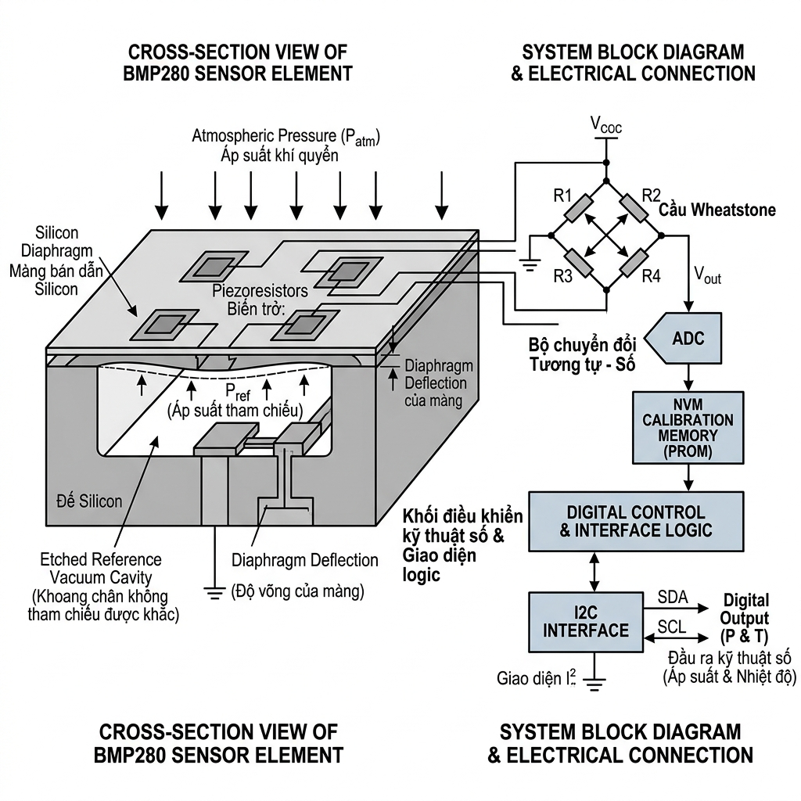
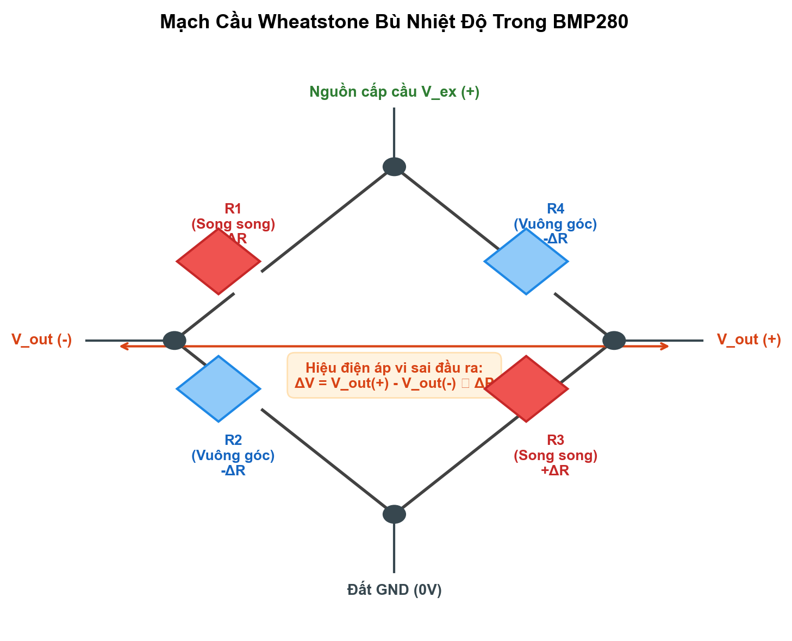
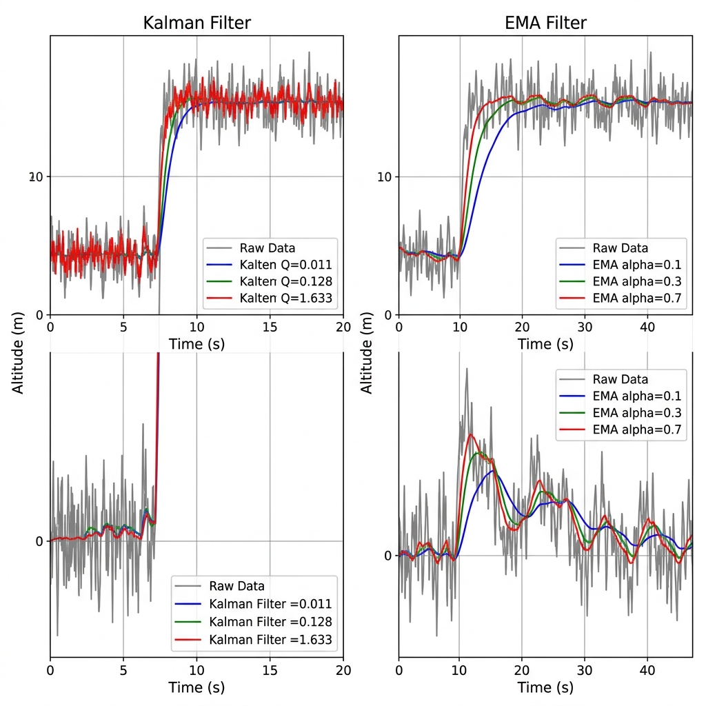
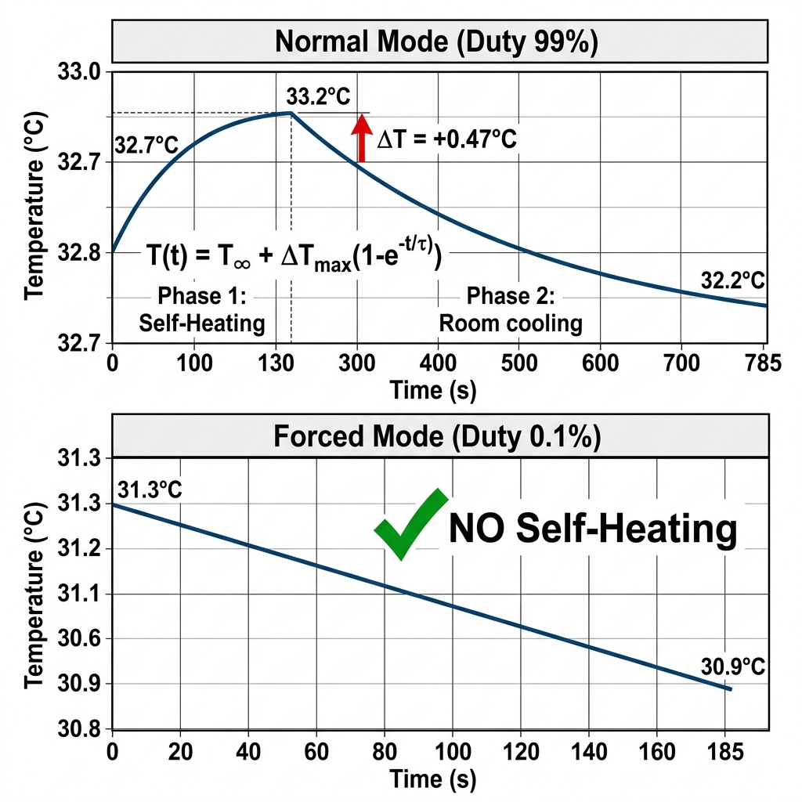

# 📚 Ngân hàng Câu hỏi Vấn đáp Cuối kỳ — Cảm biến BMP280

> **Môn:** Cảm biến và Đo lường cho Robot (RBE3042)
> **Phạm vi:** Cảm biến áp suất GY-BMP280 — Nguyên lý, Đặc tính, Bộ lọc số
> **Dạng:** Câu hỏi + Gợi ý trả lời chi tiết + Hình ảnh minh họa

---

## Câu 1. Nguyên lý hoạt động và cấu tạo cảm biến áp suất BMP280 kiểu áp điện trở (Piezoresistive MEMS)

### 📋 Đề bài
> Trình bày nguyên lý hoạt động và cấu tạo của cảm biến áp suất BMP280 dựa trên hiệu ứng áp điện trở (piezoresistive). Vẽ sơ đồ mặt cắt cấu trúc MEMS và giải thích chuỗi chuyển đổi tín hiệu từ áp suất đến giá trị số.

### ✅ Gợi ý trả lời


*Hình 1.1: Sơ đồ mặt cắt cấu trúc MEMS áp điện trở của BMP280. Khoang chân không kín bên dưới màng tạo áp suất tham chiếu tuyệt đối $P_{ref} = 0$, khi áp suất khí quyển tác động làm màng silicon mỏng biến dạng dẫn đến biến đổi điện trở của các phần tử áp điện trở cấy trên bề mặt.*

> **Hộp giải thích hiện tượng vật lý - Cơ chế MEMS áp điện trở:** Khi màng silicon siêu mỏng (diaphragm) bị uốn cong dưới tác dụng của áp suất cơ học từ bên ngoài, nó tạo ra ứng suất cơ học (stress $\sigma$) tác động trực tiếp lên mạng tinh thể silicon. Ứng suất cơ học này làm thay đổi cấu trúc vùng năng lượng (band structure) của bán dẫn silicon, cụ thể là làm dịch chuyển vùng dẫn (conduction band) và vùng hóa trị (valence band), từ đó làm thay đổi bề rộng vùng cấm (band gap $E_g$) cũng như độ linh động của hạt tải điện (carrier mobility $\mu$ - gồm electron và lỗ trống). Sự thay đổi độ linh động hạt tải này dẫn đến sự thay đổi điện trở suất ($\rho$) của vật liệu bán dẫn, tạo nên hiệu ứng áp điện trở (piezoresistive effect) đặc trưng của bán dẫn silicon với độ nhạy cao. Áp suất tuyệt đối ($P$) được đo đạc bằng cách so sánh áp suất khí quyển tác động từ mặt trên của màng silicon đối chiếu với một khoang chân không (vacuum cavity) kín nằm ngay phía dưới màng. Khoang chân không này được chế tạo ở trạng thái gần như chân không hoàn toàn ($P_{ref} \approx 0\text{ Pa}$), đóng vai trò làm điểm tham chiếu áp suất tuyệt đối cố định, giúp đảm bảo phép đo không bị ảnh hưởng bởi sự giãn nở nhiệt hay biến đổi áp suất của lượng khí giam giữ bên trong.

**Cấu tạo (từ dưới lên):**
1. **Đế silicon (substrate):** Nền cứng đỡ toàn bộ cấu trúc.
2. **Khoang chân không (vacuum cavity):** Là khoang kín bên dưới màng, tạo áp suất tham chiếu = 0 → đo áp suất tuyệt đối.
3. **Màng silicon siêu mỏng (diaphragm):** Dày vài µm, uốn cong khi áp suất khí quyển thay đổi.
4. **4 điện trở khuếch tán (piezoresistors):** Được "cấy" trực tiếp lên bề mặt màng bằng kỹ thuật ion implantation, mắc thành **cầu Wheatstone**.
5. **ADC 20-bit:** Chuyển đổi điện áp vi sai thành giá trị số.
6. **NVM (Non-Volatile Memory):** Lưu 12 hệ số hiệu chuẩn (dig_T1-T3, dig_P1-P9) được ghi khi sản xuất.
7. **Giao tiếp I²C/SPI:** Xuất dữ liệu ra vi điều khiển.

**Chuỗi chuyển đổi tín hiệu:**

```
Áp suất khí quyển → Uốn cong màng silicon → Thay đổi điện trở (hiệu ứng áp điện trở)
→ Điện áp vi sai qua cầu Wheatstone → ADC 20-bit → Bù nhiệt + Hiệu chuẩn
→ Giá trị áp suất số (Pa) → Quy đổi độ cao (m)
```

**Hiệu ứng áp điện trở:** Khi màng uốn cong, mạng tinh thể silicon bị biến dạng → thay đổi mật độ hạt tải → điện trở thay đổi. Hệ số gauge factor của silicon (~100-170) lớn hơn kim loại (~2) nên rất nhạy.

---

## Câu 2. Cầu Wheatstone trong BMP280 — Sơ đồ và nguyên lý hoạt động

### 📋 Đề bài
> Vẽ sơ đồ mạch cầu Wheatstone sử dụng trong cảm biến BMP280. Giải thích tại sao cần dùng cấu hình cầu thay vì đo trực tiếp sự thay đổi điện trở.

### ✅ Gợi ý trả lời


*Hình 1.2: Sơ đồ nguyên lý cầu vi sai Wheatstone gồm 4 điện trở áp điện đặt trên màng silicon. Cấu hình này giúp triệt tiêu nhiễu chế độ chung và nhiệt độ, đồng thời tăng độ nhạy đầu ra gấp 4 lần nhờ việc bố trí 2 điện trở tăng điện trở ($+\Delta R$) và 2 điện trở giảm điện trở ($-\Delta R$) xen kẽ.*

> **Hộp giải thích hiện tượng vật lý - Nguyên lý bù nhiệt và vi sai cầu Wheatstone:** Mạch cầu Wheatstone gồm 4 điện trở áp điện được bố trí đối xứng trên màng silicon đóng vai trò triệt tiêu nhiễu chế độ chung và bù nhiệt độ bậc một cực kỳ hiệu quả. Khi nhiệt độ môi trường thay đổi mà áp suất không đổi, cả 4 điện trở trên màng silicon đều chịu sự thay đổi điện trở cùng chiều và cùng độ lớn do hệ số nhiệt điện trở (TCR - Temperature Coefficient of Resistance) của bán dẫn silicon. Theo sơ đồ cầu Wheatstone, điện áp ngõ ra vi sai được tính bằng hiệu điện áp giữa hai nhánh: $V_{out} = V_{ex} \left( \frac{R_4}{R_3 + R_4} - \frac{R_2}{R_1 + R_2} \right)$. Khi nhiệt độ tăng, tất cả điện trở trôi cùng tỷ lệ, dẫn đến tỷ số giữa các điện trở trong mỗi nhánh được bảo toàn, giữ cho điện áp vi sai ngõ ra bằng không ($V_{out} \approx 0\text{ V}$), tức là triệt tiêu hoàn toàn sự trôi nhiệt chế độ chung.
> Ngoài ra, sơ đồ cầu Wheatstone vi sai toàn phần (full bridge) này làm tăng độ nhạy điện lên gấp 4 lần. Các điện trở được bố trí sao cho dưới ứng suất cơ học uốn cong của màng, hai điện trở ở vị trí căng (tensile stress) sẽ tăng trị số ($+\Delta R$), trong khi hai điện trở ở vị trí nén (compressive stress) sẽ giảm trị số ($-\Delta R$). Sự thay đổi điện trở trái dấu và đối xứng này làm lệch pha tối đa điện áp tại hai nhánh cầu, dẫn đến điện áp vi sai ngõ ra $V_{out} \approx V_{ex} \cdot \frac{\Delta R}{R}$, gấp 4 lần so với trường hợp chỉ sử dụng một điện trở cảm biến đơn lẻ lắp trong mạch chia áp thông thường ($V_{out} \approx V_{ex} \cdot \frac{\Delta R}{4R}$).

**Sơ đồ cầu Wheatstone:**
- 4 điện trở khuếch tán R₁, R₂, R₃, R₄ bố trí trên màng silicon
- R₁, R₃ đặt **song song** với hướng biến dạng → điện trở tăng (+ΔR)
- R₂, R₄ đặt **vuông góc** → điện trở giảm (−ΔR)

**Công thức điện áp ra:**

$$V_{out} = V_{ex} \cdot \frac{\Delta R}{R} = V_{ex} \cdot GF \cdot \varepsilon$$

Trong đó: GF = Gauge Factor (~100-170 cho silicon), ε = biến dạng tương đối của màng.

**Tại sao dùng cầu Wheatstone thay vì đo trực tiếp ΔR:**
1. **Tăng độ nhạy 4 lần:** Cấu hình full-bridge cho tín hiệu gấp 4 so với đo 1 điện trở.
2. **Tự bù nhiệt bậc 1:** Khi nhiệt độ thay đổi, cả 4 điện trở thay đổi cùng chiều → triệt tiêu ở đầu ra vi sai.
3. **Triệt tiêu nhiễu chế độ chung:** Nhiễu nguồn cấp, nhiễu điện từ bị loại bỏ nhờ phép đo vi sai.
4. **Độ phân giải cao:** Vout tỷ lệ tuyến tính với ΔR/R, có thể phát hiện ΔR/R ~ 10⁻⁶.

---

## Câu 3. Công thức quy đổi áp suất sang độ cao — Barometric Formula

### 📋 Đề bài
> Viết công thức barometric quy đổi áp suất khí quyển sang độ cao. Giải thích các tham số và phạm vi áp dụng. Tại sao trong khoảng vài chục mét, ta có thể dùng công thức xấp xỉ tuyến tính?

### ✅ Gợi ý trả lời

**Công thức barometric đầy đủ (hypsometric):**

$$h = \frac{T_0}{L} \cdot \left[ 1 - \left(\frac{P}{P_0}\right)^{\frac{R \cdot L}{M \cdot g}} \right]$$

| Tham số | Giá trị | Ý nghĩa |
|---|---|---|
| $T_0$ | 288.15 K | Nhiệt độ chuẩn mực nước biển |
| $L$ | 0.0065 K/m | Tốc độ giảm nhiệt theo độ cao (lapse rate) |
| $R$ | 8.314 J/(mol·K) | Hằng số khí lý tưởng |
| $M$ | 0.02896 kg/mol | Khối lượng mol không khí |
| $g$ | 9.80665 m/s² | Gia tốc trọng trường |
| $P_0$ | 101325 Pa (1013.25 hPa) | Áp suất tham chiếu MSL |

**Công thức xấp xỉ tuyến tính (cho Δh nhỏ < 100m):**

$$\Delta h \approx \frac{P_1 - P_2}{\rho \cdot g} \approx (P_1 - P_2) \times \frac{1}{12.013} \text{ (Pa → m)}$$

hoặc: **1 hPa ≈ 8.43 m** ở mực nước biển.

**Tại sao xấp xỉ tuyến tính được:** Trong khoảng vài chục mét, hàm mũ $(P/P_0)^{0.19}$ gần bằng $1 - 0.19 \cdot \Delta P/P_0$, sai số < 0.1%. Quan hệ phi tuyến chỉ đáng kể khi $\Delta h > 500m$.

**Số liệu thực nghiệm từ báo cáo:** Đo 10 bậc thang (17cm/bậc), hệ số góc thực đo = 0.168 m/bậc, sát lý thuyết 0.170 m/bậc → xác nhận tính tuyến tính.

---

## Câu 4. Đặc tính tĩnh của BMP280 — Range, Resolution, Linearity, Accuracy

### 📋 Đề bài
> Định nghĩa và phân biệt 4 đặc tính tĩnh: Range, Resolution, Linearity, Accuracy. Cho số liệu thực nghiệm từ thí nghiệm đo 5 tầng cầu thang, tính các chỉ số này.

### ✅ Gợi ý trả lời

| Đặc tính | Định nghĩa | Giá trị thực nghiệm | Theo Datasheet |
|---|---|---|---|
| **Range** | Dải đo = h_max − h_min | **17.12 m** (5 tầng) | 300–1100 hPa |
| **Resolution** (intra-run) | Thay đổi nhỏ nhất phân biệt được = σ_P/12.013 | **2.7 cm** | 16 cm |
| **Resolution** (overall) | Gộp 2 lần đo cách 5 phút | **10.5 cm** | 16 cm |
| **Linearity** (R²) | Hệ số xác định hồi quy tuyến tính | **0.9908** | — |
| **Accuracy** (RMSE) | Sai số trung phương so với tham chiếu | **1.51 m** (có outlier T5) | ±1 hPa |

**Hồi quy tuyến tính:** $h_{meas} = 1.1837 \cdot h_{ref} - 0.223$
- Slope = 1.1837 (lệch +18% so với lý tưởng 1.0) → Giả thuyết: chiều cao tầng thực ≈ 4.1m thay vì 3.5m
- Intercept = −0.223 m → Không có offset hệ thống đáng kể
- Nếu loại outlier T5: RMSE giảm còn **0.63 m**, R² tăng lên **0.998**

**Phát hiện quan trọng:** Resolution thực tế (2.7 cm) tốt hơn datasheet (16 cm) **gấp 6 lần** nhờ cấu hình OS×16 + IIR×16.

> ⚠️ **Lưu ý:** Resolution ≠ Accuracy. Resolution chỉ đo khả năng phân biệt, còn Accuracy phụ thuộc vào drift môi trường.

---

## Câu 5. Oversampling trong BMP280 — Nguyên lý và Ảnh hưởng

### 📋 Đề bài
> Oversampling là gì? Giải thích cơ chế giảm nhiễu bằng oversampling trong ADC của BMP280. Dựa vào số liệu thực nghiệm, đánh giá mức oversampling tối ưu.

### ✅ Gợi ý trả lời

**Oversampling** là kỹ thuật lấy nhiều mẫu ADC liên tiếp rồi lấy trung bình, thay vì chỉ 1 mẫu.

**Cơ chế giảm nhiễu:** Theo lý thuyết, oversampling N lần giảm nhiễu ngẫu nhiên đi $\sqrt{N}$ lần:

$$\sigma_{OS} = \frac{\sigma_{raw}}{\sqrt{N}}$$

Đồng thời tăng thêm $\frac{1}{2}\log_2(N)$ bit phân giải hiệu dụng.

| Mức OS | Số lần ADC | Bit hiệu dụng | Std (m) | Giảm so với X1 | Thời gian đo |
|---|---|---|---|---|---|
| **X1** | 1 | 16 bit | 0.278 | — | 6.4 ms |
| **X2** | 2 | 17 bit | 0.250 | ↓10% | 9.5 ms |
| **X4** | 4 | 18 bit | **0.183** | **↓34%** | 14.5 ms |
| **X8** | 8 | 19 bit | 0.160 | ↓42% | 24.5 ms |
| **X16** | 16 | 20 bit | 0.151 | ↓46% | 40.9 ms |

**Kết luận thực nghiệm:**
- Bước nhảy hiệu quả **lớn nhất** là X2→X4 (giảm 34%)
- Từ X4 trở lên, mỗi bước chỉ cải thiện thêm 5-7%
- **X4 là mức tối ưu** — cân bằng giữa giảm nhiễu và tốc độ đo
- X16 cho chất lượng tốt nhất nhưng chậm hơn ~6× so với X1

---

## Câu 6. Bộ lọc IIR nội bộ của BMP280 — Công thức và Phân tích

### 📋 Đề bài
> Viết công thức bộ lọc IIR tích hợp trong BMP280. So sánh tín hiệu khi TẮT và BẬT IIR ×16. Giải thích hiện tượng tưởng mâu thuẫn: tại sao σ tổng khi BẬT IIR lại có thể LỚN HƠN khi TẮT?

### ✅ Gợi ý trả lời

**Công thức IIR nội bộ BMP280:**

$$y[n] = \frac{(c-1) \cdot y[n-1] + x[n]}{c}$$

với $c \in \{0, 2, 4, 8, 16\}$. Khi c = 0 → filter OFF.

**Tương đương EMA:** IIR coefficient c tương đương EMA α = 1/c:
- c=4 ↔ α=0.25
- c=16 ↔ α=0.0625

**Số liệu thực nghiệm so sánh IIR OFF vs ON (×16):**

| Chỉ số | TẮT IIR | BẬT IIR ×16 | Đánh giá |
|---|---|---|---|
| |Δ|_max | 0.100 hPa | 0.010 hPa | **Giảm 10×** |
| |Δ|_p99 | 0.070 hPa | 0.010 hPa | Triệt tiêu gai nhiễu |
| |Δ|_TB | 0.0127 hPa | 0.0017 hPa | **Giảm 87%** |

**Giải thích "nghịch lý" σ tổng:**

IIR là **bộ lọc thông thấp** — chỉ triệt tiêu thành phần **tần số cao** (gai, răng cưa). Nó KHÔNG can thiệp vào **drift tần số thấp** (xu hướng dài hạn do áp suất môi trường thay đổi).

Khi TẮT IIR: σ phản ánh chủ yếu nhiễu cao tần (biên độ lớn) → lấn át drift.
Khi BẬT IIR: Nhiễu cao tần bị xóa → drift tần số thấp **lộ ra** → σ tổng có thể lớn hơn!

**Chỉ số đúng:** Đánh giá IIR bằng **bước nhảy |Δ|** (giữa 2 mẫu liên tiếp), không phải σ tổng.

> 🎯 **Ứng dụng UAV:** |Δ| = 0.1 hPa tương đương ~84 cm nhảy độ cao tức thời → PID rung lắc. BẬT IIR ×16: |Δ| chỉ ~8.4 mm → drone bay ổn định.

---

## Câu 7. Bộ lọc EMA — Công thức, Hằng số thời gian, và Trade-off

### 📋 Đề bài
> Viết công thức bộ lọc EMA. Tính hằng số thời gian τ cho các mức α = 0.1, 0.3, 0.7 với Δt = 100ms. Phân tích trade-off giữa khử nhiễu và tốc độ phản hồi.

### ✅ Gợi ý trả lời

**Công thức EMA (Exponential Moving Average):**

$$y[n] = \alpha \cdot x[n] + (1 - \alpha) \cdot y[n-1]$$

**Hằng số thời gian:**

$$\tau = \frac{-\Delta t}{\ln(1-\alpha)}$$

| α | τ (ms) | Lọc nhiễu σ (m) | SNR (dB) | T_rise (ms) | T_settle |
|---|---|---|---|---|---|
| Raw | — | 0.184 | 26.6 | 7,199 | > 47s |
| **0.7** | 83 | 0.158 | 27.9 | 7,199 | > 47s |
| **0.3** | 280 | 0.122 | 30.2 | 7,300 | > 47s |
| **0.1** | 949 | **0.085** | **33.3** | 7,500 | **27.5 s** ✓ |


*Hình 1.3: Đồ thị so sánh phản hồi động của bộ lọc Kalman 1D ($Q=0.128, R=1.0$) và bộ lọc EMA ($\alpha=0.1$). Trục hoành là thời gian lấy mẫu, trục tung là độ cao quy đổi. Nhìn vào đồ thị ta thấy bộ lọc EMA ($\alpha=0.1$) có thời gian trễ pha (phase lag) lớn hơn đáng kể trong các bước nhảy độ cao đột ngột, trong khi bộ lọc Kalman bám sát giá trị thực nhanh hơn mà vẫn giữ được độ mịn cao.*

> **Hộp giải thích hiện tượng vật lý - Bản chất trễ pha (Phase Lag) của bộ lọc số:** Trong xử lý tín hiệu số cho cảm biến, luôn tồn tại một sự đánh đổi vật lý không thể tránh khỏi giữa khả năng lọc mượt nhiễu cao tần (smoothing noise) và độ trễ pha (phase lag / delay) của tín hiệu đầu ra. Bộ lọc số có tần số cắt (cut-off frequency) càng thấp thì khả năng lọc sạch các gai nhiễu biên độ lớn càng mạnh, nhưng đồng thời lại làm tăng hằng số thời gian phản hồi $\tau$, khiến tín hiệu đầu ra bị chậm trễ so với sự thay đổi thực tế của môi trường. Bộ lọc số trung bình động lũy thừa (EMA) là bộ lọc đệ quy bậc một; khi cấu hình hệ số lọc $\alpha$ nhỏ (ví dụ $\alpha = 0.1$) để triệt nhiễu, hằng số thời gian $\tau = -\Delta t / \ln(1-\alpha)$ tăng lên đáng kể, tạo ra trễ pha lớn. Khi UAV thay đổi độ cao nhanh chóng đột ngột, EMA phản hồi chậm chạp do phụ thuộc nặng nề vào các giá trị đầu ra quá khứ tích lũy, dẫn đến sai số bám vết động lớn.
> Ngược lại, bộ lọc Kalman sử dụng mô hình trạng thái không gian (state-space model) kết hợp chu kỳ Dự đoán (Predict) và Cập nhật (Update) liên tục. Trong bước Dự đoán, Kalman ước lượng trạng thái tiếp theo dựa trên mô hình động học vật lý của hệ thống. Trong bước Cập nhật, nó tính toán độ lợi Kalman ($K$) tối ưu dựa trên tỷ số giữa sai số dự báo (nhiễu quá trình $Q$) và sai số đo lường (nhiễu cảm biến $R$). Khi có sự thay đổi đột ngột ở ngõ vào (vượt ngoài mô hình dự đoán ổn định thông thường), Kalman Gain sẽ tự động điều chỉnh tăng lên, giúp hệ thống tin tưởng hơn vào giá trị đo thực tế, từ đó bám sát trạng thái thực một cách nhanh chóng mà không gây ra hiện tượng trễ pha lớn như EMA, trong khi vẫn duy trì độ mịn của tín hiệu khi hệ thống ở trạng thái tĩnh.

**Trade-off cốt lõi:**
- α nhỏ → τ lớn → **lọc mạnh, phản hồi chậm** (σ thấp, T_rise cao)
- α lớn → τ nhỏ → **lọc yếu, phản hồi nhanh** (σ cao, T_rise thấp)

**Phát hiện quan trọng:** Chỉ có **α = 0.1 là duy nhất settle được** trong dải ±5% (±0.20m). Các bộ lọc khác không settle ngay cả sau 47s đo → noise floor vượt band ±5%.

**Khuyến nghị:**
- Đo tĩnh (trạm thời tiết): α = 0.1–0.2
- UAV/drone: α = 0.5–0.8, kết hợp IMU + Kalman

---

## Câu 8. Bộ lọc Kalman 1 chiều — Thuật toán và Ảnh hưởng thông số Q

### 📋 Đề bài
> Trình bày 2 bước Predict-Update của bộ lọc Kalman 1D. Giải thích ý nghĩa vật lý của Q (nhiễu quá trình) và R (nhiễu đo lường). Dựa vào số liệu, nhận xét ảnh hưởng của Q = 0.011, 0.128, 1.633.

### ✅ Gợi ý trả lời

**Bước 1 — Predict (Dự đoán):**

$$x_{pred} = x_{est}$$
$$p_{pred} = p_{est} + Q$$

**Bước 2 — Update (Cập nhật):**

$$K = \frac{p_{pred}}{p_{pred} + R}$$
$$x_{est} = x_{est} + K \cdot (z - x_{est})$$
$$p_{est} = (1-K) \cdot p_{pred}$$

**Ý nghĩa vật lý:**
| Tham số | Ý nghĩa | Ảnh hưởng khi tăng |
|---|---|---|
| **Q** (nhiễu quá trình) | Mức "không chắc chắn" về mô hình vật lý | K tăng → bám sát phép đo → phản hồi nhanh nhưng nhiễu cao |
| **R** (nhiễu đo lường) | Mức "không chắc chắn" về phép đo từ cảm biến | K giảm → tin tưởng dự đoán hơn → mượt nhưng chậm |
| **K** (Kalman Gain) | Trọng số giữa dự đoán và đo lường | K→1: tin đo; K→0: tin dự đoán |

**Kết quả thực nghiệm (R = 1.0 cố định, 20Hz, 400 mẫu):**

| Q | Kalman Gain K | Đặc tính lọc | Nhận xét |
|---|---|---|---|
| **0.011** | K rất nhỏ | Cực mượt, trễ pha nặng | Bỏ lỡ thay đổi nhanh |
| **0.128** ✦ | K vừa phải | **Cân bằng tối ưu** | Mượt + phản hồi tốt |
| **1.633** | K gần 1 | Bám sát raw, nhiễu cao | Gần như không lọc |

---

## Câu 9. So sánh EMA và IIR nội bộ BMP280 — Toán học và Thực tiễn

### 📋 Đề bài
> Chứng minh rằng bộ lọc IIR nội bộ của BMP280 về bản chất toán học tương đương với bộ lọc EMA. Nêu sự khác biệt trong triển khai thực tế.

### ✅ Gợi ý trả lời

**IIR BMP280:** $y[n] = \frac{(c-1) \cdot y[n-1] + x[n]}{c}$

Viết lại: $y[n] = \frac{1}{c} \cdot x[n] + \frac{c-1}{c} \cdot y[n-1]$

**EMA:** $y[n] = \alpha \cdot x[n] + (1-\alpha) \cdot y[n-1]$

→ Đặt $\alpha = 1/c$: **hai công thức hoàn toàn tương đương!**

| IIR coefficient c | EMA α tương đương | τ (Δt=100ms) |
|---|---|---|
| c = 2 | α = 0.50 | 144 ms |
| c = 4 | α = 0.25 | 348 ms |
| c = 8 | α = 0.125 | 748 ms |
| c = 16 | α = 0.0625 | 1,548 ms |

**Khác biệt triển khai thực tế:**

| Tiêu chí | IIR BMP280 (trên silicon) | EMA trên MCU |
|---|---|---|
| Độ phân giải tính toán | 22-bit nội bộ | Phụ thuộc float MCU |
| Tốn CPU | **Không** (chạy trên silicon) | Có (1 phép nhân + 1 phép cộng) |
| Tùy chỉnh α | Chỉ 5 mức cố định (OFF, 2, 4, 8, 16) | **Tùy ý** (0–1) liên tục |
| Adaptive | Không | **Có** (thay đổi α theo runtime) |
| Kết hợp filter khác | Không | **Có** (cascade Median → EMA → Kalman) |

> ⚠️ **Không nên bật cả hai cùng lúc** → lọc 2 tầng → trễ pha gấp đôi!

---

## Câu 10. Hiệu ứng tự gia nhiệt (Self-Heating) của BMP280

### 📋 Đề bài
> Hiệu ứng Self-Heating là gì? Giải thích cơ chế vật lý, trình bày kết quả thực nghiệm so sánh Normal Mode và Forced Mode. Định lượng ảnh hưởng đến phép đo áp suất và độ cao.

### ✅ Gợi ý trả lời


*Hình 1.4: Biểu đồ thực nghiệm hiện tượng tự gia nhiệt (Self-Heating) của BMP280. Trong chế độ Normal Mode (đo liên tục ở tần số cao), công suất tiêu thụ Joule tỏa ra làm nhiệt độ cảm biến tăng tiệm cận hàm mũ thêm $+0.47^\circ\text{C}$ và mất ~130 giây để bão hòa. Chế độ Forced Mode (chỉ đo khi yêu cầu rồi ngủ sâu) giảm công suất tiêu thụ trung bình và loại bỏ hoàn toàn hiện tượng tự gia nhiệt này.*

> **Hộp giải thích hiện tượng vật lý - Hiệu ứng tích lũy nhiệt Joule (Self-heating):** Hiệu ứng tự gia nhiệt (self-heating) xuất phát từ công suất tỏa nhiệt Joule ($P = I^2R$) sinh ra do dòng điện chạy qua các phần tử áp điện trở của cầu Wheatstone và các mạch chuyển đổi ADC, LDO tích hợp trên cùng đế silicon của cảm biến BMP280. Do kích thước chip MEMS cực kỳ nhỏ gọn, nhiệt lượng này tích lũy lại và làm tăng nhiệt độ của lõi silicon lên cao hơn so với nhiệt độ không khí xung quanh. Quá trình truyền nhiệt ra môi trường tuân theo định luật làm mát của Newton (Newton's law of cooling), trong đó tốc độ thay đổi nhiệt độ tỷ lệ thuận với sự chênh lệch nhiệt độ giữa cảm biến và môi trường: $\frac{dT}{dt} = -k(T - T_{\infty})$. Điều này tạo ra một đường cong tăng nhiệt độ tiệm cận hàm mũ $T(t) = T_{\infty} + \Delta T_{max}(1 - e^{-t/\tau})$, đạt trạng thái cân bằng nhiệt (bão hòa) sau khoảng 130 giây ở Normal Mode với mức tăng nhiệt độ cục bộ $\Delta T \approx +0.47^\circ\text{C}$.
> Mức tăng nhiệt độ cục bộ này làm thay đổi mật độ không khí cục bộ ngay sát bề mặt cảm biến và làm trôi các đặc tính cơ điện của màng silicon, dẫn đến sai lệch trong phép đo áp suất tĩnh (lệch khoảng 1 Pa). Do quan hệ giữa áp suất và độ cao theo công thức barometric, sai số áp suất 1 Pa này dịch chuyển phép tính độ cao tương đương với một sai số độ cao khoảng ~8.4 cm. Chế độ Forced Mode giải quyết triệt để vấn đề này bằng cách đưa chip vào trạng thái ngủ sâu (deep sleep) ngay sau khi hoàn thành một chu kỳ đo ngắn (hoạt động khoảng 5ms rồi tắt), làm giảm chu kỳ hoạt động (duty cycle) xuống dưới 0.1%. Dòng điện tiêu thụ trung bình giảm từ 720 µA xuống chỉ còn ~3 µA, ngăn chặn hoàn toàn sự tích lũy nhiệt Joule trên đế silicon.

**Cơ chế vật lý:** Dòng điện qua cầu Wheatstone và ADC sinh nhiệt theo định luật Joule ($P = I^2R$). Ở Normal Mode + OS×16: dòng ~720 µA, duty cycle ~99% → lõi silicon nóng lên cục bộ.

**Mô hình Newton truyền nhiệt:**

$$T(t) = T_{\infty} + \Delta T_{max} \cdot (1 - e^{-t/\tau})$$

**Kết quả thực nghiệm:**

| Chỉ số | Normal Mode | Forced Mode |
|---|---|---|
| Duty cycle | ~99% | ~0.1% |
| ΔT sau 130s | **+0.47°C** (tăng) | **−0.29°C** (giảm theo phòng) |
| Dạng đường cong | Tăng-bão hòa (hàm mũ) | Giảm tuyến tính |
| T_settle self-heating | ~130 s | Không có |
| Dòng trung bình | ~720 µA | ~3 µA |

**Ảnh hưởng đến phép đo:**
- Sai số nhiệt 0.47°C → ~**1 Pa sai số áp suất** (hệ số ~2 Pa/°C)
- 1 Pa → ~**8.4 cm sai số độ cao** — đáng kể cho ứng dụng đo cm!

**Forced Mode triệt tiêu hoàn toàn:** Chip chỉ hoạt động ~5 ms mỗi 5 giây → không tích lũy nhiệt.

---

## Câu 11. Tại sao BMP280 cần tích hợp cảm biến nhiệt độ? Quy trình bù nhiệt

### 📋 Đề bài
> Giải thích 3 lý do BMP280 cần tích hợp cảm biến nhiệt độ. Mô tả quy trình bù nhiệt sử dụng biến t_fine và 12 hệ số hiệu chuẩn.

### ✅ Gợi ý trả lời

**3 lý do cần cảm biến nhiệt độ:**

1. **Bù trôi cơ-điện:** Điện trở cầu Wheatstone có TCR ≈ 1500 ppm/°C → 1°C lệch ≈ vài Pa sai số áp suất ≈ **0.2–0.5 m sai số độ cao**.
2. **Hiệu ứng cơ học màng:** Module Young của silicon giảm ~70 ppm/°C khi nóng → màng uốn nhiều hơn ở cùng áp suất → sai số.
3. **Bù công thức barometric:** Công thức quy đổi P→h chứa $T_0$ chuẩn, cần T thực để tính chính xác.

**Quy trình bù nhiệt trên silicon:**

```
Bước 1: ADC đọc raw → adc_T (20-bit) + adc_P (20-bit)

Bước 2: Tính t_fine từ adc_T + {dig_T1, dig_T2, dig_T3}
         t_fine = f(adc_T, dig_T1, dig_T2, dig_T3)  [đa thức bậc 2]

Bước 3: Tính P_compensated từ adc_P + t_fine + {dig_P1...dig_P9}
         P = g(adc_P, t_fine, dig_P1..dig_P9)  [đa thức phức tạp]
```

**Kết quả:** Áp suất đầu ra gần như **độc lập với nhiệt độ** trong −40…+85°C, ±1 hPa.

**Hạn chế thực nghiệm:** Bù nhiệt hiệu quả khi T **ổn định**. Khi T thay đổi đột ngột (30→46.8°C), sai số lên tới **−0.744 m** do bù không kịp.

---

## Câu 12. So sánh cảm biến áp suất Piezoresistive và Capacitive

### 📋 Đề bài
> So sánh nguyên lý hoạt động, ưu nhược điểm, và ứng dụng của cảm biến áp suất kiểu áp điện trở (piezoresistive) và kiểu điện dung (capacitive). Cảm biến nào có độ nhạy cao hơn?

### ✅ Gợi ý trả lời

| Tiêu chí | Piezoresistive (BMP280) | Capacitive |
|---|---|---|
| **Nguyên lý** | ΔR/R do biến dạng màng → cầu Wheatstone | ΔC = εA/d do dịch chuyển bản tụ |
| **Phần tử cảm biến** | 4 điện trở khuếch tán trên màng silicon | 2 bản tụ (1 động + 1 cố định) |
| **Mạch đo** | Cầu Wheatstone → ADC | Mạch dao động / cầu AC |
| **Độ nhạy** | Gauge Factor ~100-170 | **Cao hơn 2-5× cùng cấp** |
| **Tuyến tính** | Tốt | Phi tuyến hơn (C ∝ 1/d) |
| **Nhạy nhiệt** | **Nhạy** (TCR ~1500 ppm/°C) | Ít nhạy |
| **Tiêu thụ điện** | Cao (dòng DC qua cầu) | **Rất thấp** (không dòng DC) |
| **Đáp ứng** | Nhanh | Nhanh |
| **Giá thành** | **Rẻ** | Đắt |
| **Nhiễu EMI** | Ít bị | Dễ bị |

**Kết luận:** Capacitive nhạy hơn 2-5× nhưng phức tạp và đắt → dùng cho vacuum gauge, microbar. Piezoresistive (BMP280) rẻ và đủ tốt → smartphone, drone, weather station.

---

## Câu 13. Sai số đo tăng theo độ cao — Nguyên nhân vật lý

### 📋 Đề bài
> Trong thí nghiệm đặc tính tĩnh, sai số đo được có xu hướng tăng hay giảm theo độ cao? Giải thích ít nhất 3 nguyên nhân vật lý.

### ✅ Gợi ý trả lời

**Quan sát thực nghiệm (5 tầng):**
- Sai số tuyệt đối: T2 = +0.71m → T3 = +0.59m → T4 = +0.91m → T5 = **+3.12m** (tăng)
- Sai số tương đối: T2 = 20% → T3 = 8.4% → T4 = 8.6% → T5 = 22% (biến động)

**4 nguyên nhân vật lý:**

1. **Tích lũy drift áp suất theo thời gian:** Đo từ T1→T5 mất ~30 phút. Áp suất khí quyển trôi 1-3 Pa/giờ do thay đổi thời tiết → sai số nền tăng dần ở các tầng sau.

2. **Drift nhiệt độ cảm biến:** T cảm biến tăng từ 33.7°C (T1) lên 35.2°C (T5) do self-heating + hơi nóng tay cầm → bù nhiệt không hoàn hảo.

3. **Đối lưu không khí cầu thang:** Dòng khí bốc lên/xuống do gradient nhiệt, gió do người đi qua, mở/đóng cửa → tạo nhiễu áp suất tức thời.

4. **Phi tuyến hàm mũ P(h):** Quan hệ áp suất–độ cao là phi tuyến yếu, nhưng trong vài chục mét đầu đóng góp < 0.1% → **không đáng kể** trong thí nghiệm này.

> 🎯 **Giải pháp:** Dùng barometer tham chiếu cố định tại T1, đo nhanh (< 5 phút toàn bộ), tránh giờ đông người, đóng cửa sổ cầu thang.

---

## Câu 14. Giao tiếp I²C của BMP280 — Sơ đồ kết nối và Cấu hình

### 📋 Đề bài
> Vẽ sơ đồ kết nối I²C giữa BMP280 và ESP32-C3. Giải thích vai trò của các chân SDO, CSB. Tại sao module GY-BMP280 không cần pull-up resistor ngoài?

### ✅ Gợi ý trả lời

**Sơ đồ kết nối:**

| BMP280 | ESP32-C3 | Chức năng |
|---|---|---|
| VCC | 3.3V | Cấp nguồn |
| GND | GND | Đất chung |
| SCL | GPIO7 | I²C Clock |
| SDA | GPIO6 | I²C Data |
| SDO | GND | Chọn địa chỉ I²C = **0x76** |
| CSB | 3.3V | Chọn chế độ **I²C** (không phải SPI) |

**Vai trò chân SDO:**
- SDO = GND → Địa chỉ I²C = **0x76**
- SDO = VCC → Địa chỉ I²C = **0x77**
- Cho phép **2 BMP280** trên cùng 1 bus I²C

**Vai trò chân CSB (Chip Select Bar):**
- CSB = VCC → Chế độ I²C
- CSB = GND → Chế độ SPI
- Giao tiếp I²C: 2 dây (SCL + SDA), tốc độ lên tới 3.4 MHz (High-Speed)

**Tại sao không cần pull-up ngoài:** Module GY-BMP280 đã tích hợp:
- LDO regulator 3.3V (cho phép cấp 5V)
- Pull-up resistor ~10 kΩ cho SCL và SDA
- Tụ lọc nguồn

---

## Câu 15. Cấu hình tối ưu BMP280 cho UAV vs IoT — Bài toán thiết kế hệ thống

### 📋 Đề bài
> Cho 2 ứng dụng: (a) UAV/drone cần điều khiển độ cao thời gian thực, (b) Trạm thời tiết IoT chạy pin. Đề xuất cấu hình BMP280 tối ưu cho mỗi ứng dụng, giải thích lý do.

### ✅ Gợi ý trả lời

| Tham số | 🚁 UAV / Drone | 🌤️ IoT / Weather Station |
|---|---|---|
| **Mode** | MODE_NORMAL | MODE_FORCED |
| **OS Pressure** | ×16 (phân giải cao nhất) | ×16 |
| **OS Temperature** | ×1 (tiết kiệm thời gian) | ×1 |
| **IIR Filter** | **×16** (khử gió, drone ổn định) | OFF hoặc ×4 |
| **Standby** | 0.5 ms (~25 Hz) | — |
| **Chu kỳ đo** | Liên tục 25-50 Hz | 30-60 giây |
| **Bộ lọc MCU** | EMA α=0.7 hoặc Kalman Q=0.128 | EMA α=0.1 |
| **Dòng tiêu thụ** | ~720 µA liên tục | ~3 µA trung bình |
| **Self-heating** | Chấp nhận +0.47°C | **Không có** |
| **Pin 200mAh** | ~278 giờ | ~66,667 giờ (**~7.6 năm**) |

**Giải thích UAV:**
- Cần tốc độ cao (25-50 Hz) để PID loop ổn định
- IIR ×16 giảm bước nhảy |Δ| từ 84 cm xuống 8.4 mm → drone không rung lắc
- Lag filter ~200 ms chấp nhận được (PID loop thường 5-10 ms)
- Self-heating +0.47°C gây sai số ~8.4 cm — nhỏ so với GPS ±2-5 m

**Giải thích IoT:**
- Không cần đo nhanh → Forced Mode tiết kiệm pin cực đại
- Forced Mode triệt tiêu self-heating → đo nhiệt độ chính xác
- EMA α=0.1 cho resolution ~8.5 cm tốt hơn datasheet
- Tuổi thọ pin: $\frac{200 \text{ mAh}}{3 \text{ µA}} = 66,667 \text{ h} \approx 7.6 \text{ năm}$

---

## Câu 16. Thiết kế bộ lọc số FIR và IIR thực tế cho cảm biến: So sánh và cài đặt code Arduino/C

### 📋 Đề bài
> So sánh bộ lọc FIR (đáp ứng xung hữu hạn) và IIR (đáp ứng xung vô hạn) dùng cho cảm biến. Viết code Arduino/C thực tế triển khai một bộ lọc thông thấp FIR (cửa sổ N=5) và một bộ lọc thông thấp IIR bậc 2 (Butterworth) từ các tham số thiết kế trong slide bài giảng.

### ✅ Gợi ý trả lời

**So sánh FIR và IIR:**
- **FIR (Finite Impulse Response):**
  - *Nguyên lý:* Chỉ sử dụng các mẫu đầu vào hiện tại và quá khứ: $y[n] = \sum_{i=0}^{N-1} h[i]x[n-i]$.
  - *Ưu điểm:* Luôn luôn ổn định, pha tuyến tính (không méo pha tín hiệu).
  - *Nhược điểm:* Cần nhiều bậc lọc (N lớn) -> tốn bộ nhớ đệm và tính toán nhiều hơn để đạt độ dốc lọc mong muốn.
- **IIR (Infinite Impulse Response):**
  - *Nguyên lý:* Sử dụng cả đầu vào và đầu ra quá khứ (phản hồi): $y[n] = \sum_{i=0}^P b_i x[n-i] - \sum_{j=1}^Q a_j y[n-j]$.
  - *Ưu điểm:* Bậc lọc thấp vẫn đạt hiệu năng lọc xuất sắc, tốn ít CPU và RAM.
  - *Nhược điểm:* Có thể mất ổn định (hệ thống tự dao động nếu các cực nằm ngoài vòng tròn đơn vị), méo pha ở tần số biên.

**Code cài đặt thực tế (theo Slide bài giảng Chappter 5.2):**

1. **Bộ lọc thông thấp FIR LPF (Cửa sổ N = 5, Fs = 500Hz, Fc = 50Hz):**
```cpp
#define N 5
float h[N] = {0.0675, 0.2490, 0.3670, 0.2490, 0.0675}; // Hệ số bộ lọc sinc * window
float buffer[N] = {0};
int idx = 0;

float FIR_LPF(float x) {
    buffer[idx] = x;
    float y = 0;
    int j = idx;
    for(int i = 0; i < N; i++) {
        y += h[i] * buffer[j];
        j--;
        if(j < 0) j = N - 1;
    }
    idx++;
    if(idx >= N) idx = 0;
    return y;
}
```

2. **Bộ lọc thông thấp IIR LPF bậc 2 (Butterworth 2nd order):**
```cpp
float b0 = 0.0675, b1 = 0.1349, b2 = 0.0675; // Hệ số tử số (feedforward)
float a1 = -1.1429, a2 = 0.4128;             // Hệ số mẫu số (feedback)
float x1 = 0, x2 = 0; // Trạng thái đầu vào trễ
float y1 = 0, y2 = 0; // Trạng thái đầu ra trễ

float IIR_Butterworth(float x) {
    float y = b0*x + b1*x1 + b2*x2 - a1*y1 - a2*y2;
    // Cập nhật trạng thái trễ
    x2 = x1; x1 = x;
    y2 = y1; y1 = y;
    return y;
}
```

---

## Câu 17. Mạch khuếch đại đo lường (Instrumentation Amplifier - IA) dùng AD620 cho cảm biến cầu

### 📋 Đề bài
> Vẽ sơ đồ khối và giải thích nguyên lý hoạt động của mạch khuếch đại đo lường (Instrumentation Amplifier) sử dụng 3 Op-Amp. Tại sao mạch này lại tối ưu để khuếch đại tín hiệu vi sai nhỏ từ cầu Wheatstone của BMP280? Cách tính chọn điện trở Gain ($R_G$) trên chip AD620 trong bài giảng.

### ✅ Gợi ý trả lời

**Cấu trúc 3 Op-Amp của Instrumentation Amplifier (IA):**
- **Tầng đệm đầu vào (Op-Amp A1 & A2):** Hai bộ khuếch đại không đảo, có trở kháng đầu vào cực kỳ lớn ($Z_{in} \approx 10^9 \Omega$), giúp tránh làm suy hao dòng điện từ cầu cảm biến.
- **Tầng vi sai đầu ra (Op-Amp A3):** Bộ khuếch đại vi sai tiêu chuẩn giúp khuếch đại hiệu số điện áp giữa hai kênh và triệt tiêu điện áp chế độ chung (nhiễu đồng pha).

**Tại sao tối ưu cho cảm biến cầu MEMS (như BMP280):**
1. **CMRR (Common-Mode Rejection Ratio) cực cao:** Đạt hơn 100dB, giúp loại bỏ nhiễu điện từ đồng pha (ví dụ nhiễu lưới điện 50Hz) trên dây dẫn tín hiệu vi sai của màng silicon.
2. **Không gây lệch tải cầu:** Trở kháng đầu vào vô cùng lớn giữ cầu Wheatstone luôn cân bằng tốt.
3. **Chỉnh Gain bằng 1 điện trở duy nhất ($R_G$):** Không cần ghép cặp điện trở chính xác như mạch vi sai thường.

**Công thức tính điện trở Gain $R_G$ của AD620 (Theo datasheet & slide bài giảng):**
Điện áp ra của AD620 được tính theo công thức:
$$V_{out} = G \cdot (V_+ - V_-)$$

Với độ lợi khuếch đại $G$ được thiết lập bởi điện trở ngoài $R_G$:
$$G = 1 + \frac{49.4 \text{ k}\Omega}{R_G}$$

Do đó, để có độ lợi $G$, ta tính chọn $R_G$ bằng:
$$R_G = \frac{49.4 \text{ k}\Omega}{G - 1}$$

*Ví dụ thực tế:* Nếu cần hệ số khuếch đại $G = 100$ để đưa tín hiệu cầu vi sai (cỡ vài mV) lên dải đo ADC (0-5V):
$$R_G = \frac{49.4 \text{ k}\Omega}{100 - 1} \approx 499 \Omega$$

---

## Câu 18. Các công nghệ cảm biến áp suất màng: Piezoresistive, Capacitive và Ionization

### 📋 Đề bài
> Phân tích cấu trúc vật lý và so sánh nguyên lý hoạt động của ba loại cảm biến áp suất màng: (1) Cảm biến áp suất áp điện trở (Piezoresistive), (2) Cảm biến áp suất điện dung (Capacitive), (3) Cảm biến áp suất ion hóa (Ionization). Phạm vi áp dụng của từng loại là gì?

### ✅ Gợi ý trả lời

**1. Cảm biến áp suất Áp điện trở (Piezoresistive - e.g., BMP280):**
- *Cấu tạo:* Màng silicon mỏng tích hợp các điện trở khuếch tán mắc cầu Wheatstone.
- *Nguyên lý:* Áp suất làm cong màng silicon -> kéo giãn mạng tinh thể -> thay đổi điện trở suất của chất bán dẫn (Gauge Factor rất lớn).
- *Ứng dụng:* Đo áp suất khí quyển từ thấp đến cao (30k-110kPa), chi phí thấp, dùng trong drone, khí tượng học, thiết bị di động.

**2. Cảm biến áp suất Điện dung (Capacitive):**
- *Cấu tạo:* Một điện cực cố định và một điện cực di động (màng mỏng kim loại hoặc silicon), ngăn cách bởi lớp điện môi (không khí hoặc chân không).
- *Nguyên lý:* Áp suất uốn cong màng di động làm thay đổi khoảng cách d giữa hai bản tụ -> thay đổi điện dung: $C = \epsilon \cdot \frac{A}{d}$.
- *Ứng dụng:* Cần độ nhạy cực cao và tiêu thụ năng lượng thấp. Dùng trong môi trường chân không cao, các microbarometer nghiên cứu âm học, hoặc thiết bị y tế nhạy cảm.

**3. Cảm biến áp suất Ion hóa (Ionization):**
- *Cấu tạo:* Gồm một nguồn phát electron (filament nóng hoặc cathode lạnh) và một anode thu ion đặt trong buồng khí cần đo áp suất.
- *Nguyên lý:* Electron va chạm với các phân tử khí tự do trong buồng khí tạo ra các ion dương. Dòng ion thu được tại cực thu tỉ lệ tuyến tính với mật độ khí (áp suất khí): $I_{ion} \propto P$.
- *Ứng dụng:* Chỉ sử dụng đo áp suất chân không siêu cao (Ultra-high vacuum, $10^{-3}$ đến $10^{-10}$ Torr hoặc thấp hơn), nơi màng cơ học không còn khả năng đo do mật độ khí quá loãng. Không hoạt động ở áp suất khí quyển vì sẽ cháy điện cực.

---

## Câu 19. Hệ thống lấy mẫu ADC và Định luật Nyquist-Shannon cho tín hiệu cảm biến

### 📋 Đề bài
> Trình bày Định luật lấy mẫu Nyquist-Shannon. Phân tích hiện tượng răng cưa (aliasing) khi lấy mẫu tín hiệu cảm biến. Làm thế nào để áp dụng định luật này khi cấu hình tần số lấy mẫu ($F_s$) cho cảm biến BMP280 trong các ứng dụng thực tế?

### ✅ Gợi ý trả lời

**Định luật Nyquist-Shannon:**
Để có thể khôi phục hoàn hảo một tín hiệu liên tục có tần số cực đại là $f_{max}$, tần số lấy mẫu $F_s$ của bộ chuyển đổi ADC phải lớn hơn ít nhất hai lần tần số cực đại đó:
$$F_s > 2 \cdot f_{max}$$

**Hiện tượng răng cưa (Aliasing):**
Nếu $F_s \le 2 \cdot f_{max}$, các thành phần tần số cao hơn tần số Nyquist ($F_N = F_s/2$) sẽ bị "gập" (aliased) về dải tần số thấp, xuất hiện dưới dạng nhiễu giả tần số thấp và không thể tách lọc ra khỏi tín hiệu gốc bằng bất kỳ bộ lọc số nào.

**Áp dụng thực tế cho cảm biến BMP280:**
1. **Xác định $f_{max}$ thực tế:** Đối với áp suất khí quyển tĩnh, tần số biến đổi của môi trường thường rất thấp (< 1Hz). Tuy nhiên, trong môi trường chuyển động (UAV, drone), rung động của cánh quạt và động cơ tạo ra nhiễu áp suất khí động học có tần số lên tới hàng chục hoặc hàng trăm Hz.
2. **Cấu hình phần cứng BMP280:**
   - Nếu đo tĩnh (IoT trạm khí tượng): Cài đặt $F_s = 1\text{ Hz}$ là đủ.
   - Nếu đo động (Drone): Động cơ rung ở tần số ví dụ 50Hz. Cần lấy mẫu ở tần số tối thiểu $F_s = 100\text{ Hz}$ (trong BMP280 có thể dùng Normal Mode với standby time 0.5ms kết hợp oversampling để đạt tần số lấy mẫu thực tế ~25-50 Hz).
3. **Mạch lọc chống răng cưa (Anti-aliasing Filter):**
   - Trước khi đưa vào ADC 20-bit của BMP280, cảm biến tích hợp sẵn bộ lọc thông thấp IIR phần cứng trên silicon.
   - Việc bật bộ lọc IIR nội bộ của BMP280 (ví dụ lọc $\times16$) đóng vai trò quan trọng như một bộ lọc chống răng cưa số trước khi truyền dữ liệu qua giao tiếp I2C/SPI về vi điều khiển MCU.

---

## Câu 20. Trôi điểm không (Zero Drift) và Trôi độ nhạy (Sensitivity Drift) của cảm biến do nhiệt độ

### 📋 Đề bài
> Phân biệt hiện tượng Trôi điểm không (Zero Drift/Offset Drift) và Trôi độ nhạy (Sensitivity/Span Drift) của cảm biến áp suất do ảnh hưởng của nhiệt độ. Trình bày cách BMP280 giải quyết vấn đề này thông qua hệ số hiệu chuẩn trong bộ nhớ NVM.

### ✅ Gợi ý trả lời

**Phân biệt Zero Drift và Sensitivity Drift:**
- **Trôi điểm không (Zero Drift):**
  - *Đặc điểm:* Là sự thay đổi điện áp đầu ra tại áp suất tham chiếu 0 (hoặc offset ban đầu) khi nhiệt độ thay đổi. Nó làm toàn bộ đường đặc tính tĩnh dịch chuyển song song lên hoặc xuống.
  - *Phương trình:* $V_{out}(T) = S \cdot P + (V_{offset} + \alpha_{offset} \cdot \Delta T)$ (với $\alpha_{offset}$ là hệ số trôi offset).
- **Trôi độ nhạy (Sensitivity Drift):**
  - *Đặc điểm:* Là sự thay đổi độ dốc (slope/sensitivity) của đường đặc tính tĩnh theo nhiệt độ. Khi nóng lên hoặc lạnh đi, cùng một lượng áp suất thay đổi $\Delta P$ sẽ tạo ra lượng điện áp đầu ra $\Delta V$ khác nhau.
  - *Phương trình:* $V_{out}(T) = (S + \beta_{sensitivity} \cdot \Delta T) \cdot P + V_{offset}$ (với $\beta_{sensitivity}$ là hệ số trôi độ nhạy).

**Giải pháp bù trôi nhiệt kỹ thuật số của BMP280:**
Nhà sản xuất Bosch khắc phục cả hai loại trôi nhiệt này bằng phương pháp bù số trực tiếp trên chip:
1. **Lưu trữ các hệ số hiệu chuẩn tại NVM (Non-Volatile Memory):** Khi sản xuất, mỗi cảm biến được kiểm thử trong buồng nhiệt độ/áp suất chuẩn để đo lượng trôi thực tế và tính ra 12 hệ số bù:
   - Các hệ số trôi nhiệt cho nhiệt độ: `dig_T1`, `dig_T2`, `dig_T3`.
   - Các hệ số trôi nhiệt cho áp suất: `dig_P1` đến `dig_P9`.
2. **Quy trình tính toán thời gian thực:**
   - Đầu tiên, vi điều khiển đọc giá trị nhiệt độ thô `adc_T`, dùng các hệ số `dig_T1-T3` để tính ra đại lượng trung gian `t_fine` (nhiệt độ silicon siêu chính xác).
   - Sau đó, giá trị áp suất thô `adc_P` được đưa vào hàm bù đa thức (chứa `dig_P1-P9` và `t_fine`). Hàm này tự động tính toán và bù trừ độ lệch trôi điểm không (Offset) cũng như độ dốc (Sensitivity) tương ứng với giá trị nhiệt độ thực tế của chip, xuất ra giá trị áp suất bù nhiệt chuẩn xác.

---

## Câu 21. Cấu trúc vật lý của màng silicon MEMS áp điện trở và phân tích độ nhạy cơ-điện (Electro-mechanical Sensitivity)

### 📋 Đề bài
> Phân tích cấu trúc vật lý chi tiết của màng silicon cảm biến áp suất MEMS BMP280 (kích thước, định hướng tinh thể, quy trình chế tạo cấy ion). Thiết lập mối quan hệ toán học giữa ứng suất cơ học và sự thay đổi điện trở suất (hiệu ứng áp điện trở bán dẫn) qua công thức tổng quát và công thức thực tế định hướng tinh thể [110] trên phiến silicon (100). Giải thích ý nghĩa của hệ số áp điện trở $\pi_{44}$.

### ✅ Gợi ý trả lời

**1. Cấu trúc vật lý và chế tạo màng silicon (diaphragm):**
- **Đế và màng:** Màng silicon mỏng của BMP280 được chế tạo bằng phương pháp ăn mòn dị hướng (anisotropic etching) hoặc ăn mòn ion phản ứng sâu (DRIE - Deep Reactive Ion Etching) từ phiến silicon đơn tinh thể (monocrystalline silicon wafer). Màng có dạng hình vuông hoặc tròn với đường kính khoảng $d \approx 200 - 500\text{ }\mu\text{m}$ và độ dày cực kỳ mỏng từ $1.5\text{ }\mu\text{m}$ đến $5\text{ }\mu\text{m}$.
- **Cấy ion (Ion Implantation):** Để tạo ra các phần tử áp điện trở (piezoresistors), tạp chất loại P (thường là boron - B) được cấy trực tiếp vào các khu vực chịu ứng suất cơ học lớn nhất ở rìa màng silicon loại N (N-type substrate). Nồng độ cấy ion được kiểm soát ở mức trung bình (khoảng $10^{18}\text{ atoms/cm}^3$) để tối ưu hóa hệ số áp điện trở và giảm thiểu hệ số trôi nhiệt điện trở (TCR).
- **Định hướng tinh thể (Crystal Orientation):** Silicon là vật liệu không đẳng hướng (anisotropic). Để đạt độ nhạy áp điện trở lớn nhất, các điện trở loại P thường được định hướng dọc theo trục tinh thể $[110]$ trên bề mặt phiến silicon định hướng $(100)$.

**2. Công thức liên hệ ứng suất cơ học và sự thay đổi điện trở:**
Mối quan hệ tổng quát giữa sự thay đổi điện trở tương đối $\frac{\Delta R}{R}$ và ứng suất cơ học được mô tả qua ứng suất dọc ($\sigma_l$ - longitudinal stress) và ứng suất ngang ($\sigma_t$ - transverse stress):

$$\frac{\Delta R}{R} = \pi_l \sigma_l + \pi_t \sigma_t$$

Trong đó, $\pi_l$ và $\pi_t$ là các hệ số áp điện trở tương ứng.

Đối với điện trở loại P định hướng dọc theo trục $[110]$ trên bề mặt $(100)$, các hệ số này liên hệ trực tiếp với hệ số áp điện trở cắt $\pi_{44}$ của silicon (các hệ số khác như $\pi_{11}$ và $\pi_{12}$ rất nhỏ và có thể bỏ qua):

$$\pi_l \approx \frac{1}{2}\pi_{44}, \quad \pi_t \approx -\frac{1}{2}\pi_{44}$$

Khi màng silicon uốn cong dưới tác dụng của áp suất khí quyển, tại rìa màng xuất hiện ứng suất dọc $\sigma_l = \sigma$ là chủ đạo, ứng suất ngang $\sigma_t$ nhỏ hơn nhiều, dẫn đến công thức xấp xỉ thực tế:

$$\frac{\Delta R}{R} \approx \frac{1}{2} \pi_{44} \cdot \sigma$$

**3. Ý nghĩa của hệ số áp điện trở $\pi_{44}$:**
- Với silicon loại P, $\pi_{44}$ có giá trị dương rất lớn (khoảng $+138.1 \times 10^{-11}\text{ Pa}^{-1}$ ở nhiệt độ phòng). Do đó, ứng suất kéo căng ($\sigma > 0$) sẽ làm tăng điện trở tương đối ($\Delta R/R > 0$) và ứng suất nén sẽ làm giảm điện trở tương đối.
- Giá trị $\pi_{44}$ lớn giúp silicon nhạy hơn kim loại gấp hàng chục lần (hệ số gauge factor của silicon đạt ~100-170 so với ~2 ở kim loại), cho phép đo được những biến động áp suất cực nhỏ.

---

## Câu 22. Chi tiết toán học của thuật toán bù trôi nhiệt kỹ thuật số (Digital Temperature Drift Compensation) sử dụng 12 tham số NVM

### 📋 Đề bài
> Trình bày chi tiết toán học của thuật toán hiệu chuẩn và bù trôi nhiệt tích hợp trong cảm biến BMP280. Viết đầy đủ các phương trình toán học chuyển đổi từ giá trị ADC thô (`adc_T`, `adc_P`) sang nhiệt độ thực tế ($^\circ\text{C}$) và áp suất thực tế ($\text{Pa}$) sử dụng 12 tham số hiệu chuẩn lưu trong NVM của nhà sản xuất. Giải thích ý nghĩa của biến trung gian `t_fine`.

### ✅ Gợi ý trả lời

**1. Các tham số hiệu chuẩn lưu trong bộ nhớ NVM:**
BMP280 chứa 12 tham số hiệu chuẩn 16-bit và 8-bit được nhà sản xuất ghi sẵn trong bộ nhớ không khả biến (NVM):
- Nhiệt độ (3 tham số): `dig_T1` (uint16_t), `dig_T2` (int16_t), `dig_T3` (int16_t)
- Áp suất (9 tham số): `dig_P1` (uint16_t), `dig_P2` đến `dig_P9` (int16_t)

**2. Thuật toán bù nhiệt độ:**
Sử dụng giá trị nhiệt độ thô `adc_T` (20-bit) để tính toán hai đại lượng trung gian $var_1$ và $var_2$:

$$var_1 = \left( \frac{adc\_T}{16384.0} - \frac{dig\_T1}{1024.0} \right) \cdot dig\_T2$$

$$var_2 = \left( \left(\frac{adc\_T}{131072.0} - \frac{dig\_T1}{8192.0}\right) \cdot \left(\frac{adc\_T}{131072.0} - \frac{dig\_T1}{8192.0}\right) \right) \cdot dig\_T3$$

Biến `t_fine` đại diện cho nhiệt độ thực tế của chip dưới dạng số dấu chấm động có độ phân giải rất cao, được tính bằng tổng:

$$t\_fine = var_1 + var_2$$

Nhiệt độ thực tế ($T$, đơn vị $^\circ\text{C}$) được quy đổi từ `t_fine`:

$$T = \frac{t\_fine}{5120.0}$$

**3. Thuật toán bù áp suất:**
Sử dụng giá trị áp suất thô `adc_P` (20-bit) và biến trung gian `t_fine` để thực hiện phép bù đa thức phi tuyến bậc 2 và bậc 3 theo trình tự sau:

$$var_1 = \left(\frac{t\_fine}{2.0}\right) - 64000.0$$

$$var_2 = var_1 \cdot var_1 \cdot \frac{dig\_P6}{32768.0}$$

$$var_2 = var_2 + var_1 \cdot dig\_P5 \cdot 2.0$$

$$var_2 = \left(\frac{var_2}{4.0}\right) + \left(dig\_P4 \cdot 65536.0\right)$$

$$var_1 = \left( \frac{dig\_P3 \cdot var_1 \cdot var_1}{524288.0} + dig\_P2 \cdot var_1 \right) \cdot \frac{1}{524288.0}$$

$$var_1 = \left( 1.0 + \frac{var_1}{32768.0} \right) \cdot dig\_P1$$

Nếu $var_1 == 0$, thuật toán trả về áp suất bằng $0$ để tránh lỗi chia cho $0$. Ngược lại:

$$P_{raw} = 1048576.0 - adc\_P$$

$$P = \left( P_{raw} - \frac{var_2}{4096.0} \right) \cdot \frac{6250.0}{var_1}$$

$$var_1 = dig\_P9 \cdot P \cdot P / 2147483648.0$$

$$var_2 = P \cdot dig\_P8 / 32768.0$$

$$P_{compensated} = P + \frac{var_1 + var_2 + dig\_P7}{16.0}$$

Áp suất ngõ ra $P_{compensated}$ có đơn vị là Pascal ($\text{Pa}$).

**4. Ý nghĩa vật lý của biến trung gian `t_fine`:**
- `t_fine` đóng vai trò là tham số liên kết bù trừ nhiệt độ cho phép đo áp suất. Nó phản ánh chính xác sự trôi nhiệt của các phần tử cơ điện trên màng silicon và cầu Wheatstone tại thời điểm đo đạc thực tế.
- Nhờ có `t_fine`, việc tính toán bù áp suất trở nên độc lập với sự thay đổi nhiệt độ làm việc của cảm biến, triệt tiêu sai số nhiệt độ hiệu quả từ $-40$ đến $+85^\circ\text{C}$.

---

## Câu 23. Phân tích sai số không đối xứng (Asymmetric Error) và trôi nhiệt của cầu Wheatstone vi sai trong BMP280

### 📋 Đề bài
> Phân tích nguyên nhân vật lý gây ra sai số không đối xứng (Asymmetric Error) và trôi nhiệt điểm không (Zero Drift) trong mạch cầu Wheatstone của cảm biến áp suất MEMS BMP280. Thiết lập mô hình toán học mô tả ảnh hưởng của sự mất cân bằng điện trở ban đầu và sự không đồng nhất về hệ số nhiệt điện trở (TCR) giữa các nhánh cầu. Trình bày giải pháp bù đắp điện tử.

### ✅ Gợi ý trả lời

**1. Nguyên nhân vật lý gây sai số không đối xứng (Asymmetric Error):**
- Trong quy trình chế tạo vi cơ khí bán dẫn (photolithography, cấy ion, ăn mòn màng), luôn tồn tại các dung sai chế tạo không thể tránh khỏi.
- Các sai lệch về kích thước hình học của màng silicon, sự định vị lệch tâm nhẹ của các điện trở áp điện so với vùng ứng suất cực đại, và sự phân bố nồng độ chất tạp chất cấy ion không đồng đều làm cho trị số của 4 điện trở áp điện không hoàn toàn bằng nhau khi không có áp suất tác động ($R_1 \neq R_2 \neq R_3 \neq R_4$).
- Sự mất đối xứng này tạo ra một điện áp lệch điểm không (Offset Voltage) ban đầu khác 0 ngay cả khi áp suất tuyệt đối $P = 0$.

**2. Mô hình toán học trôi nhiệt điểm không do không đồng nhất TCR:**
Hệ số nhiệt điện trở (TCR - Temperature Coefficient of Resistance, ký hiệu $\alpha$) của mỗi điện trở phụ thuộc vào nồng độ cấy ion tạp chất. Do sự không đồng đều trong quá trình cấy ion, các điện trở có hệ số nhiệt điện trở khác nhau nhẹ: $\alpha_1 \neq \alpha_2 \neq \alpha_3 \neq \alpha_4$.

Điện trở của mỗi phần tử tại nhiệt độ $T$ được mô tả bởi:

$$R_i(T) = R_i(T_0) [1 + \alpha_i (T - T_0)]$$

Khi lắp vào mạch cầu Wheatstone với điện áp cấp nguồn $V_{ex}$, điện áp ngõ ra vi sai tại áp suất không đổi là:

$$V_{out}(T) = V_{ex} \left( \frac{R_4(T)}{R_3(T) + R_4(T)} - \frac{R_2(T)}{R_1(T) + R_2(T)} \right)$$

Thay biểu thức trôi nhiệt của các điện trở vào, ta thấy điện áp ngõ ra vi sai trôi phi tuyến theo nhiệt độ:

$$V_{out}(T) \approx V_{out}(T_0) + \Delta V_{drift}(T)$$

Trong đó, tốc độ trôi nhiệt điểm không (Zero Drift Rate) phụ thuộc vào sự chênh lệch của các hệ số nhiệt điện trở:

$$\frac{dV_{out}}{dT} \approx \frac{V_{ex}}{4} \cdot \left[ (\alpha_4 - \alpha_3) - (\alpha_2 - \alpha_1) \right]$$

Nếu các điện trở hoàn hảo ($\alpha_1 = \alpha_2 = \alpha_3 = \alpha_4$), đạo hàm này bằng 0. Nhưng do sự mất đối xứng thực tế, hiệu số này khác 0, dẫn đến hiện tượng trôi nhiệt điểm không (Zero Drift).

**3. Giải pháp bù đắp điện tử:**
- **Bù thô bằng phần cứng tương tự (Analog Front-End):** Sử dụng các kỹ thuật thiết kế mạch tích hợp như tự động triệt offset (auto-zeroing), bộ khuếch đại chopper (chopper stabilization) để loại bỏ offset tĩnh và trôi chậm của Op-Amp ngõ ra.
- **Bù tinh bằng phần mềm số (Digital Calibration):** Sử dụng các tham số hiệu chuẩn `dig_P1` đến `dig_P9` lưu trong NVM. Các phương trình bù áp suất của BMP280 sử dụng `t_fine` để tính toán chính xác lượng dịch chuyển điểm không $Offset(T)$ và hệ số tỉ lệ $Sensitivity(T)$ tương ứng với từng mức nhiệt độ cụ thể, triệt tiêu sai số phi tuyến bậc cao của cầu Wheatstone.

---

## Câu 24. Cấu hình, cài đặt code và phân tích đáp ứng tần số (Frequency Response / Bode) của các bộ lọc số (EMA, IIR, FIR, Kalman) trên ESP32-C3 cho BMP280

### 📋 Đề bài
> Phân tích đáp ứng tần số, độ dốc suy hao (attenuation slope) và độ trễ pha (phase lag) của 4 bộ lọc số: EMA, IIR Butterworth bậc 2, FIR Moving Average (N=8) và Kalman 1D. Viết các đoạn code C/C++ hoàn chỉnh, tối ưu hóa hiệu năng để chạy trên ESP32-C3 cho từng bộ lọc này nhằm xử lý dữ liệu áp suất/độ cao từ cảm biến BMP280. Thảo luận về tính phù hợp của từng bộ lọc trong các ứng dụng điều khiển động học (như UAV/drone giữ độ cao) và đo đạc tĩnh (như trạm quan trắc thời tiết).

### ✅ Gợi ý trả lời

**1. Phân tích đáp ứng tần số và trễ pha (Bode Analysis):**
- **EMA (Exponential Moving Average):** Là bộ lọc thông thấp IIR bậc 1. Công thức truyền đạt: $H(z) = \frac{\alpha}{1 - (1-\alpha)z^{-1}}$. Tần số cắt $3\text{ dB}$ phụ thuộc vào hệ số $\alpha$. Trễ pha tăng nhanh khi tần số tiến gần tần số cắt, độ dốc suy hao thấp ($-20\text{ dB/decade}$).
- **IIR Butterworth bậc 2:** Đáp ứng phẳng nhất trong dải thông (maximally flat). Độ dốc suy hao sắc nét hơn ($-40\text{ dB/decade}$), giúp triệt tiêu nhiễu cao tần cực tốt nhưng gây trễ pha lớn tại tần số cắt.
- **FIR Moving Average (N=8):** Công thức $y[n] = \frac{1}{N}\sum_{i=0}^{N-1} x[n-i]$. Đáp ứng tần số có dạng hàm sinc với các điểm triệt tiêu (notch) tại các tần số là bội số của $F_s/N$. Trễ pha là tuyến tính (linear phase delay $= \frac{N-1}{2}$ mẫu), giúp bảo toàn hình dạng tín hiệu không bị méo pha, nhưng suy hao dải dừng kém và xuất hiện các búp sóng phụ (sidelobes).
- **Kalman 1D:** Không phải là một bộ lọc tần số cắt cố định mà là một bộ lọc thích nghi tối ưu theo trạng thái. Đáp ứng tần số của nó thay đổi động dựa trên Kalman Gain $K$. Khi sai số đo lớn, nó mở rộng băng thông để bám nhanh; khi trạng thái tĩnh, nó thu hẹp băng thông để lọc mượt, mang lại sự kết hợp tối ưu giữa trễ pha thấp nhất trong quá trình chuyển động và suy hao nhiễu cao nhất ở trạng thái tĩnh.

**2. Code C/C++ hoàn chỉnh trên ESP32-C3:**

```cpp
#include <Arduino.h>

// 1. Bộ lọc EMA (Exponential Moving Average)
class EmaFilter {
private:
    float alpha;
    float y_prev;
    bool is_initialized;
public:
    EmaFilter(float a) : alpha(a), y_prev(0.0f), is_initialized(false) {}
    float filter(float x) {
        if (!is_initialized) {
            y_prev = x;
            is_initialized = true;
        }
        float y = alpha * x + (1.0f - alpha) * y_prev;
        y_prev = y;
        return y;
    }
};

// 2. Bộ lọc IIR Butterworth bậc 2 (Fs = 50Hz, Fc = 5Hz)
class IirButterworth2nd {
private:
    float b0, b1, b2;
    float a1, a2;
    float x1, x2;
    float y1, y2;
    bool is_initialized;
public:
    IirButterworth2nd() : x1(0), x2(0), y1(0), y2(0), is_initialized(false) {
        // Hệ số tính toán sẵn cho Fs = 50Hz, Fc = 5Hz
        b0 = 0.067455f; b1 = 0.134910f; b2 = 0.067455f;
        a1 = -1.142980f; a2 = 0.412800f;
    }
    float filter(float x) {
        if (!is_initialized) {
            x1 = x2 = y1 = y2 = x;
            is_initialized = true;
        }
        float y = b0 * x + b1 * x1 + b2 * x2 - a1 * y1 - a2 * y2;
        x2 = x1; x1 = x;
        y2 = y1; y1 = y;
        return y;
    }
};

// 3. Bộ lọc FIR Moving Average (N = 8)
class FirMovingAverage {
private:
    static const int N = 8;
    float buffer[N];
    int write_index;
    float sum;
    bool is_initialized;
public:
    FirMovingAverage() : write_index(0), sum(0.0f), is_initialized(false) {
        memset(buffer, 0, sizeof(buffer));
    }
    float filter(float x) {
        if (!is_initialized) {
            for (int i = 0; i < N; i++) buffer[i] = x;
            sum = x * N;
            is_initialized = true;
            return x;
        }
        sum -= buffer[write_index];
        buffer[write_index] = x;
        sum += x;
        write_index = (write_index + 1) % N;
        return sum / N;
    }
};

// 4. Bộ lọc Kalman 1D
class Kalman1D {
private:
    float Q;      // Process noise covariance
    float R;      // Measurement noise covariance
    float x_est;  // Estimated state
    float p_est;  // Estimated error covariance
    bool is_initialized;
public:
    Kalman1D(float q, float r) : Q(q), R(r), x_est(0.0f), p_est(1.0f), is_initialized(false) {}
    float filter(float z) {
        if (!is_initialized) {
            x_est = z;
            is_initialized = true;
        }
        // Predict
        float x_pred = x_est;
        float p_pred = p_est + Q;
        // Update
        float K = p_pred / (p_pred + R);
        x_est = x_pred + K * (z - x_pred);
        p_est = (1.0f - K) * p_pred;
        return x_est;
    }
};
```

**3. Thảo luận ứng dụng phù hợp:**
- **UAV/Drone giữ độ cao (Altitude Hold):**
  - *Yêu cầu:* Trễ pha cực thấp để tránh làm mất ổn định vòng lặp phản hồi PID (gây dao động tự kích).
  - *Lựa chọn:* **Kalman 1D** kết hợp với cảm biến gia tốc kế (IMU) là tối ưu nhất vì nó giảm thiểu trễ pha tối đa trong khi bám sát động học tốc độ cao. Nếu chỉ dùng bộ lọc số tĩnh, **EMA** với $\alpha$ lớn ($0.5 - 0.8$) hoặc **FIR N nhỏ** là sự lựa chọn hợp lý, trong khi **IIR Butterworth bậc 2** không phù hợp do trễ pha lớn tại tần số cắt.
- **Trạm thời tiết IoT (Weather Station):**
  - *Yêu cầu:* Độ mịn tín hiệu tối đa, khử trôi và triệt tiêu hoàn toàn nhiễu gió cao tần. Trễ pha vài giây không ảnh hưởng đến hệ thống.
  - *Lựa chọn:* **EMA với $\alpha = 0.1$** hoặc **IIR Butterworth bậc 2** là giải pháp lý tưởng. Các bộ lọc này sử dụng rất ít tài nguyên tính toán và mang lại độ mịn cực cao, theo dõi xu hướng áp suất khí quyển dài hạn ổn định.

---

## Câu 25. Thiết kế mạch tiền xử lý tương tự (Analog Front-End) sử dụng Instrumentation Amplifier AD620 và Bộ lọc chống răng cưa (Anti-Aliasing Filter)

### 📋 Đề bài
> Thiết kế chi tiết mạch tiền xử lý tương tự (Analog Front-End) cho một cảm biến cầu Wheatstone (tương tự nguyên lý hoạt động của BMP280 nhưng ngõ ra tương tự). Mạch sử dụng bộ khuếch đại đo lường AD620 để đưa tín hiệu vi sai nhỏ (dải đo $\pm 10\text{ mV}$) lên dải đo của bộ chuyển đổi ADC ($0 - 3.3\text{ V}$) của ESP32-C3. Tính toán điện trở Gain $R_G$. Thiết kế bộ lọc thông thấp RC chống răng cưa phần cứng trước ADC với tần số cắt $F_c < F_s / 2$ (cho biết tần số lấy mẫu $F_s = 100\text{ Hz}$). Thảo luận về việc kết hợp bộ lọc chống răng cưa phần cứng với kỹ thuật oversampling bằng phần mềm.

### ✅ Gợi ý trả lời

**1. Sơ đồ nguyên lý mạch AFE:**
- **Cầu Wheatstone:** Nhánh cầu gồm 4 điện trở được cấp nguồn $V_{ex} = 3.3\text{ V}$. Hai ngõ ra vi sai của cầu là $V_+$ và $V_-$ được kết nối trực tiếp vào chân đầu vào không đảo (chân 3) và đầu vào đảo (chân 2) của chip AD620.
- **AD620:**
  - Chân nguồn: Chân 7 kết nối với nguồn dương $+5\text{ V}$ (hoặc $+3.3\text{ V}$), chân 4 kết nối với đất $GND$ (hoặc nguồn âm $-5\text{ V}$ cho cấu hình nguồn kép). Để hoạt động tốt với dải đo đơn cực $0-3.3\text{ V}$, chân Reference (chân 5) của AD620 được nối với điện áp tham chiếu offset $V_{ref} = 1.65\text{ V}$ (tạo ra từ mạch chia áp đệm Op-Amp) để dịch chuyển điểm không vi sai lên giữa thang đo.
  - Điện trở Gain $R_G$: Mắc giữa chân 1 và chân 8.
- **Bộ lọc chống răng cưa (Anti-Aliasing Filter):** Ngõ ra của AD620 (chân 6) được nối qua một bộ lọc thông thấp RC thụ động bậc một gồm điện trở $R$ nối tiếp và tụ điện $C$ nối xuống đất $GND$. Ngõ ra trên tụ điện $C$ được kết nối trực tiếp vào kênh đầu vào ADC của ESP32-C3.

**2. Tính toán điện trở Gain $R_G$:**
- Dải tín hiệu ngõ vào vi sai: $V_{in,diff} = V_+ - V_- = \pm 10\text{ mV}$ (tổng dải đo đỉnh-đỉnh là $20\text{ mV}$).
- Dải điện áp ngõ ra mong muốn của ADC: $0 - 3.3\text{ V}$ (tổng dải đo đỉnh-đỉnh là $3.3\text{ V}$).
- Độ lợi khuếch đại cần thiết:

$$G = \frac{V_{out,p-p}}{V_{in,diff,p-p}} = \frac{3.3\text{ V}}{20\text{ mV}} = 165$$

- Áp dụng công thức tính điện trở Gain cho AD620:

$$R_G = \frac{49.4\text{ k}\Omega}{G - 1} = \frac{49400\Omega}{165 - 1} = \frac{49400}{164} \approx 301.2\Omega$$

Ta chọn điện trở thực tế chuẩn là $301\Omega$ (dung sai 1%).

**3. Thiết kế bộ lọc RC chống răng cưa:**
- Tần số lấy mẫu: $F_s = 100\text{ Hz}$. Theo định luật Nyquist, tần số cắt của bộ lọc chống răng cưa phải nhỏ hơn tần số Nyquist: $F_c < \frac{F_s}{2} = 50\text{ Hz}$.
- Để đảm bảo suy hao nhiễu tốt ở tần số Nyquist, ta chọn tần số cắt an toàn ở mức $F_c = 10\text{ Hz}$ (thấp hơn nhiều so với $50\text{ Hz}$ để lọc sạch nhiễu tần số cao).
- Công thức tần số cắt bộ lọc RC bậc một:

$$F_c = \frac{1}{2\pi R C}$$

Chọn tụ điện chuẩn $C = 1\text{ }\mu\text{F}$ để giảm trở kháng ngõ ra của mạch lọc. Tính điện trở $R$:

$$R = \frac{1}{2\pi \cdot F_c \cdot C} = \frac{1}{2\pi \cdot 10\text{ Hz} \cdot 10^{-6}\text{ F}} \approx 15.9\text{ k}\Omega$$

Ta chọn điện trở thực tế chuẩn là $16\text{ k}\Omega$.

**4. Thảo luận kết hợp bộ lọc phần cứng RC và oversampling phần mềm:**
- Bộ lọc RC phần cứng bậc một có độ dốc suy hao khá phẳng ($-20\text{ dB/decade}$), nên các thành phần nhiễu tần số cao gần $50\text{ Hz}$ vẫn có khả năng bị gập về dải thông nếu không được lọc thêm.
- Kỹ thuật oversampling bằng phần mềm (lấy mẫu ở tần số rất cao $F_{os} = 1.6\text{ kHz}$ rồi dùng bộ lọc trung bình số để nén băng thông về $100\text{ Hz}$) hoạt động phối hợp tuyệt vời với bộ lọc RC phần cứng.
- Bộ lọc phần cứng RC đóng vai trò triệt tiêu các thành phần nhiễu tần số siêu cao (như nhiễu điện từ, nhiễu xung nhọn) vốn có thể làm bão hòa đầu vào ADC hoặc vượt quá khả năng xử lý của bộ lọc số. Phần mềm oversampling tiếp tục nâng độ phân giải hiệu dụng (ENOB) của ADC lên thêm vài bit và tạo ra một bộ lọc số sắc nét hơn, giúp hệ thống đạt độ chính xác cực cao mà không cần dùng đến các bộ lọc analog bậc cao phức tạp và đắt tiền.

---

> **📌 Ghi chú ôn tập ôn thi Vấn đáp cuối kỳ:**
> - Ngân hàng gồm **25 câu hỏi trọng tâm** phủ kín 5 tuần báo cáo thực nghiệm và các bài giảng lý thuyết (Mạch đo, Bộ lọc số, Định luật lấy mẫu, Trôi nhiệt).
> - Nhớ các số liệu chính của BMP280: R² ≈ 0.999 (độ tuyến tính), σ giảm 34% ở OS X4, bước nhảy |Δ| giảm 10 lần ở IIR x16, ΔT = +0.47°C do tự gia nhiệt ở Normal Mode, độ phân giải thực tế đạt tới 2.7cm.
> - Nắm vững 3 bộ lọc chính: EMA (α), Kalman 1D (Q, R, K), IIR nội bộ của chip (c).
> - Công thức quan trọng: Barometric formula quy đổi độ cao ($1 \text{ hPa} \approx 8.43\text{ m}$), cầu Wheatstone ($V_{out} = V_{ex} \cdot \frac{\Delta R}{R}$), mạch AD620 ($G = 1 + 49.4\text{k}\Omega / R_G$).
> - Hiểu rõ Nyquist-Shannon ($F_s > 2 \cdot f_{max}$) để cấu hình tốc độ lấy mẫu và giải quyết nhiễu răng cưa (aliasing) bằng bộ lọc IIR phần cứng.

