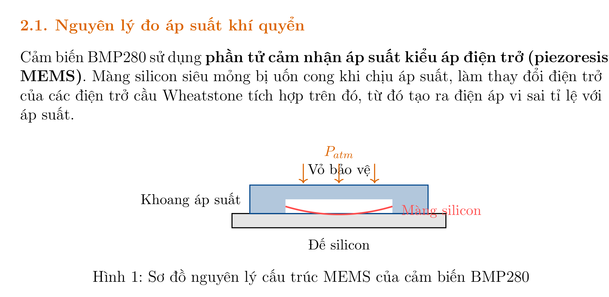

# LAB 01: CẢM BIẾN ÁP SUẤT (Barometric Pressure & Altitude Sensor)
**TRƯỜNG ĐẠI HỌC CÔNG NGHỆ – ĐHQGHN**  
**KHOA ĐIỆN TỬ – VIỄN THÔNG**  

* **Học phần:** Kỹ Thuật Cảm Biến / Cảm biến & Đo lường cho Robot
* **Năm học:** 2025 – 2026
* **Đối tượng:** Sinh viên năm 3 – Điện tử Viễn thông / Kỹ thuật Robot
* **Tài liệu nội bộ** — Dành cho sinh viên thực hành

---

## 1. MỤC TIÊU BÀI THỰC HÀNH
Sau khi hoàn thành bài thực hành, sinh viên có khả năng:
1. Giải thích nguyên lý đo áp suất và độ cao khí quyển của cảm biến BMP280 dựa trên hiệu ứng áp điện trở (piezoresistive).
2. Kết nối và lập trình giao tiếp I2C giữa BMP280 và vi điều khiển (Arduino/ESP32).
3. Khảo sát và đánh giá định lượng các đặc tính tĩnh: Range, Resolution, Linearity, Accuracy.
4. Khảo sát và đánh giá định lượng các đặc tính động: thời gian đáp ứng, ảnh hưởng của bộ lọc số.
5. Xây dựng báo cáo thí nghiệm theo chuẩn khoa học, trình bày kết quả bằng đồ thị và bảng số liệu.

---

## 2. CƠ SỞ LÝ THUYẾT

### 2.1. Nguyên lý đo áp suất khí quyển
Cảm biến BMP280 sử dụng phần tử cảm nhận áp suất kiểu áp điện trở (piezoresistive MEMS). Màng silicon siêu mỏng bị uốn cong khi chịu áp suất, làm thay đổi điện trở của các điện trở cầu Wheatstone tích hợp trên đó, từ đó tạo ra điện áp vi sai tỉ lệ với áp suất.

*Hình 1: Sơ đồ nguyên lý cấu trúc MEMS của cảm biến BMP280.*

### 2.2. Mô hình áp suất khí quyển theo độ cao
Sự phụ thuộc của áp suất khí quyển theo độ cao được mô tả bởi công thức khí áp tĩnh học:
$$h = \frac{T_0}{L} \left[ \left( \frac{P}{P_0} \right)^{-\frac{R \cdot L}{M \cdot g}} - 1 \right] \quad (1)$$

Trong đó:
* $h$ – độ cao so với điểm tham chiếu $[m]$
* $P$ – áp suất đo được $[Pa]$
* $P_0$ – áp suất tại điểm tham chiếu $[Pa]$
* $T_0 = 288.15 \, K$ – nhiệt độ chuẩn tại mực nước biển
* $L = 0.0065 \, K/m$ – gradient nhiệt độ theo độ cao
* $R = 8.314 \, J/(mol \cdot K)$ – hằng số khí lý tưởng
* $M = 0.02896 \, kg/mol$ – khối lượng mol không khí
* $g = 9.80665 \, m/s^2$ – gia tốc trọng trường

Trong thực hành, công thức xấp xỉ thường được sử dụng:
$$\Delta h \approx \frac{P_1 - P_2}{\rho_{air} \cdot g} \approx (P_1 - P_2) \times 8.43 \quad (2)$$
với $\rho_{air} \approx 1.225 \, kg/m^3$ ở điều kiện tiêu chuẩn.

### 2.3. Thông số kỹ thuật của BMP280
*Bảng 1: Thông số kỹ thuật chính của BMP280 (theo Datasheet Bosch Sensortec)*

| Thông số | Giá trị | Đơn vị |
|---|---|---|
| Dải đo áp suất | 300 – 1100 | hPa |
| Độ phân giải áp suất (lọc tối đa) | 0.16 | Pa |
| Độ chính xác tuyệt đối | $\pm 1.0$ | hPa |
| Dải đo nhiệt độ | $-40$ đến $+85$ | $^\circ C$ |
| Độ phân giải nhiệt độ | 0.01 | $^\circ C$ |
| Điện áp hoạt động (VDD) | 1.71 – 3.6 | V |
| Giao tiếp | I2C / SPI | – |
| Địa chỉ I2C | 0x76 hoặc 0x77 | – |
| Tần số lấy mẫu tối đa | 157 | Hz |
| Tiêu thụ điện (mode bình thường) | 2.74 | $\mu A$ |
| Phân giải độ cao (mode siêu cao) | 0.16 | m |

### 2.4. Chế độ hoạt động và oversampling
BMP280 hỗ trợ các chế độ oversampling để cân bằng giữa tốc độ lấy mẫu và độ nhiễu:

*Bảng 2: Các chế độ oversampling của BMP280*

| Chế độ | Oversampling | Độ phân giải | Thời gian đo |
|---|---|---|---|
| Ultra low power | $\times 1$ | 16 bit | 6.4 ms |
| Low power | $\times 2$ | 17 bit | 8.7 ms |
| Standard | $\times 4$ | 18 bit | 13.3 ms |
| High | $\times 8$ | 19 bit | 22.5 ms |
| Ultra high | $\times 16$ | 20 bit | 40.9 ms |

### 2.5. Các đặc tính cần khảo sát

#### 2.5.1. Đặc tính tĩnh (Static Characteristics)
* **Range (Dải đo):** Khoảng giá trị đầu vào mà cảm biến hoạt động trong đặc tính kỹ thuật. Được xác định bởi $R = x_{max} - x_{min}$.
* **Resolution (Độ phân giải):** Thay đổi nhỏ nhất của đại lượng đo mà cảm biến có thể phân biệt được.
* **Linearity (Độ tuyến tính):** Mức độ đầu ra bám theo đường thẳng lý tưởng. Đánh giá qua sai số phi tuyến:
  $$e_{NL} = \frac{|y_{actual} - y_{linear}|}{y_{FS}} \times 100\%$$
* **Accuracy (Độ chính xác):** Độ gần của giá trị đo so với giá trị thực. Bao gồm sai số hệ thống và sai số ngẫu nhiên.

#### 2.5.2. Đặc tính động (Dynamic Characteristics)
* **Thời gian đáp ứng (Response time):** Thời gian để đầu ra đạt 90% giá trị cuối cùng sau khi đầu vào thay đổi đột ngột.
* **Độ trễ (Delay):** Trễ pha gây ra bởi bộ lọc số IIR tích hợp bên trong BMP280.

---

## 3. THIẾT BỊ VÀ LINH KIỆN
*Bảng 3: Danh sách thiết bị và linh kiện*

| STT | Item | Số lượng |
|---|---|---|
| 1 | Module GY-BMP280 | 1 |
| 2 | Arduino Uno / ESP32 DevKit | 1 |
| 3 | Cáp USB | 1 |
| 4 | Breadboard & dây nối | 1 bộ |
| 5 | Điện trở pull-up $4.7 \, k\Omega$ | 2 |
| 6 | Máy tính | 1 |
| 7 | Thước đo chiều cao (hoặc biết sẵn) | 1 |

---

## 4. QUY TRÌNH THÍ NGHIỆM

### 4.1. Thí nghiệm 1 – Khảo sát đặc tính tĩnh

#### 4.1.1. Chuẩn bị
1. Kết nối phần cứng theo sơ đồ. Kiểm tra lại trước khi cấp điện.
2. Nạp chương trình đọc dữ liệu thô (không lọc) vào vi điều khiển.
3. Mở Serial Monitor (Baud: 115200). Đợi cảm biến ổn định **ít nhất 2 phút** tại vị trí xuất phát (Tầng 1).

#### 4.1.2. Đo đạc
* **Địa điểm:** Cầu thang tòa nhà từ Tầng 1 đến Tầng 7.
* **Giá trị tham chiếu:** Đo hoặc tra cứu chiều cao mỗi tầng (thông thường $\approx 3.5 \, m$/tầng).
* **Quy trình tại mỗi tầng:**
  1. Di chuyển đến tầng, đứng yên **30 giây**.
  2. Ghi lại **20 giá trị** áp suất và nhiệt độ liên tiếp.
  3. Tính giá trị trung bình $\bar{P}_i$ và độ lệch chuẩn $\sigma_{P_i}$.
  4. Chuyển đổi sang độ cao: $h_i = f(\bar{P}_i, P_0)$ theo Phương trình (1).

*Bảng 4: Bảng ghi số liệu thực nghiệm đặc tính tĩnh*

| Tầng | $h_{ref}$ (m) | $\bar{P}$ (Pa) | $\sigma_P$ (Pa) | $\bar{T}$ ($^\circ C$) | $h_{meas}$ (m) | $e_h$ (m) | $e_h$ (%) |
|---|---|---|---|---|---|---|---|
| 1 (GND) | 0 | | 0 (ref) | | | | |
| 2 | | | | | | | |
| 3 | | | | | | | |
| 4 | | | | | | | |
| 5 | | | | | | | |
| 6 | | | | | | | |
| 7 | | | | | | | |

#### 4.1.3. Phân tích số liệu
1. Vẽ đồ thị: $h_{meas}$ vs $h_{ref}$ cùng với đường thẳng lý tưởng ($y = x$).
2. **Hồi quy tuyến tính (Linear Regression):** Tìm hệ số $a$, $b$ trong $h_{meas} = a \cdot h_{ref} + b$ bằng phương pháp bình phương tối thiểu:
   $$a = \frac{n \sum x_i y_i - \sum x_i \sum y_i}{n \sum x_i^2 - (\sum x_i)^2}$$
   $$b = \frac{\sum y_i - a \sum x_i}{n} \quad (3)$$
3. Đánh giá độ tuyến tính:
   $$R^2 = 1 - \frac{\sum (y_i - \hat{y}_i)^2}{\sum (y_i - \bar{y})^2} \quad (4)$$
4. Tính sai số trung phương (RMSE):
   $$RMSE = \sqrt{\frac{1}{n} \sum_{i=1}^{n} (h_{meas,i} - h_{ref,i})^2} \quad (5)$$
5. Xác định Range, Resolution:
   * **Range:** $R = h_{max} - h_{min}$ (tầng 7 so tầng 1)
   * **Resolution:** thay đổi độ cao tương ứng với 1 bit LSB của ADC (tính từ datasheet)

### 4.2. Thí nghiệm 2 – Khảo sát đặc tính động

#### 4.2.1. Quy trình
1. Nạp chương trình có bộ lọc EMA. Đặt $\alpha = 0.3$.
2. Giữ cảm biến yên tại vị trí ổn định trong **10 giây**.
3. Di chuyển nhanh lên cao $\sim 1$ tầng (mang tay lên đầu), sau đó giữ yên.
4. Ghi lại toàn bộ chuỗi thời gian (dữ liệu thô + EMA) ra file CSV.
5. Lặp lại với $\alpha = 0.1$ và $\alpha = 0.7$ để so sánh.

*Bảng 5: Ghi nhận kết quả đặc tính động với EMA filter*

| Hệ số $\alpha$ | $T_{rise}$ (ms) | $T_{settle}$ (ms) | Biên độ dao động | SNR |
|---|---|---|---|---|
| 0.1 (lọc mạnh) | | | | |
| 0.3 (cân bằng) | | | | |
| 0.7 (lọc yếu) | | | | |
| Thô (Raw) | | | | |

*Tiến hành khảo sát đặc tính động tương tự như trên nhưng với bộ lọc Kalman và so sánh.*

#### 4.2.2. Định nghĩa thời gian đáp ứng
* $T_{10\%}$ : thời điểm đầu ra đạt 10% giá trị cuối
* $T_{90\%}$ : thời điểm đầu ra đạt 90% giá trị cuối
* $T_{rise} = T_{90\%} - T_{10\%}$ (thời gian tăng)
* $T_{settle}$ : thời điểm đầu ra nằm trong băng thông $\pm 2\%$

---

## 5. XỬ LÝ SỐ LIỆU VÀ PHÂN TÍCH

### 5.1. Công cụ phân tích
Sinh viên có thể sử dụng một trong các công cụ sau:
* Microsoft Excel / Google Sheets: Vẽ đồ thị, hàm `LINEST`, `STDEV`.
* Python: Thư viện `numpy`, `pandas`, `matplotlib`.
* MATLAB: Script xử lý tín hiệu và vẽ đồ thị.

### 5.2. Yêu cầu đồ thị
1. Đồ thị đặc tuyến tĩnh: $h_{meas}$ vs $h_{ref}$ – gồm điểm đo và đường hồi quy.
2. Đồ thị sai số: $e_h = h_{meas} - h_{ref}$ theo $h_{ref}$.
3. Đồ thị thời gian: Áp suất (thô và lọc) theo thời gian – thể hiện rõ $T_{rise}$ và $T_{settle}$.
4. Histogram phân bố sai số tại một tầng cố định (dữ liệu từ 100 mẫu).

---

## 6. YÊU CẦU BÁO CÁO
Báo cáo thực hành phải bao gồm các nội dung sau:
* **I. Cơ sở lý thuyết:** Giải thích nguyên lý hoạt động BMP280, mô hình áp suất – độ cao.
* **II. Phương pháp thực nghiệm:** Mô tả sơ đồ kết nối, quy trình đo, thiết bị sử dụng.
* **III. Kết quả & Phân tích:**
  * Bảng số liệu đầy đủ (Bảng 4, Bảng 5).
  * Tất cả đồ thị theo Mục 5.2.
  * Giá trị định lượng: Range, Resolution, RMSE, $R^2$, $T_{rise}$, $T_{settle}$.
* **IV. Thảo luận:** Giải thích nguyên nhân sai số, ảnh hưởng của nhiệt độ, so sánh các chế độ lọc.
* **V. Kết luận:** Tóm tắt điểm mạnh/yếu của cảm biến, đề xuất ứng dụng.

---

## 7. CÂU HỎI ÔN TẬP VÀ THẢO LUẬN
* **Q1.** So sánh nguyên lý hoạt động của cảm biến áp suất kiểu áp điện trở (piezoresistive) và kiểu điện dung (capacitive). Cảm biến nào có độ nhạy cao hơn?
* **Q2.** Tại sao BMP280 tích hợp thêm cảm biến nhiệt độ? Nhiệt độ ảnh hưởng như thế nào đến phép đo áp suất? Quá trình bù nhiệt độ được thực hiện như thế nào?
* **Q3.** Trong thí nghiệm đặc tính tĩnh, sai số đo được có xu hướng tăng hay giảm theo độ cao? Hãy giải thích nguyên nhân vật lý.
* **Q4.** Phân tích sự đánh đổi (trade-off) giữa tốc độ đáp ứng và mức độ nhiễu khi thay đổi hệ số $\alpha$ của bộ lọc EMA. Trong ứng dụng UAV (drone), nên chọn $\alpha$ bằng bao nhiêu và tại sao?
* **Q5.** Bộ lọc IIR tích hợp trong BMP280 và bộ lọc EMA trong code có gì giống và khác nhau về mặt toán học?
* **Q6.** Cảm biến BMP280 có thể đo độ cao với độ phân giải $\sim 0.16 \, m$ theo datasheet. Trong thực nghiệm của nhóm, độ phân giải thực tế là bao nhiêu? Tại sao có sự khác biệt?

*— Hết Lab 01 —*  
*Cập nhật lần cuối: 05/2026*
