# 1. Introduction to Sensors for robot

> Tài liệu chuyển đổi từ PDF: `1. Introduction to Sensors for robot.pdf`

---

## Trang 1

### 1

- Khoa Điện tử- Viễn thông
- Trường Đại học Công nghệ, ĐHQGHN
- Kỹthuật Điện tử
- Electronics Engineering
- Cảm biến và đo lường cho robot
- (RBE3042)
- 1
- Assco. Prof. Bùi Thanh Tùng
- MSc. Nguyễn Như Cường
- MEMS and Microsystems Department
- Khoa Điện tử- Viễn thông
- Trường Đại học Công nghệ, ĐHQGHN
- Kỹthuật Điện tử
- Electronics Engineering
- Human and robot sensors quiz
- How many sensors or senses do humans have? What
- are they?
- Describe how any two of those human sensor work
- Give at least three examples of robot sensors that are
- similar to human senses.
- 2
- 1
- 2

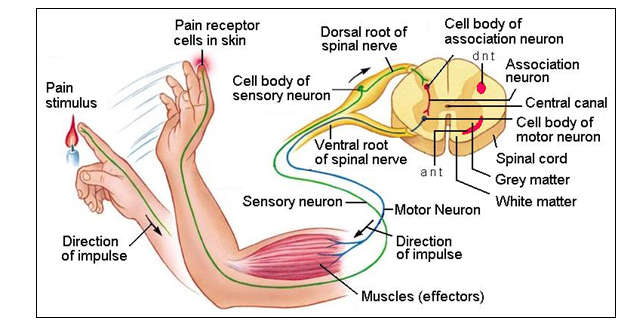

---

## Trang 2

### 2

- Khoa Điện tử- Viễn thông
- Trường Đại học Công nghệ, ĐHQGHN
- Kỹthuật Điện tử
- Electronics Engineering
- 3
- Auditory system 1.Ossicle. 2. Semicircular canal.
- 3. Cochlea. 4. Auditory nerve 5. Eustachian tube
- 6.Midle ear. 7. Ear drum 8. External ear canal
- Olfactory system. 1. Olfactory bulb. 2. nasal cavity. 3. Brain. 4. Olfactory epithelium
- 5. Vomeronasal organ. 6. Ions. 7 Glomeruli. *. Axon. 9. To olfactory cortex
- Light enters the front of the eye through the pupil
- and is focused by the lens onto the retina. Rod cells
- on the retina respond to the light and send a
- message through the optic nerve fiber to the brain.
- The tongue is covered with dozens of
- pimple-like projections called papillae.
- These grip and move food when you
- chew. Around the sides of the papillae
- are about 10,000 microscopic taste
- buds. Different parts of the tongue are
- sensitive to different flavours: sweet,
- salt, sour and bitter.
- The sense of touch is the name
- given to a network of nerve
- endings that reach just about
- every part of our body. These
- sensory nerve endings are
- located just below the skin and
- register light and heavy pressure
- on the skin and also differences in
- temperature. These nerve
- endings gather information and
- send it to the brain
- Khoa Điện tử- Viễn thông
- Trường Đại học Công nghệ, ĐHQGHN
- Kỹthuật Điện tử
- Electronics Engineering
- Human and robot sensors quiz
- 
- 5 main senses: vision, hearing, smell, touch and taste
- 
- Human sensor: eyes, ears, nose, skin and tongue
- 
- Additional sensors: temperature sensors, body position sensors,
- balance sensors and blood acidity sensors
- 
- How they work:
- 
- Eyes: surrounding light -> relay it to nerve cells -> send signal to
- brain
- 
- Ears: sound wave -> air vibrations -> inner ear  -> hair cells ->
- send signal to brain
- 
- Nose: particle are inhaled into the nose -> nerve cell contact the
- particles -> send signal to brain
- 
- Skin: sensor all over the skin are activate and send signals to brain
- through the nervous system
- 
- Tongue: particles in food -> hair cell -> send signals to brain
- through the nervous system
- 4
- 3
- 4

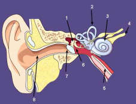

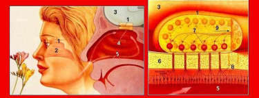

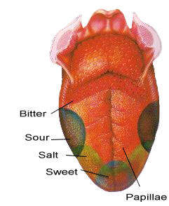

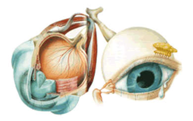

---

## Trang 3

### 3

- Khoa Điện tử- Viễn thông
- Trường Đại học Công nghệ, ĐHQGHN
- Kỹthuật Điện tử
- Electronics Engineering
- Your sensory organs (eyes, ears, nose, tongue, and
- skin) provide information to your brain so that it can
- make decisions.
- Several additional sensors in the body that donot
- notice directly
- 
- Sensors in the inner ear give the brain information
- about balance
- 
- Sensor in muscles inform the brain of our body
- positions
- 
- Sensor throughout the body that sense temperature
- 
- … and more
- 5
- Khoa Điện tử- Viễn thông
- Trường Đại học Công nghệ, ĐHQGHN
- Kỹthuật Điện tử
- Electronics Engineering
- Question
- Name some sensors used in robot
- 6
- https://app.sli.do/event/uJZW4iwCMqaVmu
- d2y6rvJG/embed/polls/69df39d5-37f4-
- 470b-beac-cc2133333c9a
- 5
- 6

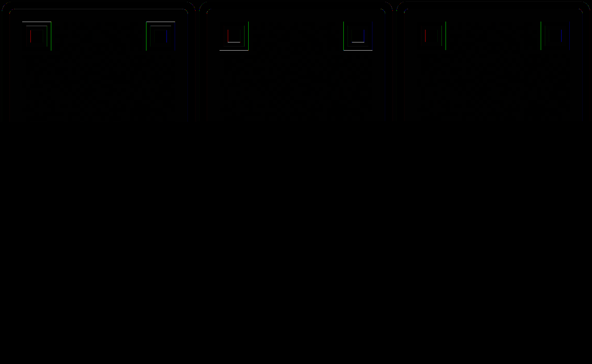

---

## Trang 4

### 4

- Khoa Điện tử- Viễn thông
- Trường Đại học Công nghệ, ĐHQGHN
- Kỹthuật Điện tử
- Electronics Engineering
- Contents
- Introduction to Robotics
- Robot Sensors
- Desirable features
- Need for Sensors
- Classification of Sensors
- 7
- Khoa Điện tử- Viễn thông
- Trường Đại học Công nghệ, ĐHQGHN
- Kỹthuật Điện tử
- Electronics Engineering
- What is a robot
- 
- A robot is a machine designed to execute one or more tasks
- repeatedly, with speed and precision. There are as many
- different types of robots as there are tasks for them to perform.
- It is a mechanical or virtual artificial agent, usually an electro-
- mechanical machine that is guided by a computer program or
- electronic circuitry.
- 
- A robot can be controlled by a human operator, sometimes from
- a great distance. But most robots are controlled by computer,
- and fall into either of two categories: autonomous robots and
- insect robots. An autonomous robot acts as a stand-alone
- system, complete with its own computer
- 
- For many people it is a machine that imitates a human—like the
- androids in Star Wars, Terminator and Star Trek: The Next
- Generation. However much these robots capture our
- imagination, such robots still only inhabit Science Fiction.
- 8
- 7
- 8

---

## Trang 5

### 5

- Khoa Điện tử- Viễn thông
- Trường Đại học Công nghệ, ĐHQGHN
- Kỹthuật Điện tử
- Electronics Engineering
- Classification by JIR
- Japanese Industrial Robot Association (JIRA) :
- “A device with degrees of freedom that canbe controlled.”:
- 
- Class 1: Manual handling device
- 
- Class 2 : Fixed sequence robot
- 
- Class 3 : Variable sequence robot
- 
- Class 4 : Playback robot
- 
- Class 5 : Numerical control robot
- 
- Class 6 : Intelligent robot
- 9
- Khoa Điện tử- Viễn thông
- Trường Đại học Công nghệ, ĐHQGHN
- Kỹthuật Điện tử
- Electronics Engineering
- Isaac Asimov
- Was born on January 2, 1920 in
- America
- An American author and professor
- of biochemistry at Boston University
- Wrote about 500 popular science
- books, and most importantly he
- wrote about robotics and created the
- Laws of robotics.
- Asimov was very famous for his
- writing and ideas on robotics. He's
- first short story to be sold is
- "Marooned Off Vesta" And Asimov
- would later be credited with coming
- up with the term "robotics"
- 10
- 9
- 10

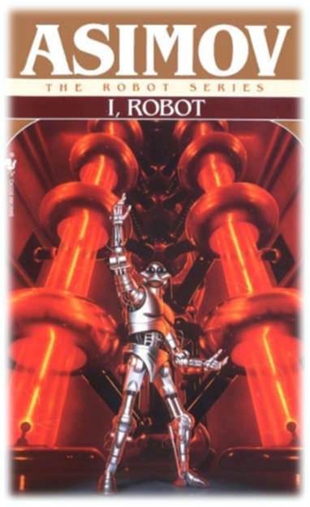

---

## Trang 6

### 6

- Khoa Điện tử- Viễn thông
- Trường Đại học Công nghệ, ĐHQGHN
- Kỹthuật Điện tử
- Electronics Engineering
- The Three Laws of Robotics
- 
- A robot may not injure a
- human being or, through
- inaction, allow a human being
- to come to harm.
- 
- A robot must obey the
- orders given to it by human
- beings except where such
- orders would conflict with the
- First Law.
- 
- A robot must protect its own
- existence as long as such
- protection does not conflict
- with the First or Second Laws.
- 11
- Created by the science fiction author Isaac Asimov (introduced in his
- 1942 novel “I, Robot”)
- Khoa Điện tử- Viễn thông
- Trường Đại học Công nghệ, ĐHQGHN
- Kỹthuật Điện tử
- Electronics Engineering
- 12
- 3 Robotic Laws
- Benefits
- Disadvantages
- 1) A robot may not injure
- a human being or, through
- inaction, allow a human
- being to come to harm
- This law protects
- human and insure
- safety of human.
- Robots may not work perfectly
- and they may not obey
- human's orders.
- 2) A robot must obey the
- orders given it by human
- beings, except where such
- orders would conflict with
- the First Law.
- It is better for
- human to control
- robots to prevent bad
- consequence.
- It seems like a discrimination
- against the robots. Human have
- more rights than the robots, so
- it is not fair for robots.
- 3) A robot must protect
- its own existence as long
- as such protection does
- not conflict with the First
- or Second Laws.
- It gives robots some
- rights to protect
- themselves.
- If robots do not obey human's
- order and break the three law
- of robotics. There are no
- penalties to the robots or they
- cannot blame lame the person
- who created that robot.
- While these “rules” are commonly used by science fiction authors and
- screenwriters, they are NOT actual laws that must be followed by
- engineers in their robotic inventions.
- 11
- 12

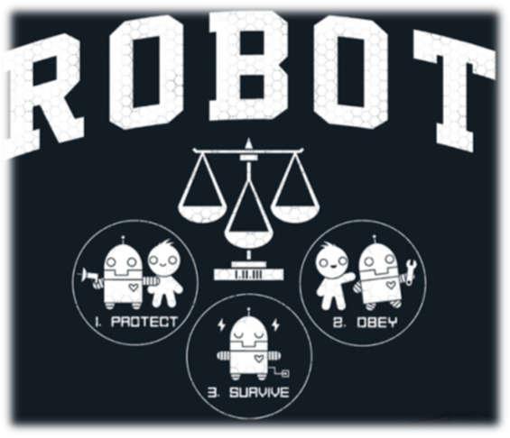

---

## Trang 7

### 7

- Khoa Điện tử- Viễn thông
- Trường Đại học Công nghệ, ĐHQGHN
- Kỹthuật Điện tử
- Electronics Engineering
- Robotic Sensing
- A branch of robotics science intended to give robots
- sensing capabilities, so that robots are more human-
- like.
- Robotic sensing mainly gives robots the ability to see,
- touch, hear and move and uses algorithms that
- require environmental feedback.
- The use of sensors in robots has taken them into the
- next level of creativity. Most importantly, the sensor
- shave increased the performance of robots to a large
- extent. It also allows the robots to perform several
- functions like a human being.
- 13
- Khoa Điện tử- Viễn thông
- Trường Đại học Công nghệ, ĐHQGHN
- Kỹthuật Điện tử
- Electronics Engineering
- The robot uses sensors to interact with its environment.
- There are a variety of sensors used for a variety of
- purposes: Pressure, rotation, temperature, smoke, tilt,
- vibration, light, proximity and so on.
- 13
- 14

---

## Trang 8

### 8

- Khoa Điện tử- Viễn thông
- Trường Đại học Công nghệ, ĐHQGHN
- Kỹthuật Điện tử
- Electronics Engineering
- Overview
- 
- What are Sensors?
- 
- Detectable Phenomenon
- 
- Physical Principles – How Do Sensors Work?
- 
- Need for Sensors
- 
- Choosing a Sensor
- 
- Sensor Descriptions
- Khoa Điện tử- Viễn thông
- Trường Đại học Công nghệ, ĐHQGHN
- Kỹthuật Điện tử
- Electronics Engineering
- 16
- Sensors in Robot
- 
- A model of sensing
- 
- Sensing
- 
- Sensor
- 15
- 16

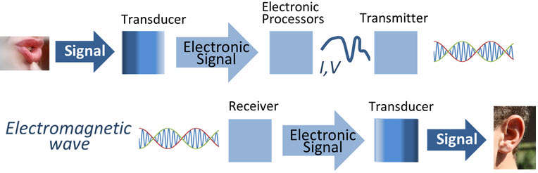

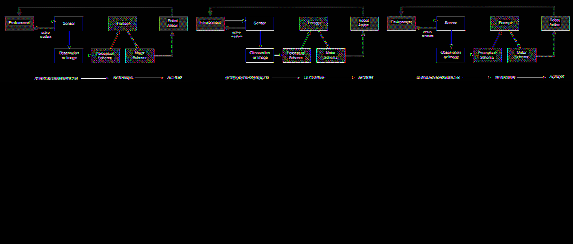

---

## Trang 9

### 9

- Khoa Điện tử- Viễn thông
- Trường Đại học Công nghệ, ĐHQGHN
- Kỹthuật Điện tử
- Electronics Engineering
- Need for Sensors
- Sensors are omnipresent.  They embedded in
- our bodies, automobiles, airplanes, cellular
- telephones, radios, chemical plants, industrial
- plants and countless other applications.
- Without the use of sensors, there would be no
- automation !!
- Imagine having to manually fill Poland Spring
- bottles
- Khoa Điện tử- Viễn thông
- Trường Đại học Công nghệ, ĐHQGHN
- Kỹthuật Điện tử
- Electronics Engineering
- Transducers
- Transducer
- 
- a device that converts a primary form of energy into a
- corresponding signal with a different energy form
- 
- Primary Energy Forms: mechanical, thermal, electromagnetic,
- optical, chemical, etc.
- 
- take form of a sensor or an actuator
- Sensor (e.g., thermometer)
- 
- a device that detects/measures a signal or stimulus
- 
- acquires information from the “real world”
- Actuator (e.g., heater)
- 
- a device that generates a signal or stimulus
- real
- world
- sensor
- actuator
- intelligent
- feedback
- system
- 17
- 18

---

## Trang 10

### 10

- Khoa Điện tử- Viễn thông
- Trường Đại học Công nghệ, ĐHQGHN
- Kỹthuật Điện tử
- Electronics Engineering
- Sensors are devices that responds to a physicalstimulus he
- at, light, sound, pressure, magnetism, motion, etc. and
- convert that into an electrical signal. They perform an
- input function.
- Actuators are devices which perform an output function
- and are used to control some external device,
- for example movement. Coverts electrical energy tomecha
- nical movement (motors)
- Both sensors and actuators are collectively known as
- Transducers
- Transducers are devices used to convert energy of onekind
- into energy of another kind
- 19
- Khoa Điện tử- Viễn thông
- Trường Đại học Công nghệ, ĐHQGHN
- Kỹthuật Điện tử
- Electronics Engineering
- Robotic sensors are used to estimate a robot’s condition
- and environment. These signals are passedto a controller
- to enable appropriate behavior.
- They sense and measure geometric and physical
- properties of robots and the surroundingenvironment
- 
- Position, orientation, velocity, acceleration
- 
- Distance, size
- 
- Force, moment
- 
- Temperature, Luminance,
- Sensors in robots are based on the functions of human
- sensory organs.
- Robots require extensive information about their
- environment in order to function effectively
- 20
- 19
- 20

---

## Trang 11

### 11

- Khoa Điện tử- Viễn thông
- Trường Đại học Công nghệ, ĐHQGHN
- Kỹthuật Điện tử
- Electronics Engineering
- What are Sensors?
- 
- American National Standards Institute (ANSI) Definition
- 
- A device which provides a usable output in response to a
- specified measurand
- 
- A sensor acquires a physical parameter and converts it into a
- signal suitable for processing (e.g. optical, electrical, mechanical)
- 
- Example:
- https://www.elprocus.com/difference-between-sensor-and-
- transducer/
- Sensor
- Input
- Signal
- Output
- Signal
- Khoa Điện tử- Viễn thông
- Trường Đại học Công nghệ, ĐHQGHN
- Kỹthuật Điện tử
- Electronics Engineering
- 22
- Typical Sensors
- 21
- 22

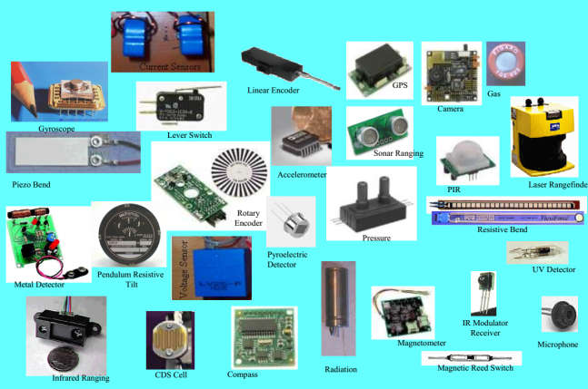

---

## Trang 12

### 12

- Khoa Điện tử- Viễn thông
- Trường Đại học Công nghệ, ĐHQGHN
- Kỹthuật Điện tử
- Electronics Engineering
- Features of Sensors
- Accuracy: Accuracy should be high. How close outputto the
- true value is the accuracy of the device.
- Precision : There should not be any variations in the
- sensed output over a period of time precision of thesensor
- should be high.
- Operating Range: Sensor should have wide range
- of operation and should be accurate and precise overthis
- entire range.
- Speed of Response: Should be capable of responding to
- the changes in the sensed variable in minimumtime.
- 23
- Khoa Điện tử- Viễn thông
- Trường Đại học Công nghệ, ĐHQGHN
- Kỹthuật Điện tử
- Electronics Engineering
- Calibration: Sensor should be easy to calibrate,
- timeand trouble required to calibrate should beminimum. I
- t should not require frequent recalibration.
- Reliability: It should have high reliability. Frequentfailure
- should not happen.
- Cost and Ease of operation: Cost should be as lowas
- possible, installation, operation and maintenanceshould be
- easy and should not required skilled or highly trained
- persons.
- 24
- 23
- 24

---

## Trang 13

### 13

- Khoa Điện tử- Viễn thông
- Trường Đại học Công nghệ, ĐHQGHN
- Kỹthuật Điện tử
- Electronics Engineering
- Choosing a Sensor
- Khoa Điện tử- Viễn thông
- Trường Đại học Công nghệ, ĐHQGHN
- Kỹthuật Điện tử
- Electronics Engineering
- Classification of Sensors
- Proprioceptive (Internal state) v.s. Exteroceptive
- 
- Measure values internally to the system (battery level,
- wheel position, joint angle…)
- 
- Observation of environments, objects
- Active vs Passive
- 
- Emitting energy into the environment, e.g., infrared,
- radar, sonar
- 
- Passively receive energy to make observation: camera
- Contact vs. non-contact
- …
- 26
- 25
- 26

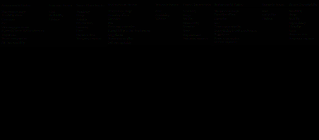

---

## Trang 14

### 14

- Khoa Điện tử- Viễn thông
- Trường Đại học Công nghệ, ĐHQGHN
- Kỹthuật Điện tử
- Electronics Engineering
- Common Sensors and Transducers
- 27
- Stimulus
- Quantity
- Acoustic
- Wave (amplitude, phase,
- polarization), Spectrum,
- Wave Velocity
- Biological & Chemical
- Fluid Concentrations (Gas or
- Liquid)
- Electric
- Charge, Voltage, Current,
- Electric Field (amplitude,
- phase, polarization),
- Conductivity, Permittivity
- Magnetic
- Magnetic Field (amplitude,
- phase, polarization),
- Flux, Permeability
- Optical
- Refractive Index, Reflectivity,
- Absorption
- Thermal
- Temperature, Flux, Specific
- Heat, Thermal
- Conductivity
- Mechanical
- Position, Velocity,
- Acceleration, Force,
- Strain, Stress, Pressure,
- Torque
- Khoa Điện tử- Viễn thông
- Trường Đại học Công nghệ, ĐHQGHN
- Kỹthuật Điện tử
- Electronics Engineering
- Need for Sensors
- Sensors are needed in robotics in order to makethem automated.
- Without sensors, a robot is, in essence, blind and deaf.
- Sensors allow a robot to collect information from the surrounding
- environment, in order to interact with it.
- Humanoid robots need a multitude of these sensors
- in order to mimic the capabilities of their living counterparts (human).
- Sensors are important in creating robots which areefficient in their
- appointed purpose.
- The inclusion of sensors is imperative to theirautomation. However,
- developers need to take carewhen choosing which sensors to
- incorporate in the design.
- Sensor type, sensitivity, accuracy, and position are all important
- factors for the success of the robot.
- 28
- 27
- 28

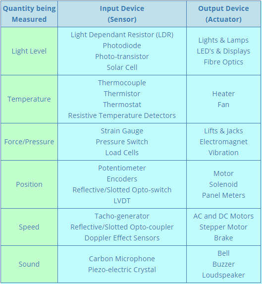

---

## Trang 15

### 15

- Khoa Điện tử- Viễn thông
- Trường Đại học Công nghệ, ĐHQGHN
- Kỹthuật Điện tử
- Electronics Engineering
- Classification of Sensors
- There are a wide variety of sensors used in robots
- Sensors can be classified using two important functional
- axes
- Proprioceptive / exteroceptive (internal/external)
- passive/active
- Contact/noncontact
- 29
- Khoa Điện tử- Viễn thông
- Trường Đại học Công nghệ, ĐHQGHN
- Kỹthuật Điện tử
- Electronics Engineering
- Proprioceptive sensors measure valuesinternal to the
- robot; for example, motor speed, wheel load, robot arm
- joint angles, and battery voltage.
- Passive sensors measure ambientenvironment energy ente
- ring the sensor.Examples of passive sensors include
- 
- temperature probes,
- 
- microphones,
- 
- and CCD or CMOS cameras.
- 30
- 29
- 30

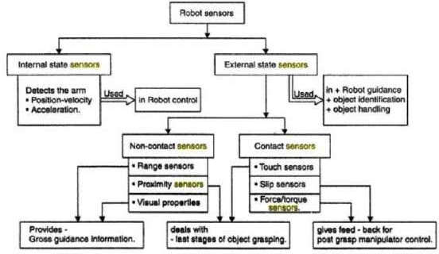

---

## Trang 16

### 16

- Khoa Điện tử- Viễn thông
- Trường Đại học Công nghệ, ĐHQGHN
- Kỹthuật Điện tử
- Electronics Engineering
- Industrial manufacturing robots need sensors to allow them to
- operate efficiently for pick and place of objects without crushing
- or dropping them ->  torque sensors, which monitor and control
- rotational forces
- Acoustical and piezoelectric sensors allow robots to identify
- prominent sounds, such as commands, in an area with
- background noise.
- Robots can incorporate pre-programmed outputs based upon
- the commands heard. This could be especially useful for field
- work, or robots in noisy environments.
- The simplest sensors are switch sensors. There are three types
- of switch sensor; contact, limitand shaft encoder sensors. They
- work without processing.
- 31
- Khoa Điện tử- Viễn thông
- Trường Đại học Công nghệ, ĐHQGHN
- Kỹthuật Điện tử
- Electronics Engineering
- Light sensors can also be used in multiple ways.They
- give a robot the ability to see.
- Light sensors allow robots to measure light intensity,
- differential intensity, and break-beam, i.e. the sudden
- reduction of intensity.
- These light sensors can be applied in different
- positions and directions depending on therobot’s
- intended purpose.
- 32
- 31
- 32

---

## Trang 17

### 17

- Khoa Điện tử- Viễn thông
- Trường Đại học Công nghệ, ĐHQGHN
- Kỹthuật Điện tử
- Electronics Engineering
- Ex. Line Sensor
- QRD1114: infrared (IR)
- reflective sensor to
- determine the
- reflectivity of the surface
- below it.
- When over the black
- playing field, the
- reflectivity is very low
- When over the white
- border, the reflectivity is
- very high and will cause
- a different reading from
- the sensor.
- Khoa Điện tử- Viễn thông
- Trường Đại học Công nghệ, ĐHQGHN
- Kỹthuật Điện tử
- Electronics Engineering
- 34
- Ex. Position sensors
- Rotary
- Linear
- Optical shaft encoder
- 33
- 34

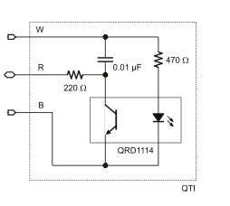

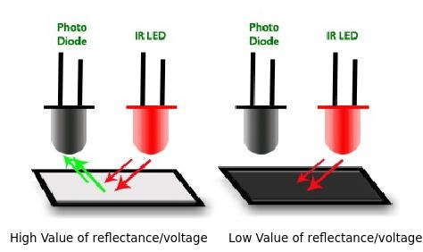

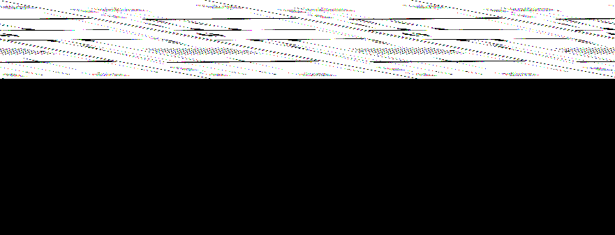

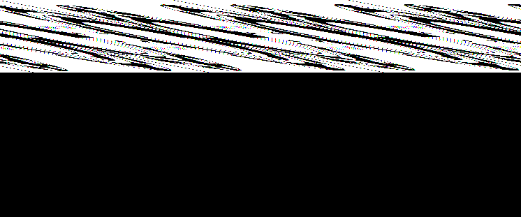

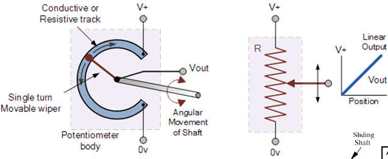

---

## Trang 18

### 18

- Khoa Điện tử- Viễn thông
- Trường Đại học Công nghệ, ĐHQGHN
- Kỹthuật Điện tử
- Electronics Engineering
- Ex. Ultrasonic Proximity Sensor
- PING Ultrasonic Range Finder
- •PING ultrasonic distance sensor provides precise distance
- measurements from about 2 cm (0.8 inches) to 3 meters (3.3
- yards).
- •It works by transmitting an ultrasonic burst and providing an
- output pulse that corresponds to the time required for the burst
- echo to return to the sensor.
- •By measuring the echo pulse width the distance to target can
- easily be calculated.
- Khoa Điện tử- Viễn thông
- Trường Đại học Công nghệ, ĐHQGHN
- Kỹthuật Điện tử
- Electronics Engineering
- Ex. Bending Beam Load Cell
- Strain Gauge
- Strain Gauge
- Strain Gauge
- In Tension
- Strain Gauge
- in compression
- 35
- 36

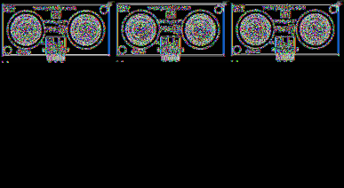

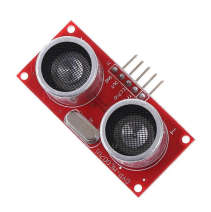

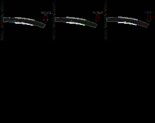

---

## Trang 19

### 19

- Khoa Điện tử- Viễn thông
- Trường Đại học Công nghệ, ĐHQGHN
- Kỹthuật Điện tử
- Electronics Engineering
- Measuring Thrust & Torque
- Khoa Điện tử- Viễn thông
- Trường Đại học Công nghệ, ĐHQGHN
- Kỹthuật Điện tử
- Electronics Engineering
- Measuring Thrust & Torque
- Thrust
- Torque
- 37
- 38

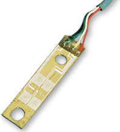

---

## Trang 20

### 20

- Khoa Điện tử- Viễn thông
- Trường Đại học Công nghệ, ĐHQGHN
- Kỹthuật Điện tử
- Electronics Engineering
- Course Objectives
- 
- Kiến thức
- 
- Giới thiệu tổng quan về kỹ thuật đo lường và cảm biến
- 
- Các nguyên lý, kỹ thuật chuyển đổi tín hiệu từ môi trường thành tín hiệu
- điện
- 
- Thiết kế, cấu tạo, hoạt động và ứng dụng của một số cảm biến
- 
- Kỹ năng
- 
- Phân tích thiết kế, triển khai hệ thống cảm biến điện tử
- 
- Các công cụ tính toán và phân tích như Matlab, Ansys, Comsol, …
- 39
- Khoa Điện tử- Viễn thông
- Trường Đại học Công nghệ, ĐHQGHN
- Kỹthuật Điện tử
- Electronics Engineering
- Summary
- Introduction to Robotics
- Robot Sensors
- Desirable features
- Need for Sensors
- Classification of Sensors
- 40
- 39
- 40

---

## Trang 21

### 21

- Khoa Điện tử- Viễn thông
- Trường Đại học Công nghệ, ĐHQGHN
- Kỹthuật Điện tử
- Electronics Engineering
- Textbook and references
- Textbook: Introduction to sensors for electrical and
- mechanical engineers, Novák, Martin
- References
- 
- Sensors and Actuators A: Physical - Journals | Elsevier
- https://www.journals.elsevier.com/sensors-and-
- actuators-a-physical
- 
- Sensors and Actuators B: Chemical - Journals | Elsevier
- https://www.journals.elsevier.com/sensors-and-
- actuators-b-chemical
- 
- IEEE Sensors Journal
- https://ieeexplore.ieee.org/xpl/RecentIssue.jsp?punum
- ber=7361
- 
- …
- (https://sci-hub.shop/)
- 41
- Khoa Điện tử- Viễn thông
- Trường Đại học Công nghệ, ĐHQGHN
- Kỹthuật Điện tử
- Electronics Engineering
- Software and Tool
- Matlab
- Comsol
- 42
- 41
- 42

---

## Trang 22

### 22

- Khoa Điện tử- Viễn thông
- Trường Đại học Công nghệ, ĐHQGHN
- Kỹthuật Điện tử
- Electronics Engineering
- Home works and Essays
- Home works: Website Courses.vnu.edu.vn
- Essay: 10 group of about 5 students
- 43
- 43

---
