# Chappter 5.2 ADC-Sampling and Filter

> Tài liệu chuyển đổi từ slide PowerPoint: `Chappter 5.2 ADC-Sampling and Filter.pptx`

---

## Slide 1

### ADC- Sampling and Filter

- 1

---

## Slide 2

### ADC Sampling

- 2
- 
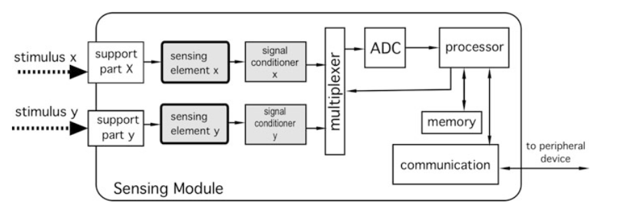

- Measurement systems block diagram

---

## Slide 3

### ADC interface and sampling

- 
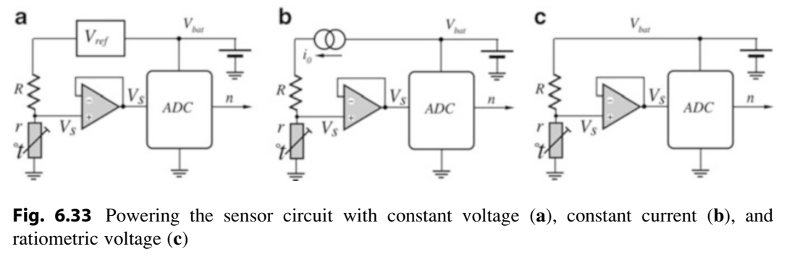

- 3

---

## Slide 4

### Digital Filters for sensor

- 4
- FIR (Finite Impulse Response) bộ lọc số có đáp ứng xung hữu hạn:
- Fs = 1 / 2 (ms) = 500 Hz, Fc = 50 Hz (low-pass), cửa sổ lọc N=5
- Thiết kế low-pass FIR thực chiến cho sensor
- 𝑥(𝑡) : tín hiệu vào
- ℎ(𝑡) : đáp ứng xung (impulse response)𝑦(𝑡) : tín hiệu ra

---

## Slide 5

### 5

- sinc(x)=sin(πx)/πx​
- h[n]=2⋅0.1⋅sinc(0.2(n−2))
- Digital Filter for sensor
- h[n]=hideal​[n]⋅w[n]

---

## Slide 6

### Digital Filter for sensor

- 6

---

## Slide 7

### 7

- #define N 5
- float h[N] = {
- 0.0675,
- 0.2490,
- 0.3670,
- 0.2490,
- 0.0675
- };
- float buffer[N] = {0};
- int idx = 0;
- float FIR_LPF(float x)
- {
- buffer[idx] = x;
- float y = 0;
- int j = idx;
- for(int i = 0; i < N; i++)
- {
- y += h[i] * buffer[j];
- j--;
- if(j < 0) j = N - 1;
- }
- idx++;
- if(idx >= N) idx = 0;
- return y;
- }
- unsigned long last = 0;
- void loop()
- {
- if (micros() - last >= 2000) // 2 ms
- {
- last = micros();
- float input = analogRead(A0);
- float output = FIR_LPF(input);
- }
- }
- Fs = 1 / 2 (ms) = 500 Hz, Fc = 50 Hz (low-pass), cửa sổ lọc N=5
- Digital Filter for sensor

---

## Slide 8

### IIR Low pass filter-Bộ lọc đáp ứng xung vô hạn

- 8

---

## Slide 9

### 9

- float alpha = 0.385;
- float y_prev = 0;
- float IIR_LPF(float x)
- {
- float y = alpha * x + (1 - alpha) * y_prev;
- y_prev = y;
- return y;
- }
- 

- IIR Low pass filter
- IIR Low pass filter bậc I

---

## Slide 10

### 10

- 

- float b0 = 0.0675;
- float b1 = 0.1349;
- float b2 = 0.0675;
- float a1 = -1.1429;
- float a2 = 0.4128;
- float x1 = 0, x2 = 0;
- float y1 = 0, y2 = 0;
- float IIR_Butterworth(float x)
- {
- float y = b0*x + b1*x1 + b2*x2
- - a1*y1 - a2*y2;
- // shift state
- x2 = x1;
- x1 = x;
- y2 = y1;
- y1 = y;
- return y;
- }
- Butterworth 2nd order
- IIR Low pass filter

---

## Slide 11

### Kalman filter for sensor

- 11
- Group discussion

---

## Slide 12

### Sensors for mobile robot

- 12
- 
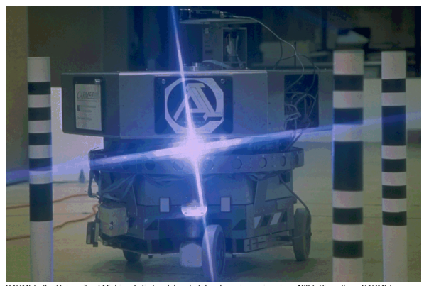

---

## Slide 13

### Sensors for Robots- Mobile robot

- 13
- IMU sensor
- 
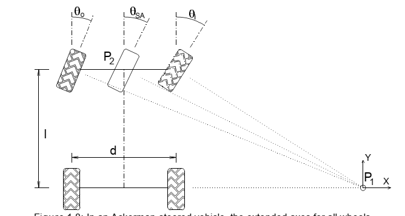

- 
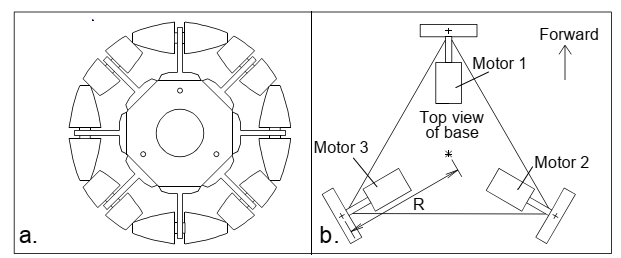

- 
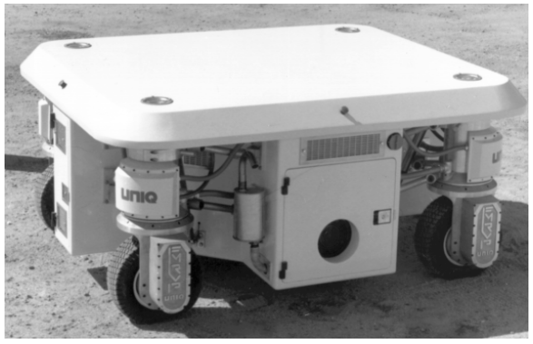

- 

- Motor: Encoder – Hall sensors
- Approximate sensor
- GPS
- Deep camera
- Line sensor
- 

- 

- 
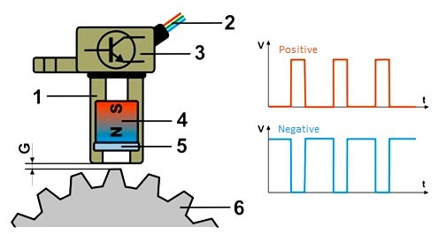

- 

- 

- 

- 
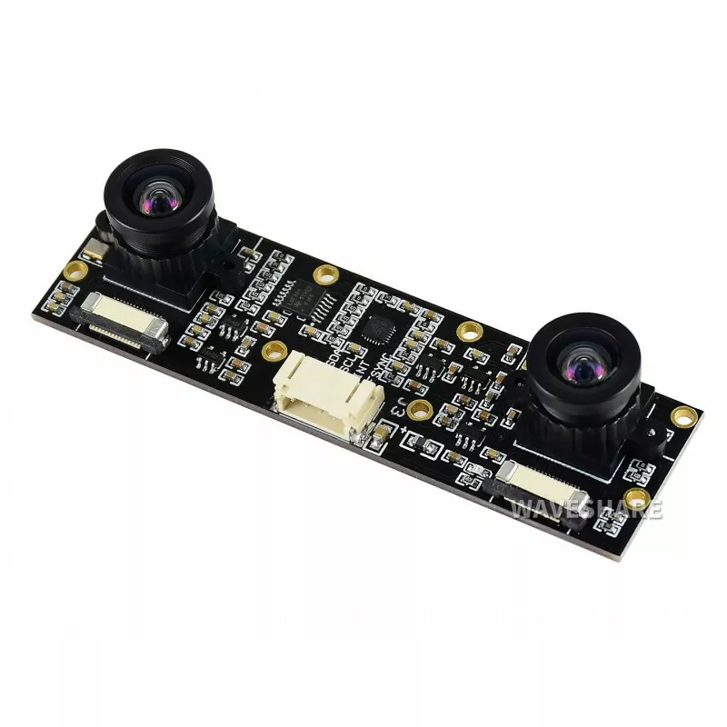

- Lidar sensor

---

## Slide 14

### ROS and Sensors

- 14
- 

- 
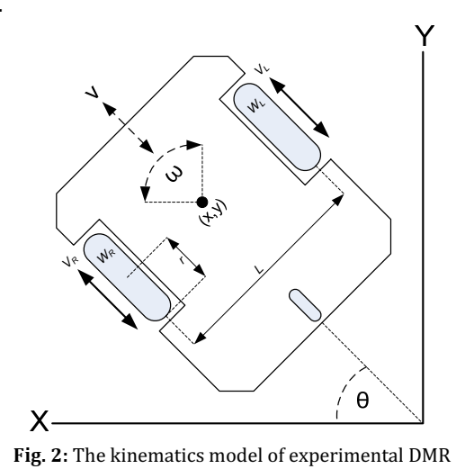

- 
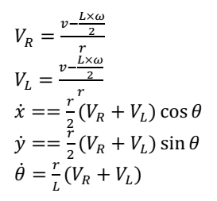

---

## Slide 15

### ROS - Sensors

- 15
- 

- 

- 
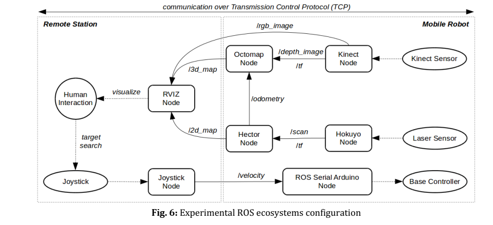

---

## Slide 16

### Laser scanner- LIDAR

- 16
- 

- 

- 

---

## Slide 17

### 17

- 
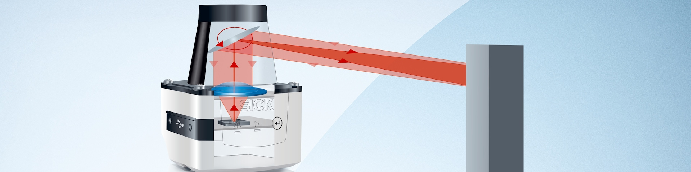

- 

- 2D Lidar
- 3D Lidar
- 
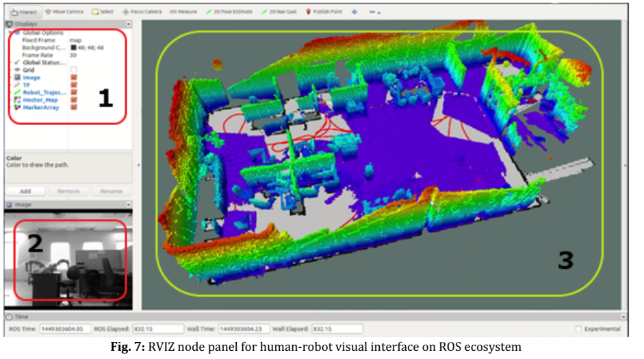

- 
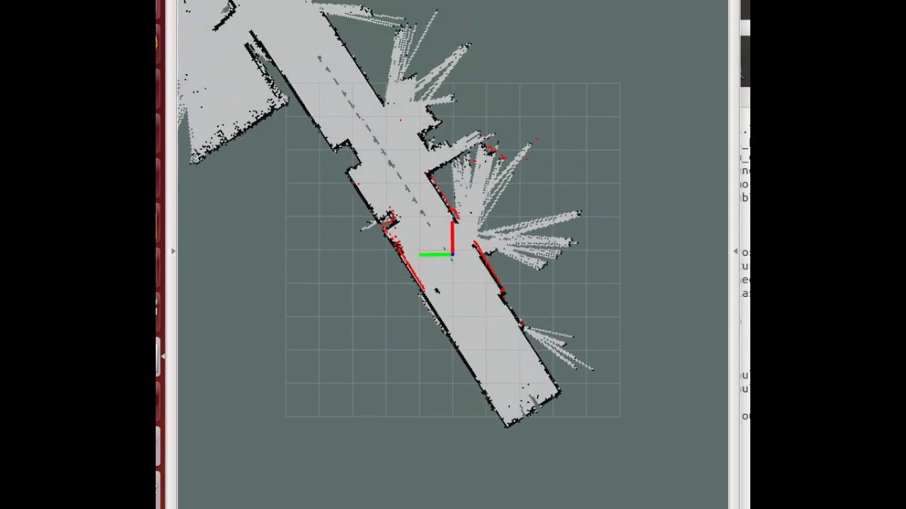

- Laser scanner- LIDAR

---

## Slide 18

### BLDC MOTOR

- 18
- 

- 
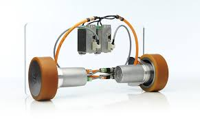

- ROBOT Dynamic control
- 

- 
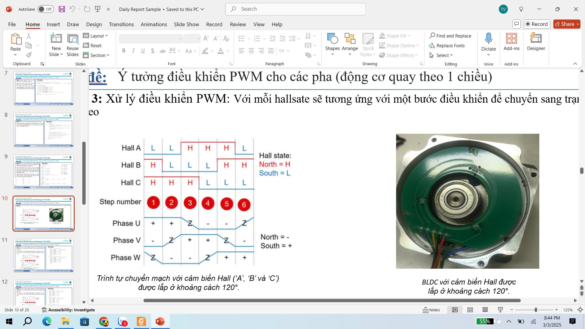

---

## Slide 19

### ROBOT-BLDC MOTOR

- 19
- 

- BLDC MOTOR

---

## Slide 20

### 20

- 

- ROBOT-BLDC MOTOR
- BLDC MOTOR
- 

- 

---

## Slide 21

### Magnetic (Hall) sensors

- 21
- 
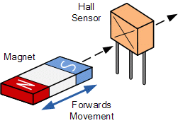

- 

---

## Slide 22

### Magnetic (Hall) sensors

- 22
- 

- 

- 

---

## Slide 23

### Incremental rotary encoders (IRC)

- 

- 23

---

## Slide 24

### Absolute rotary encoders

- 
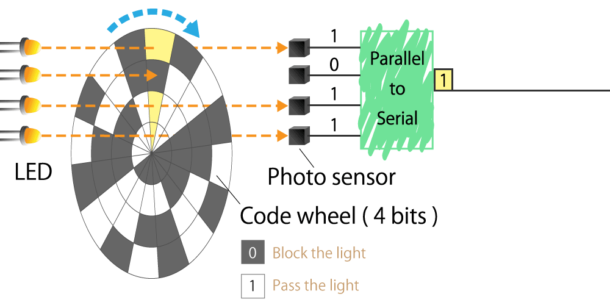

- 24

---

## Slide 25

### 25

- 

- Absolute rotary encoders

---

## Slide 26

### ROBOT – IMU sensor

- 26
- 

- 

- 

---

## Slide 27

### 27

- ROBOT – IMU sensor
- 
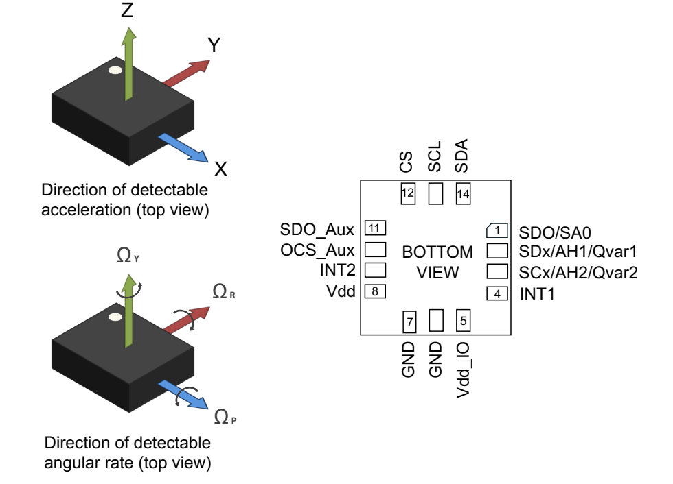

- 
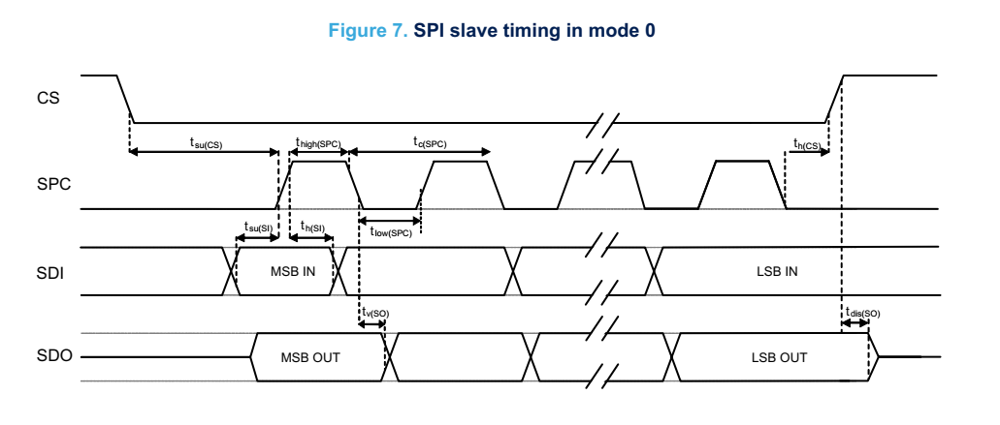

- 

---

## Slide 28

### 28

- ROBOT – IMU sensor
- 

- 

- Digital filter in IMU sensor
- 

---

## Slide 29

### Inductive proximity sensors

- 29
- 

- Only work with conductive objects
- 
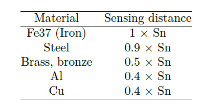

- 

- 

---

## Slide 30

### Capacitive proximity sensors

- 30
- 
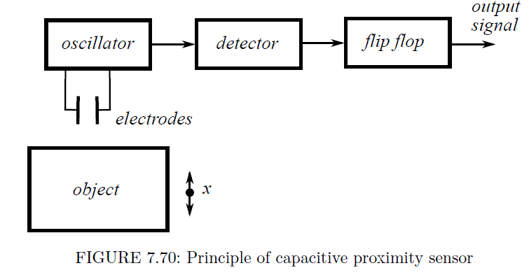

- 

- 

---

## Slide 31

### Optic proximity sensors

- 31
- 
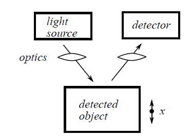

- 

- 

---
