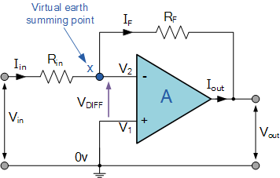
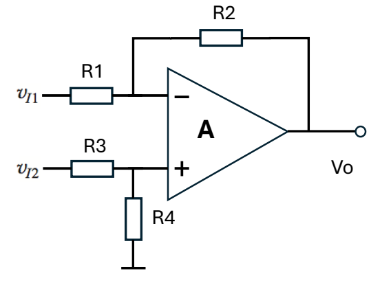
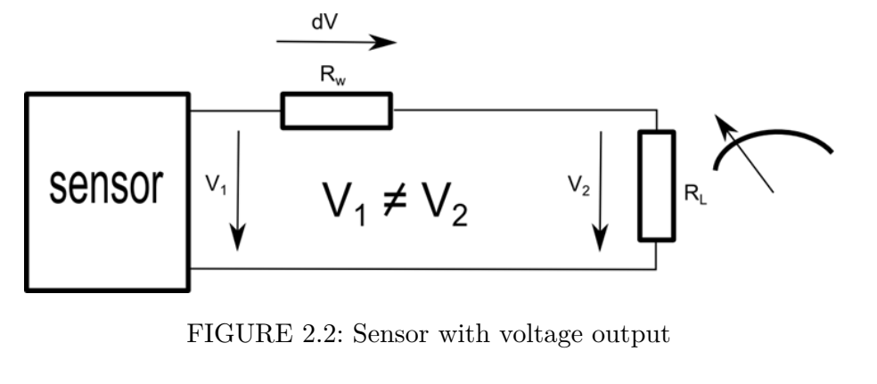
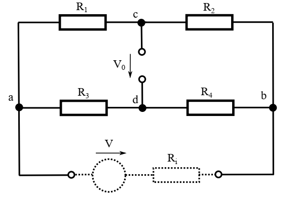
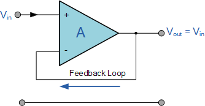
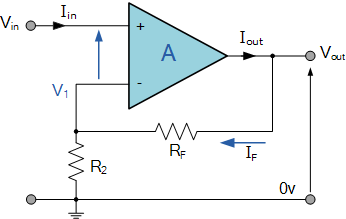
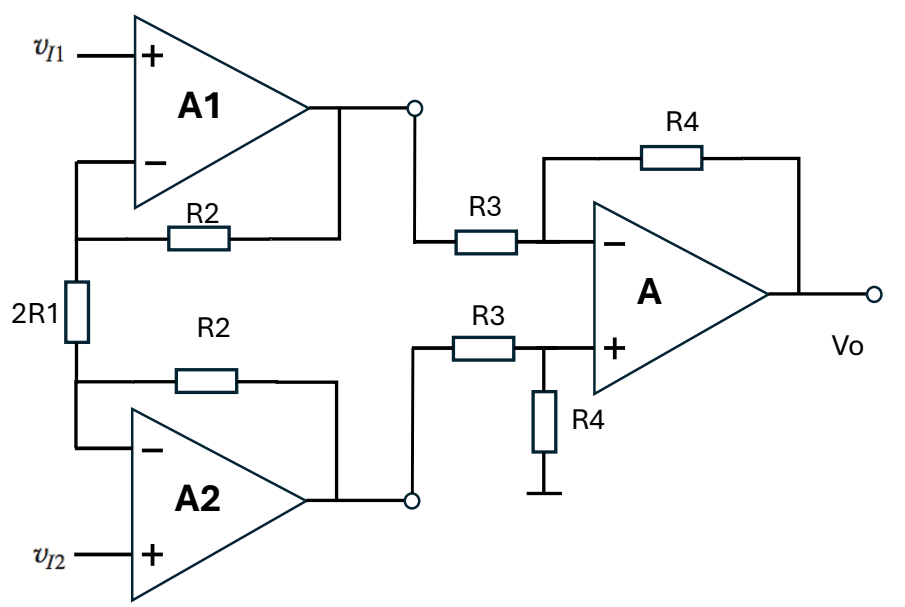

# Chương 4

> Tài liệu chuyển đổi từ tệp Word: `Chương 4.docx`

---

Chương 4: Mạch đo lường và xử lý tín hiệu lối ra cảm biến (Signal Conditioning)

Trong các chương trước, chúng ta đã trình bày các nguyên lý chuyển đổi (transducer) nhằm biến đổi các đại lượng vật lý và môi trường thành tín hiệu điện. Tuy nhiên, trong hầu hết các trường hợp, tín hiệu điện thu được từ cảm biến không thể đưa trực tiếp vào các thiết bị đọc, hiển thị hoặc làm đầu vào cho hệ thống đo lường và điều khiển, mà cần phải được xử lý trước.

Cụ thể, tín hiệu từ cảm biến thường có mức năng lượng thấp, đặc tính chưa tuyến tính hoặc chưa nằm trong dải đo phù hợp với các mạch xử lý phía sau. Bên cạnh đó, các nguồn nhiễu từ môi trường và từ chính hệ thống điện tử cũng có thể ảnh hưởng đáng kể đến độ chính xác của phép đo. Vì vậy, việc thiết kế các mạch xử lý tín hiệu là hết sức cần thiết nhằm thực hiện các chức năng như khuếch đại tín hiệu, lọc nhiễu, điều chỉnh dải đo, tuyến tính hóa đặc tính cảm biến và đảm bảo tín hiệu đầu ra đáp ứng yêu cầu của hệ thống.

Bên cạnh các đặc tính chuyển đổi giữa đại lượng vật lý và tín hiệu điện, cảm biến còn được đặc trưng bởi các tham số điện quan trọng như trở kháng đầu ra và công suất tín hiệu. Những tham số này có ảnh hưởng trực tiếp đến khả năng truyền tín hiệu và hiệu quả ghép nối giữa cảm biến với các khối xử lý tín hiệu phía sau.

Trở kháng đầu ra của cảm biến () biểu thị khả năng cung cấp tín hiệu điện của cảm biến tới tải bên ngoài. Khi cảm biến được kết nối với một mạch đo hoặc mạch xử lý tín hiệu có trở kháng đầu vào , mối quan hệ giữa hai giá trị trở kháng này sẽ quyết định mức tín hiệu thực sự được truyền tới mạch tiếp theo. Nếu trở kháng đầu vào của mạch đo không đủ lớn so với trở kháng đầu ra của cảm biến, tín hiệu điện áp sẽ bị suy giảm do hiện tượng phân áp trên các phần tử trở kháng.

Trong nhiều trường hợp, công suất tín hiệu từ cảm biến là rất nhỏ. Theo nguyên lý truyền công suất tối đa, công suất truyền từ nguồn đến tải đạt giá trị lớn nhất khi trở kháng tải bằng trở kháng nguồn. Tuy nhiên, trong các hệ đo lường và cảm biến, mục tiêu thường không phải là truyền công suất tối đa mà là duy trì độ chính xác của tín hiệu điện áp. Vì vậy, mạch đo hoặc mạch tiền xử lý tín hiệu thường được thiết kế sao cho trở kháng đầu vào lớn hơn nhiều so với trở kháng đầu ra của cảm biến, nhằm giảm thiểu sự suy giảm tín hiệu.

Để đảm bảo tín hiệu từ cảm biến được truyền tới hệ thống xử lý dữ liệu một cách chính xác, cần thực hiện phối hợp trở kháng giữa các khối chức năng trong hệ thống. Cụ thể, khối xử lý tín hiệu bao gồm các mạch khuếch đại, lọc và chuyển đổi – thường được thiết kế với trở kháng đầu vào cao để không làm tải cảm biến. Sau đó, tín hiệu đã được khuếch đại và điều chỉnh sẽ được truyền tới như bộ chuyển đổi tương tự–số (ADC) hoặc vi điều khiển. Việc phối hợp trở kháng hợp lý giữa các khối này giúp tối ưu hóa việc truyền tín hiệu, giảm suy hao và nâng cao độ chính xác của toàn bộ hệ thống đo lường.

Trong quá trình chuyển đổi tín hiệu, tín hiệu đầu ra của cảm biến thường có biên độ nhỏ hoặc năng lượng thấp. Do đó, cần sử dụng các mạch khuếch đại để tăng biên độ và công suất của tín hiệu. Chẳng hạn, đối với một số cảm biến nhiệt độ, sự thay đổi điện áp đầu ra chỉ nằm trong dải vài chục microvolt (µV). Vì vậy, tín hiệu này cần được khuếch đại lên mức điện áp cỡ volt (V) để các hệ đo lường hoặc bộ xử lý có thể nhận biết và xử lý một cách hiệu quả.

Hình 4.1 Sơ đồ mạch mô tả mô hình lối ra của cảm biến với hệ đo lường

Hình 4.1 mô tả mô hình truyền tín hiệu điện áp từ đầu ra của cảm biến. Trong đó, tín hiệu điện áp xuất hiện tại đầu ra của cảm biến, biểu diễn giá trị của đại lượng cần đo sau khi đã được chuyển đổi từ môi trường sang dạng tín hiệu điện. Tín hiệu này được truyền tới một vôn kế có điện trở đầu vào thông qua các dây nối có điện trở hữu hạn .

Do dây dẫn có điện trở khác không nên sẽ xuất hiện sụt áp trên các dây nối. Vì vậy, điện áp đo được tại vôn kế sẽ nhỏ hơn điện áp đầu ra ban đầu của cảm biến . Ngoài ra, trong thực tế, các dây dẫn còn có thể thu nhận nhiễu điện từ từ môi trường xung quanh do chúng hoạt động như một anten thu nhiễu. Các yếu tố này làm cho tín hiệu nhận được tại thiết bị đo bị sai lệch so với tín hiệu ban đầu của cảm biến.

Truyền tín hiệu ở dạng điện áp thường chỉ phù hợp trong các hệ thống có khoảng cách truyền ngắn và môi trường nhiễu thấp. Trong các trường hợp cần cải thiện chất lượng tín hiệu, người ta có thể sử dụng dây dẫn có lớp bọc chống nhiễu (shielded cable) để hạn chế ảnh hưởng của nhiễu điện từ. Đồng thời, các mạch khuếch đại tín hiệu cũng được sử dụng nhằm giảm ảnh hưởng của sụt áp trên dây dẫn và nâng cao tỷ số tín hiệu trên nhiễu.

Một phương pháp khác là truyền tín hiệu dưới dạng dòng điện thay vì điện áp. Với phương pháp này, tín hiệu được truyền trong một vòng dòng điện kín, trong đó giá trị dòng điện tỉ lệ với giá trị đại lượng đo được từ cảm biến. Phương pháp truyền tín hiệu dòng điện có ưu điểm ít bị ảnh hưởng bởi điện trở của dây dẫn và nhiễu môi trường. Trong công nghiệp, chuẩn truyền tín hiệu dòng điện thường được sử dụng là 4–20 mA.

Hình 4.2. Cấu hình hoạt động chuyển đổi tín hiệu của cảm biến dưới dạng tín hiệu dòng điện.

Hình 4.2 mô tả cấu hình hoạt động của cảm biến dưa trên nguyên lý biến đổi dòng điện. Thay vì thay đổi giá trị điện áp thì tín hiệu sẽ đặc trưng biến đổi bởi dòng điện một chiều tạo thành một mạch kín. Việc sử dụng tín hiệu dạng này giúp giảm nhiễu đường dây và tăng độ tin cậy của việc đọc tín hiệu từ cảm biến. Đây cũng là một chuẩn chuyển đổi hay được sử dụng trong công nghiệp khi các cảm biến thương mại có chế độ đọc giá trị dựa trên chuyển đổi dòng điện.

Ưu điểm quan trọng của phương pháp truyền tín hiệu dòng điện là ít bị ảnh hưởng bởi điện trở của dây dẫn. Dù dây dẫn có gây ra sụt áp, giá trị dòng điện trong mạch vẫn được duy trì gần như không đổi, miễn là nguồn cung cấp đủ điện áp để duy trì vòng dòng điện. Vì vậy, phương pháp này có khả năng truyền tín hiệu ổn định trên khoảng cách xa và trong môi trường có nhiều nhiễu điện từ.

4.1. Mạch khuếch đại tín hiệu (Đảo, Không đảo, Vi sai)

4.1.1 Mạch khuếch đại đảo

Hình 4.3 minh họa sơ đồ nguyên lý của mạch khuếch đại đảo (Inverting amplifier) sử dụng bộ khuếch đại thuật toán (Operational Amplifier – Op-Amp). Trong cấu hình này, tín hiệu đầu vào cần được khuếch đại được đưa vào cực đảo của bộ khuếch đại thông qua điện trở , trong khi điện trở hồi tiếp nối từ đầu ra về nút vào đảo. Cực không đảo của bộ khuếch đại được nối với đất (0 V).

Hình 4.3. Sơ đồ nguyên lý của mạch khuếch đại đảo

Do bộ khuếch đại thuật toán có hệ số khuếch đại vòng hở rất lớn, điện áp tại hai đầu vào của op-amp gần như bằng nhau. Vì cực không đảo được nối đất nên điện áp tại nút vào đảo (điểm X trong hình) xấp xỉ bằng 0 V. Điểm này được gọi là điểm đất ảo (virtual ground). Nhờ đặc tính trở kháng đầu vào rất lớn của op-amp, dòng điện đi vào các cực đầu vào gần như bằng không. Do đó, dòng điện chạy qua điện trở sẽ đi hoàn toàn qua điện trở hồi tiếp .

Áp dụng định luật Ohm và định luật Kirchhoff cho nút tại điểm X, ta có:

(4.1)

Từ đó thu được hệ số khuếch đại điện áp của mạch:

(4.2)

Dấu âm trong biểu thức cho thấy tín hiệu đầu ra bị đảo pha 180° so với tín hiệu đầu vào. Mạch khuếch đại đảo thường được sử dụng trong các hệ thống xử lý tín hiệu cảm biến (signal conditioning) để khuếch đại các tín hiệu điện áp nhỏ từ cảm biến, đồng thời cung cấp khả năng điều chỉnh hệ số khuếch đại thông qua việc lựa chọn tỉ số giữa hai điện trở và . Ngoài ra, nhờ đặc tính điểm đất ảo, mạch còn giúp đơn giản hóa việc phân tích dòng điện và giảm ảnh hưởng của tải lên nguồn tín hiệu đầu vào.

Do op-amp lý tưởng có trở kháng đầu vào rất lớn, dòng điện đi vào các cực đầu vào gần như bằng không. Đồng thời, nhờ hồi tiếp âm, điện áp tại hai đầu vào của op-amp gần như bằng nhau (). Vì cực không đảo được nối đất nên điện áp tại nút vào đảo (điểm X) cũng xấp xỉ bằng 0. Điểm này được gọi là đất ảo (virtual ground).

Dòng điện từ nguồn tín hiệu đi vào mạch là:

(4.3)Do :

(4.4)Trở kháng lối vào của mạch được định nghĩa là:

(4.5)Thay vào ta được:  .

Như vậy, trong cấu hình khuếch đại đảo, trở kháng lối vào của mạch được xác định trực tiếp bởi điện trở .  Đối với kháng lối ra của mạch khuếch đại không đảo, Để tính trở kháng lối ra, ta đặt tín hiệu đầu vào bằng 0:  và đặt một nguồn thử tại đầu ra để xác định dòng .

Trong op-amp thực tế, tồn tại trở kháng đầu ra nội tại . Khi có hồi tiếp âm, trở kháng lối ra của toàn mạch được giảm theo hệ số vòng lặp. Hệ số hồi tiếp của mạch khuếch đại đảo là:

(4.7)Nếu  là hệ số khuếch đại vòng hở của op-amp, thì trở kháng lối ra của mạch xấp xỉ:

(4.8)Do của op-amp thường rất lớn (cỡ ), nên: Vì vậy: Việc xác định trở kháng lối vào và trở kháng lối ra của mạch khuếch đại đóng vai trò quan trọng trong thiết kế các hệ thống đo lường và điều khiển. Các tham số này cho phép đánh giá khả năng ghép nối giữa các khối chức năng trong hệ thống, từ cảm biến, mạch tiền xử lý tín hiệu cho đến khối xử lý dữ liệu. Khi các khối được thiết kế với sự phối hợp trở kháng hợp lý, tín hiệu sẽ được truyền đi một cách ổn định và ít bị suy hao. Ngược lại, nếu không chú ý đến vấn đề phối hợp trở kháng, tín hiệu có thể bị suy giảm hoặc biến dạng trong quá trình truyền giữa các khối, làm ảnh hưởng đến độ chính xác và độ tin cậy của toàn bộ hệ thống đo lường và điều khiển. Như vậy, đối với mạch khuếch đại đảo, một đặc trưng cần lưu ý là trở kháng lối vào của mạch được quy định bởi trở phối hợp Rin.

4.1.2 Mạch khuếch đại không đảo

Hình 4.2 mô tả sơ đồ nguyên lý của bộ khuếch đại không đảo sử dụng bộ khuếch đại thuật toán (Operational Amplifier – Op-Amp). Trong sơ đồ nguyên lý này, tín hiệu đầu vào được đưa trực tiếp vào cực không đảo (+) của op-amp, trong khi cực đảo (−) được nối với mạng hồi tiếp gồm hai điện trở và . Điện trở nối từ đầu ra về cực đảo, còn nối từ cực đảo xuống đất.

Hình 4.4. Sơ đồ nguyên lý của mạch khuếch đại không đảo

Do op-amp có hệ số khuếch đại vòng hở rất lớn và mạch có hồi tiếp âm, điện áp tại hai đầu vào gần như bằng nhau: () Vì tín hiệu được đưa vào cực không đảo nên:

Điện áp tại cực đảo được xác định bởi mạch chia áp gồm và :

(4.9)Do , ta có:

(4.10)Từ phương trình trên có thể suy ra hệ số khuếch đại điện áp của mạch:

(4.11)Như vậy, tín hiệu đầu ra cùng pha với tín hiệu đầu vào, và hệ số khuếch đại được xác định bởi tỉ số giữa hai điện trở hồi tiếp.

Trong cấu hình khuếch đại không đảo, tín hiệu đầu vào được đưa trực tiếp vào cực không đảo của op-amp. Do op-amp lý tưởng có trở kháng đầu vào rất lớn, dòng điện đi vào cực này gần như bằng không (), do đó:

(4.12)Trong thực tế, trở kháng lối vào của mạch xấp xỉ bằng trở kháng đầu vào của op-amp, thường nằm trong khoảng từ megaohm đến gigaohm. Nhờ đó mạch gần như không làm tải nguồn tín hiệu, rất phù hợp để khuếch đại tín hiệu từ các cảm biến có trở kháng đầu ra lớn.

Đối với trở kháng lối ra, một khuếch đại thuật thực tế có một trở kháng đầu ra nội tại . Tuy nhiên, nhờ có hồi tiếp âm thông qua mạng điện trở và , trở kháng lối ra của toàn mạch được giảm đáng kể:

(4.13)

trong đó:  là hệ số khuếch đại vòng hở của op-amp, là hệ số hồi tiếp của mạch

Với mạch khuếch đại không đảo:

(4.14)

Do  rất lớn, nên trở kháng lối ra xấp xỉ bằng không (). Điều này giúp mạch có khả năng cung cấp tín hiệu ổn định cho các tải hoặc các khối xử lý tiếp theo như bộ lọc, bộ ADC hoặc vi điều khiển.

Hình 4.5. Sơ đồ nguyên lý của mạch khuếch đại lặp lại tín hiệu (Buffer amplifier)

Hình 4.5 mô tả cấu hình của mạch khuếch đại đệm (buffer amplifier) sử dụng bộ khuếch đại thuật toán (Op-Amp). Trong cấu hình này, tín hiệu đầu vào được đưa trực tiếp vào cực không đảo (+) của op-amp, trong khi đầu ra được hồi tiếp trực tiếp về cực đảo (−) của bộ khuếch đại. Do đó mạch tạo thành một vòng hồi tiếp âm trực tiếp.

Với đặc tính của op-amp có hệ số khuếch đại vòng hở rất lớn, khi có hồi tiếp âm thì điện áp tại hai đầu vào gần như bằng nhau. Do đó điện áp đầu ra sẽ xấp xỉ tín hiệu điện áp đầu vào ().

Do đó hệ số khuếch đại điện áp của mạch xấp xỉ bằng 1, tức là tín hiệu đầu ra có biên độ và pha giống với tín hiệu đầu vào. Mạch không thực hiện khuếch đại biên độ mà chủ yếu dùng để cách phối hợp kháng giữa các khối trong hệ thống.

Một đặc điểm quan trọng của mạch đệm là trở kháng lối vào rất lớn và trở kháng lối ra rất nhỏ. Nhờ vậy mạch gần như không làm tải nguồn tín hiệu ở đầu vào, đồng thời có khả năng cung cấp tín hiệu ổn định cho tải hoặc các khối xử lý phía sau. Vì lý do này, mạch khuếch đại đệm thường được sử dụng trong các hệ thống xử lý tín hiệu cảm biến (signal conditioning) để ghép nối giữa cảm biến có trở kháng cao với các mạch đo, bộ lọc hoặc bộ chuyển đổi tương tự–số (ADC).

4.1.3 Mạch khuếch đại vi sai

Hình 4.6 minh họa việc sử dụng mạch khuếch đại vi sai (differential amplifier) kết hợp với cầu điện trở (resistive bridge) để đo sự thay đổi nhỏ của điện trở trong các cảm biến. Trong cấu hình này, các phần tử điện trở của cầu có thể bao gồm các điện trở chuẩn và một hoặc nhiều điện trở cảm biến. Khi hệ thống ở trạng thái cân bằng, điện áp tại hai nút của cầu bằng nhau nên hiệu điện áp giữa hai đầu ra của cầu gần như bằng không.

Khi đại lượng vật lý cần đo (như áp suất, lực, nhiệt độ hoặc biến dạng) tác động lên cảm biến, giá trị điện trở của phần tử cảm biến thay đổi, làm mất cân bằng cầu điện trở. Sự mất cân bằng này tạo ra hai điện áp và tại hai nút của cầu. Các tín hiệu này được đưa vào hai đầu vào của bộ khuếch đại vi sai. Bộ khuếch đại sẽ khuếch đại hiệu điện áp giữa hai tín hiệu đầu vào, theo quan hệ:

(4.15)trong đó  là hệ số khuếch đại của mạch.

Hình 4.6. Mạch khuếch đại vi sai mắc kết hợp với khối cầu điện trở

Nhờ chỉ khuếch đại sai khác giữa hai tín hiệu, mạch khuếch đại vi sai có khả năng loại bỏ các thành phần nhiễu chung xuất hiện đồng thời trên cả hai đường tín hiệu, đồng thời tăng độ nhạy đối với các thay đổi nhỏ của cảm biến. Vì vậy, cấu hình này được sử dụng rộng rãi trong các hệ đo lường chính xác, đặc biệt trong các cảm biến sử dụng cầu Wheatstone như cảm biến áp suất, cảm biến lực hoặc cảm biến biến dạng (strain gauge).

Hình 4.7 minh họa cấu hình mạch khuếch đại vi sai (differential amplifier) sử dụng bộ khuếch đại thuật toán. Trong mạch này, hai tín hiệu đầu vào và  được đưa vào hai cực của op-amp thông qua các điện trở và . Điện trở  đóng vai trò hồi tiếp từ đầu ra về cực đảo, trong khi điện trở nối từ cực không đảo xuống đất nhằm thiết lập mạng phân áp cho tín hiệu đầu vào.

Hình 4.6. Cấu hình mạch khuếch đại vi sai sử dụng bộ khuếch đại thuật toán

Do op-amp có hệ số khuếch đại vòng hở rất lớn và mạch có hồi tiếp âm, điện áp tại hai đầu vào của op-amp gần như bằng nhau ().  Trước hết xét điện áp tại cực không đảo. Điện áp này được xác định bởi mạch chia áp giữa và :

(4.16)Do , ta có:

(4.17)Áp dụng định luật Kirchhoff tại nút vào đảo:

(4.18)Thay biểu thức của vào và biến đổi, ta thu được điện áp đầu ra của mạch:

(4.19)Thay tiếp giá trị :

(4.20)Trong trường hợp các điện trở được lựa chọn thỏa mãn điều kiện:

(4.21)mạch sẽ hoạt động như bộ khuếch đại vi sai lý tưởng, và biểu thức đầu ra trở thành:

(4.22)Kết quả này cho thấy điện áp đầu ra tỉ lệ với hiệu điện áp giữa hai tín hiệu đầu vào. Nhờ đó, mạch có khả năng khuếch đại các tín hiệu sai khác nhỏ đồng thời loại bỏ các thành phần nhiễu chung xuất hiện trên cả hai đầu vào. Chính vì vậy, cấu hình khuếch đại vi sai thường được sử dụng trong các hệ xử lý tín hiệu cảm biến, đặc biệt khi kết hợp với các mạch cầu điện trở (Wheatstone bridge) để đo các thay đổi rất nhỏ của điện trở trong các cảm biến như cảm biến biến dạng, cảm biến áp suất hoặc cảm biến lực.

- Common-Mode Rejection Ratio (CMRR) Hệ số khử tín hiệu chế độ chung
CMRR là tham số được sử dụng để đánh giá khả năng của bộ khuếch đại vi sai trong việc khuếch đại tín hiệu sai khác giữa hai đầu vào và loại bỏ các tín hiệu nhiễu đồng pha. CMRR được định nghĩa là tỉ số giữa hệ số khuếch đại vi sai và hệ số khuếch đại chế độ chung:

(4.23)trong đó:

: hệ số khuếch đại vi sai.

: hệ số khuếch đại chế độ chung được xác định dựa trên

CMRR thường được biểu diễn dưới dạng decibel (dB):

(4.24)

Hình 4.7. Cấu hình mạch mắc chung đầu vào để xác định hệ số CMRR

4.2. Mạch khuếch đại công cụ (Instrumentation Amplifier) và ứng dụng

Hình 4.8. Cấu hình mạch khuếch đại công cụ

Mạch trong hình bạn đưa là một mạch khuếch đại công cụ (instrumentation amplifier – INA) điển hình, gồm ba op-amp: hai tầng đầu (A1, A2) và một tầng vi sai phía sau (A). Đây là cấu trúc rất phổ biến khi cần đo các tín hiệu nhỏ từ cảm biến trong môi trường nhiễu.

Hai op-amp A1 và A2 hoạt động như buffer khuếch đại đầu vào, giúp: Tăng trở kháng vào (không làm ảnh hưởng sensor), tiền khuếch đại hiệu điện áp và . Điện trở  nối giữa hai nhánh đóng vai trò điều chỉnh hệ số khuếch đại vi sai. Tầng thứ ba (op-amp A) nhận tín hiệu từ A1 và A2 qua các điện trở , thực hiện phép trừ (khuếch đại vi sai), Loại bỏ nhiễu đồng pha (common-mode). Ở tầng đầu (A1, A2), do op-amp lý tưởng nên  , suy ra điện áp tại hai đầu vào đảo bằng và  dòng qua điện trở :

Dòng này chạy qua các điện trở hồi tiếp , tạo ra điện áp ra của hai op-amp:

Lấy hiệu:

Ở tầng  vi sai (op-amp A), mạch này là khuếch đại vi sai chuẩn với tỉ số điện trở:

Kết hợp hai tầng:

Ý nghĩa của mạch

Chỉ khuếch đại hiệu điện áp giữa hai đầu vào

Loại bỏ tín hiệu chung (nhiễu)

Có thể điều chỉnh gain bằng cách thay

4.3. Mạch cầu Wheatstone (DC/AC) và Kỹ thuật cầu  cân bằng

Để xử lý tín hiệu từ cảm biến thành tín hiệu chuẩn, cần sử dụng các mạch điện tử. Một trong những mạch quan trọng nhất là mạch cầu. Có rất nhiều loại cảm biến sử dụng mạch cầu để làm bộ chuyển đổi (Variable conversion element). Có thể ví dụ như các cảm biến lực dạng load cell, cảm biến áp suất, cảm biến nhiệt độ theo nguyên lý thay đổi điện trở. Mạch cầu có thể được phân loại theo một số cách như theo nguồn cấp như mạch cầu DC và mạch cầu AC hoặc theo phương pháp đo điện áp đầu ra như mạch cầu cân bằng (balanced bridge) và mạch cầu không cân bằng. Trong mạch cầu không cân bằng, điện áp đầu ra được đo trực tiếp bằng vôn kế.Trong mạch cầu cân bằng, các phần tử được điều chỉnh cho đến khi điện áp đầu ra bằng 0.

4.3.1 Mạch cầu DC

Mạch cầu DC được sử dụng cho các cảm biến có sự thay đổi điện trở và có cấu hình bao gồm một điện trở tham chiếu mắc nối tiếp với điện trở cần đo là cảm biến. Trong mạch DC không có thành phần điện dung hoặc điện cảm. Mạch cầu hoạt động như một chuyển đổi sự thay đổi nhỏ của điện trở thành điện áp nhỏ gây ra bởi sự thay đổi của dòng điện khi điện trở thay đổi. Điện áp này thường cần được khuếch đại thêm bằng bộ khuếch đại DC.

4.3.2 Mạch cầu Wheatstone

Mạch cầu Wheatstone được cấu tạo bởi bốn điện trở R1, R2, R3 và R4 (trong đó một hoặc nhiều điện trở có thể là cảm biến) và được cấp nguồn điện áp . Điện áp đầu ra:  thường nối với vôn kế hoặc mạch xử lý (khuếch đại DC, instrumentation amplifier). Điện trở nguồn thường rất nhỏ so với đến , nên có thể bỏ qua trong tính toán đơn giản (Hình 4.9).

Hình 4.9. Cấu hình mạch cầu Wheatstone

Áp dụng định lý Thevenin, ta có thể thay thế mạch bằng một nguồn điện áp  nối tiếp với điện trở tương đương . Điện áp tại các nút:

(4.25)Ta có điện áp đầu ra:

(4.26)

Điện trở tương đương Thevenin khi ngắn mạch nguồn điện áp và hở mạch nguồn dòng, ta thu được:

(4.27)

Dòng điện đầu ra khi nối với vôn kế có điện trở trong :

(4.28)

Khai triển:

(4.29)Trường hợp mạch cầu cân bằng sẽ thỏa mãn điều kiện I=0 và ngược lại nếu mạch cầu không cân bằng thì dòng điện I khác 0.

4.3.3 Mạch cầu một phần tư (Quarter-bridge)

Mạch cầu ¼  là mạch cầu Wheatstone trong đó có 1 điện trở biến thiên có thể là một cảm biến và các điện trở còn lại là là cố định. Thông thường, ta chọn:

(4.30)

Điện trở cảm biến có giá trị danh định là , và thay đổi:

(4.30)

Mạch cầu 1/4 được minh họa trong Hình 2.8. Dòng điện đầu ra của mạch cầu:

Biểu thức trên là phi tuyến theo  điện áp và dòng đo được còn phụ thuộc vào điện trở trong của vôn kế .

Quan hệ giữa điện áp đầu ra và  là phi tuyến (non-linear). Xấp xỉ tuyến tính đạt được (khi biến thiên nhỏ) Với:

Ta có thể đơn giản hóa:

Độ nhạy dòng (Current Sensitivity)

Độ nhạy của dòng theo sự thay đổi điện trở:

Điện áp đầu ra

Độ nhạy điện áp (Voltage Sensitivity)

4.4. Mạch Logarit, mạch lọc, và khuếch đại Lock-in

Mạch khuếch đại logarit là một mạch điện tử đặc biệt có khả năng biến đổi tín hiệu đầu vào theo quy luật logarit, thay vì tuyến tính như các mạch khuếch đại thông thường. Nói đơn giản, khi điện áp đầu vào tăng theo cấp số nhân thì điện áp đầu ra chỉ tăng theo cấp số cộng. Điều này rất hữu ích trong những hệ thống cần nén dải động rộng, chẳng hạn như xử lý tín hiệu âm thanh, đo lường tín hiệu rất nhỏ hoặc trong các thiết bị cảm biến.

Nguyên lý hoạt động của mạch dựa trên đặc tính phi tuyến của các linh kiện bán dẫn, phổ biến nhất là diode hoặc transistor. Khi một diode được phân cực thuận, dòng điện qua nó có quan hệ logarit với điện áp. Bằng cách đặt diode trong vòng phản hồi của một op-amp, người ta có thể “khai thác” đặc tính này để tạo ra đầu ra tỷ lệ với logarit của đầu vào. Kết quả là một mạch vừa ổn định nhờ op-amp, vừa mang đặc tính nén tín hiệu nhờ diode.

Hình 4.10. Sơ đồ nguyên lý của mạch khuếch đại Logarit

Trong thực tế, mạch khuếch đại logarit thường xuất hiện trong các thiết bị đo công suất tín hiệu RF, máy đo decibel, hay các hệ thống xử lý âm thanh chuyên nghiệp. Ví dụ, tai người cảm nhận âm thanh gần với thang logarit, nên việc xử lý tín hiệu theo kiểu này giúp âm thanh nghe tự nhiên hơn. Ngoài ra, trong các hệ thống đo lường, mạch logarit cho phép hiển thị các giá trị rất lớn và rất nhỏ trên cùng một thang đo mà vẫn dễ quan sát.

Tuy nhiên, thiết kế mạch này không đơn giản. Đặc tính của diode phụ thuộc mạnh vào nhiệt độ, nên nếu không có biện pháp bù nhiệt, kết quả có thể sai lệch đáng kể. Vì vậy, các mạch thực tế thường sử dụng cặp transistor ghép đôi hoặc IC chuyên dụng để tăng độ chính xác và ổn định.

Tóm lại, mạch khuếch đại logarit là một công cụ mạnh trong điện tử, cho phép xử lý tín hiệu theo cách phù hợp hơn với nhiều hiện tượng tự nhiên và nhu cầu kỹ thuật, đặc biệt khi phải làm việc với dải tín hiệu rộng. Do op-amp lý tưởng nên    (đất ảo). Dòng qua điện trở sẽ có dạng:

(4.35)
Ta có dòng diode có dạng:

(4.36)
Với:  là dòng bão hòa, , . Vì , ta xấp xỉ:

(4.37)
Do diode nằm trong hồi tiếp nên . Thay  ta có:

(4.38)
Lấy logarit phương trình trên ta thu được:

(4.39)
Từ phương trình trên ta được:

(4.40)

Từ công thức trên ta thấy đầu ra tỷ lệ với log của đầu vào, khi tăng 10 lần →  chỉ tăng tuyến tính.

- 4.5. Mạch chuyển đổi Quang-Điện (Photodiode, Phototransistor)

