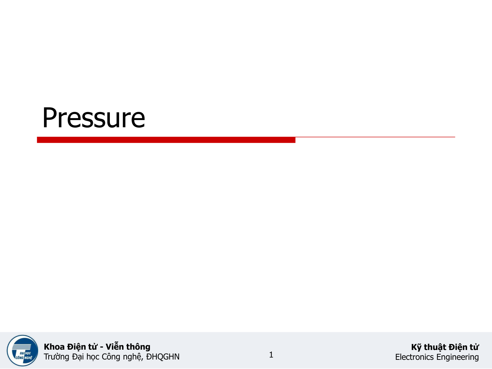
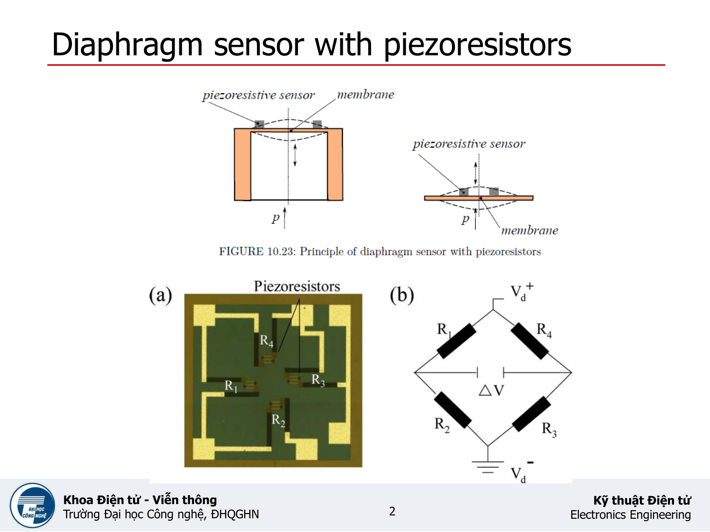
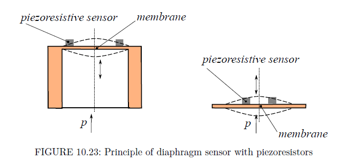
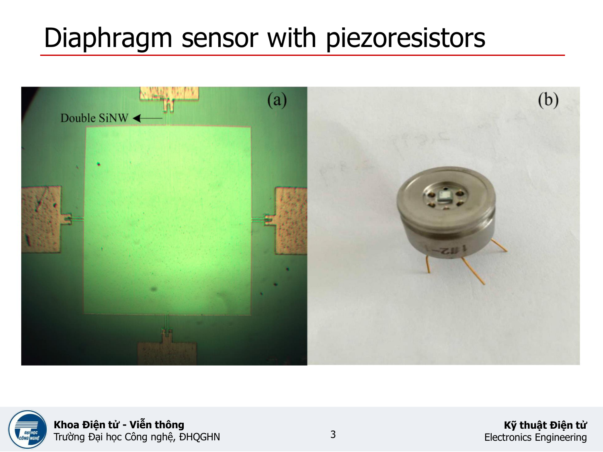
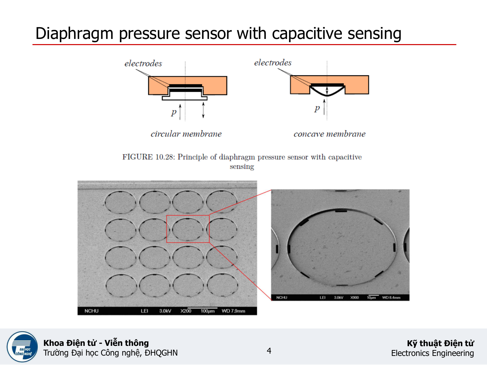
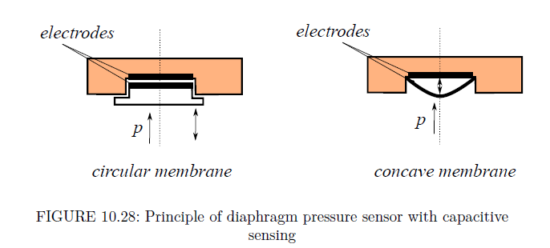
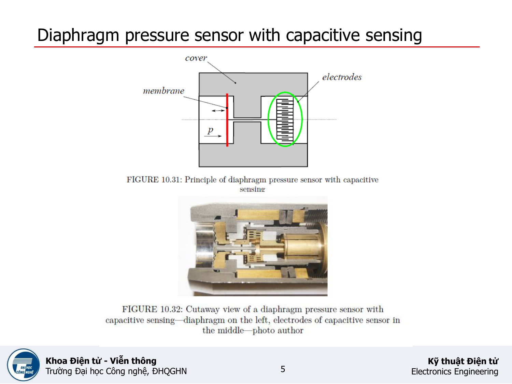
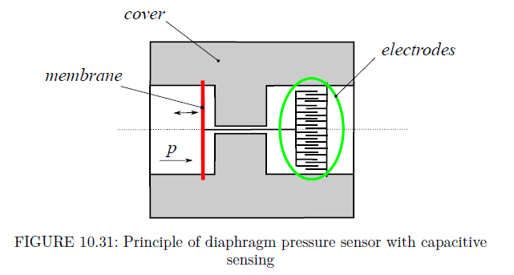
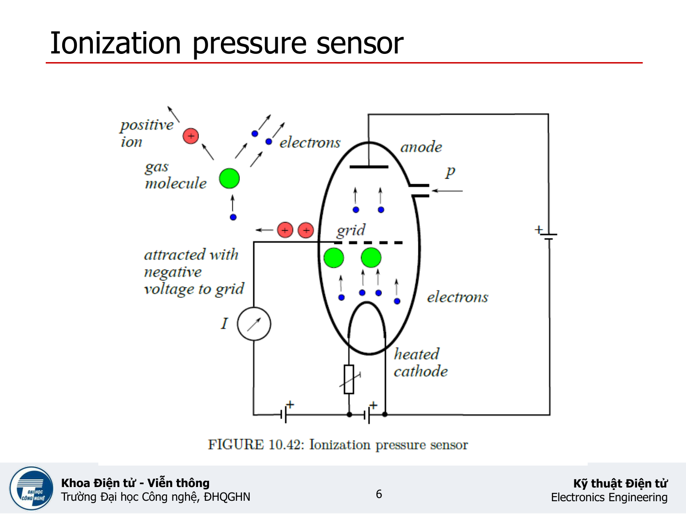
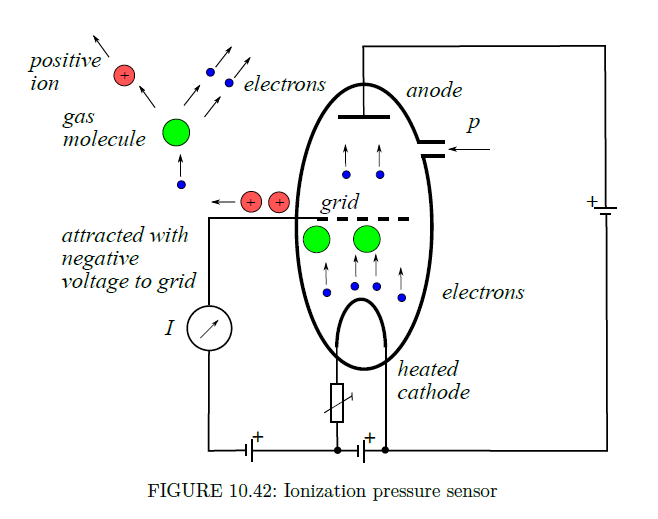

# EP10 Pressure

> Tài liệu chuyển đổi từ PDF: `EP10 Pressure.pdf`

---

## Trang 1

- Khoa Điện tử- Viễn thông
- Trường Đại học Công nghệ, ĐHQGHN
- Kỹthuật Điện tử
- Electronics Engineering
- Pressure
- 1

---

## Trang 2

- Khoa Điện tử- Viễn thông
- Trường Đại học Công nghệ, ĐHQGHN
- Kỹthuật Điện tử
- Electronics Engineering
- Diaphragm sensor with piezoresistors
- 2

---

## Trang 3

- Khoa Điện tử- Viễn thông
- Trường Đại học Công nghệ, ĐHQGHN
- Kỹthuật Điện tử
- Electronics Engineering
- Diaphragm sensor with piezoresistors
- 3

---

## Trang 4

- Khoa Điện tử- Viễn thông
- Trường Đại học Công nghệ, ĐHQGHN
- Kỹthuật Điện tử
- Electronics Engineering
- Diaphragm pressure sensor with capacitive sensing
- 4

---

## Trang 5

- Khoa Điện tử- Viễn thông
- Trường Đại học Công nghệ, ĐHQGHN
- Kỹthuật Điện tử
- Electronics Engineering
- Diaphragm pressure sensor with capacitive sensing
- 5

---

## Trang 6

- Khoa Điện tử- Viễn thông
- Trường Đại học Công nghệ, ĐHQGHN
- Kỹthuật Điện tử
- Electronics Engineering
- Ionization pressure sensor
- 6

---

