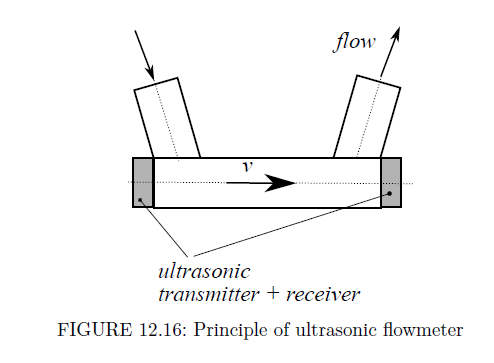
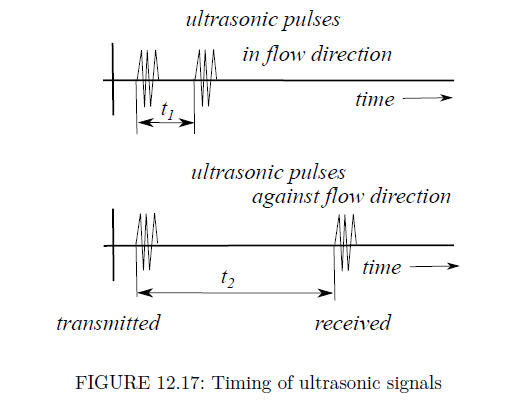
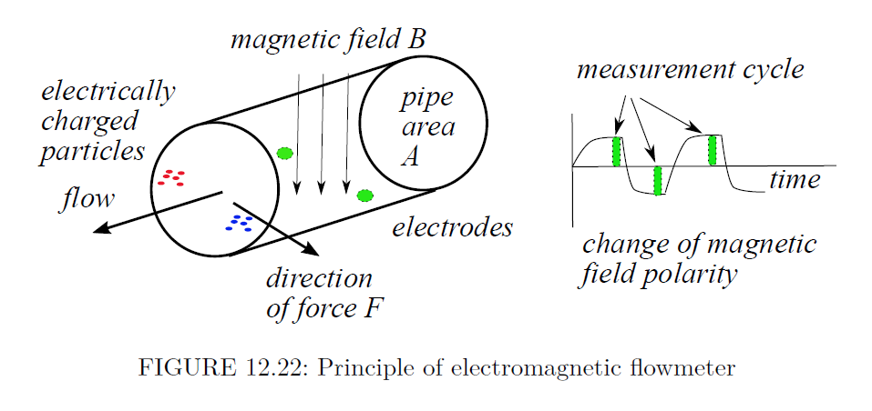
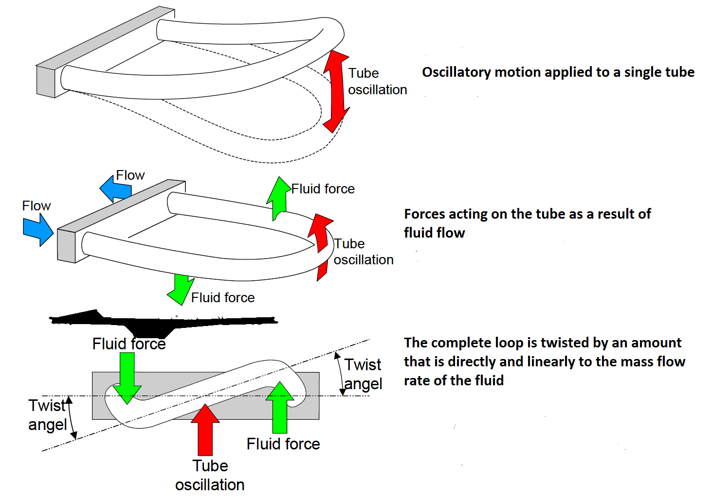
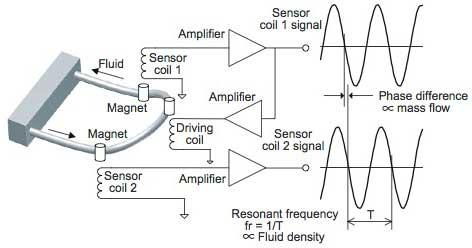
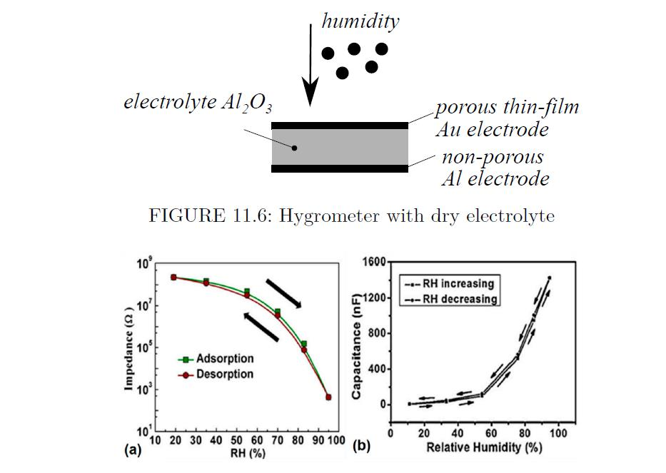
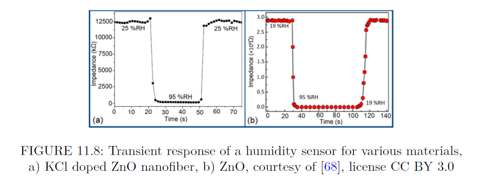
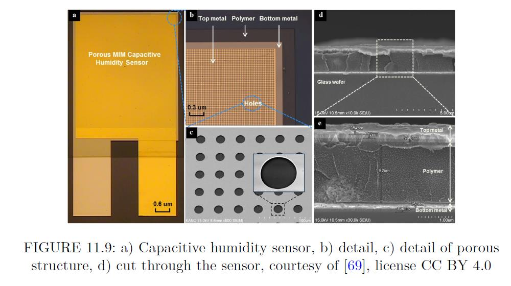
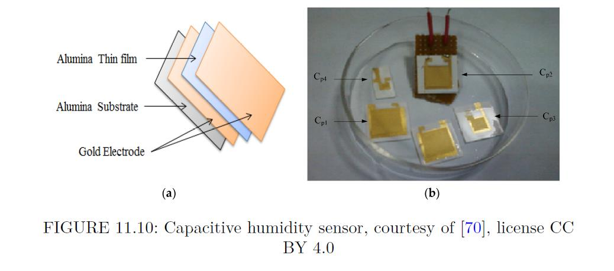
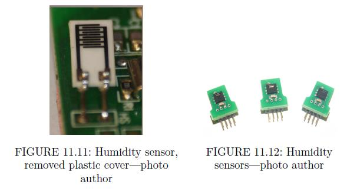

# EP11 Flowrate

> Tài liệu chuyển đổi từ PDF: `EP11 Flowrate.pdf`

---

## Trang 1

### Khoa Điện tử- Viễn thông

- Trường Đại học Công nghệ, ĐHQGHN
- Kỹthuật Điện tử
- Electronics Engineering
- Mass Flow & Humidity
- 1

---

## Trang 2

### Khoa Điện tử- Viễn thông

- Trường Đại học Công nghệ, ĐHQGHN
- Kỹthuật Điện tử
- Electronics Engineering
- Ultrasonic Flowmeters
- 2

---

## Trang 3

### Khoa Điện tử- Viễn thông

- Trường Đại học Công nghệ, ĐHQGHN
- Kỹthuật Điện tử
- Electronics Engineering
- Electromagnetic Flowmeters
- 3

---

## Trang 4

### Khoa Điện tử- Viễn thông

- Trường Đại học Công nghệ, ĐHQGHN
- Kỹthuật Điện tử
- Electronics Engineering
- Coriolis Flowmeters
- 4

---

## Trang 5

### Khoa Điện tử- Viễn thông

- Trường Đại học Công nghệ, ĐHQGHN
- Kỹthuật Điện tử
- Electronics Engineering
- Coriolis Flowmeters
- 5

---

## Trang 6

### Khoa Điện tử- Viễn thông

- Trường Đại học Công nghệ, ĐHQGHN
- Kỹthuật Điện tử
- Electronics Engineering
- Hygrometers with dry electrolytes
- 6

---

## Trang 7

### Khoa Điện tử- Viễn thông

- Trường Đại học Công nghệ, ĐHQGHN
- Kỹthuật Điện tử
- Electronics Engineering
- Hygrometers with dry electrolytes
- 7

---

## Trang 8

### Khoa Điện tử- Viễn thông

- Trường Đại học Công nghệ, ĐHQGHN
- Kỹthuật Điện tử
- Electronics Engineering
- Hygrometers with dry electrolytes
- 8

---

## Trang 9

### Khoa Điện tử- Viễn thông

- Trường Đại học Công nghệ, ĐHQGHN
- Kỹthuật Điện tử
- Electronics Engineering
- Hygrometers with dry electrolytes
- 9

---
