# EP2 Measurement Systems

> Tài liệu chuyển đổi từ PDF: `EP2 Measurement Systems.pdf`

---

## Trang 1

### Khoa Điện tử- Viễn thông

- Trường Đại học Công nghệ, ĐHQGHN
- Cảm biến và đo lường cho robot
- Introduction to Measurements
- 1

---

## Trang 2

### Khoa Điện tử- Viễn thông

- Trường Đại học Công nghệ, ĐHQGHN
- Cảm biến và đo lường cho robot
- Introduction to Measurement
- A sensor is a device that transfers the measured
- physical property into some output signal that can be
- processed or displayed.
- Sensors use mostly electrical output signals.
- 2

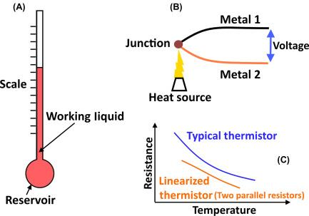

---

## Trang 3

### Khoa Điện tử- Viễn thông

- Trường Đại học Công nghệ, ĐHQGHN
- Cảm biến và đo lường cho robot
- Elements of a measurement system
- In simple cases, the system can consist of only a
- single unit that gives an output reading or signal.
- However, the sensor is usually placed in a measuring
- chain:
- 3

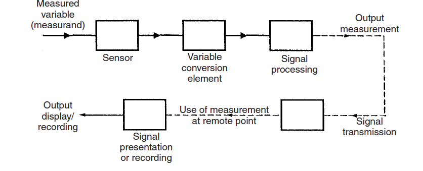

---

## Trang 4

### Khoa Điện tử- Viễn thông

- Trường Đại học Công nghệ, ĐHQGHN
- Cảm biến và đo lường cho robot
- Elements of a measurement system
- 
- Sensors gives an output that is a
- function of the measurand (the
- input applied to it).
- 4

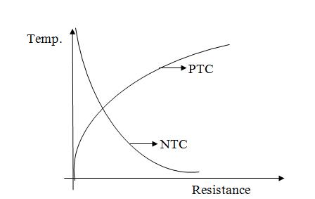

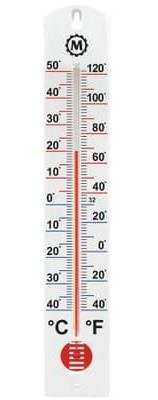

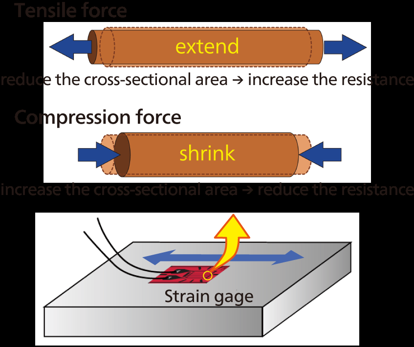

---

## Trang 5

### Khoa Điện tử- Viễn thông

- Trường Đại học Công nghệ, ĐHQGHN
- Cảm biến và đo lường cho robot
- Elements of a measurement system
- 
- Variable conversion elements
- convert the output variable into a
- more convenient form.
- 
- In some cases, the primary
- sensor and variable conversion
- element are combined, and
- known as a transducer.
- 5

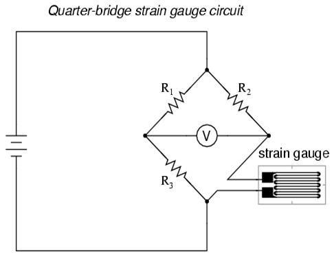

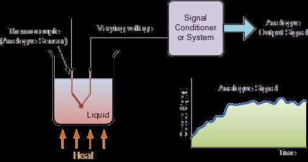

---

## Trang 6

### Khoa Điện tử- Viễn thông

- Trường Đại học Công nghệ, ĐHQGHN
- Cảm biến và đo lường cho robot
- Elements of a measurement system
- 
- Signal processing elements
- improve the quality of the output
- of a measurement system.
- 
- Electronic amplifier
- 
- Filter
- 
- In some devices, signal
- processing is incorporated into a
- transducer, which is then known
- as a transmitter.
- 6
- In some cases, the word ‘sensor’ is used generically
- to refer to both transducers and transmitters

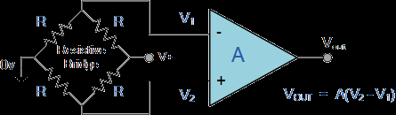

---

## Trang 7

### Khoa Điện tử- Viễn thông

- Trường Đại học Công nghệ, ĐHQGHN
- Cảm biến và đo lường cho robot
- Elements of a measurement system
- 
- Signal presentation or
- recording
- 7
- 
- The signal transmission
- element

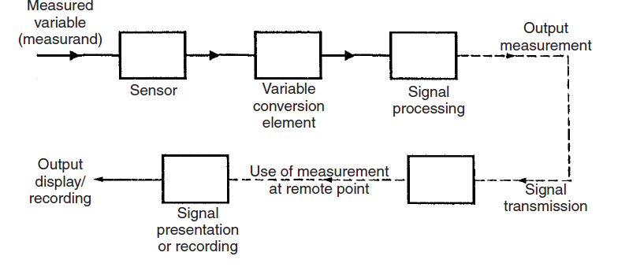

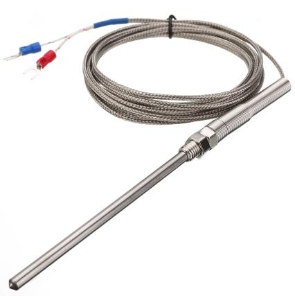

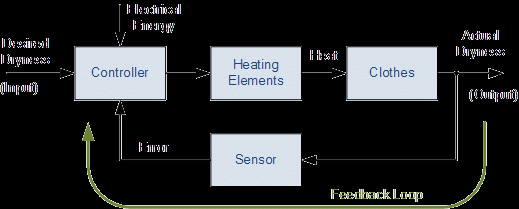

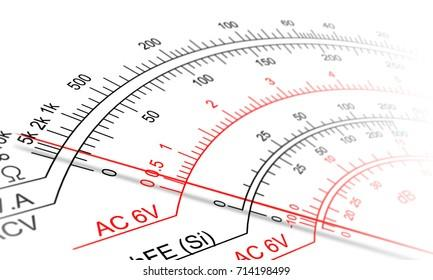

---

## Trang 8

### Khoa Điện tử- Viễn thông

- Trường Đại học Công nghệ, ĐHQGHN
- Cảm biến và đo lường cho robot
- Elements of a measurement system
- 
- In smart sensors, all or some parts of the measuring chain are
- integrated in an independent block (can be integrated circuit,
- circuit board).
- 
- Smart sensors are most commonly composed of the main sensor
- (or sensors), amplifiers, analog/digital converters,
- microprocessor and some communication interface.
- 8

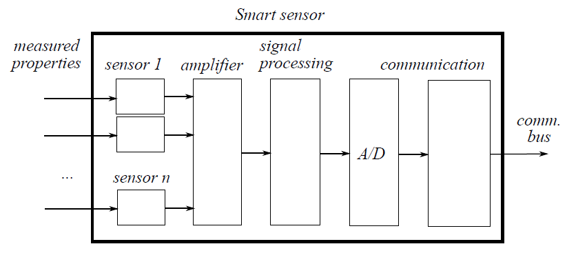

---

## Trang 9

### Khoa Điện tử- Viễn thông

- Trường Đại học Công nghệ, ĐHQGHN
- Cảm biến và đo lường cho robot
- Static Properties
- Experiment: The water temperature in a tank is
- measured with a temperature sensor.
- 9
- Sensor properties can be described in
- transients (functions of time) or in
- steady state (not functions of time).
- Steady state is the state in which
- BOTH input signal AND output
- signal are constant.

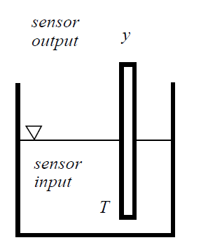

---

## Trang 10

### Khoa Điện tử- Viễn thông

- Trường Đại học Công nghệ, ĐHQGHN
- Cảm biến và đo lường cho robot
- Accuracy and inaccuracy
- The accuracy of an instrument is a measure of how
- close the output reading of the instrument is to the
- correct value.
- Absolute error Δy is the difference between the
- measured value ym and correct value yc of the
- measured property.
- Δ𝑦= 𝑦𝑚−𝑦𝑐
- Relative error δ(y) is the ratio between absolute
- error Δy to the instantaneously measured value ym.
- 𝛿𝑦= Δ𝑦
- 𝑦𝑚
- × 100%
- 10

---

## Trang 11

### Khoa Điện tử- Viễn thông

- Trường Đại học Công nghệ, ĐHQGHN
- Cảm biến và đo lường cho robot
- Precision/repeatability/reproducibility
- Precision is a term that describes an
- instrument’s degree of freedom from
- random errors.
- Precision ≠ Accuracy
- Low accuracy measurements from a
- high precision instrument are normally
- caused by a bias in the measurements.
- 11

---

## Trang 12

### Khoa Điện tử- Viễn thông

- Trường Đại học Công nghệ, ĐHQGHN
- Cảm biến và đo lường cho robot
- Precision/repeatability/reproducibility
- 12

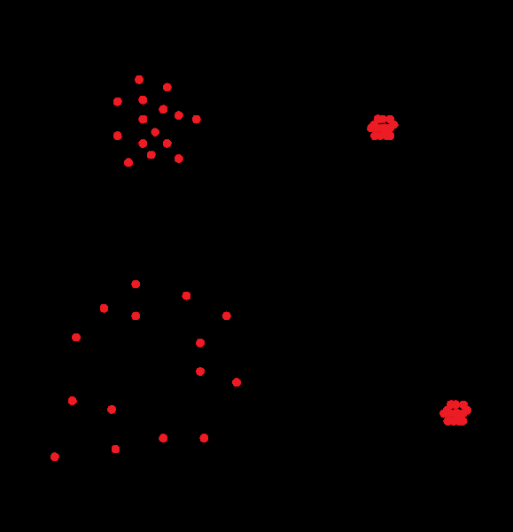

---

## Trang 13

### Khoa Điện tử- Viễn thông

- Trường Đại học Công nghệ, ĐHQGHN
- Cảm biến và đo lường cho robot
- Precision/repeatability/reproducibility
- 13

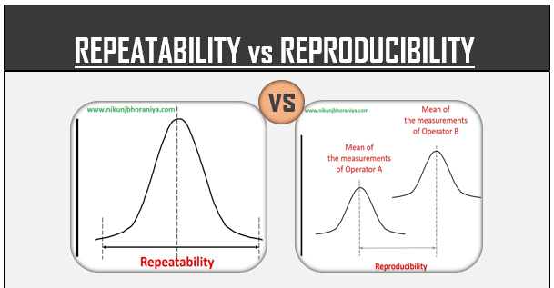

---

## Trang 14

### Khoa Điện tử- Viễn thông

- Trường Đại học Công nghệ, ĐHQGHN
- Cảm biến và đo lường cho robot
- Precision/repeatability/reproducibility
- 
- Repeatability: the closeness of output readings when
- the same input is applied repetitively over a short
- period of time, with the same measurement
- conditions, same instrument and observer, same
- location and same conditions of use maintained
- throughout.
- 
- Reproducibility: the closeness of output readings for
- the same input when there are changes in the
- method of measurement, observer, measuring
- instrument, location, conditions of use and time of
- measurement.
- 14

---

## Trang 15

### Khoa Điện tử- Viễn thông

- Trường Đại học Công nghệ, ĐHQGHN
- Cảm biến và đo lường cho robot
- Precision/repeatability/reproducibility
- Tolerance describes the maximum deviation of a
- manufactured component from some specified value.
- One resistor have a nominal value 1000Ω and
- tolerance 5% might have an actual value
- anywhere between 950 Ω and 1050 Ω.
- 15

---

## Trang 16

### Khoa Điện tử- Viễn thông

- Trường Đại học Công nghệ, ĐHQGHN
- Cảm biến và đo lường cho robot
- Linearlity
- 16

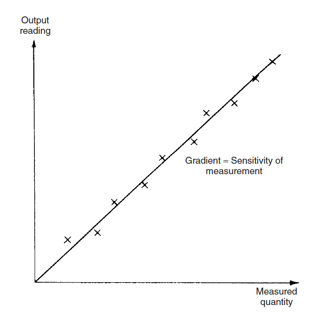

---

## Trang 17

### Khoa Điện tử- Viễn thông

- Trường Đại học Công nghệ, ĐHQGHN
- Cảm biến và đo lường cho robot
- Sensitivity of measurement
- The sensitivity of measurement is a measure of the
- change in instrument output that occurs when the
- quantity being measured changes by a given amount.
- 𝑠= lim
- Δ𝑥→0
- Δ𝑦
- Δ𝑥
- 17
- Example: a pressure of 2 bar
- produces a deflection of 10
- degrees in a pressure
- transducer, the sensitivity of
- the instrument is 5
- degrees/bar

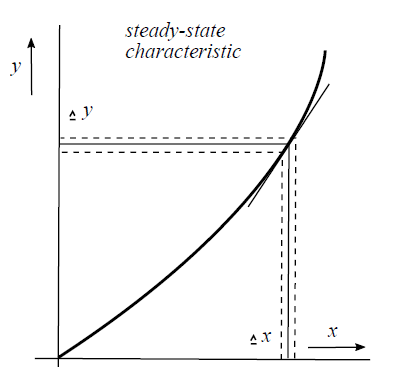

---

## Trang 18

### Khoa Điện tử- Viễn thông

- Trường Đại học Công nghệ, ĐHQGHN
- Cảm biến và đo lường cho robot
- Sensitivity of measurement
- Example: The following resistance values of a
- platinum resistance thermometer were measured at a
- range of temperatures. Determine the measurement
- sensitivity of the instrument in ohms/℃.
- 18
- Resistance (Ω)
- Temperature (℃)
- 307
- 200
- 314
- 230
- 321
- 260
- 328
- 290

---

## Trang 19

### Khoa Điện tử- Viễn thông

- Trường Đại học Công nghệ, ĐHQGHN
- Cảm biến và đo lường cho robot
- Threshold and Resolution
- Threshold: the minimum level of input that causes
- the change in the instrument output reading to be of
- a large enough magnitude to detectable.
- Resolution: the lower limit on the magnitude of the
- change in the input measured quantity that produces
- an observable change in the instrument output.
- 19

---

## Trang 20

### Khoa Điện tử- Viễn thông

- Trường Đại học Công nghệ, ĐHQGHN
- Cảm biến và đo lường cho robot
- Dynamic Properties
- Transient responses: the transient response is the
- response of a system to a step change on its input.
- 20
- The sensor input signal change
- with a step. The output signal,
- however, will not be a step but
- a transient function.

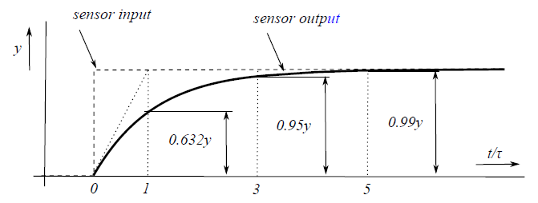

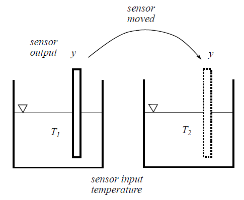

---

## Trang 21

### Khoa Điện tử- Viễn thông

- Trường Đại học Công nghệ, ĐHQGHN
- Cảm biến và đo lường cho robot
- Dynamic Properties
- Based on the system properties it will take a shorter
- or longer time before a new steady state is reached.
- In any linear, time-invariant measuring system, the
- following general relation can be written between
- input and output for time (t)>0:
- 𝑎𝑛𝑑𝑛𝑞0
- 𝑑𝑡𝑛
- + 𝑎𝑛−1
- 𝑑𝑛−1𝑞0
- 𝑑𝑡𝑛−1 + ⋯+ 𝑎1
- 𝑑𝑞0
- 𝑑𝑡+ 𝑎0𝑞0 = 𝑏0𝑞𝑖
- Where 𝑞𝑖is the measured quantity, 𝑞0 is the output
- reading and 𝑎0 … 𝑎𝑛, 𝑏0 are constants.
- 21

---

## Trang 22

### Khoa Điện tử- Viễn thông

- Trường Đại học Công nghệ, ĐHQGHN
- Cảm biến và đo lường cho robot
- Dynamic Properties
- Zero order instrument
- If all the coefficients 𝑎1… 𝑎𝑛except for 𝑎0 are assumed
- zero, then:
- 𝑎0𝑞0 = 𝑏0𝑞𝑖or 𝑞0 =
- 𝑏0𝑞𝑖
- 𝑎0 = 𝐾𝑞𝑖
- Where K is the instrument sensitivity.
- 22

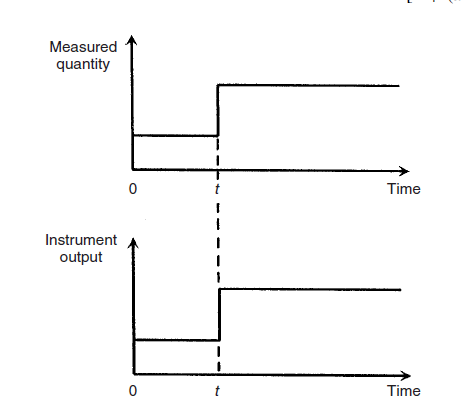

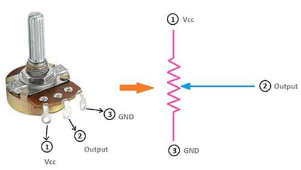

---

## Trang 23

### Khoa Điện tử- Viễn thông

- Trường Đại học Công nghệ, ĐHQGHN
- Cảm biến và đo lường cho robot
- Dynamic Properties
- First order instrument
- If all the coefficients 𝑎2 … 𝑎𝑛except 𝑎0, 𝑎1 for are
- assumed zero, then:
- 𝑎1𝑑𝑞0
- 𝑑𝑡
- + 𝑎0𝑞0 = 𝑏0𝑞𝑖
- 𝑎1
- 𝑎0
- × 𝑑𝑞0
- 𝑑𝑡+ 𝑞0 = 𝑏0
- 𝑎0
- × 𝑞𝑖
- Defining:
- 𝐾=
- 𝑏0
- 𝑎0 as the static sensitivity/gain – system behavior
- in steady state
- 𝜏= 𝑎1/𝑎0 as the time constant of the system – how
- fast the system can respond to changes
- 23

---

## Trang 24

### Khoa Điện tử- Viễn thông

- Trường Đại học Công nghệ, ĐHQGHN
- Cảm biến và đo lường cho robot
- Dynamic Properties
- First order instrument
- 
- The time constant 𝜏of the step response is the time
- taken for the output quantity 𝑞0 to reach 63% of its
- final value.
- 
- 5𝜏is considered the steady state with sufficient
- accuracy.
- 24

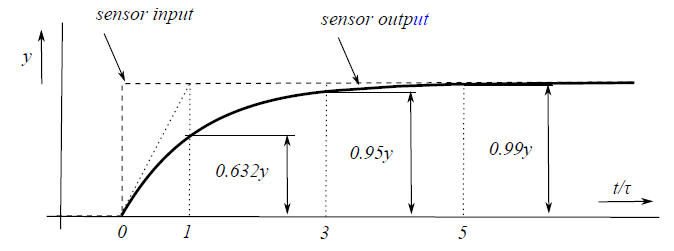

---

## Trang 25

### Khoa Điện tử- Viễn thông

- Trường Đại học Công nghệ, ĐHQGHN
- Cảm biến và đo lường cho robot
- Dynamic Properties
- Ví dụ:
- Khí cầu được trang bị các dụng cụ đo nhiệt độ và độ cao và có
- thiết bị vô tuyến có thể truyền các kết quả đầu ra của các thiết
- bị này trở lại mặt đất. Khí cầu ban đầu được neo vào mặt đất
- với các số đọc đầu ra của thiết bị ở trạng thái ổn định. Dụng
- cụ đo độ cao là thiết bị bậc 0 và bộ chuyển đổi nhiệt độ bậc
- nhất với hằng số thời gian là 15 giây. Nhiêt độ mặt đất là 𝑇0 =
- 10℃, nhiệt độ tại độ cao x là: 𝑇𝑥= 𝑇0 −0.01𝑥
- 
- Nếu khinh khí cầu được thả ở thời điểm 0, và sau đó bay lên
- trên với vận tốc 5 mét / giây, hãy vẽ bảng hiển thị các phép
- đo nhiệt độ và độ cao được báo cáo trong khoảng thời gian
- 10 giây trong 50 giây đầu tiên. Xác định sai số đo.
- 
- Ở 5000m, nhiệt độ khí cầu gửi về là bao nhiêu?
- 25

---

## Trang 26

### Khoa Điện tử- Viễn thông

- Trường Đại học Công nghệ, ĐHQGHN
- Cảm biến và đo lường cho robot
- Dynamic Properties
- 𝑇𝑟= −0.75𝑒−
- 𝑡
- 15 −0.05𝑡+ 10.75
- Time
- Altitude
- Temperature
- reading
- Temperature
- error
- 0
- 0
- 10
- 0
- 10
- 50
- 9.86
- 0.36
- 20
- 100
- 9.55
- 0.55
- 30
- 150
- 9.15
- 0.65
- 40
- 200
- 8.70
- 0.70
- 50
- 250
- 8.22
- 0.72
- 26

---

## Trang 27

### Khoa Điện tử- Viễn thông

- Trường Đại học Công nghệ, ĐHQGHN
- Cảm biến và đo lường cho robot
- Dynamic Properties
- Second order instrument
- If all the coefficients 𝑎3 … 𝑎𝑛except for 𝑎0, 𝑎1, 𝑎2 are
- assumed zero, then:
- 𝑎2
- 𝑑2𝑞0
- 𝑑𝑡2 + 𝑎1𝑑𝑞0
- 𝑑𝑡
- + 𝑎0𝑞0 = 𝑏0𝑞𝑖
- Based on the equation roots, different solutions are
- obtained:
- 
- Real different roots – over-damped system
- 𝜆1 ≠𝜆2
- 𝑞𝑜𝑡= 𝐶1𝑒𝜆1𝑡+ 𝐶2𝑒𝜆2𝑡+ 𝑞𝑜∞
- 
- Real equal roots – critically damped system
- 𝜆1 = 𝜆2
- 𝑞𝑜𝑡= 𝐶1 + 𝐶2𝑡𝑒𝜆1𝑡+ 𝑞𝑜∞
- 27

---

## Trang 28

### Khoa Điện tử- Viễn thông

- Trường Đại học Công nghệ, ĐHQGHN
- Cảm biến và đo lường cho robot
- Dynamic Properties
- Second order instrument
- 
- Complex conjugate pole pair – under-damp
- system
- 𝜆1,2 = 𝛼± 𝑗𝜔
- 𝑞𝑜𝑡= 𝐴𝑐𝑜𝑠𝜔𝑡+ 𝐵𝑠𝑖𝑛𝜔𝑡𝑒𝛼𝑡+ 𝑞𝑜∞
- 28

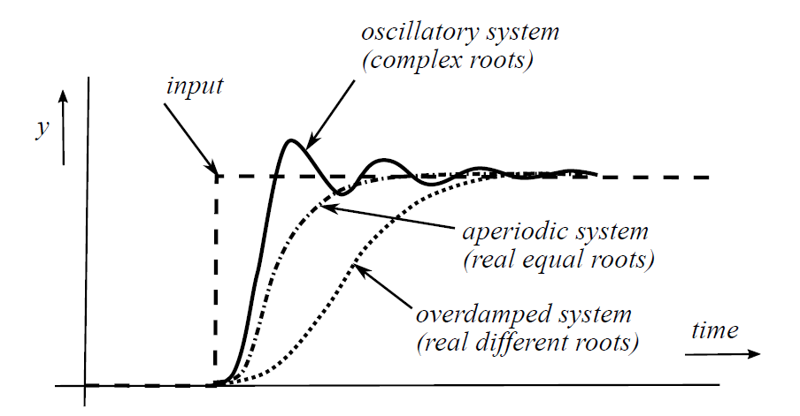

---
