# EP3 Errors during the measurement process

> Tài liệu chuyển đổi từ PDF: `EP3 Errors during the measurement process.pdf`

---

## Trang 1

### Khoa Điện tử- Viễn thông

- Trường Đại học Công nghệ, ĐHQGHN
- Cảm biến và đo lường cho robot
- Errors during the measurement
- process
- 1

---

## Trang 2

### Khoa Điện tử- Viễn thông

- Trường Đại học Công nghệ, ĐHQGHN
- Cảm biến và đo lường cho robot
- Sources of systematic error
- System disturbance due to measurement
- 2
- Heat transfer lowers the
- temperature of the water
- Permanent pressure loss in
- the flowing fluid
- The process of measurement always disturbs the system
- being measured.

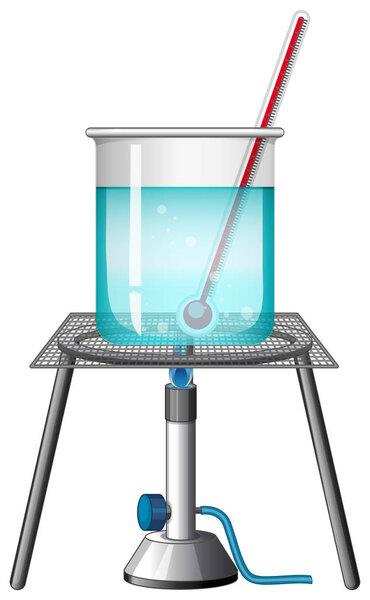

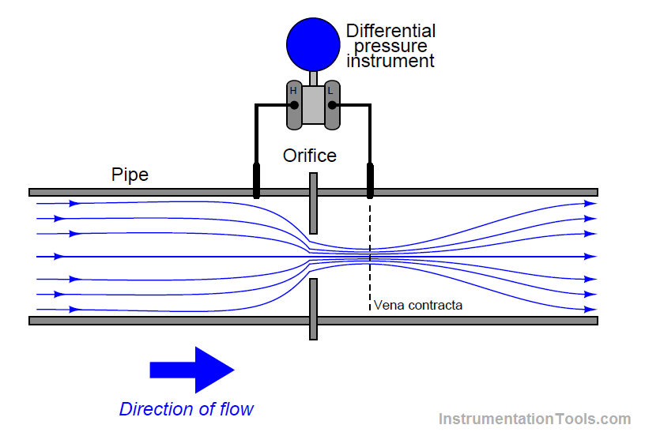

---

## Trang 3

### Khoa Điện tử- Viễn thông

- Trường Đại học Công nghệ, ĐHQGHN
- Cảm biến và đo lường cho robot
- Sources of systematic error
- Measurements in electric circuits
- 3
- 1
- 𝑅𝐶𝐷
- =
- 1
- 𝑅1 + 𝑅2
- + 1
- 𝑅3
- ⇔𝑅𝐶𝐷=
- 𝑅1 + 𝑅2 𝑅3
- 𝑅1 + 𝑅2 + 𝑅3
- 1
- 𝑅𝐴𝐵
- =
- 1
- 𝑅𝐶𝐷+ 𝑅4
- + 1
- 𝑅5
- ⇔𝑅𝐴𝐵=
- 𝑅4 + 𝑅𝐶𝐷𝑅5
- 𝑅4 + 𝑅𝐶𝐷+ 𝑅5

---

## Trang 4

### Khoa Điện tử- Viễn thông

- Trường Đại học Công nghệ, ĐHQGHN
- Cảm biến và đo lường cho robot
- Sources of systematic error
- Measurements in electric circuits
- 4
- 𝐼=
- 𝐸0
- 𝑅𝐴𝐵+ 𝑅𝑚
- 𝐸𝑚=
- 𝑅𝑚𝐸0
- 𝑅𝐴𝐵+ 𝑅𝑚
- ⟺𝐸𝑚
- 𝐸0
- =
- 𝑅𝑚
- 𝑅𝐴𝐵+ 𝑅𝑚
- As 𝑅𝑚gets larger, the ratio 𝐸𝑚/𝐸0 gets closer to unity ⟹𝑅𝑚should
- be as high as possible to minimize disturbance of the measured
- system.

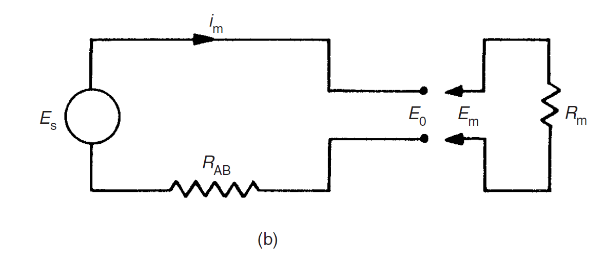

---

## Trang 5

### Khoa Điện tử- Viễn thông

- Trường Đại học Công nghệ, ĐHQGHN
- Cảm biến và đo lường cho robot
- Sources of systematic error
- Measurements in electric circuits
- 5
- Suppose that the components of the circuit the above figures have
- the following values:
- 𝑅1 = 400Ω; 𝑅2 = 600Ω; 𝑅3 = 1000Ω; 𝑅4 = 500Ω; 𝑅5 = 1000Ω
- The voltage across AB is measured by a voltmeter whose internal
- resistance is 9500Ω.
- What is the measurement error caused by the resistance of the
- measuring instrument?

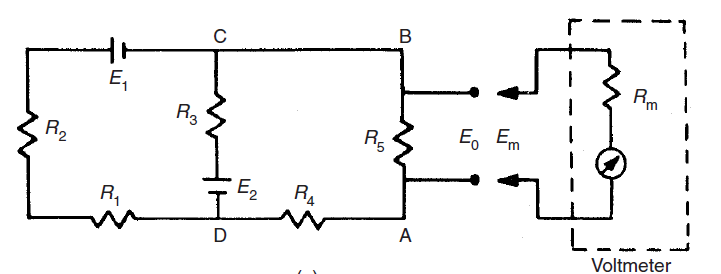

---

## Trang 6

### Khoa Điện tử- Viễn thông

- Trường Đại học Công nghệ, ĐHQGHN
- Cảm biến và đo lường cho robot
- Sources of systematic error
- 
- Errors due to environmental inputs.
- 
- Wear in instrument components
- 
- Connecting leads: the resistance of connecting leads (or pipes in the
- case of pneumatically or hydraulically actuated measurement
- systems).
- 6

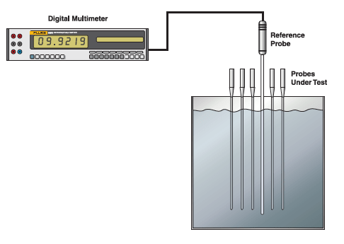

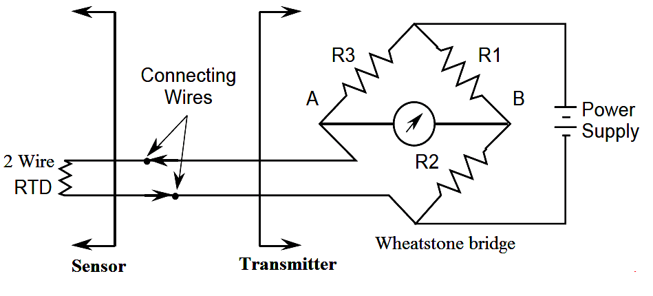

---

## Trang 7

### Khoa Điện tử- Viễn thông

- Trường Đại học Công nghệ, ĐHQGHN
- Cảm biến và đo lường cho robot
- Reduction of systematic errors
- Careful instrument design
- 
- Reducing the sensitivity of an instrument to environmental
- inputs to as low a level as possible.
- 7
- 
- In the design of strain
- gauges, the element should
- be constructed from a
- material whose resistance has
- a very low temperature
- coefficient (i.e. the variation
- of the resistance with
- temperature is very small).

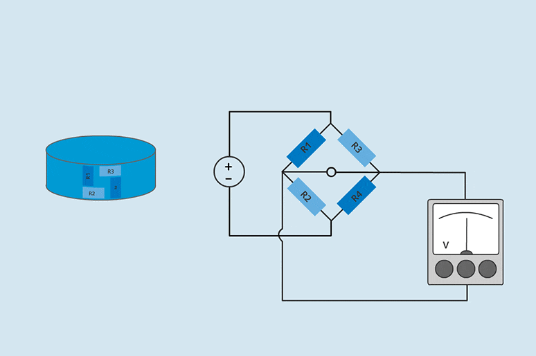

---

## Trang 8

### Khoa Điện tử- Viễn thông

- Trường Đại học Công nghệ, ĐHQGHN
- Cảm biến và đo lường cho robot
- Reduction of systematic errors
- Method of opposing inputs
- 
- The method of opposing inputs compensates for the effect of an
- environmental input in a measurement system by introducing an
- equal and opposite environmental input that cancels it out.
- 8
- 
- In response to an increase in
- temperature,
- Rcoil ↑
- 𝑅𝑐𝑜𝑚𝑝↓
- 
- The total resistance remains
- approximately the same

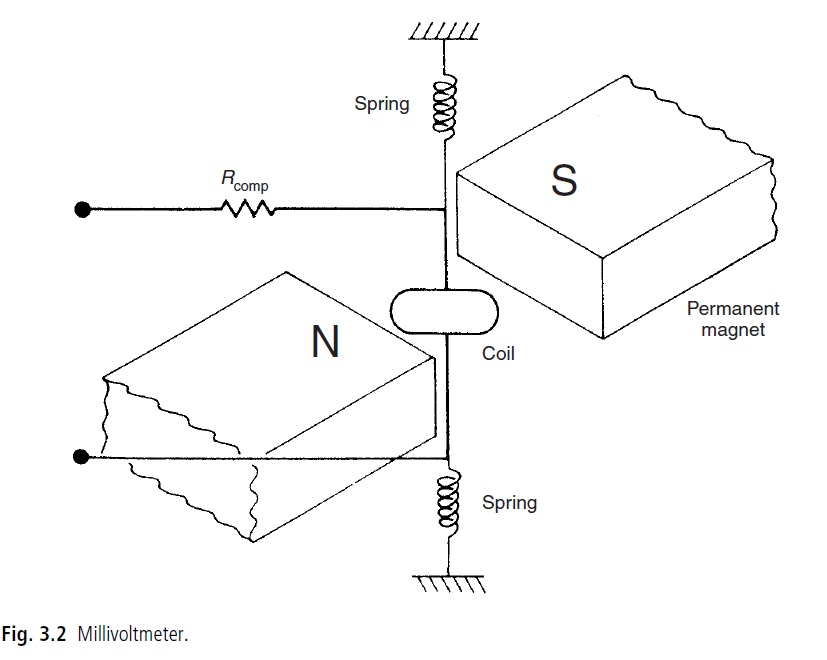

---

## Trang 9

### Khoa Điện tử- Viễn thông

- Trường Đại học Công nghệ, ĐHQGHN
- Cảm biến và đo lường cho robot
- Reduction of systematic errors
- 9
- Example of 3-wire bridge circuit

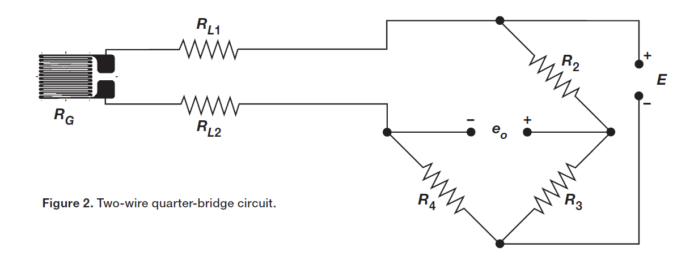

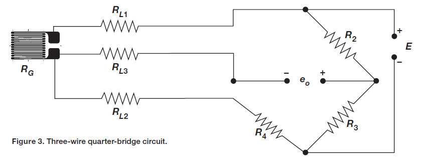

---

## Trang 10

### Khoa Điện tử- Viễn thông

- Trường Đại học Công nghệ, ĐHQGHN
- Cảm biến và đo lường cho robot
- Reduction of systematic errors
- High-gain feedback
- 10

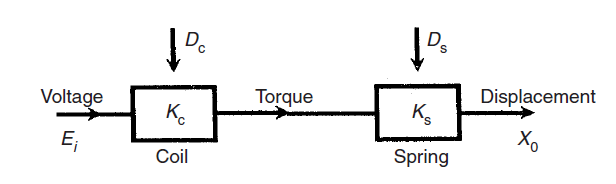

---

## Trang 11

### Khoa Điện tử- Viễn thông

- Trường Đại học Công nghệ, ĐHQGHN
- Cảm biến và đo lường cho robot
- Reduction of systematic errors
- High-gain feedback
- 11
- 𝐸0 = 𝐾𝑓𝑋0; 𝑋0 = 𝐸𝑖−𝐸0 𝐾𝑎𝐾𝑚𝐾𝑠= 𝐸𝑖−𝐾𝑓𝑋0 𝐾𝑎𝐾𝑚𝐾𝑠
- Thus:
- 𝐸𝑖𝐾𝑎𝐾𝑚𝐾𝑠= 1 + 𝐾𝑓𝐾𝑎𝐾𝑚𝐾𝑠𝑋0
- 𝑋0 =
- 𝐾𝑎𝐾𝑚𝐾𝑠
- 1 + 𝐾𝑓𝐾𝑎𝐾𝑚𝐾𝑠
- 𝐸𝑖
- Because 𝐾𝑎is very large, 𝐾𝑓𝐾𝑎𝐾𝑚𝐾𝑠≫1
- 𝑋0 = 𝐸𝑖/𝐾𝑓

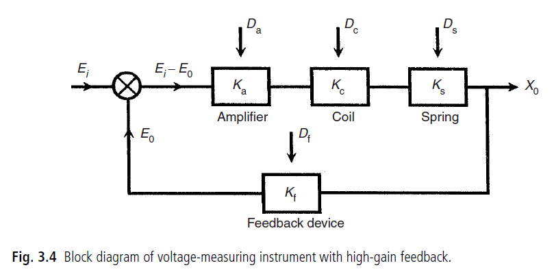

---

## Trang 12

### Khoa Điện tử- Viễn thông

- Trường Đại học Công nghệ, ĐHQGHN
- Cảm biến và đo lường cho robot
- Random Error
- Mean
- 𝑥𝑚𝑒𝑎𝑛= 𝑥1 + 𝑥2 + ⋯𝑥𝑛
- 𝑛
- Standard deviation and variance
- 𝑑𝑖= 𝑥𝑖−𝑥𝑚𝑒𝑎𝑛
- Variance
- 𝑉= 𝑑1
- 2 + 𝑑2
- 2 … 𝑑𝑛2
- 𝑛−1
- Standard deviation:
- 𝜎=
- 𝑉=
- 𝑑1
- 2 + 𝑑2
- 2 … 𝑑𝑛2
- 𝑛−1
- 12

---

## Trang 13

### Khoa Điện tử- Viễn thông

- Trường Đại học Công nghệ, ĐHQGHN
- Cảm biến và đo lường cho robot
- Aggregation of measurement system errors
- Combined effect of systematic and random errors
- 
- Systematic errors: ±x
- 
- Random errors: ±y
- Likely maximum error:
- 𝑒=
- 𝑥2 + 𝑦2
- 13

---

## Trang 14

### Khoa Điện tử- Viễn thông

- Trường Đại học Công nghệ, ĐHQGHN
- Cảm biến và đo lường cho robot
- Aggregation of measurement system errors
- 
- Error in a sum
- Two outputs y and z of separate measurement system components
- are to be added together S = y + z
- If the maximum errors in y and z are ±ay and ±bz:
- 𝑆𝑚𝑎𝑥= 𝑦+ 𝑎𝑦+ 𝑧+ 𝑏𝑧
- 𝑆𝑚𝑖𝑛= 𝑦−𝑎𝑦+ 𝑧−𝑏𝑧
- 𝑆= 𝑦+ 𝑧± 𝑎𝑦+ 𝑏𝑧
- Absolute errors
- 𝑒=
- 𝑎𝑦2 + 𝑏𝑧2
- Thus 𝑆= 𝑦+ 𝑧± 𝑒. This can be express in alternative form:
- 𝑆= 𝑦+ 𝑧
- 1 ± 𝑓where f = e/(y + z)
- 14

---

## Trang 15

### Khoa Điện tử- Viễn thông

- Trường Đại học Công nghệ, ĐHQGHN
- Cảm biến và đo lường cho robot
- Aggregation of measurement system errors
- 
- Error in a sum
- Example:
- A circuit requirement for a resistance of 550Ω is satisfied by
- connecting together two resistors of nominal values 220Ω and 330Ω
- in series If each resistor has a tolerance of ±2%, find the error in
- the sum and the total resistance.
- 15
- The error in the sum:
- 𝑒=
- 0.02 × 220 2 + 0.02 × 330 2 = 7.93; 𝑓= 7.93
- 550 = 0.0144
- The total resistance S can be expressed as
- 𝑆= 550Ω ± 7.93Ω or 𝑆= 550 1 ± 0.0144 Ω i.e. 𝑆= 550Ω ± 1.4%

---

## Trang 16

### Khoa Điện tử- Viễn thông

- Trường Đại học Công nghệ, ĐHQGHN
- Cảm biến và đo lường cho robot
- Aggregation of measurement system errors
- Error in a difference
- Two outputs y and z of separate measurement system
- components are to be subtracted, S = y - z
- If the maximum errors in y and z are ±ay and ±bz:
- S = y −z ± e or S = (y −z)(1 ± f)
- Where e is 𝑒=
- 𝑎𝑦2 + 𝑏𝑧2, and 𝑓= 𝑒/(𝑦−𝑧)
- 16

---

## Trang 17

### Khoa Điện tử- Viễn thông

- Trường Đại học Công nghệ, ĐHQGHN
- Cảm biến và đo lường cho robot
- Aggregation of measurement system errors
- Error in a difference
- Example
- A fluid flow rate is calculated from the difference in
- pressure measured on both sides of an orifice plate. If
- the pressure measurements are 10.0 bar and 9.5 bar and
- the error in the pressure measuring instruments is
- specified as ±0.1%, find e and f?
- 17
- 𝑒=
- 0.001 × 10 2 + 0.001 × 9.5 2 = 0.0138
- 𝑓= 0.0138/0.5

---

## Trang 18

### Khoa Điện tử- Viễn thông

- Trường Đại học Công nghệ, ĐHQGHN
- Cảm biến và đo lường cho robot
- Aggregation of measurement system errors
- Error in a product
- If the outputs y and z of two measurement system
- components are multiplied together, P=yz.
- If the possible error in y is ±ay and in z is ±bz
- 𝑃𝑚𝑎𝑥= 𝑦+ 𝑎𝑦
- 𝑧+ 𝑏𝑧= 𝑦𝑧+ 𝑎𝑦𝑧+ 𝑏𝑦𝑧+ 𝑎𝑦𝑏𝑧
- 𝑃𝑚𝑖𝑛= 𝑦−𝑎𝑦
- 𝑧−𝑏𝑧= 𝑦𝑧−𝑎𝑦𝑧−𝑏𝑦𝑧+ 𝑎𝑦𝑏𝑧
- For 𝑎≪1, 𝑏≪1
- 𝑃𝑚𝑎𝑥= 𝑦𝑧(1 + 𝑎+ 𝑏); 𝑃𝑚𝑖𝑛= 𝑦𝑧(1 −𝑎−𝑏)
- Likely maximum error in P:
- 𝑒=
- 𝑎2 + 𝑏2
- 18

---

## Trang 19

### Khoa Điện tử- Viễn thông

- Trường Đại học Công nghệ, ĐHQGHN
- Cảm biến và đo lường cho robot
- Aggregation of measurement system errors
- Error in a product
- Example
- If the power in a circuit is calculated from measurements
- of voltage and current in which the calculated maximum
- errors are respectively ±1% and ±2%, find the
- maximum likely error?
- 19
- 𝑒= ± 0.012 + 0.022 = ±0.022 𝑜𝑟± 2.2%

---

## Trang 20

### Khoa Điện tử- Viễn thông

- Trường Đại học Công nghệ, ĐHQGHN
- Cảm biến và đo lường cho robot
- Aggregation of measurement system errors
- 
- Error in a quotient
- If the output measurement y of one system component with possible
- error ±x is divided by the output measurement z of another system
- component with possible error ±bz.
- The maximum and minimum possible values for the quotient can:
- 𝑄𝑚𝑎𝑥= 𝑦+ 𝑎𝑦
- 𝑧−𝑏𝑧= (𝑦+ 𝑎𝑦)(𝑧+ 𝑏𝑧)
- (𝑧−𝑏𝑧)(𝑧+ 𝑏𝑧) = 𝑦𝑧+ 𝑎𝑦𝑧+ 𝑏𝑦𝑧+ 𝑎𝑦𝑏𝑧
- 𝑧2 −𝑏2𝑧2
- 𝑄𝑚𝑖𝑛= 𝑦−𝑎𝑦
- 𝑧+ 𝑏𝑧= (𝑦−𝑎𝑦)(𝑧−𝑏𝑧)
- (𝑧+ 𝑏𝑧)(𝑧−𝑏𝑧) = 𝑦𝑧−𝑎𝑦𝑧−𝑏𝑦𝑧+ 𝑎𝑦𝑏𝑧
- 𝑧2 −𝑏2𝑧2
- For 𝑎≪1 and 𝑏≪1
- 𝑄𝑚𝑎𝑥=
- 𝑦𝑧1+𝑎+𝑏
- 𝑧2
- ; 𝑄𝑚𝑖𝑛=
- 𝑦𝑧1−𝑎−𝑏
- 𝑧2
- ; 𝑄=
- 𝑦
- 𝑧±
- 𝑦
- 𝑧(𝑎+ 𝑏)
- 20

---

## Trang 21

### Khoa Điện tử- Viễn thông

- Trường Đại học Công nghệ, ĐHQGHN
- Cảm biến và đo lường cho robot
- Aggregation of measurement system errors
- 
- Error in a quotient
- Example
- If the density of a substance is calculated from measurements of its
- mass and volume where the respective errors are ±2% and ±3%.
- Find the maximum likely error in the density value?
- 21
- 𝑒= ± 0.022 + 0.0032 = ±0.036 𝑜𝑟± 3.6%

---

## Trang 22

### Khoa Điện tử- Viễn thông

- Trường Đại học Công nghệ, ĐHQGHN
- Cảm biến và đo lường cho robot
- Total error when combining multiple measurements
- Example
- A rectangular-sided block has edges of lengths a, b and c, and its
- mass is m. If the values and possible errors in quantities a, b, c and
- m are as shown below, calculate the value of density and the
- possible error in this value.
- 𝑎= 100𝑚𝑚± 1%; 𝑏= 200𝑚𝑚± 1%; 𝑐= 300𝑚𝑚± 1%; 𝑚= 20𝑘𝑔± 0.5%
- 22
- 
- 𝑎𝑏= 0.02 𝑚2 ± 2% (possible error = 1%+1%=2%)
- 
- 𝑎𝑏𝑐= 0.006 𝑚3 ± 3% (possible error = 2% + 1% = 3%)
- 
- 𝑚
- 𝑎𝑏𝑐=
- 20
- 0.006 =
- 3330𝑘𝑔
- 𝑚3
- ± 3.5% (possible error = 3% + 0.5%=3.5%)

---
