# EP5 Circuits for Sensors

> Tài liệu chuyển đổi từ PDF: `EP5 Circuits for Sensors.pdf`

---

## Trang 1

- Khoa Điện tử- Viễn thông
- Trường Đại học Công nghệ, ĐHQGHN
- Cảm biến và đo lường cho robot
- Circuits for Sensors
- 1

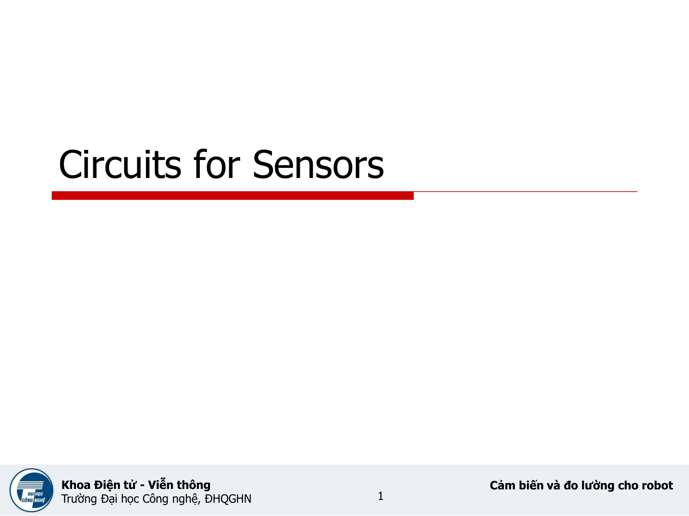

---

## Trang 2

- Khoa Điện tử- Viễn thông
- Trường Đại học Công nghệ, ĐHQGHN
- Cảm biến và đo lường cho robot
- Inverting Operational Amplifier
- 𝐴𝑣= 𝑉𝑜𝑢𝑡
- 𝑉𝑖𝑛
- = −
- 𝑅𝑓
- 𝑅𝑖𝑛
- 2

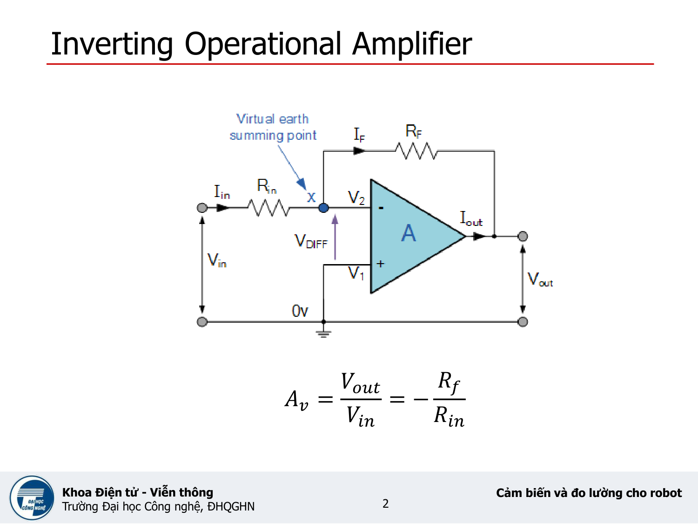

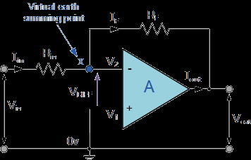

---

## Trang 3

- Khoa Điện tử- Viễn thông
- Trường Đại học Công nghệ, ĐHQGHN
- Cảm biến và đo lường cho robot
- Non-inverting Operational Amplifier
- 𝐴𝑣= 1 + 𝑅𝐹
- 𝑅2
- 3

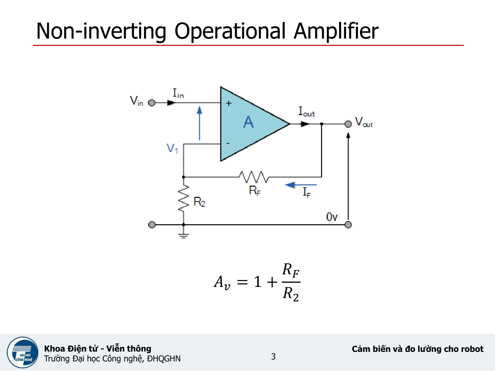

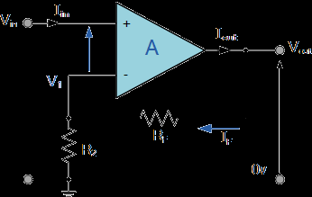

---

## Trang 4

- Khoa Điện tử- Viễn thông
- Trường Đại học Công nghệ, ĐHQGHN
- Cảm biến và đo lường cho robot
- Voltage follower (pre-amplifier)
- 𝐴𝑣= 1
- 4

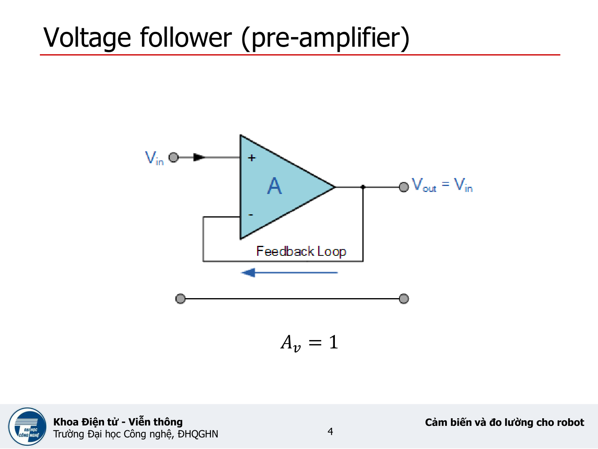

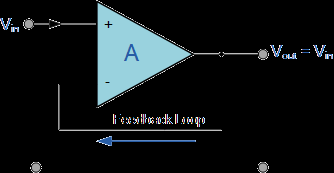

---

## Trang 5

- Khoa Điện tử- Viễn thông
- Trường Đại học Công nghệ, ĐHQGHN
- Cảm biến và đo lường cho robot
- Differential Amplifier
- 5

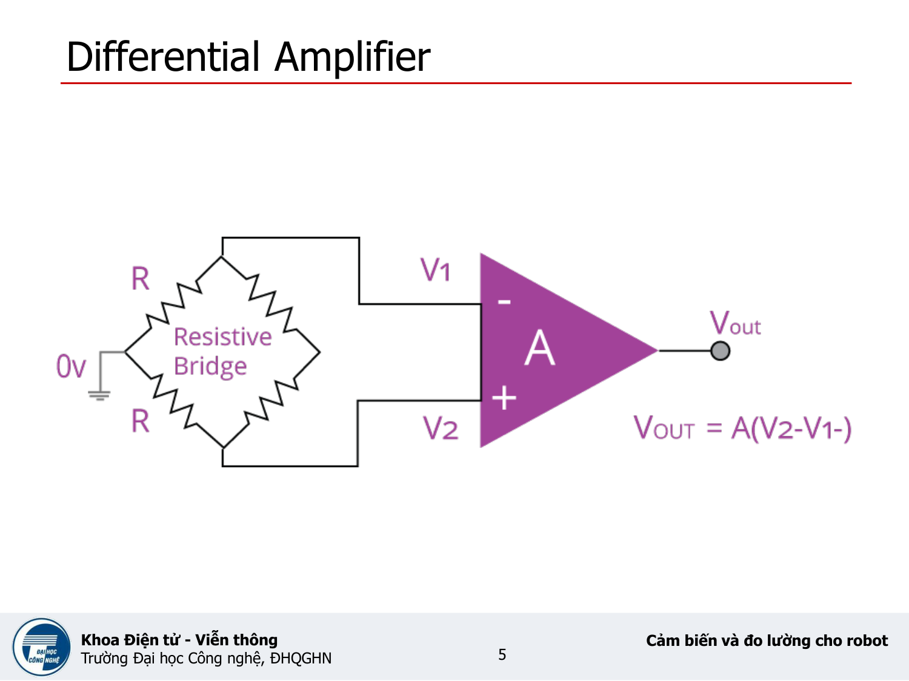

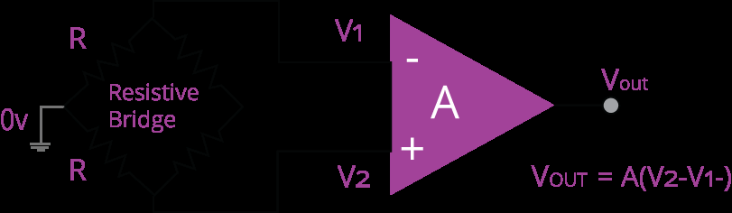

---

## Trang 6

- Khoa Điện tử- Viễn thông
- Trường Đại học Công nghệ, ĐHQGHN
- Cảm biến và đo lường cho robot
- Differential Amplifier
- Op-Amp as Differential Amplifier
- 𝑣0 =
- 𝑅4
- 𝑅3 + 𝑅4
- 𝑅1 + 𝑅2
- 𝑅1
- 𝑣𝑖2 −𝑅2
- 𝑅1
- 𝑣𝑖1
- If 𝑅1 = 𝑅3 and 𝑅2 = 𝑅4
- 𝑣0 = 𝑅2
- 𝑅1
- (𝑣𝑖2 −𝑣𝑖1)
- 6

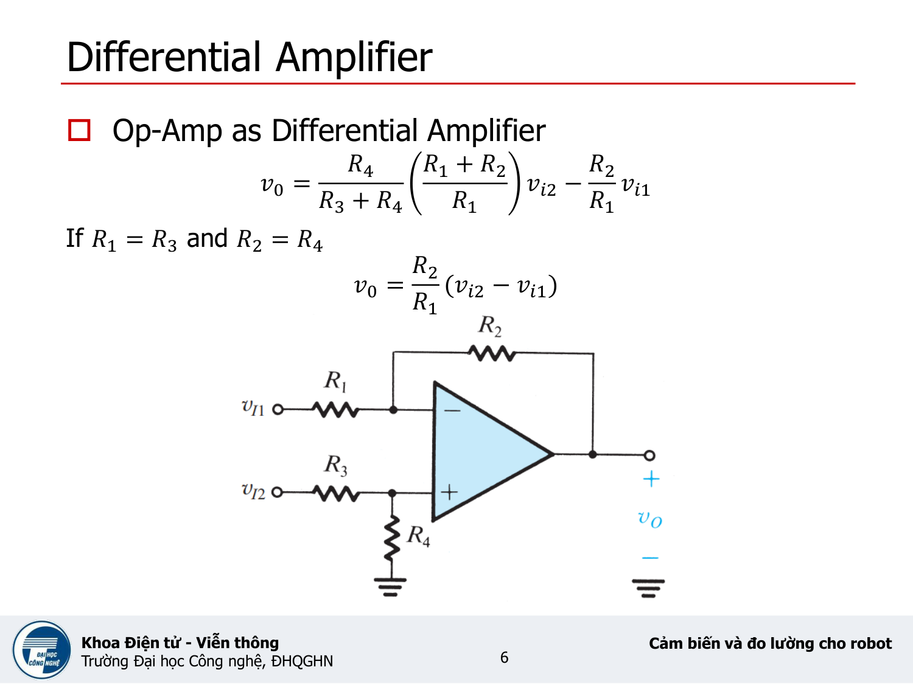

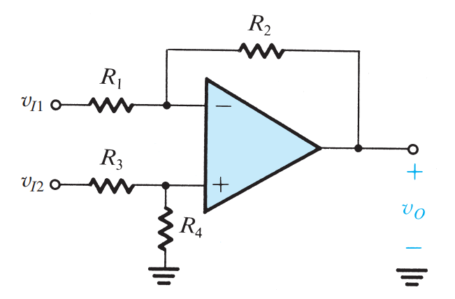

---

## Trang 7

- Khoa Điện tử- Viễn thông
- Trường Đại học Công nghệ, ĐHQGHN
- Cảm biến và đo lường cho robot
- Differential Amplifier
- 7
- 𝒗𝒐= 𝑨𝒅𝒗𝑰𝒅
- 𝒗𝒐= 𝑨𝒄𝒎𝒗𝑰𝒄𝒎
- 𝑣𝑜= 𝐴𝑑𝑣𝐼𝑑+ 𝐴𝑐𝑚𝑣𝐼𝑐𝑚
- Differential gain
- Common-mode gain
- Common-Mode Rejection Ratio (CMRR)
- 𝐶𝑀𝑅𝑅= 20 log 𝐴𝑑
- 𝐴𝑐𝑚

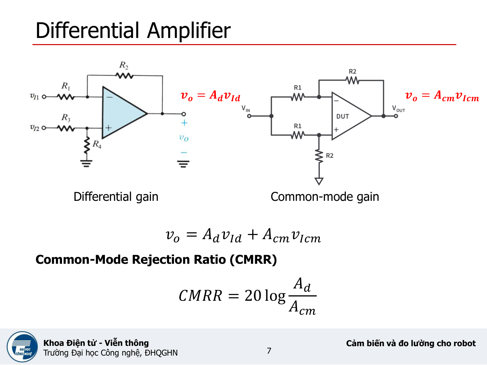

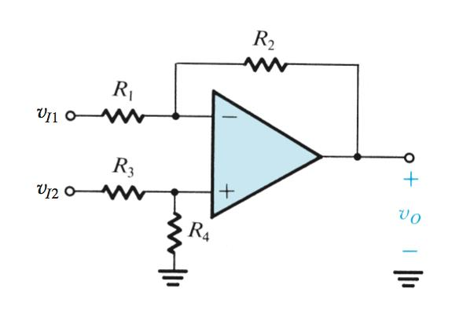

---

## Trang 8

- Khoa Điện tử- Viễn thông
- Trường Đại học Công nghệ, ĐHQGHN
- Cảm biến và đo lường cho robot
- Differential Amplifier
- 8

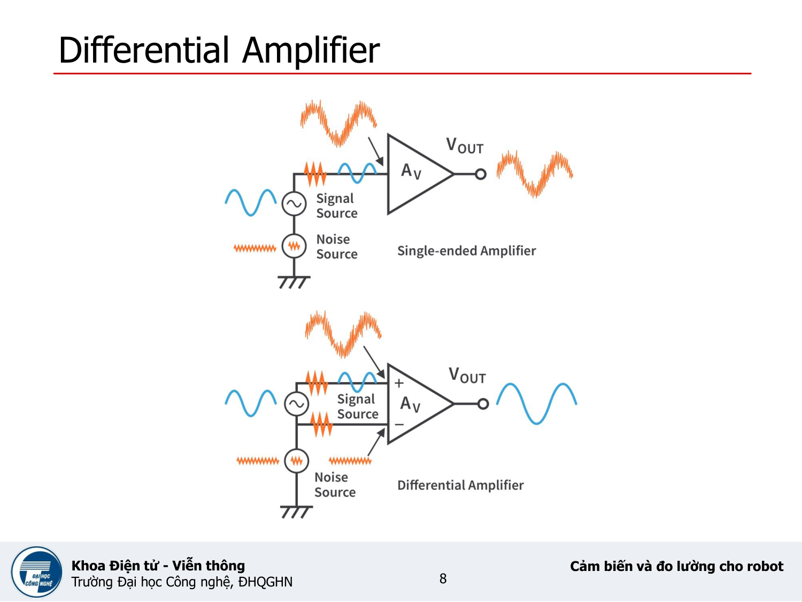

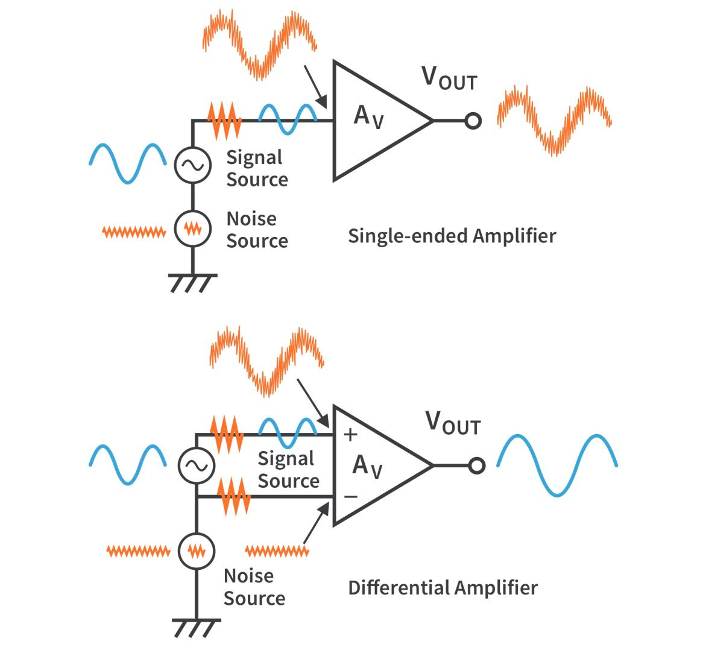

---

## Trang 9

- Khoa Điện tử- Viễn thông
- Trường Đại học Công nghệ, ĐHQGHN
- Cảm biến và đo lường cho robot
- Differential Amplifier
- Common mode gain
- 𝐴𝑐𝑚= 𝑣𝑜
- 𝑣𝐼𝑐𝑚
- =
- 𝑅4
- 𝑅4 + 𝑅3
- 1 −𝑅2
- 𝑅1
- 𝑅3
- 𝑅4
- Ideally, 𝑅1 = 𝑅3 and 𝑅2 = 𝑅4
- 𝐴𝑐𝑚= 0 and 𝐶𝑀𝑅𝑅= ∞
- Any mismatch in the resistance ratios can make 𝐴𝑐𝑚nonzero
- 9
- 𝑣𝑜=
- 𝑅4
- 𝑅4 + 𝑅3
- 1 −𝑅2𝑅3
- 𝑅1𝑅4
- 𝑣𝐼𝑐𝑚

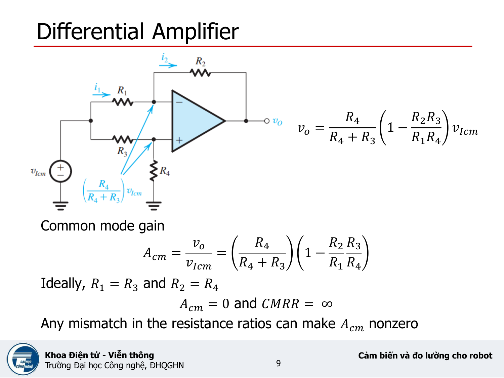

---

## Trang 10

- Khoa Điện tử- Viễn thông
- Trường Đại học Công nghệ, ĐHQGHN
- Cảm biến và đo lường cho robot
- Differential Amplifier
- 
- Differential input resistance
- 𝑅𝑖𝑑≡𝑣𝐼𝑑
- 𝑖𝐼
- 𝑣𝐼𝑑= 𝑅1𝑖𝐼+ 𝑅1𝑖𝐼
- 𝑅𝑖𝑑= 2𝑅1
- 10
- •
- High input impedance: ❌
- •
- Low output impedance: ✔️
- •
- High gain: ❌
- •
- High CMRR: ❌

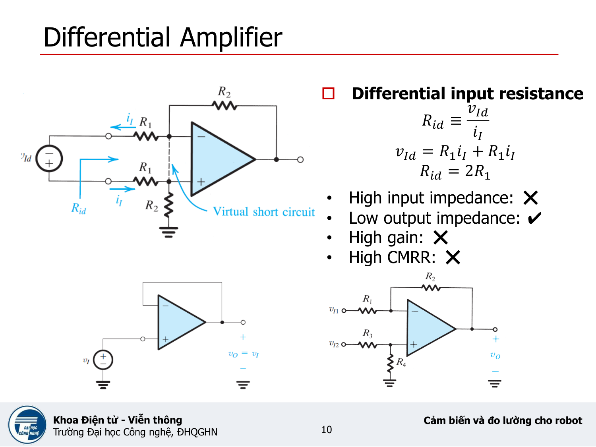

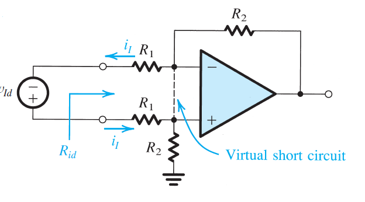

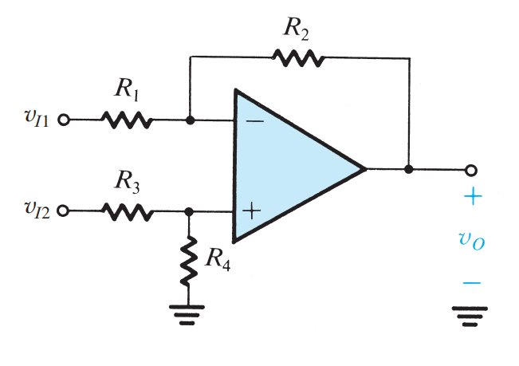

---

## Trang 11

- Khoa Điện tử- Viễn thông
- Trường Đại học Công nghệ, ĐHQGHN
- Cảm biến và đo lường cho robot
- Instrumentation Amplifier
- 𝑣𝑜= 𝑅4
- 𝑅3
- 1 + 𝑅2
- 𝑅1
- 𝑣𝐼𝑑
- 𝐴𝑑=
- 𝑅4
- 𝑅3
- 1 + 𝑅2
- 𝑅1
- 11

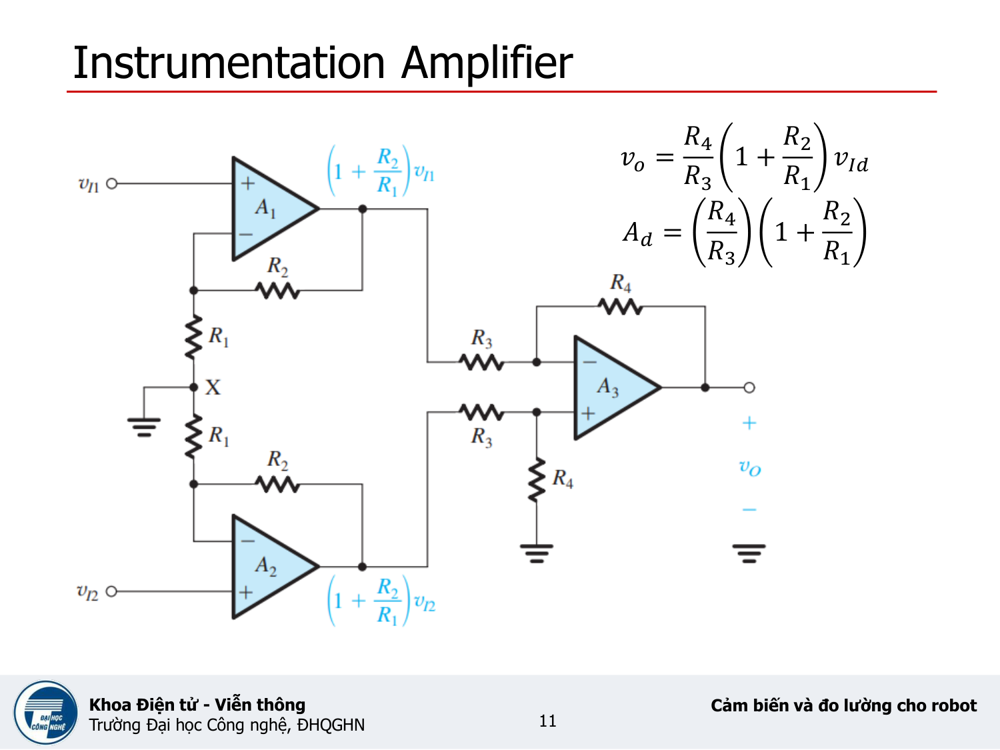

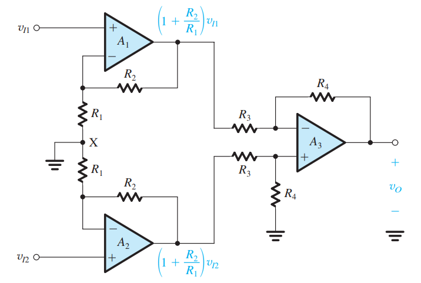

---

## Trang 12

- Khoa Điện tử- Viễn thông
- Trường Đại học Công nghệ, ĐHQGHN
- Cảm biến và đo lường cho robot
- Instrumentation Amplifier
- 12
- 𝑣𝑜= 𝑅4
- 𝑅3
- 1 + 𝑅2
- 𝑅1
- 𝑣𝐼𝑑
- 𝐴𝑑=
- 𝑅4
- 𝑅3
- 1 + 𝑅2
- 𝑅1

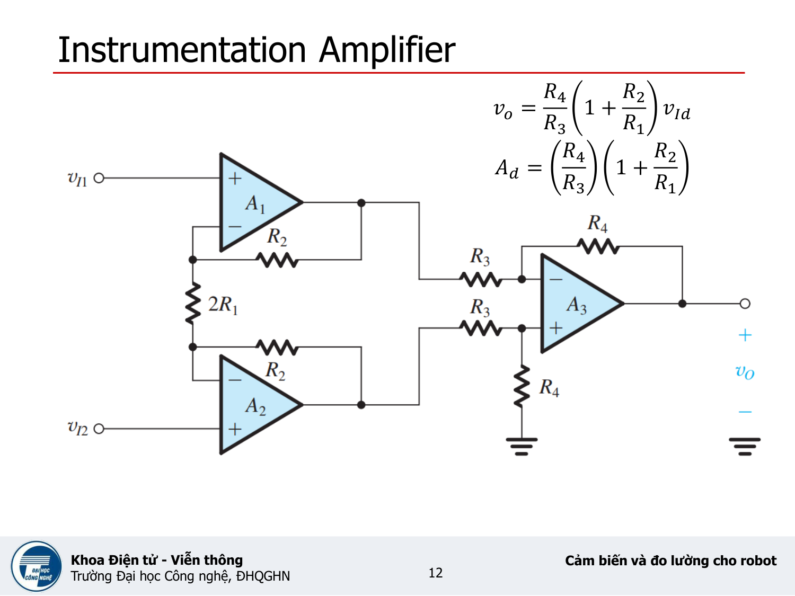

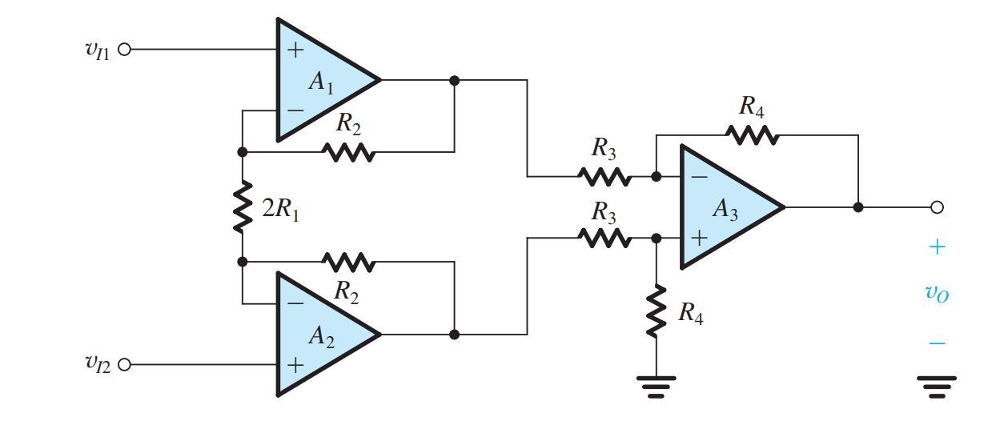

---

## Trang 13

- Khoa Điện tử- Viễn thông
- Trường Đại học Công nghệ, ĐHQGHN
- Cảm biến và đo lường cho robot
- Instrumentation Amplifier
- 13

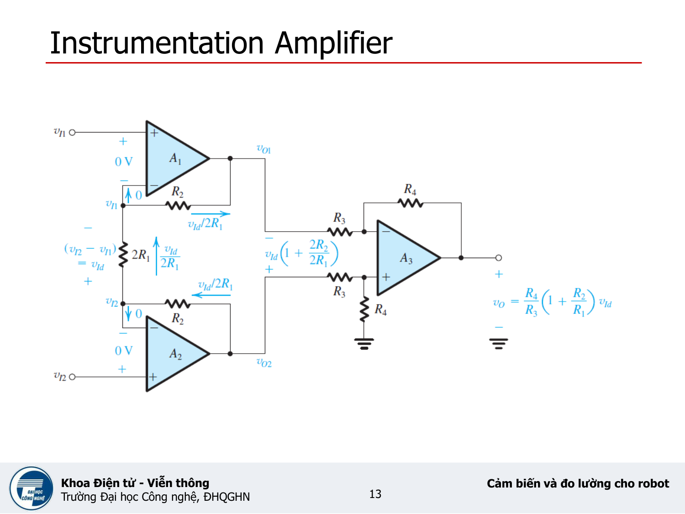

---

## Trang 14

- Khoa Điện tử- Viễn thông
- Trường Đại học Công nghệ, ĐHQGHN
- Cảm biến và đo lường cho robot
- Instrumentation Amplifier
- 14

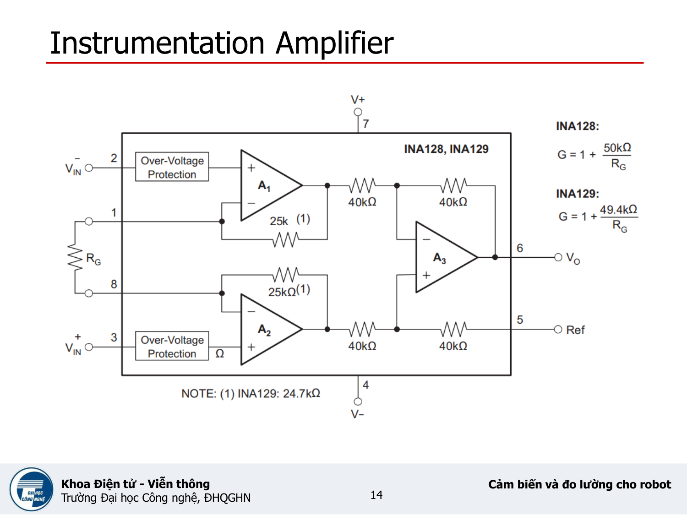

---

## Trang 15

- Khoa Điện tử- Viễn thông
- Trường Đại học Công nghệ, ĐHQGHN
- Cảm biến và đo lường cho robot
- Lock-in amplifier
- Detect and measure very small AC signals (down to a
- few nanovolts) even when the small signal is
- obscured by larger noise source.
- 15

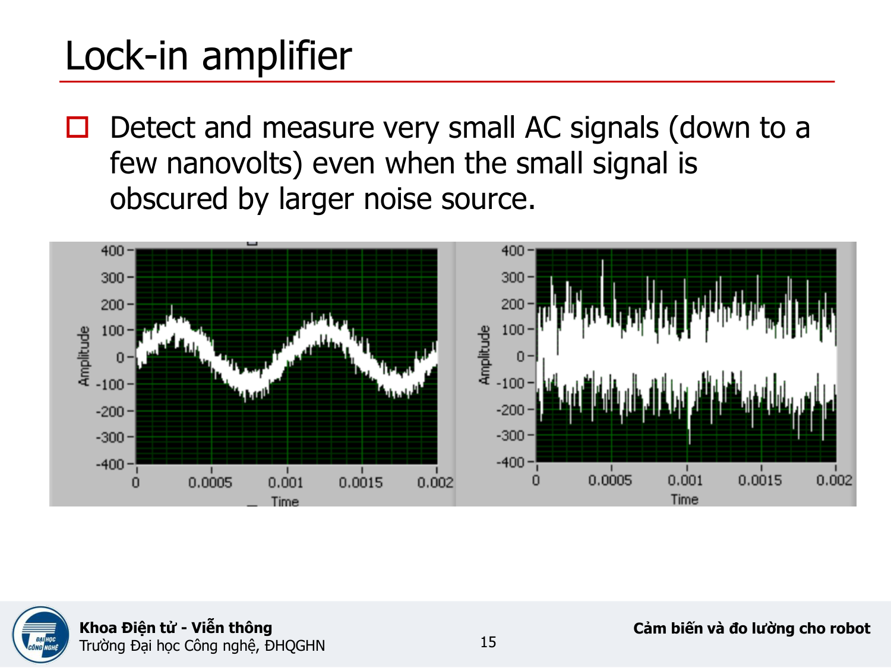

---

## Trang 16

- Khoa Điện tử- Viễn thông
- Trường Đại học Công nghệ, ĐHQGHN
- Cảm biến và đo lường cho robot
- Lock-in Amplifier
- 16

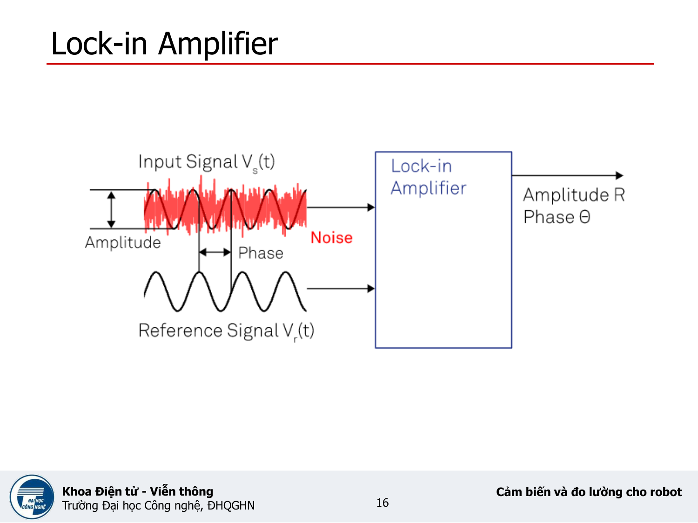

---

## Trang 17

- Khoa Điện tử- Viễn thông
- Trường Đại học Công nghệ, ĐHQGHN
- Cảm biến và đo lường cho robot
- Lock-in amplifier
- 17

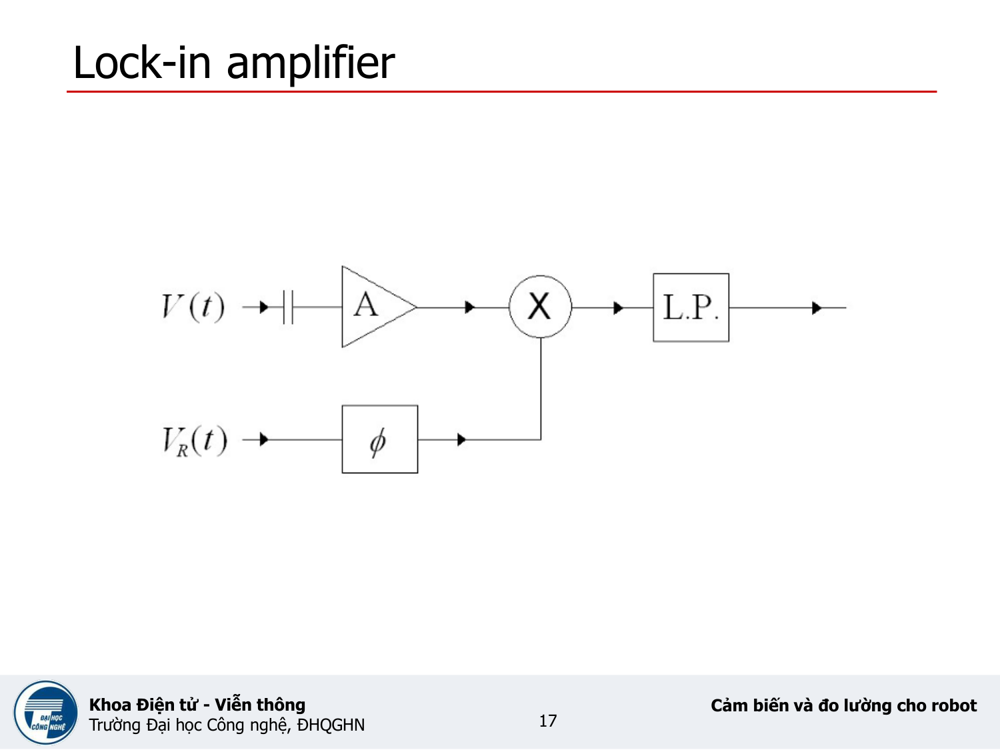

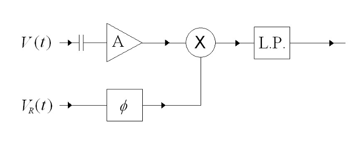

---

## Trang 18

- Khoa Điện tử- Viễn thông
- Trường Đại học Công nghệ, ĐHQGHN
- Cảm biến và đo lường cho robot
- Lock-in amplifier
- Signal of interest: 𝑉𝑠𝑖𝑔sin(𝜔𝑟𝑡+ 𝜃𝑠𝑖𝑔)
- Reference signal: 𝑉𝐿sin(𝜔𝑜𝑡+ 𝜃𝑟𝑒𝑓)
- 𝑉𝑝𝑠𝑑= 𝑉𝑠𝑖𝑔𝑉𝐿sin 𝜔𝑟𝑡+ 𝜃𝑠𝑖𝑔sin 𝜔𝐿𝑡+ 𝜃𝑟𝑒𝑓
- = 1
- 2 𝑉𝑠𝑖𝑔𝑉𝐿cos
- 𝜔𝑟−𝜔𝐿𝑡+ 𝜃𝑠𝑖𝑔−𝜃𝑟𝑒𝑓
- −1
- 2 𝑉𝑠𝑖𝑔𝑉𝐿cos
- 𝜔𝑟+ 𝜔𝐿𝑡+ 𝜃𝑠𝑖𝑔+ 𝜃𝑟𝑒𝑓
- 18

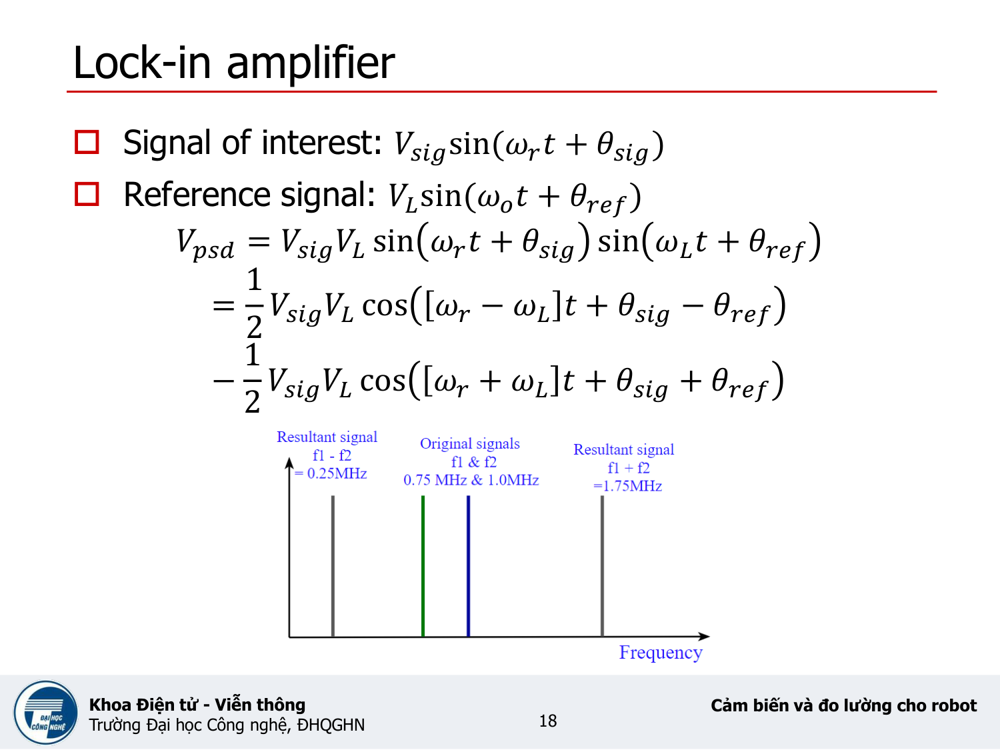

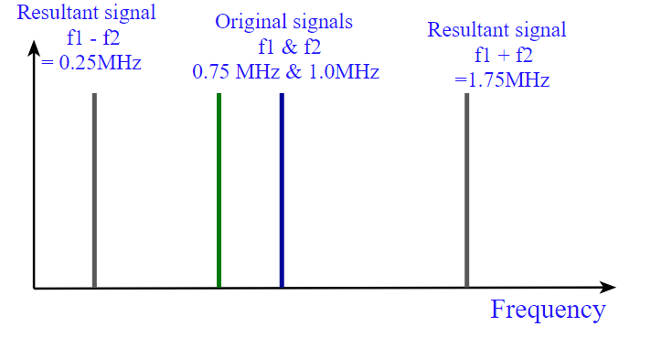

---

## Trang 19

- Khoa Điện tử- Viễn thông
- Trường Đại học Công nghệ, ĐHQGHN
- Cảm biến và đo lường cho robot
- Lock-in amplifier
- If 𝜔𝐿= 𝜔𝑟, the difference frequency component will
- be a DC signal.
- 𝑉𝑝𝑠𝑑= 1
- 2 𝑉𝑠𝑖𝑔𝑉𝐿cos 𝜃𝑠𝑖𝑔−𝜃𝑟𝑒𝑓−1
- 2 𝑉𝑠𝑖𝑔𝑉𝐿cos(2𝜔𝑡+ 𝜃𝑠𝑖𝑔+ 𝜃𝑟𝑒𝑓)
- 19

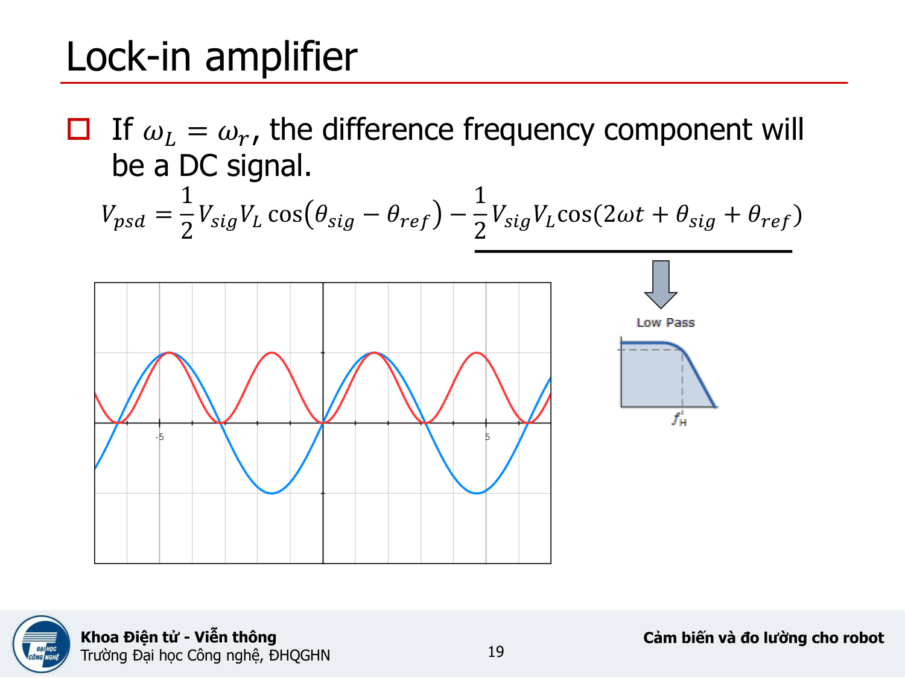

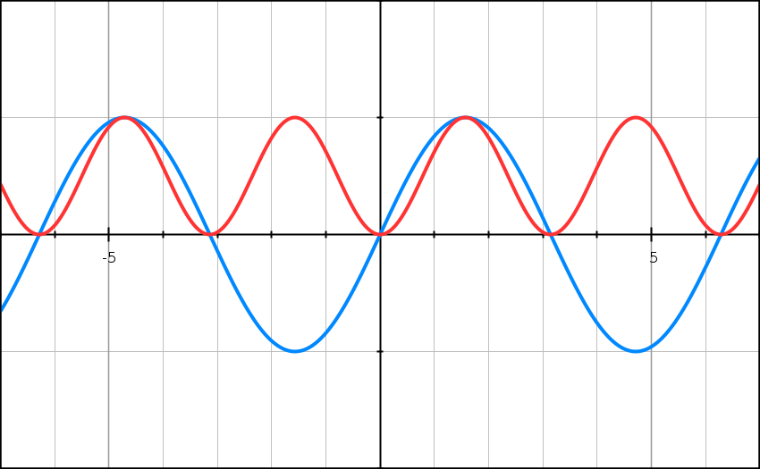

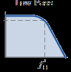

---

## Trang 20

- Khoa Điện tử- Viễn thông
- Trường Đại học Công nghệ, ĐHQGHN
- Cảm biến và đo lường cho robot
- Lock-in amplifier
- If 𝜔𝐿= 𝜔𝑟, the difference frequency component will
- be a DC signal.
- 𝑉𝑝𝑠𝑑= 1
- 2 𝑉𝑠𝑖𝑔𝑉𝐿cos 𝜃𝑠𝑖𝑔−𝜃𝑟𝑒𝑓−1
- 2 𝑉𝑠𝑖𝑔𝑉𝐿cos(2𝜔𝑡+ 𝜃𝑠𝑖𝑔+ 𝜃𝑟𝑒𝑓)
- 20

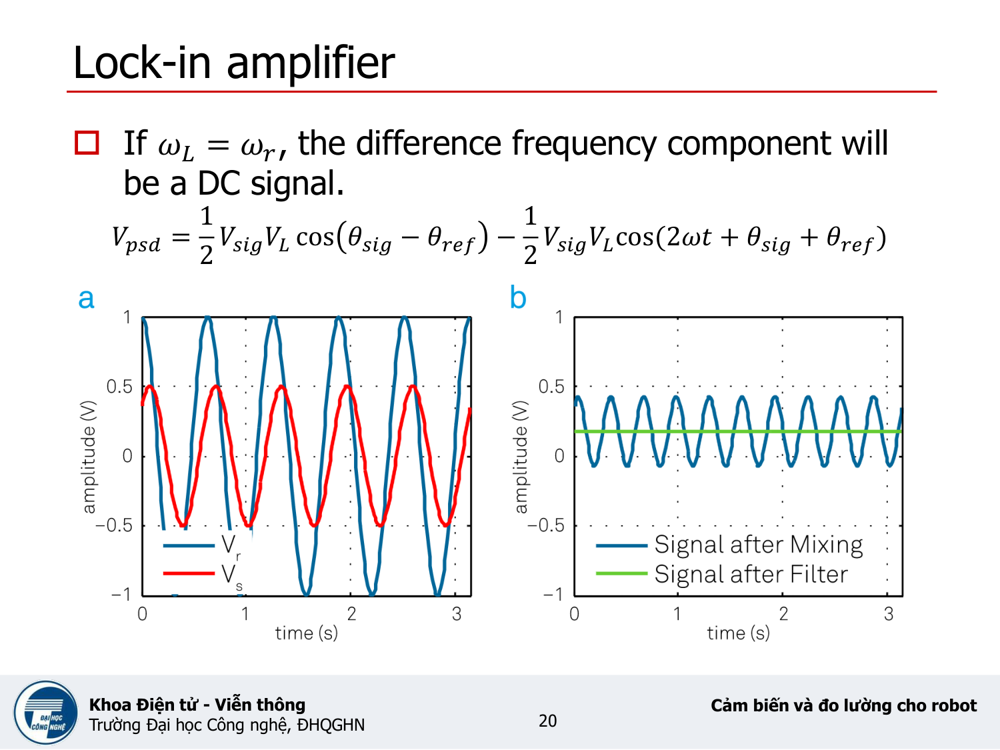

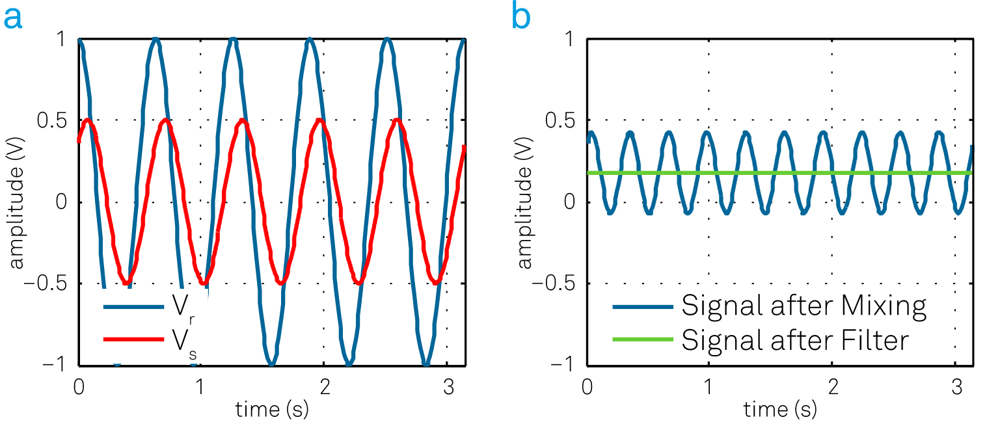

---

## Trang 21

- Khoa Điện tử- Viễn thông
- Trường Đại học Công nghệ, ĐHQGHN
- Cảm biến và đo lường cho robot
- Lock-in amplifier
- 
- If 𝜔𝐿≠𝜔𝑟, signal components with different frequencies make
- new signals, but they still have an average vale of zero
- 21

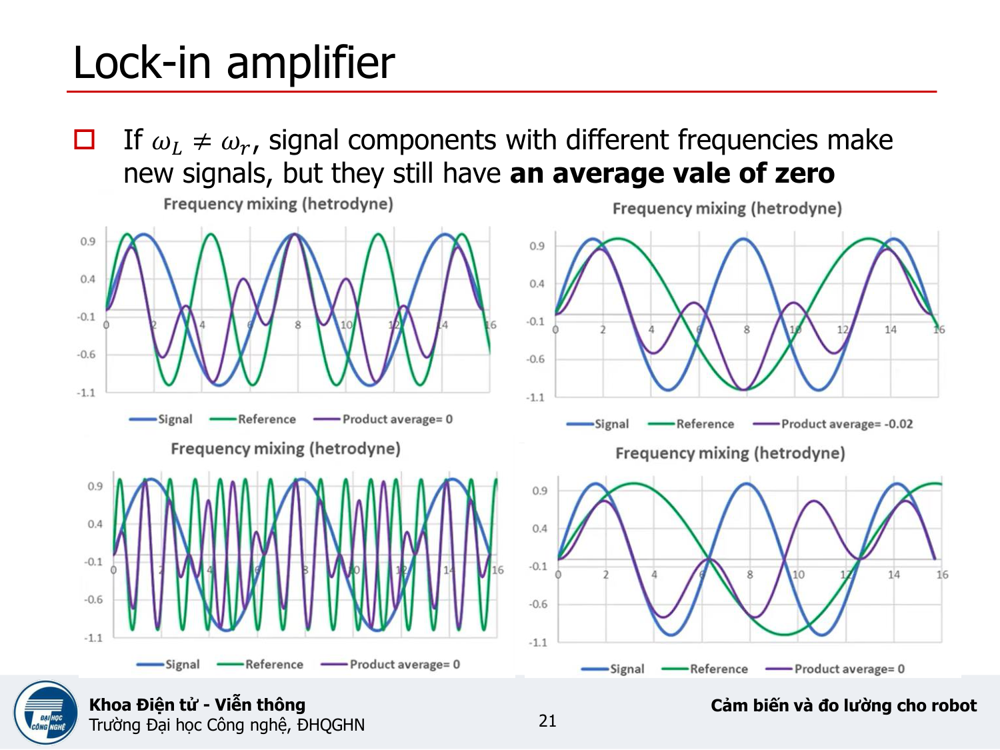

---

## Trang 22

- Khoa Điện tử- Viễn thông
- Trường Đại học Công nghệ, ĐHQGHN
- Cảm biến và đo lường cho robot
- Lock-in amplifier
- If 𝜔𝐿≠𝜔𝑟, signal components with different
- frequencies make new signals, but they still have an
- average vale of zero
- 22

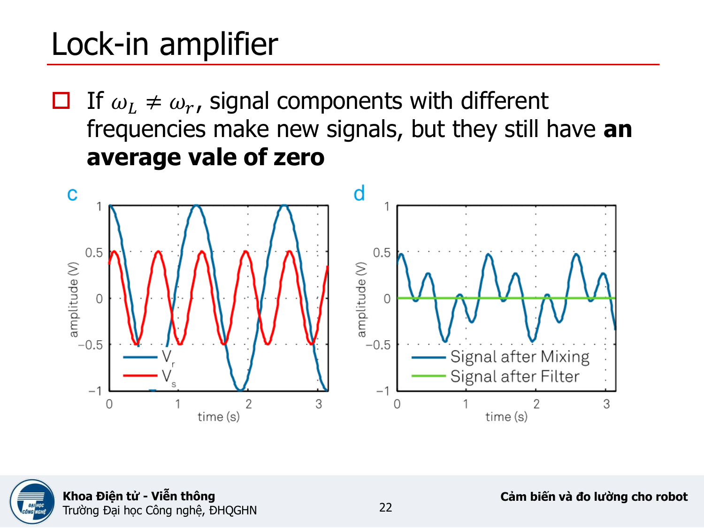

---

## Trang 23

- Khoa Điện tử- Viễn thông
- Trường Đại học Công nghệ, ĐHQGHN
- Cảm biến và đo lường cho robot
- Lock-in amplifier
- 𝑋=
- 1
- 2 𝑉𝑠𝑖𝑔𝑉𝐿cos 𝜃𝑠𝑖𝑔−𝜃𝑟𝑒𝑓
- 𝑌=
- 1
- 2 𝑉𝑠𝑖𝑔𝑉𝐿sin 𝜃𝑠𝑖𝑔−𝜃𝑟𝑒𝑓
- 23
- 𝐴= 2 ×
- 𝑋2 + 𝑌2
- 𝑃ℎ𝑎𝑠𝑒= tan−1 𝑌
- 𝑋

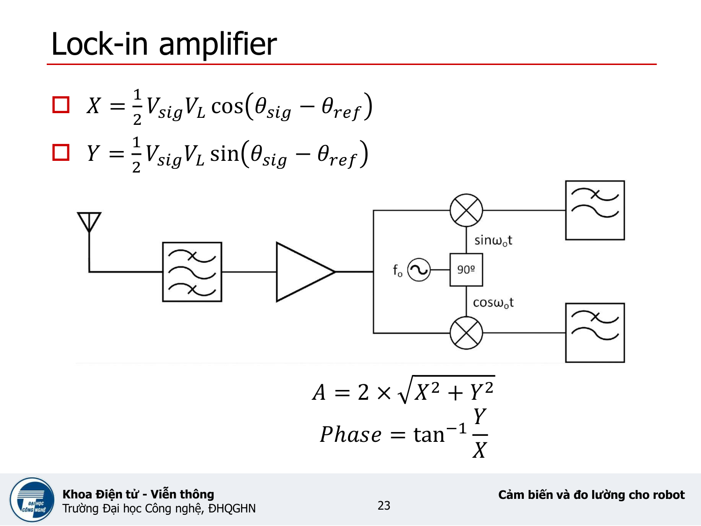

---

## Trang 24

- Khoa Điện tử- Viễn thông
- Trường Đại học Công nghệ, ĐHQGHN
- Cảm biến và đo lường cho robot
- Log Amplifier
- 𝑉𝑜𝑢𝑡= −𝑉𝑇ln 𝑉𝑖𝑛
- 𝐼𝑠𝑅
- 24

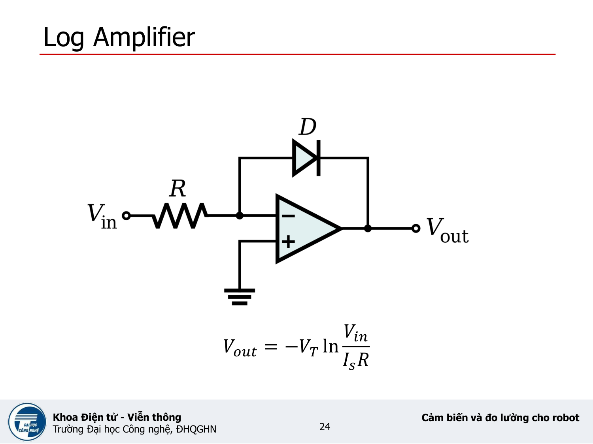

---

## Trang 25

- Khoa Điện tử- Viễn thông
- Trường Đại học Công nghệ, ĐHQGHN
- Cảm biến và đo lường cho robot
- Anti-Log Amplifier
- 𝑉𝑜𝑢𝑡= −𝑅𝑓𝐼𝑠𝑒
- 𝑉𝑖
- 𝑉𝑇
- 25

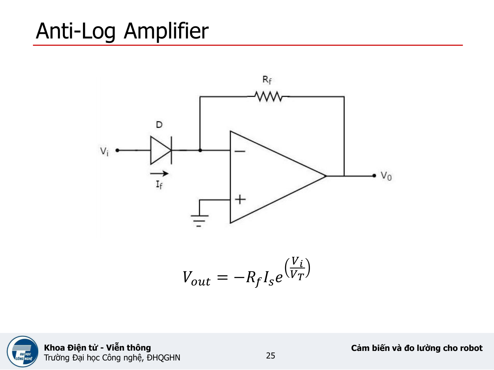

---

## Trang 26

- Khoa Điện tử- Viễn thông
- Trường Đại học Công nghệ, ĐHQGHN
- Cảm biến và đo lường cho robot
- Bias (zero drift) removal
- 26

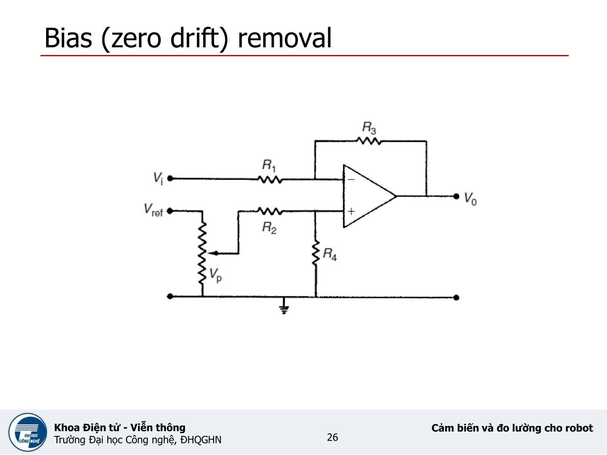

---

## Trang 27

- Khoa Điện tử- Viễn thông
- Trường Đại học Công nghệ, ĐHQGHN
- Cảm biến và đo lường cho robot
- Signal integration
- 27

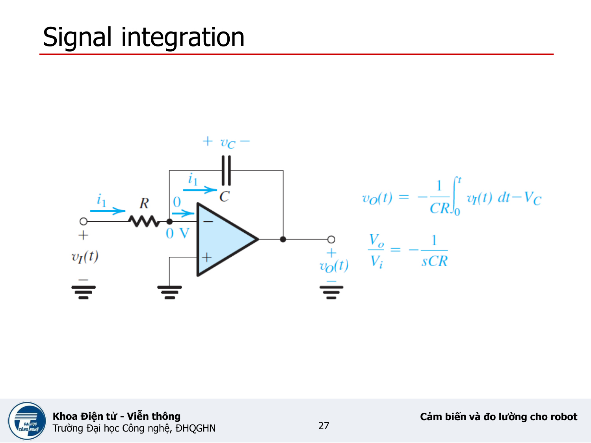

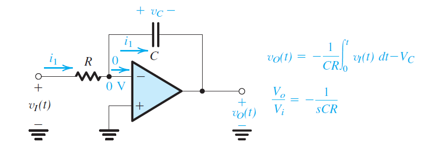

---

## Trang 28

- Khoa Điện tử- Viễn thông
- Trường Đại học Công nghệ, ĐHQGHN
- Cảm biến và đo lường cho robot
- Signal differentiation
- 28

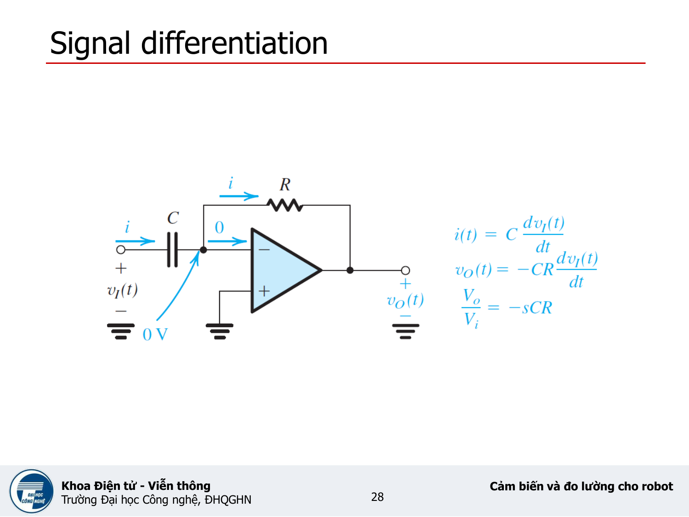

---

## Trang 29

- Khoa Điện tử- Viễn thông
- Trường Đại học Công nghệ, ĐHQGHN
- Cảm biến và đo lường cho robot
- Voltage comparator
- 29

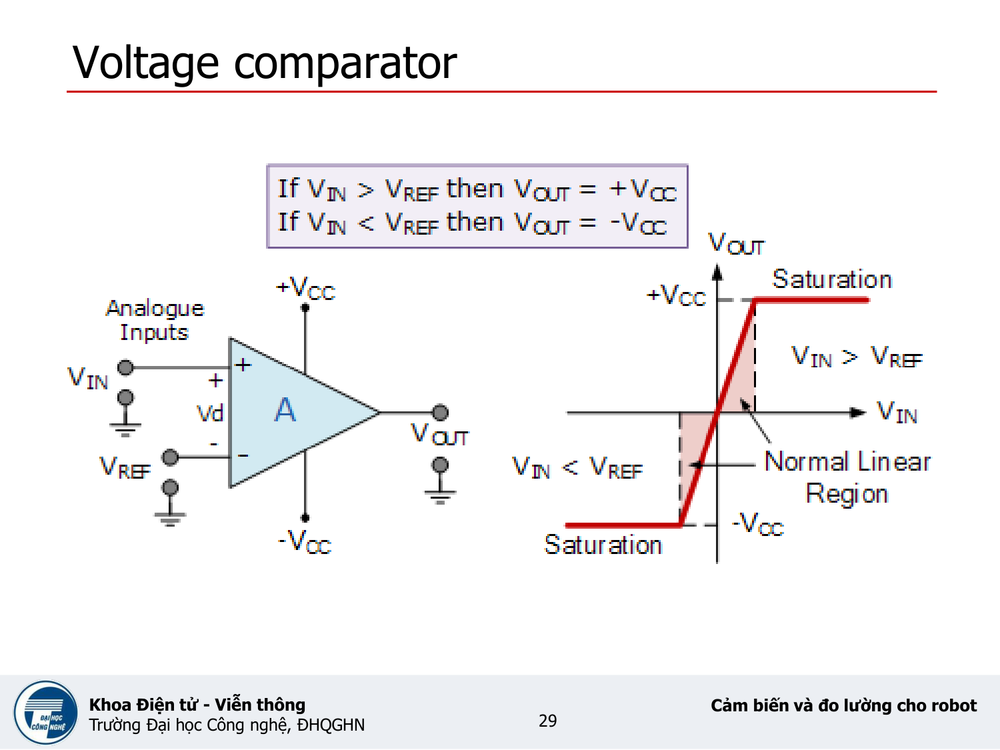

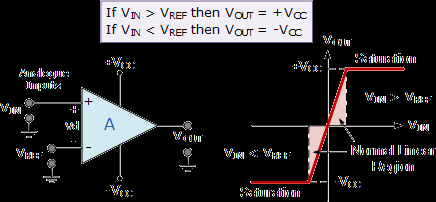

---

## Trang 30

- Khoa Điện tử- Viễn thông
- Trường Đại học Công nghệ, ĐHQGHN
- Cảm biến và đo lường cho robot
- Schmitt trigger
- 30

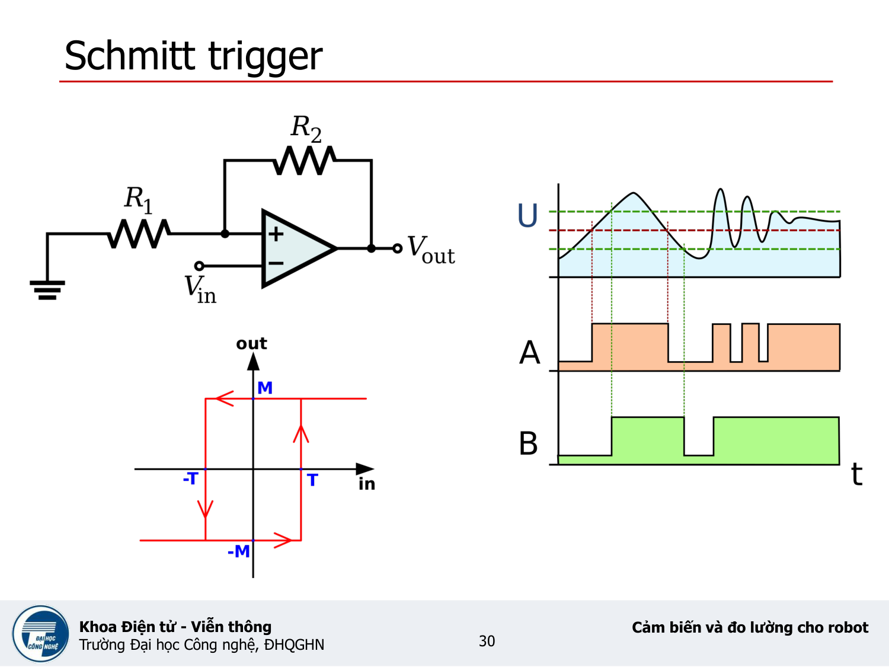

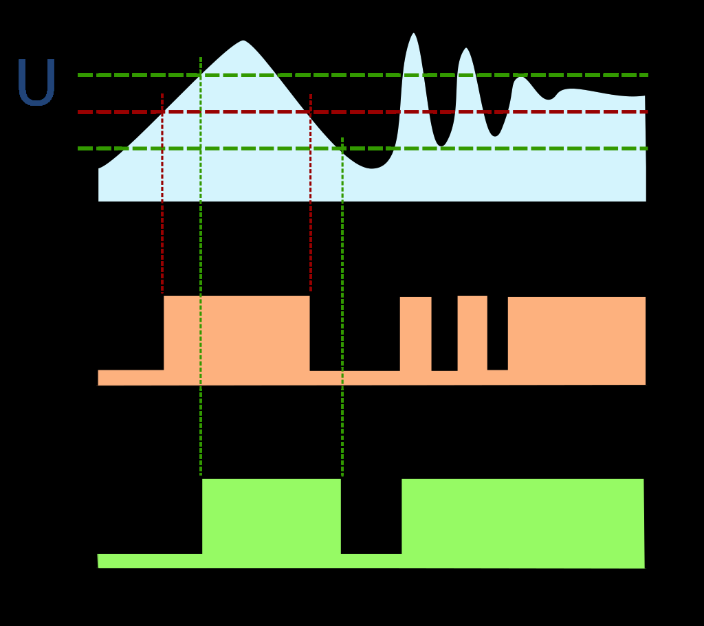

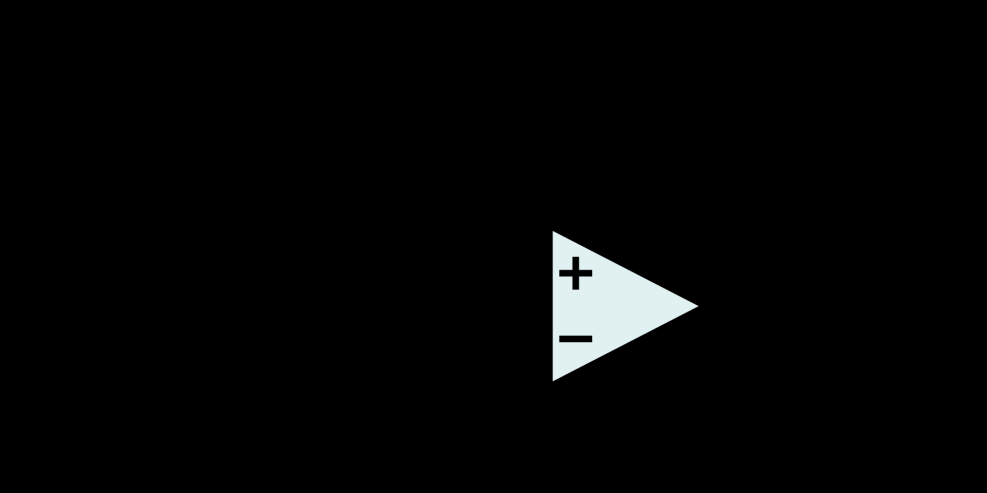

---

## Trang 31

- Khoa Điện tử- Viễn thông
- Trường Đại học Công nghệ, ĐHQGHN
- Cảm biến và đo lường cho robot
- Signal addition
- 31


---

## Trang 32

- Khoa Điện tử- Viễn thông
- Trường Đại học Công nghệ, ĐHQGHN
- Cảm biến và đo lường cho robot
- Signal multiplication
- 32


---

## Trang 33

- Khoa Điện tử- Viễn thông
- Trường Đại học Công nghệ, ĐHQGHN
- Cảm biến và đo lường cho robot
- Signal multiplication
- 33


---

## Trang 34

- Khoa Điện tử- Viễn thông
- Trường Đại học Công nghệ, ĐHQGHN
- Cảm biến và đo lường cho robot
- Low Pass Filter
- 34
- Passive Low Pass Filter
- Active Low Pass Filter


---

## Trang 35

- Khoa Điện tử- Viễn thông
- Trường Đại học Công nghệ, ĐHQGHN
- Cảm biến và đo lường cho robot
- High Pass Filter
- 35
- Passive High Pass Filter
- Active High Pass Filter


---

