# EP6 Temperature - Contact

> Tài liệu chuyển đổi từ slide PowerPoint: `EP6 Temperature - Contact.pptx`

---

## Slide 1

- 
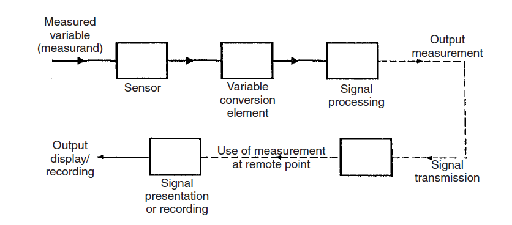

- 1

---

## Slide 2

### Temperature - Contact

- 2

---

## Slide 3

### Resistive temperature detectors (RTD)

- Based on changes of electrical resistance on temperature.
- 3
- 
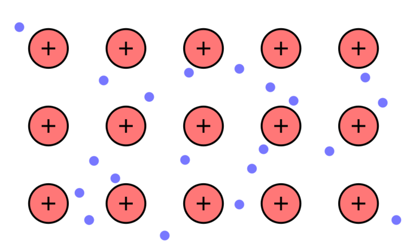

---

## Slide 4

### Resistive temperature detectors (RTD)

- Based on changes of electrical resistance on temperature.
- 4
- 
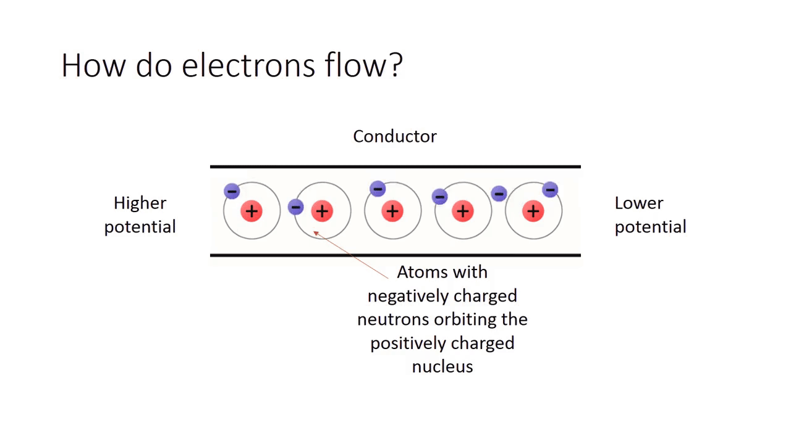

---

## Slide 5

### Resistive temperature detectors (RTD)

- 5

---

## Slide 6

### Resistive temperature detectors (RTD)

- 6

---

## Slide 7

### Sensor self-heating

- 7
- 
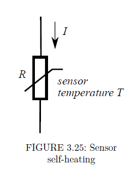

---

## Slide 8

### Resistive temperature detectors (RTD)

- 8

---

## Slide 9

### Resistive temperature detectors (RTD)

- 9
- 
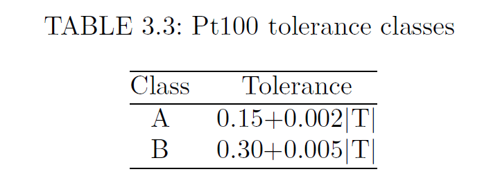

---

## Slide 10

### Resistive temperature detectors (RTD)

- 10
- 
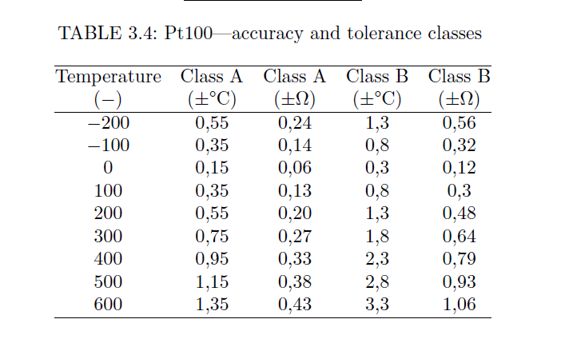

---

## Slide 11

### Resistive temperature detectors (RTD)

- Glass platinum RTD
- RTD’s are common in three different types—glass, ceramics and thin film.
- 11
- 
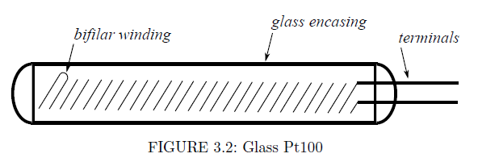

- 

---

## Slide 12

### Resistive temperature detectors (RTD)

- Ceramic platinum RTD
- 12
- 
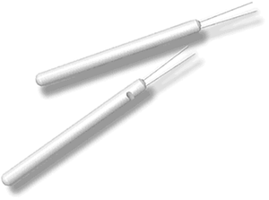

- 
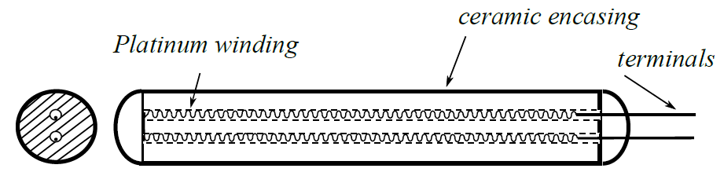

- The platinum wire is not melted into the material but is placed in a tube.
- The wire is allowed to move freely inside the casing.
- Suitable for higher temperatures (up to 850℃).

---

## Slide 13

### Resistive temperature detectors (RTD)

- Thin-film RTDs
- 13
- A thin film of Pt paste is deposited on a ceramic substrate.
- A fast response (small time constant), less influence on the measured surface.
- Measurement of surface temperature.
- 
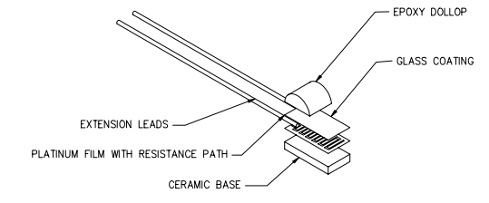

- 

---

## Slide 14

### Resistive temperature detectors (RTD)

- 14
- Less expensive, Less accurate and less stable in the long-term and are non-linear.

---

## Slide 15

### Resistive temperature detectors (RTD)

- Nickel RTDs
- 15
- 
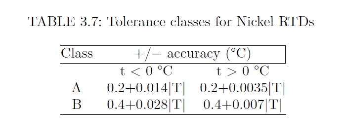

---

## Slide 16

### Resistive temperature detectors (RTD)

- Nickel RTDs
- 16
- 
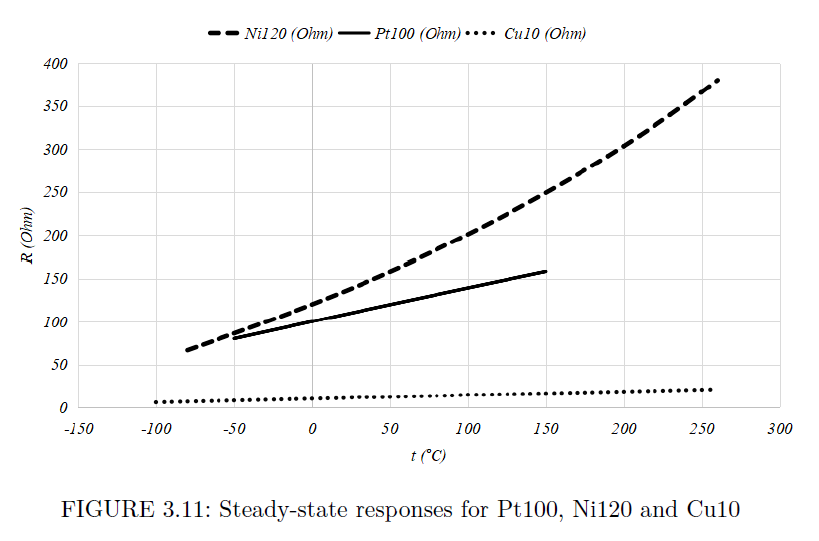

---

## Slide 17

### Resistive temperature detectors (RTD)

- Copper RTDs
- Copper RTDs can be used for short-time experiments.
- 17
- 
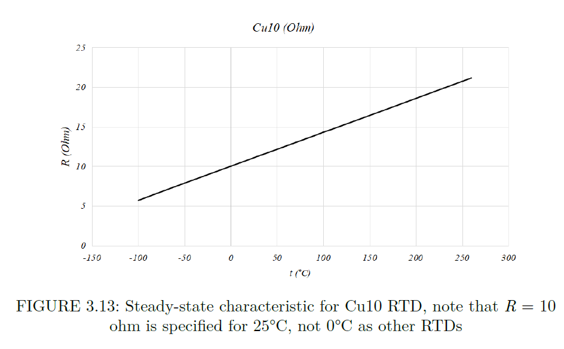

---

## Slide 18

### Thermistors

- Exploit the dependence of electrical resistance on temperature.
- Produced by high-temperature pressing of metallic oxides (Fe2O3, TiO2, CuO2, NiO) into a form of a bead.
- 18
- 
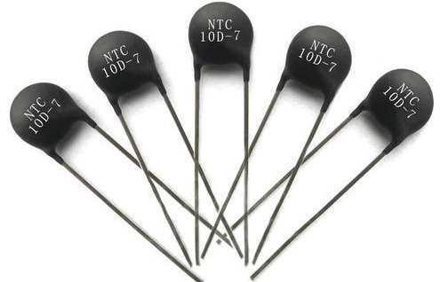

- 
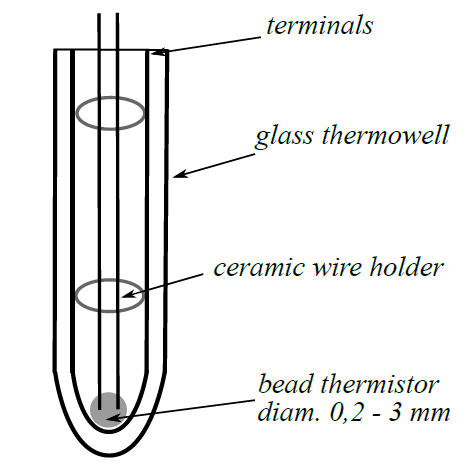

---

## Slide 19

### Thermistors

- The dependence of resistance on temperature for semiconductors is non-linear.
- 19
- 
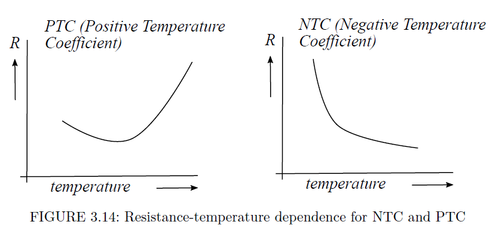

---

## Slide 20

### Thermistors

- 20
- An example of the resistance-temperature dependence for a thermistor with 20kΩ for 25℃
- 
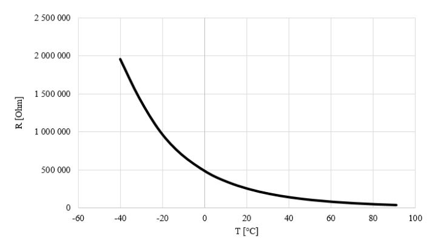

---

## Slide 21

### Thermistors

- Thermistors have a large sensitivity (x10 larger than for metal RTDs).
- Non-linear → more complex electronic circuit.
- Large tolerance (5% to 10%).
- Maximal range is about 150℃
- Thermistors are very fast; they have a small time constant
- 21

---

## Slide 22

### Thermistors

- Thermistor linearity
- 22
- 
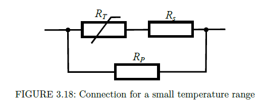

- 
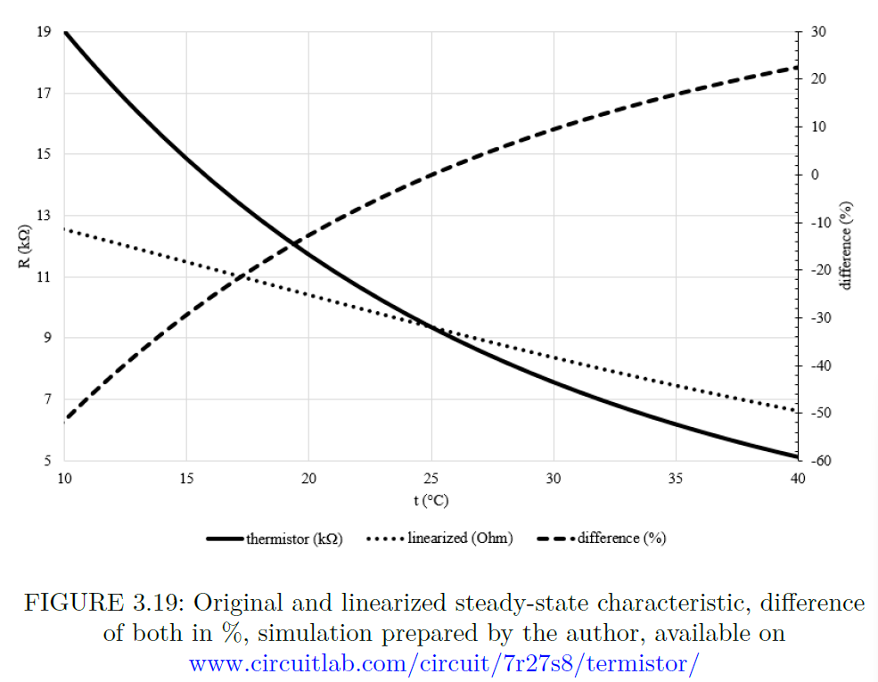

---

## Slide 23

### Thermistors

- Thermistor linearity
- 23
- 
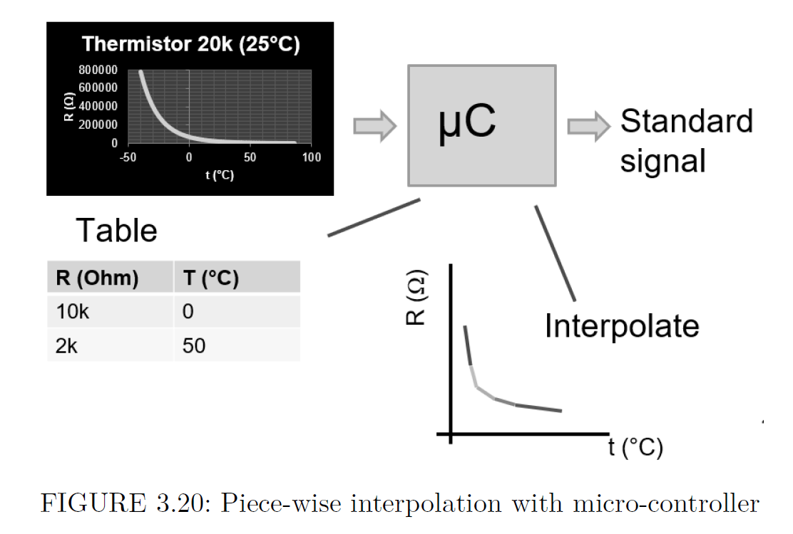

---

## Slide 24

### Thermocouples

- Seebeck effect (Thermoelectric Effect)
- Electromotive force (emf) develops across two points of an electrically conducting material when there is a temperature difference.
- 24
- 
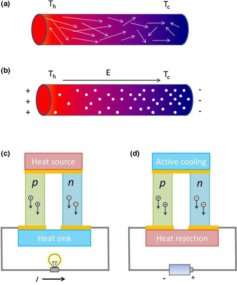

---

## Slide 25

### Thermocouples

- 25
- 
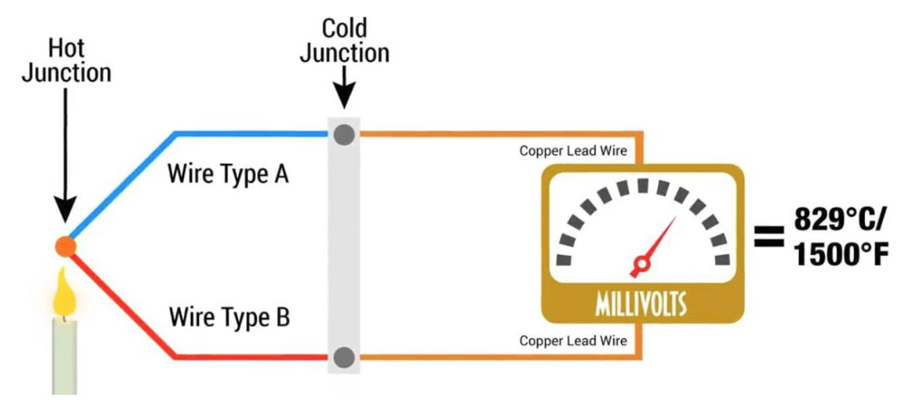

- A thermocouple measures temperature difference.

---

## Slide 26

### Thermocouples

- 26
- 
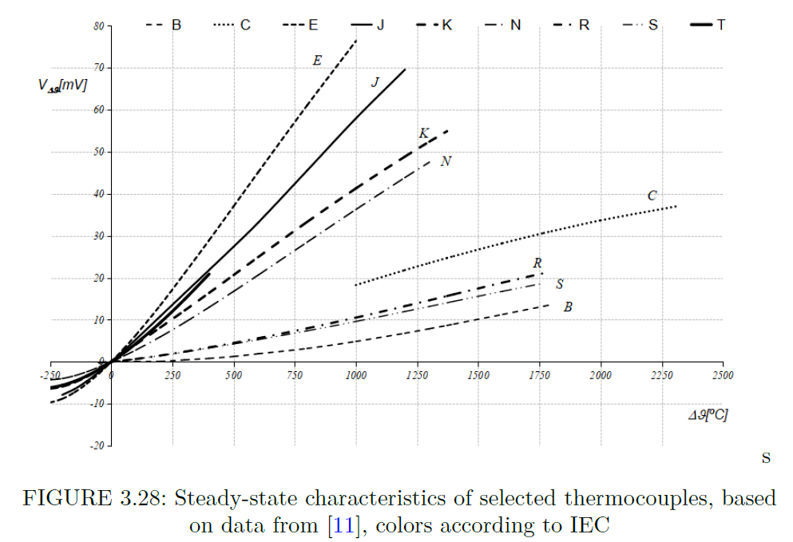

---

## Slide 27

### Thermocouple installation

- 27
- 
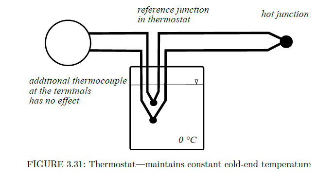

---

## Slide 28

### Thermocouple installation

- Cold-junction box
- 28
- 
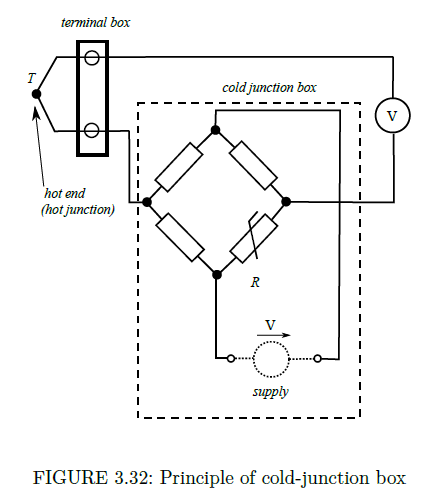

- 
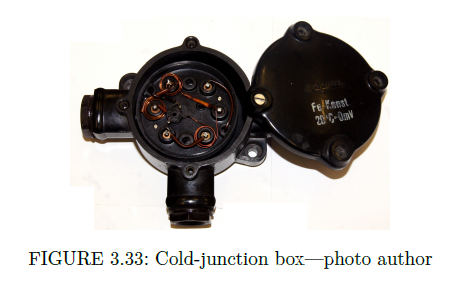

- Three resistors independent on temperature (constantan, α = -0.000074 1/℃).
- The fourth resistor is made from copper (α = 0.004041 1/℃).
- The bridge is balanced for 20 ℃.

---

## Slide 29

### Thermoelectric cooling

- Peltier Effects
- 29
- 
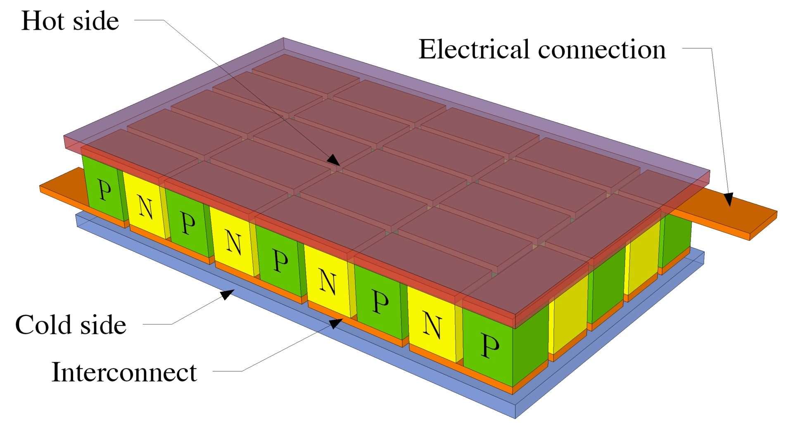

- 
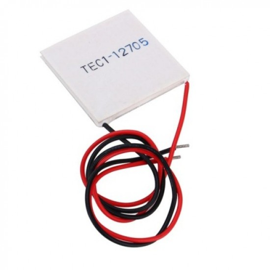

---

## Slide 30

### Temperature-sensor placement

- Thermowell
- 30
- 
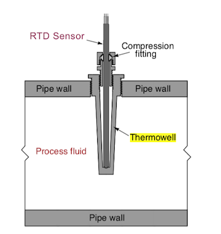

- 

---

## Slide 31

### Comparision of Temperature Sensors

- 31

---
