# EP7 Force

> Tài liệu chuyển đổi từ PDF: `EP7 Force.pdf`

---

## Trang 1

### Khoa Điện tử- Viễn thông

- Trường Đại học Công nghệ, ĐHQGHN
- Cảm biến và đo lường cho robot
- Force
- 1

---

## Trang 2

### Khoa Điện tử- Viễn thông

- Trường Đại học Công nghệ, ĐHQGHN
- Cảm biến và đo lường cho robot
- Metallic strain gauges
- The electric resistance of a wire
- 𝑅= 𝜌𝑙
- 𝐴
- Material with a very small temperature coefficient of
- electrical resistance.
- 2

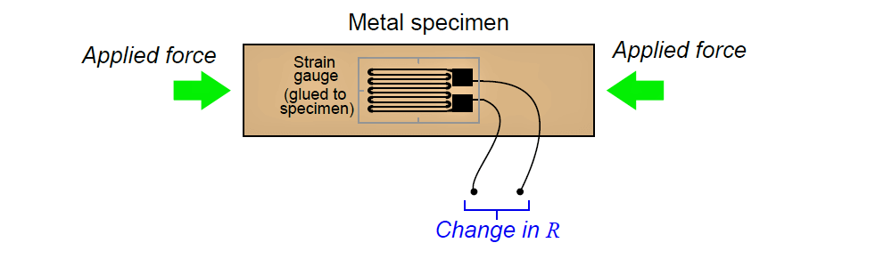

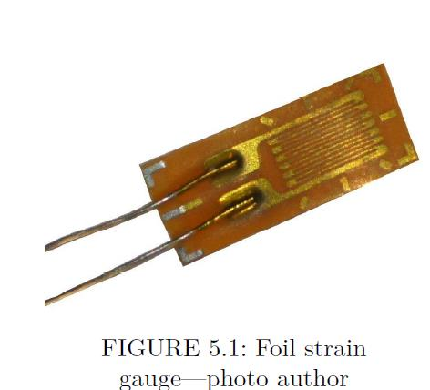

---

## Trang 3

### Khoa Điện tử- Viễn thông

- Trường Đại học Công nghệ, ĐHQGHN
- Cảm biến và đo lường cho robot
- Strain
- 3
- Strain (m/m): the measure of how much an object is stretched or deformed

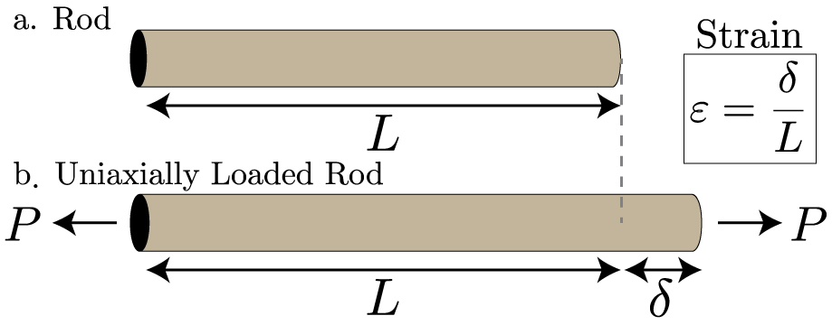

---

## Trang 4

### Khoa Điện tử- Viễn thông

- Trường Đại học Công nghệ, ĐHQGHN
- Cảm biến và đo lường cho robot
- Poisson’s Ratio
- 4

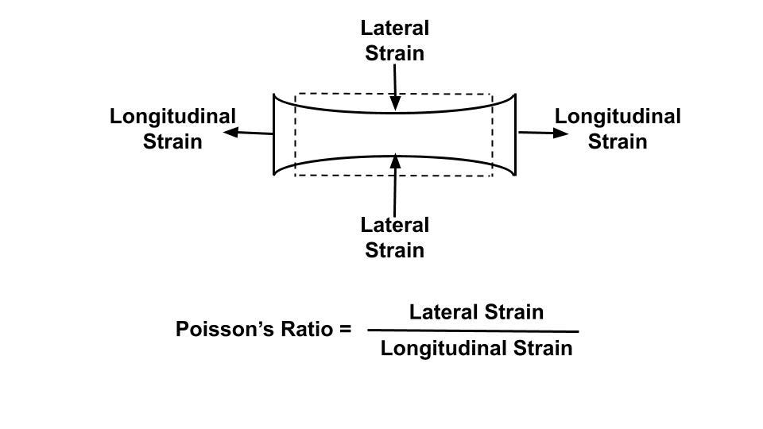

---

## Trang 5

### Khoa Điện tử- Viễn thông

- Trường Đại học Công nghệ, ĐHQGHN
- Cảm biến và đo lường cho robot
- Young’s Modulus
- 5

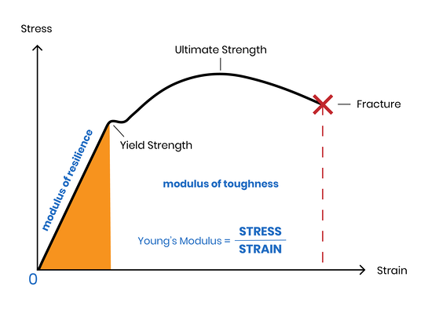

---

## Trang 6

### Khoa Điện tử- Viễn thông

- Trường Đại học Công nghệ, ĐHQGHN
- Cảm biến và đo lường cho robot
- Young’s Modulus
- 6

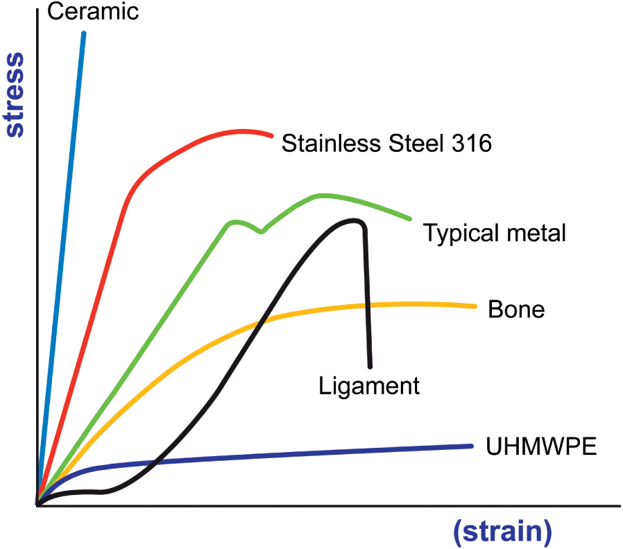

---

## Trang 7

### Khoa Điện tử- Viễn thông

- Trường Đại học Công nghệ, ĐHQGHN
- Cảm biến và đo lường cho robot
- Metallic strain gauges
- Change of electrical resistance depends on:
- 
- Change of electrical resistance with strain
- 
- Change of electrical resistance with change of length
- 
- Change of electrical resistance with change of cross
- section
- 7

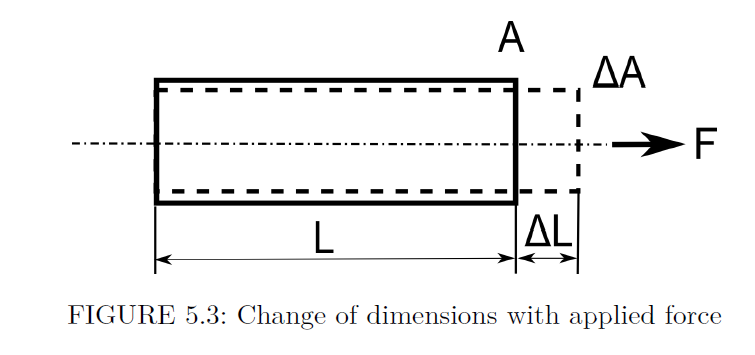

---

## Trang 8

### Khoa Điện tử- Viễn thông

- Trường Đại học Công nghệ, ĐHQGHN
- Cảm biến và đo lường cho robot
- Metallic strain gauges
- 𝑑𝑅
- 𝑅= 𝑑𝑙
- 𝑙−𝑑𝐴
- 𝐴+ 𝑑𝜌
- 𝜌
- Dependence of length and cross section (Poisson ratio 𝜈)
- 𝑑𝐴
- 𝐴= −2𝜈𝑑𝑙
- 𝑙
- 𝑑𝑅
- 𝑅= 𝑑𝑙
- 𝑙−𝑑𝐴
- 𝐴+ 𝑑𝜌
- 𝜌= 1 + 2𝜈𝑑𝑙
- 𝑙+ 𝑑𝜌
- 𝜌
- 𝑑𝑅
- 𝑅=
- 1 + 2𝜈+
- 𝑑𝜌
- 𝜌
- 𝑑𝑙
- 𝑙
- ⋅𝑑𝑙
- 𝑙= 𝐾⋅𝜀
- 8
- Gauge factor

---

## Trang 9

### Khoa Điện tử- Viễn thông

- Trường Đại học Công nghệ, ĐHQGHN
- Cảm biến và đo lường cho robot
- Metallic strain gauges
- Gauge factor (sensitivity of the gauge)
- The ratio of per unit change in resistance to per unit
- change in length.
- 𝐺𝑓= Δ𝑅/𝑅
- Δ𝐿/𝐿= 1 + 2𝜈+ Δ𝜌/𝜌
- 𝜀
- 9

---

## Trang 10

### Khoa Điện tử- Viễn thông

- Trường Đại học Công nghệ, ĐHQGHN
- Cảm biến và đo lường cho robot
- Metallic strain gauges
- 10

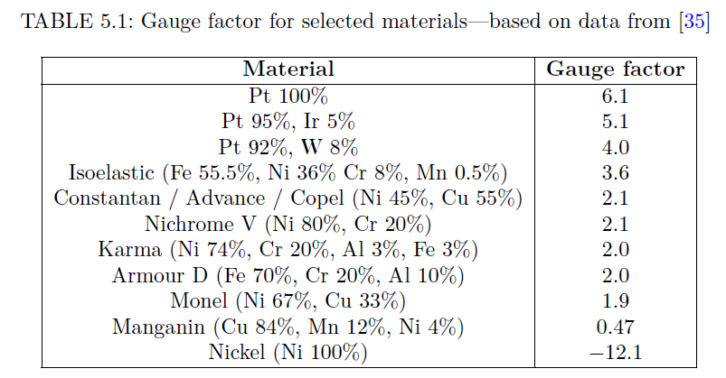

---

## Trang 11

### Khoa Điện tử- Viễn thông

- Trường Đại học Công nghệ, ĐHQGHN
- Cảm biến và đo lường cho robot
- Strain-gauge rosettes
- 11

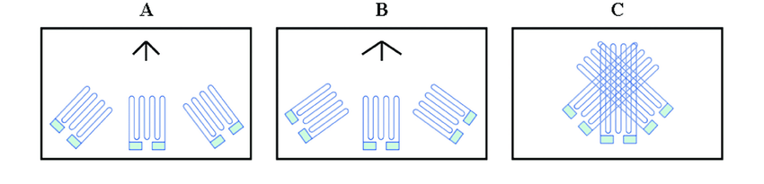

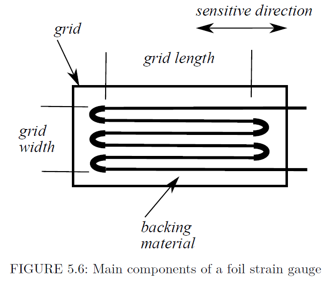

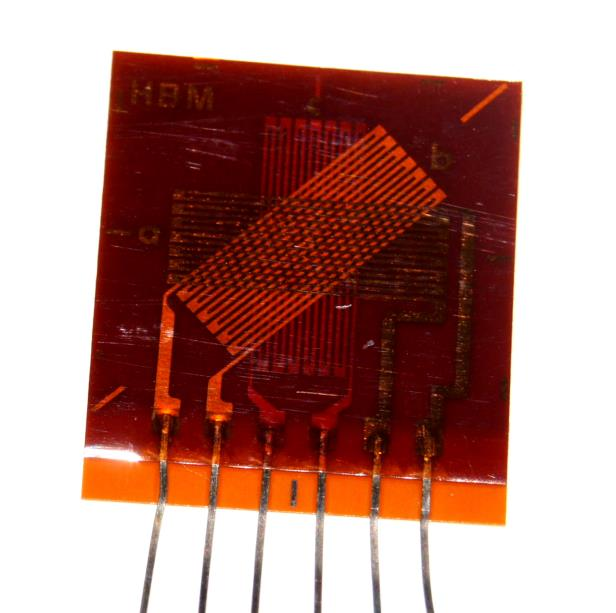

---

## Trang 12

### Khoa Điện tử- Viễn thông

- Trường Đại học Công nghệ, ĐHQGHN
- Cảm biến và đo lường cho robot
- Temperature compensation
- A steel bar with dimensions 10×10 mm, Young’s
- modulus E = 200 GPa. The bar is loaded with a force
- F = 1000 N.
- 12

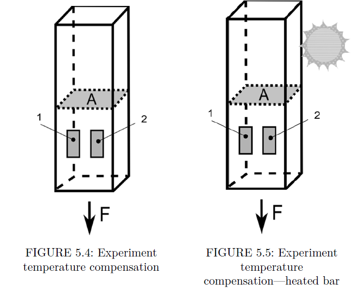

---

## Trang 13

### Khoa Điện tử- Viễn thông

- Trường Đại học Công nghệ, ĐHQGHN
- Cảm biến và đo lường cho robot
- Temperature compensation
- For a strain gauge with R = 120, the absolute change
- of electrical resistance:
- 𝑑𝑅= 𝐾𝜖𝑅= 2 × 50 × 10−6 × 120 = 12 𝑚Ω
- The change of rresistance caused by the temperature
- change for the constantan strain gauge:
- 𝑅𝑇= 𝑅𝑇0
- 1 + 𝛼Δ𝑇= 120 1 + 8 × 10−6 × 10 = 120.0096 Ω
- Δ𝑅𝑇= 9.6 𝑚Ω
- The change of rresistance caused by the temperature
- change for the copper strain gauge:
- 𝑅𝑇= 𝑅𝑇0
- 1 + 𝛼Δ𝑇= 120 1 + 3.9 × 10−3 × 10 = 124.68 Ω
- Δ𝑅𝑇= 4.68 Ω
- 13

---

## Trang 14

### Khoa Điện tử- Viễn thông

- Trường Đại học Công nghệ, ĐHQGHN
- Cảm biến và đo lường cho robot
- Circuits for strain gauges
- 14

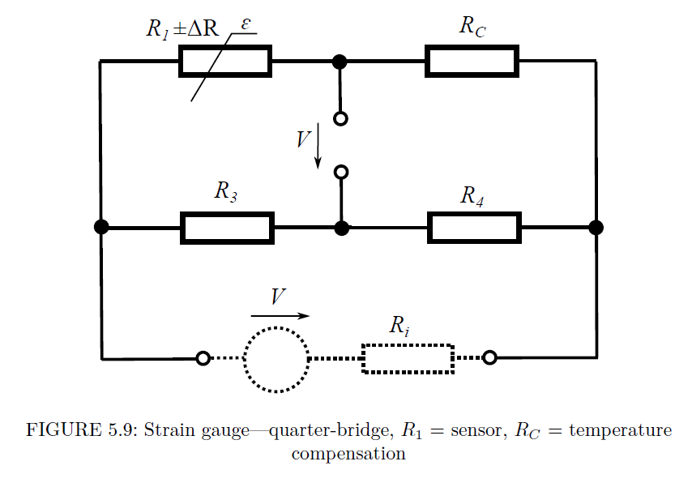

---

## Trang 15

### Khoa Điện tử- Viễn thông

- Trường Đại học Công nghệ, ĐHQGHN
- Cảm biến và đo lường cho robot
- Circuits for strain gauges
- 15

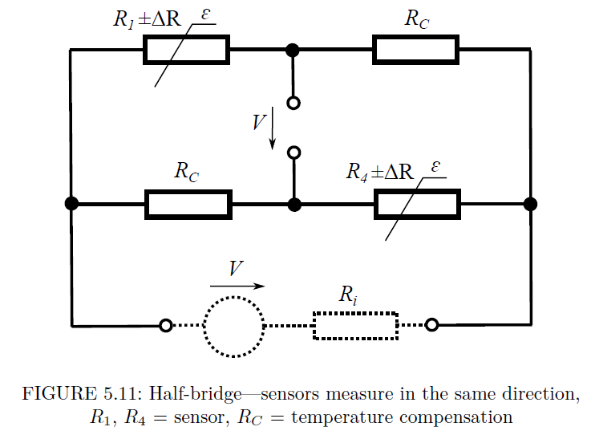

---

## Trang 16

### Khoa Điện tử- Viễn thông

- Trường Đại học Công nghệ, ĐHQGHN
- Cảm biến và đo lường cho robot
- Circuits for strain gauges
- 16

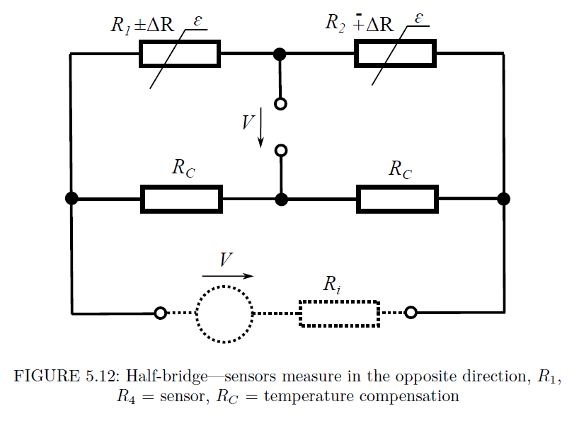

---

## Trang 17

### Khoa Điện tử- Viễn thông

- Trường Đại học Công nghệ, ĐHQGHN
- Cảm biến và đo lường cho robot
- Circuits for strain gauges
- 17
- The full bridge doubles the sensitivity as compared to a half-bridge.

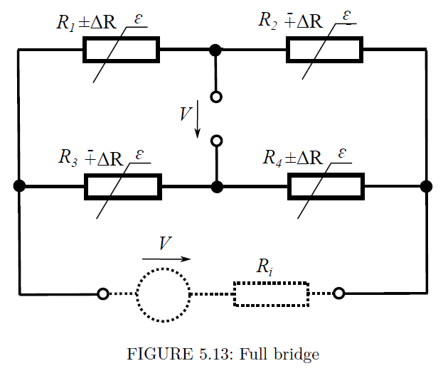

---

## Trang 18

### Khoa Điện tử- Viễn thông

- Trường Đại học Công nghệ, ĐHQGHN
- Cảm biến và đo lường cho robot
- Semiconductor strain gauges
- 18

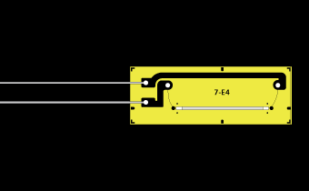

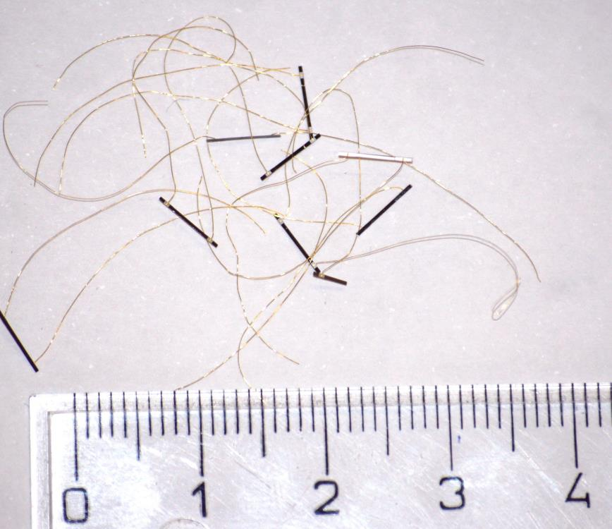

---

## Trang 19

### Khoa Điện tử- Viễn thông

- Trường Đại học Công nghệ, ĐHQGHN
- Cảm biến và đo lường cho robot
- Semiconductor strain gauges
- Have significantly larger sensitivity (x25 larger than
- that of metal strain gauges.
- GF for a p-type semiconductor strain gauge is
- approximately +110 to +130; for n-type
- semiconductor strain gauges, GF is approximately -80
- to -100
- 𝑅0,𝑡= 𝑅0.25 1 + 𝑎𝑡−25 + 𝑏𝑡−25 2
- Semiconductor strain gauges are about 75x more
- sensitive to temperature.
- 𝑅𝜖,25 = 𝑅0.25(1 + 𝐶1𝜖+ 𝐶2𝜖2)
- 19

---

## Trang 20

### Khoa Điện tử- Viễn thông

- Trường Đại học Công nghệ, ĐHQGHN
- Cảm biến và đo lường cho robot
- Load Cells
- 20

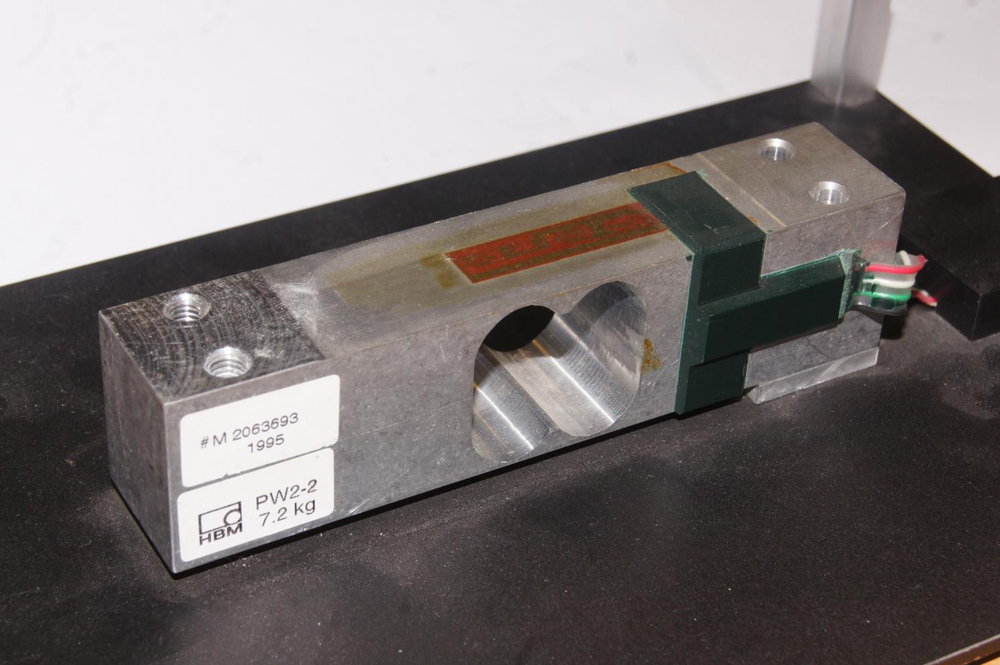

---

## Trang 21

### Khoa Điện tử- Viễn thông

- Trường Đại học Công nghệ, ĐHQGHN
- Cảm biến và đo lường cho robot
- Load Cells
- 21

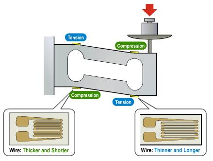

---

## Trang 22

### Khoa Điện tử- Viễn thông

- Trường Đại học Công nghệ, ĐHQGHN
- Cảm biến và đo lường cho robot
- Load Cells
- 22

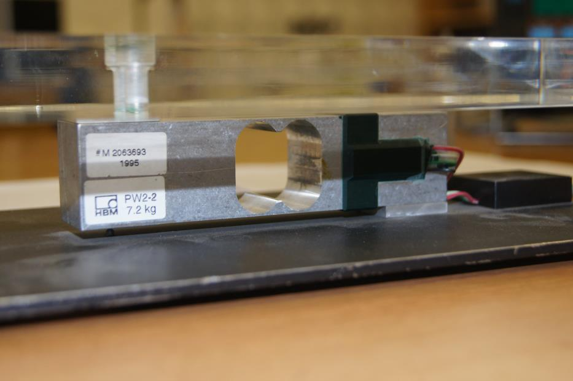

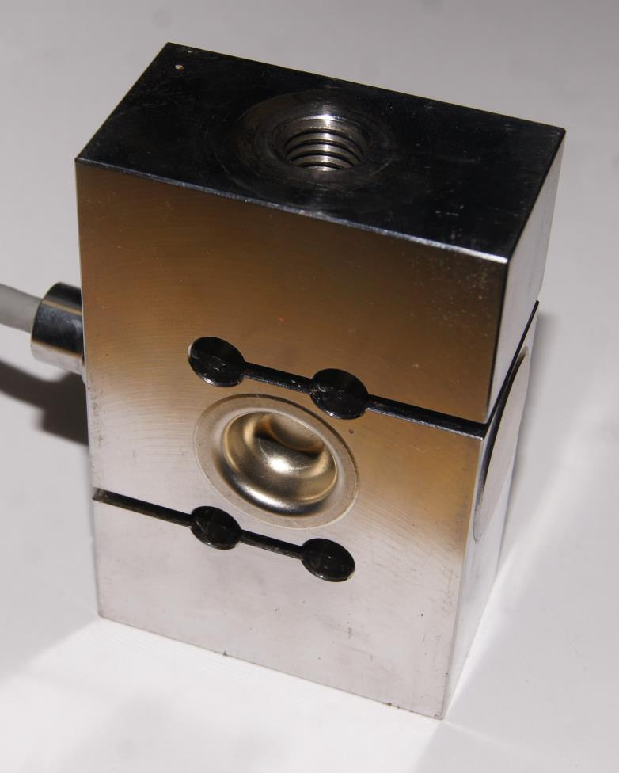

---

## Trang 23

### Khoa Điện tử- Viễn thông

- Trường Đại học Công nghệ, ĐHQGHN
- Cảm biến và đo lường cho robot
- Load Cells
- 23

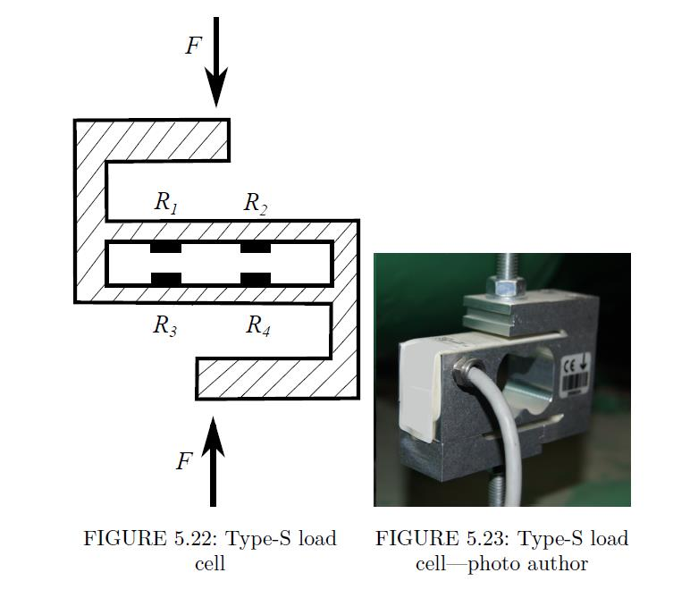

---

## Trang 24

### Khoa Điện tử- Viễn thông

- Trường Đại học Công nghệ, ĐHQGHN
- Cảm biến và đo lường cho robot
- Piezoelectricty
- 24

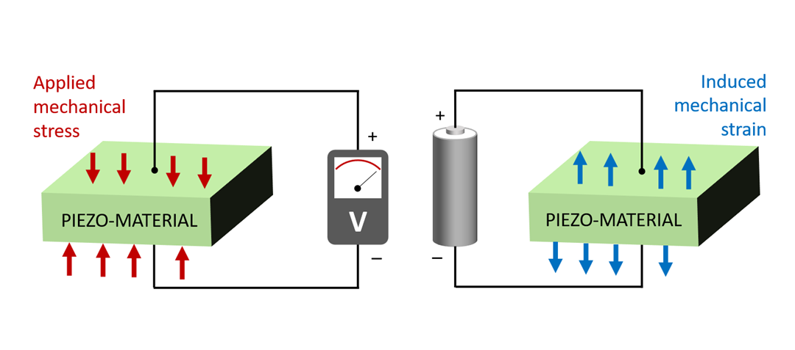

---

## Trang 25

### Khoa Điện tử- Viễn thông

- Trường Đại học Công nghệ, ĐHQGHN
- Cảm biến và đo lường cho robot
- Piezoelectricty
- 25
- Quartz
- Barium titanate
- Lead zirconium titanate (PZT)
- Rochelle salt
- Cane sugar

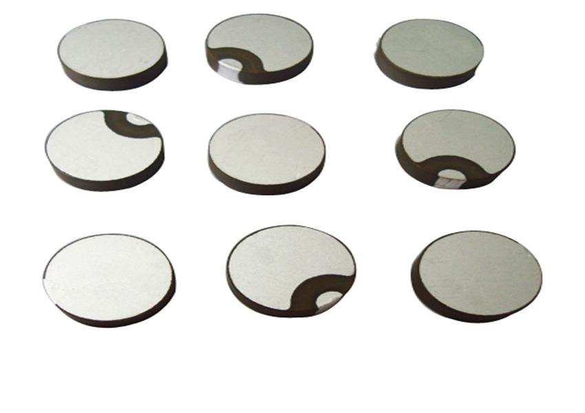

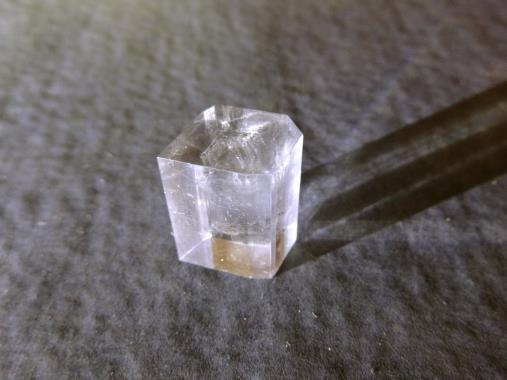

---

## Trang 26

### Khoa Điện tử- Viễn thông

- Trường Đại học Công nghệ, ĐHQGHN
- Cảm biến và đo lường cho robot
- Piezoelectricty
- 26

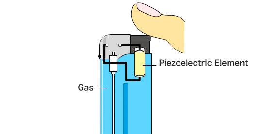

---

## Trang 27

### Khoa Điện tử- Viễn thông

- Trường Đại học Công nghệ, ĐHQGHN
- Cảm biến và đo lường cho robot
- Piezoelectricty
- 27

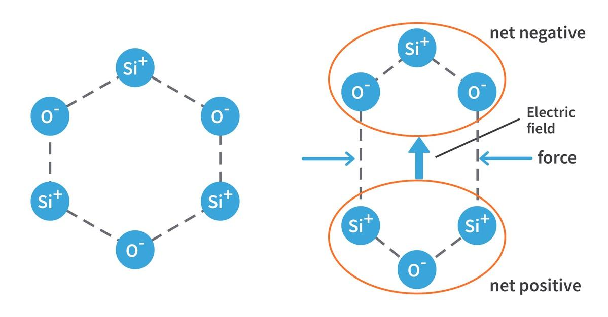

---

## Trang 28

### Khoa Điện tử- Viễn thông

- Trường Đại học Công nghệ, ĐHQGHN
- Cảm biến và đo lường cho robot
- Piezoelectricty
- 28

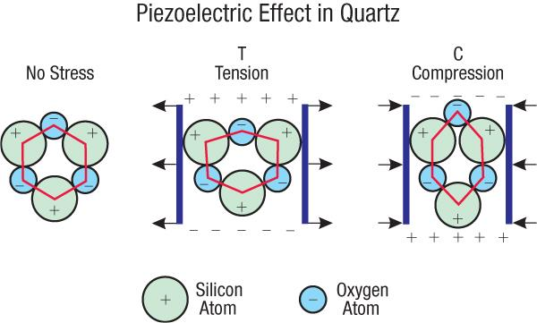

---

## Trang 29

### Khoa Điện tử- Viễn thông

- Trường Đại học Công nghệ, ĐHQGHN
- Cảm biến và đo lường cho robot
- Piezoelectricty
- 29

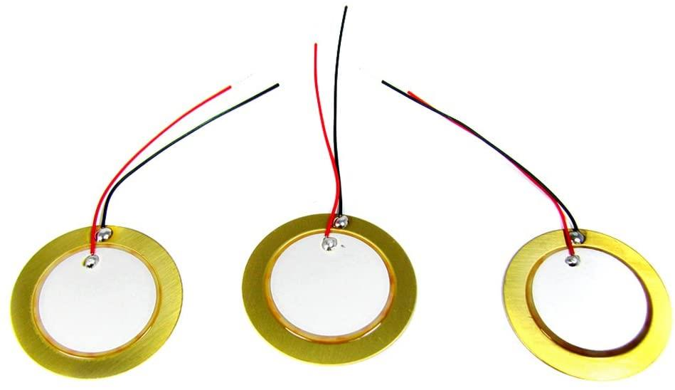

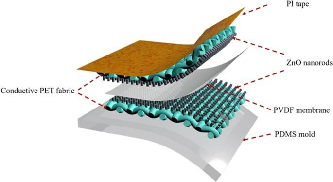

---

## Trang 30

### Khoa Điện tử- Viễn thông

- Trường Đại học Công nghệ, ĐHQGHN
- Cảm biến và đo lường cho robot
- Piezoelectricty
- 30

---

## Trang 31

### Khoa Điện tử- Viễn thông

- Trường Đại học Công nghệ, ĐHQGHN
- Cảm biến và đo lường cho robot
- Piezoelectricty
- 31

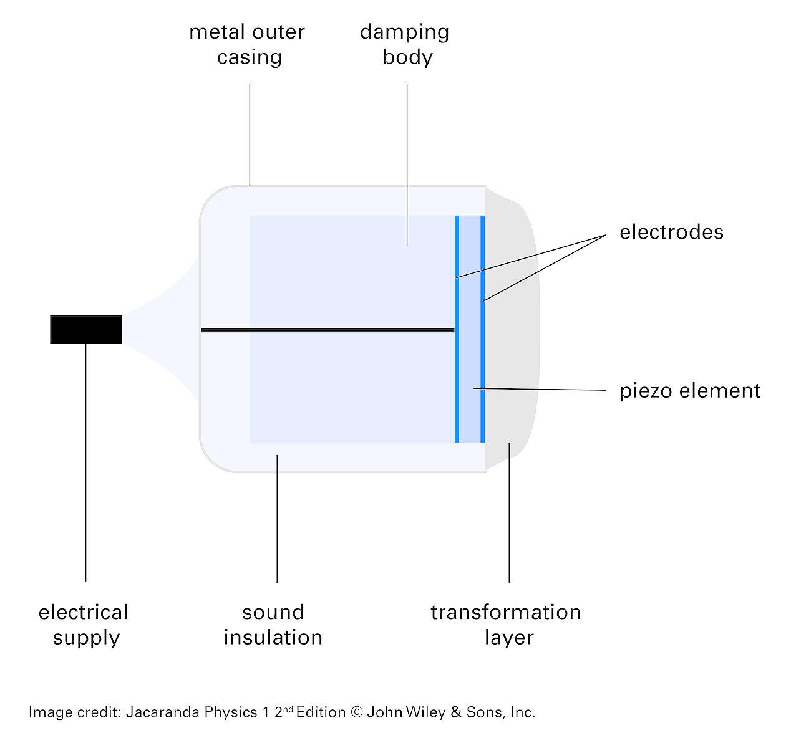

---

## Trang 32

### Khoa Điện tử- Viễn thông

- Trường Đại học Công nghệ, ĐHQGHN
- Cảm biến và đo lường cho robot
- Piezoelectricty
- 32

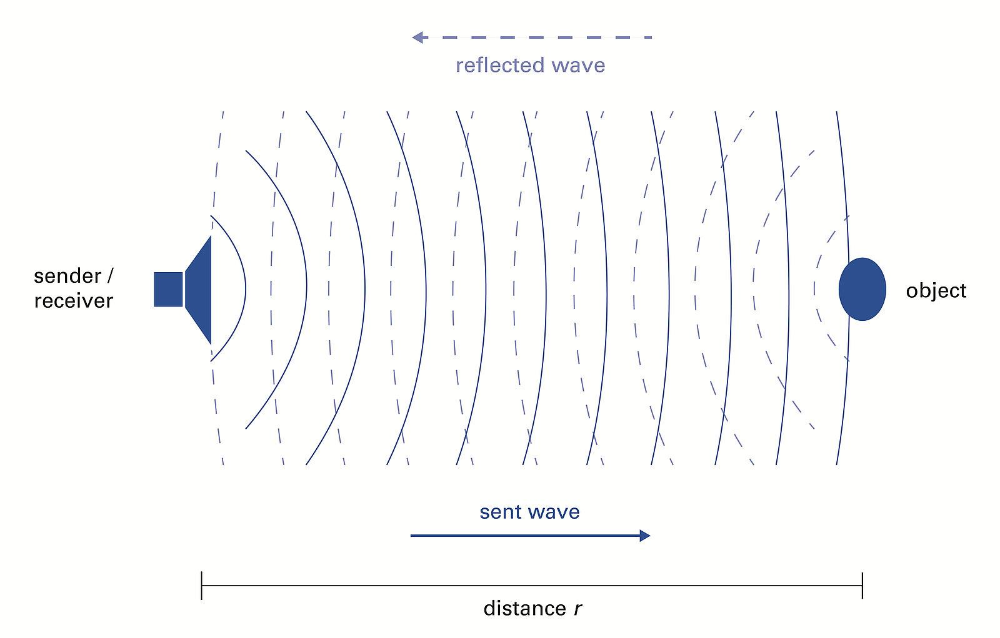

---

## Trang 33

### Khoa Điện tử- Viễn thông

- Trường Đại học Công nghệ, ĐHQGHN
- Cảm biến và đo lường cho robot
- Piezoelectricty
- 33

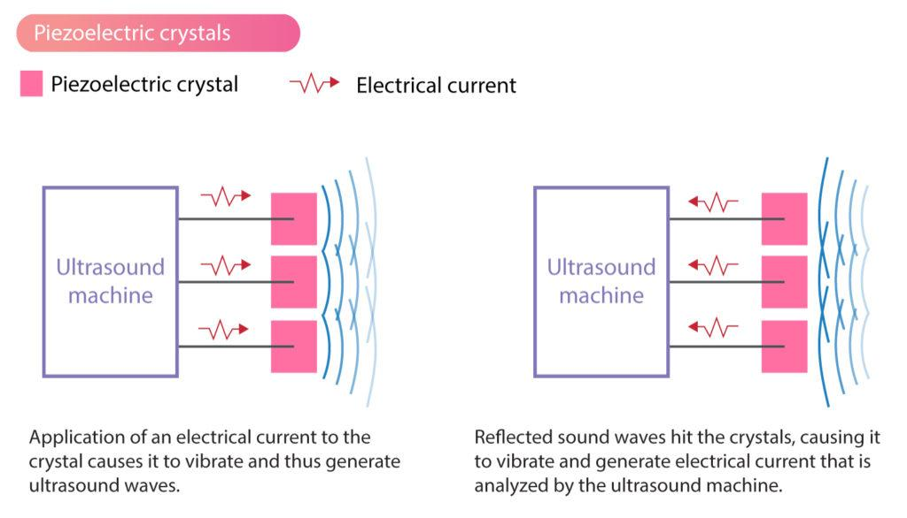

---

## Trang 34

### Khoa Điện tử- Viễn thông

- Trường Đại học Công nghệ, ĐHQGHN
- Cảm biến và đo lường cho robot
- Piezoelectricty
- 34

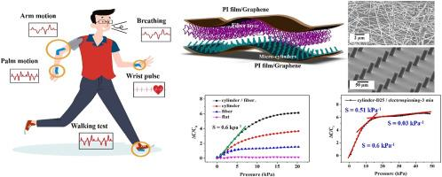

---

## Trang 35

### Khoa Điện tử- Viễn thông

- Trường Đại học Công nghệ, ĐHQGHN
- Cảm biến và đo lường cho robot
- Piezoelectricty
- 35

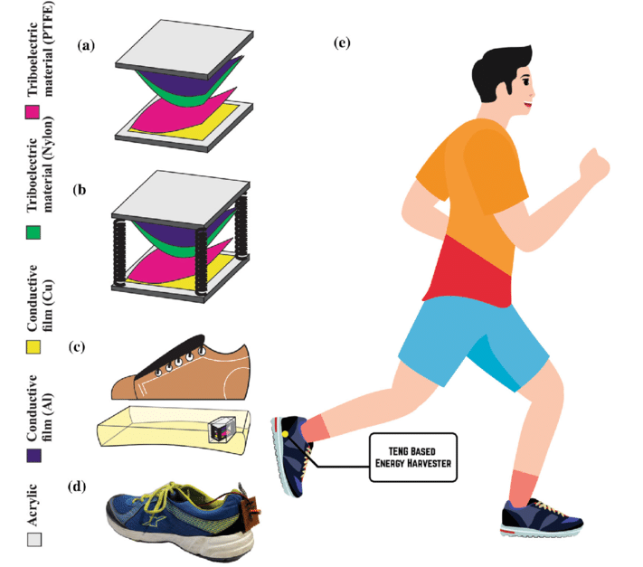

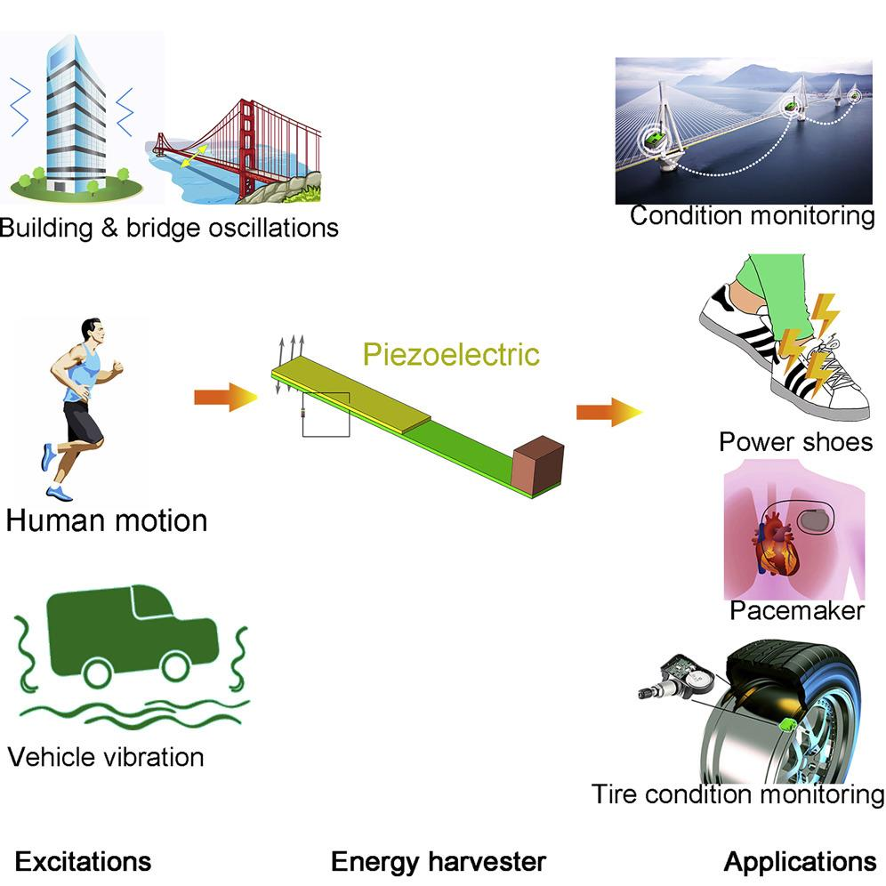

---
