# EP8 Position & Velocity

> Tài liệu chuyển đổi từ PDF: `EP8 Position & Velocity.pdf`

---

## Trang 1

### Khoa Điện tử- Viễn thông

- Trường Đại học Công nghệ, ĐHQGHN
- Kỹthuật Điện tử
- Electronics Engineering
- Position
- 1

---

## Trang 2

### Khoa Điện tử- Viễn thông

- Trường Đại học Công nghệ, ĐHQGHN
- Kỹthuật Điện tử
- Electronics Engineering
- Categories
- Absolute: Send out the correct position right after
- they are powered. No movement to a reference
- position is required.
- Relative: Count pulses from a reference position. A
- movement to a reference (zero) position is required.
- 2

---

## Trang 3

### Khoa Điện tử- Viễn thông

- Trường Đại học Công nghệ, ĐHQGHN
- Kỹthuật Điện tử
- Electronics Engineering
- Categories
- Continuous - they measure continuously the
- distance between the sensor and the object. The
- output signal is proportional to the measured
- distance.
- Proximity - proximity sensors detect only the
- presence of the object or not its distance. The output
- is a digital signal, 0/1, object is present or not.
- 3

---

## Trang 4

### Khoa Điện tử- Viễn thông

- Trường Đại học Công nghệ, ĐHQGHN
- Kỹthuật Điện tử
- Electronics Engineering
- Categories
- Linear - the sensor measures in principle linear
- displacement
- Angular - the sensor measures in principle angular
- displacement
- 4

---

## Trang 5

### Khoa Điện tử- Viễn thông

- Trường Đại học Công nghệ, ĐHQGHN
- Kỹthuật Điện tử
- Electronics Engineering
- Resistive sensor
- 5

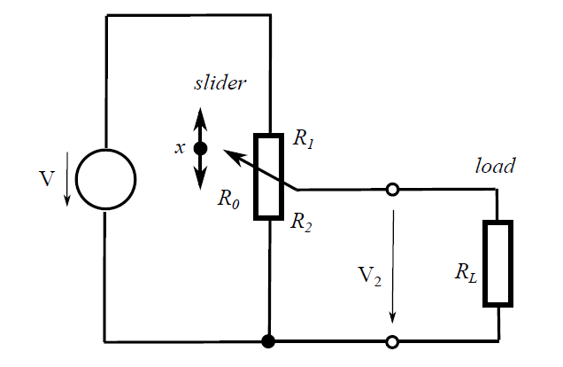

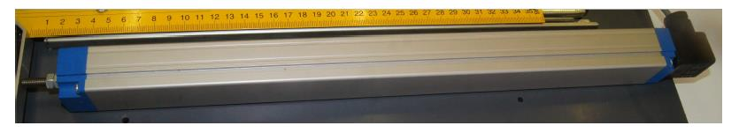

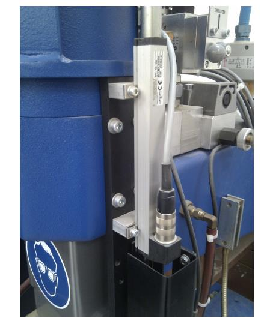

---

## Trang 6

### Khoa Điện tử- Viễn thông

- Trường Đại học Công nghệ, ĐHQGHN
- Kỹthuật Điện tử
- Electronics Engineering
- Resistive sensor
- 6

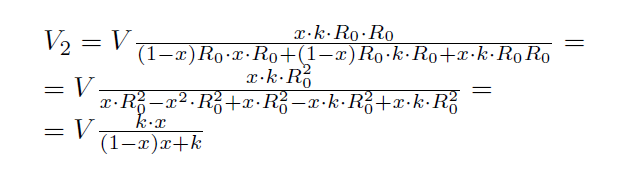

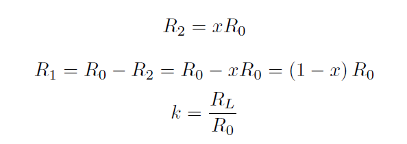

---

## Trang 7

### Khoa Điện tử- Viễn thông

- Trường Đại học Công nghệ, ĐHQGHN
- Kỹthuật Điện tử
- Electronics Engineering
- Resistive sensor
- Relative error of resistive position sensor
- 7
- The position of maximal relative error

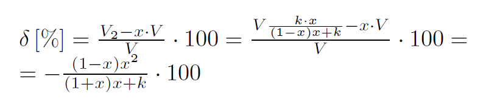

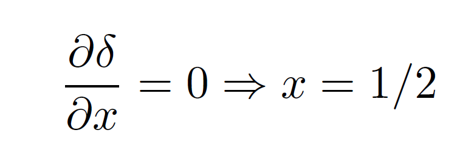

---

## Trang 8

### Khoa Điện tử- Viễn thông

- Trường Đại học Công nghệ, ĐHQGHN
- Kỹthuật Điện tử
- Electronics Engineering
- Resistive sensor
- Absolute error
- 8
- The position of maximal absolute error is dependent on the value of k. For
- example for k = 1 the position of maximal absolute error is

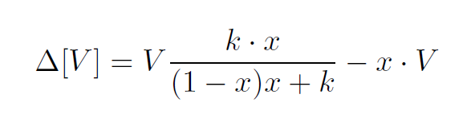

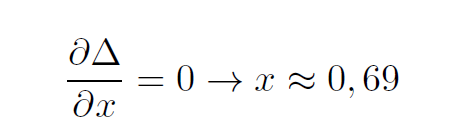

---

## Trang 9

### Khoa Điện tử- Viễn thông

- Trường Đại học Công nghệ, ĐHQGHN
- Kỹthuật Điện tử
- Electronics Engineering
- Inductive sensors
- Measure small distances, up to approximately 1 mm.
- The coil inductivity
- 𝐿= 𝑁2
- 𝑅𝑚
- 𝑅𝑚: magnetic resistance (reluctance); N: number of turns
- 9

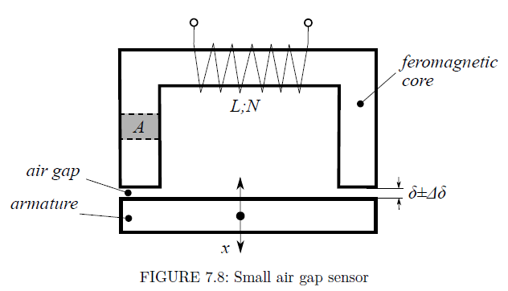

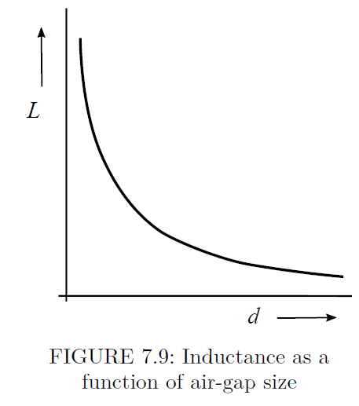

---

## Trang 10

### Khoa Điện tử- Viễn thông

- Trường Đại học Công nghệ, ĐHQGHN
- Kỹthuật Điện tử
- Electronics Engineering
- Inductive sensors
- 
- Reluctance of uniform magnetic circuit: 𝑅=
- 𝑙
- 𝜇𝐴
- 
- Reluctance = air-gap reluctance 𝑅𝑎𝑔+ iron reluctance 𝑅𝐹𝑒
- 𝑅𝑚= 𝑅𝐹𝑒+ 𝑅𝑎𝑔=
- 𝑙𝐹𝑒
- 𝜇𝐴
- +
- 2𝛿
- 𝜇𝐴
- 𝑙𝐹𝑒: length of iron magnetic circuit
- 𝜇: the permeability of the material
- 10

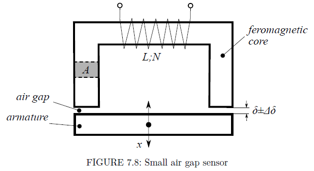

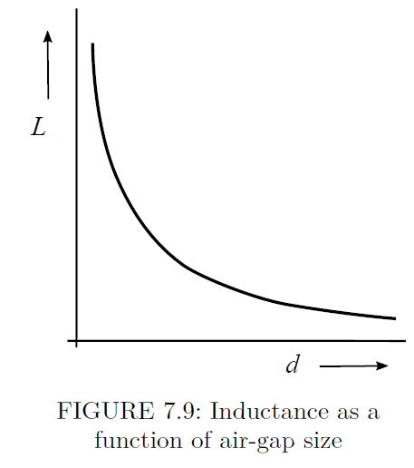

---

## Trang 11

### Khoa Điện tử- Viễn thông

- Trường Đại học Công nghệ, ĐHQGHN
- Kỹthuật Điện tử
- Electronics Engineering
- Inductive sensors
- 
- Assuming Rag ≫RFe
- 𝐿= 𝜇𝐴𝑁2
- 2𝜎
- 
- The impedance change causes the change of inductor current.
- መI =
- ෡V
- ෠Z =
- ෡V
- 𝑅+ 𝑗𝜔𝐿
- Assuming
- 𝜔𝐿
- 𝑅≫1
- 𝐼= 𝑉
- 𝜔L =
- 2𝑉
- 𝑁2𝜇0𝐴× 𝛿
- 11

---

## Trang 12

### Khoa Điện tử- Viễn thông

- Trường Đại học Công nghệ, ĐHQGHN
- Kỹthuật Điện tử
- Electronics Engineering
- Inductive sensors
- 
- Region 1: 𝑅𝑎𝑔≫𝑅𝐹𝑒is not
- valid. The dependence is
- non-linear
- 
- Region 2: The dependence
- is approximately linear.
- 
- Region 3: 𝜔𝐿/𝑅≫1 is not
- valid. Increase in the air gap
- does not change the current.
- 12

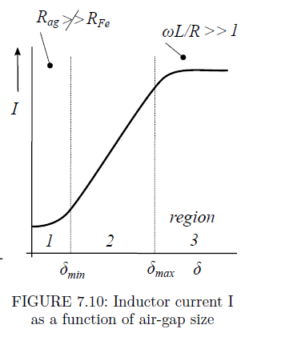

---

## Trang 13

### Khoa Điện tử- Viễn thông

- Trường Đại học Công nghệ, ĐHQGHN
- Kỹthuật Điện tử
- Electronics Engineering
- Inductive sensors
- 13

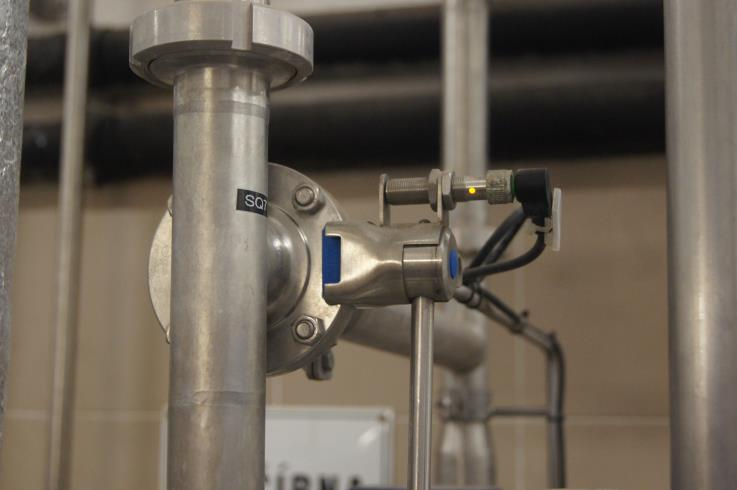

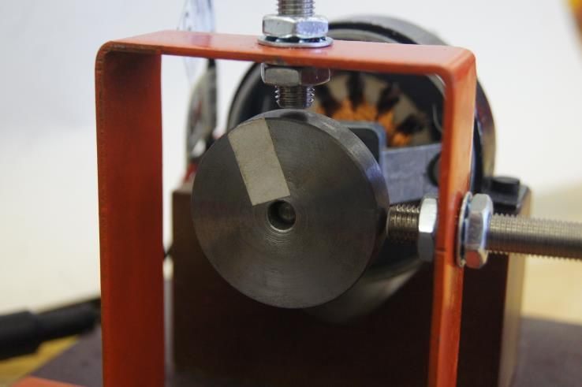

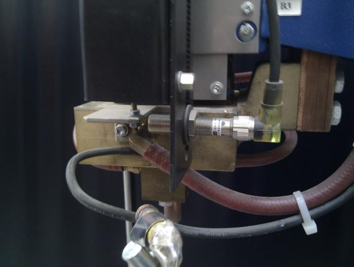

---

## Trang 14

### Khoa Điện tử- Viễn thông

- Trường Đại học Công nghệ, ĐHQGHN
- Kỹthuật Điện tử
- Electronics Engineering
- Linear variable differential transformer (LVDT)
- 14

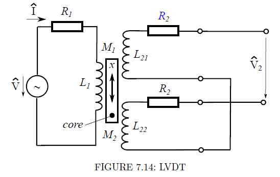

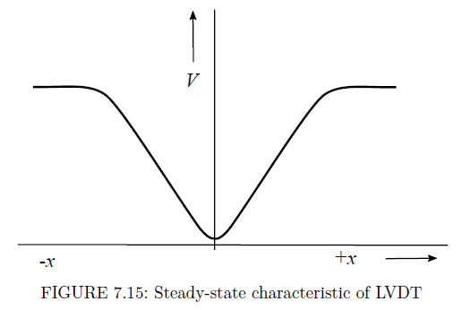

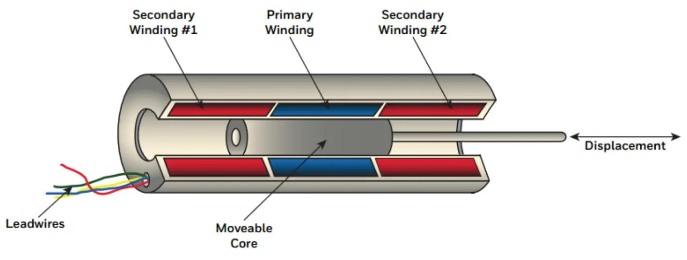

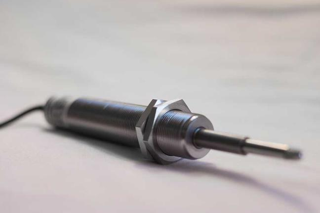

---

## Trang 15

### Khoa Điện tử- Viễn thông

- Trường Đại học Công nghệ, ĐHQGHN
- Kỹthuật Điện tử
- Electronics Engineering
- Resolver
- ෠𝑉= 𝑉𝑚𝑎𝑥sin 𝜔𝑡
- Induced voltage in stator winding
- ෢
- 𝑉21 = 𝑉𝑚𝑎𝑥sin 𝜔𝑡sin 𝛼
- ෢
- 𝑉22 = 𝑉𝑚𝑎𝑥sin 𝜔𝑡cos 𝛼
- 15

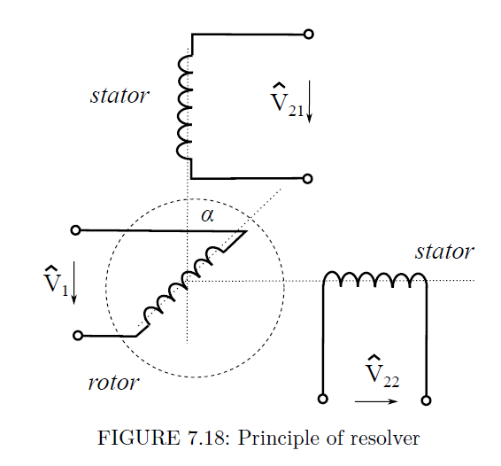

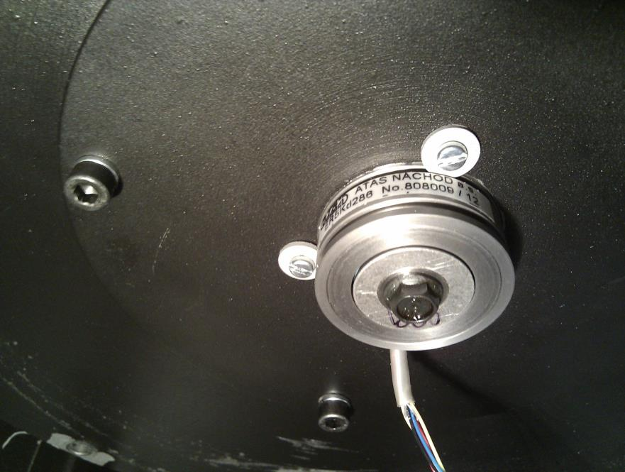

---

## Trang 16

### Khoa Điện tử- Viễn thông

- Trường Đại học Công nghệ, ĐHQGHN
- Kỹthuật Điện tử
- Electronics Engineering
- Resolver
- 16

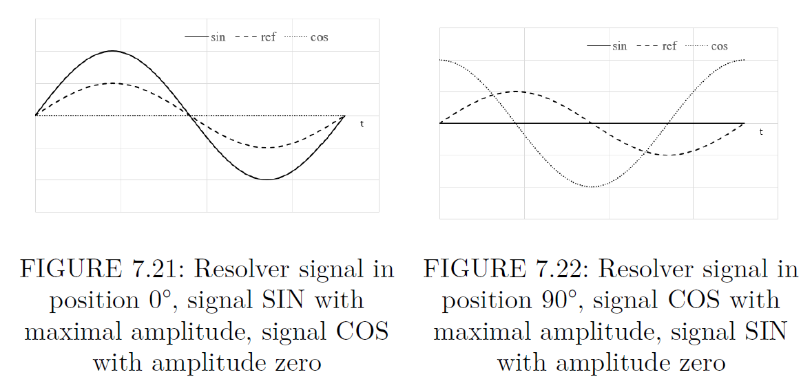

---

## Trang 17

### Khoa Điện tử- Viễn thông

- Trường Đại học Công nghệ, ĐHQGHN
- Kỹthuật Điện tử
- Electronics Engineering
- Capacitive sensors
- For a planar capacitor
- 𝐶= 𝜀0𝜀𝑟
- 𝐴
- 𝑑
- 17

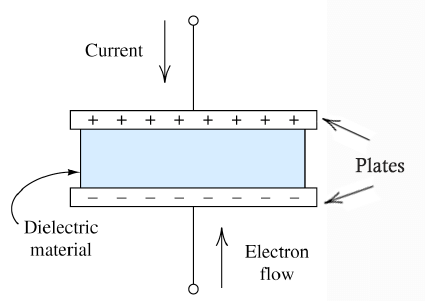

---

## Trang 18

### Khoa Điện tử- Viễn thông

- Trường Đại học Công nghệ, ĐHQGHN
- Kỹthuật Điện tử
- Electronics Engineering
- Capacitive sensors
- Sensors based on change of distance between
- electrodes
- 18

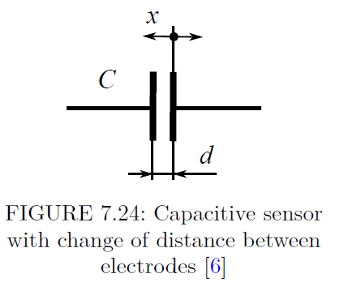

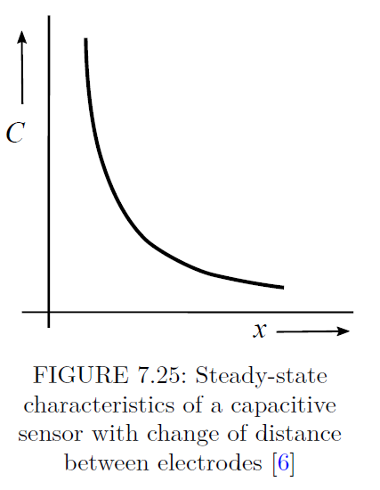

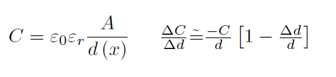

---

## Trang 19

### Khoa Điện tử- Viễn thông

- Trường Đại học Công nghệ, ĐHQGHN
- Kỹthuật Điện tử
- Electronics Engineering
- Capacitive sensors
- Differential capacitor
- 19
- 𝐶1 = 𝜀0𝜀𝑟
- 𝐴
- 𝑑1 𝑥; 𝐶2 = 𝜀0𝜀𝑟
- 𝐴
- 𝑑2 𝑥
- Sensitivity
- Δ𝐶
- Δ𝑑= −𝐶
- 𝑑1 −2 Δ𝑑
- 𝑑
- 2

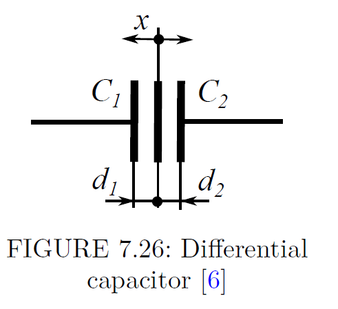

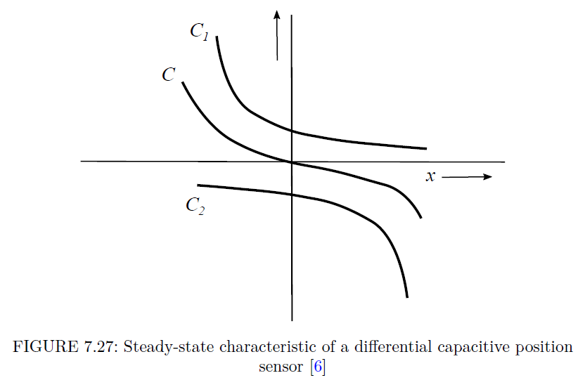

---

## Trang 20

### Khoa Điện tử- Viễn thông

- Trường Đại học Công nghệ, ĐHQGHN
- Kỹthuật Điện tử
- Electronics Engineering
- Capacitive sensors
- Differential capacitor
- 20

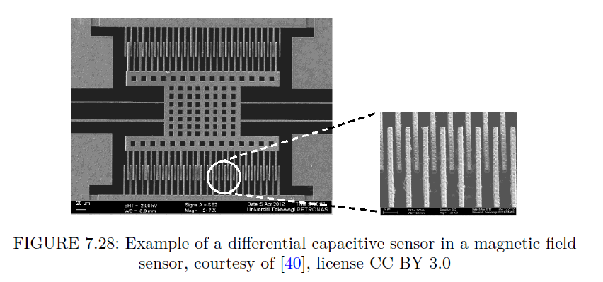

---

## Trang 21

### Khoa Điện tử- Viễn thông

- Trường Đại học Công nghệ, ĐHQGHN
- Kỹthuật Điện tử
- Electronics Engineering
- Capacitive sensors
- Change of electrode area
- 21

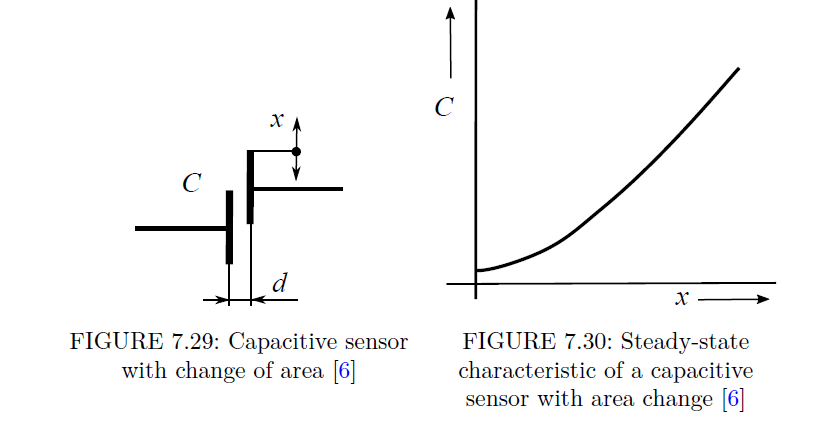

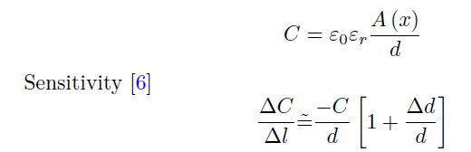

---

## Trang 22

### Khoa Điện tử- Viễn thông

- Trường Đại học Công nghệ, ĐHQGHN
- Kỹthuật Điện tử
- Electronics Engineering
- Capacitive sensors
- Change of permittivity
- 22

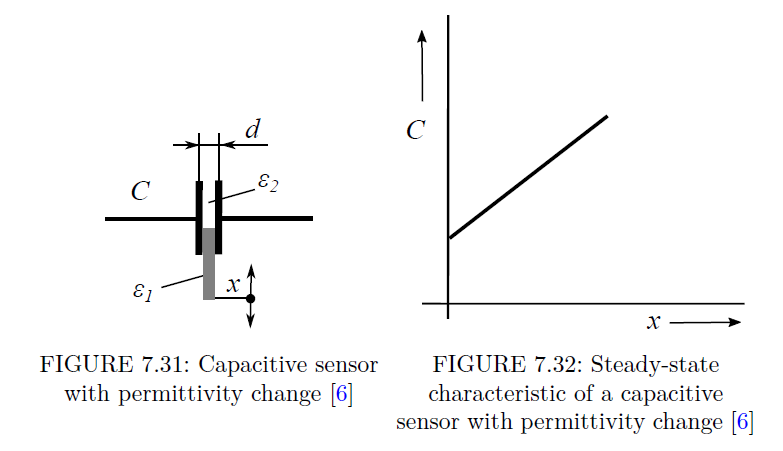

---

## Trang 23

### Khoa Điện tử- Viễn thông

- Trường Đại học Công nghệ, ĐHQGHN
- Kỹthuật Điện tử
- Electronics Engineering
- Capacitive sensors
- Resistive Touchscreen
- 23

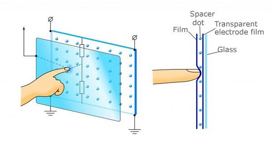

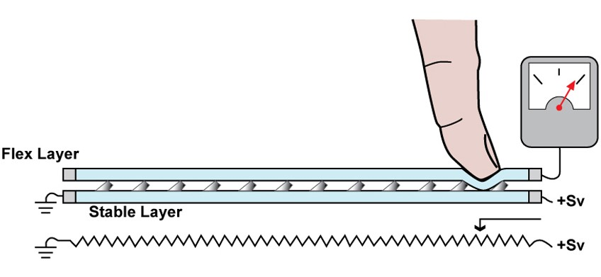

---

## Trang 24

### Khoa Điện tử- Viễn thông

- Trường Đại học Công nghệ, ĐHQGHN
- Kỹthuật Điện tử
- Electronics Engineering
- Capacitive sensors
- Capacitive Touchscreen
- 24

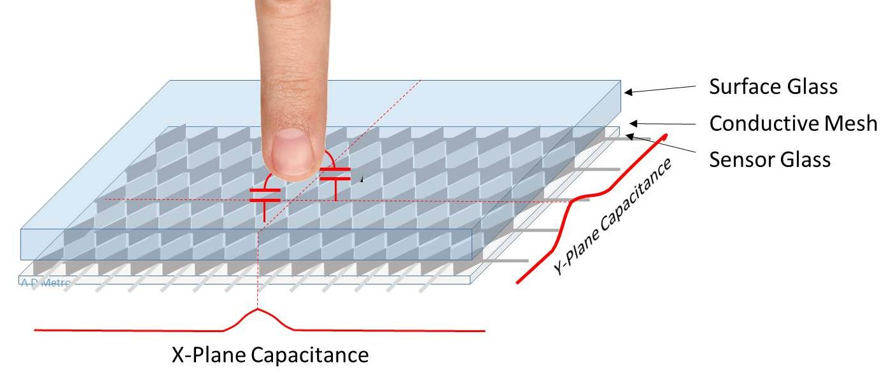

---

## Trang 25

### Khoa Điện tử- Viễn thông

- Trường Đại học Công nghệ, ĐHQGHN
- Kỹthuật Điện tử
- Electronics Engineering
- Capacitive sensors
- Optic Fingerprint Reader
- 25

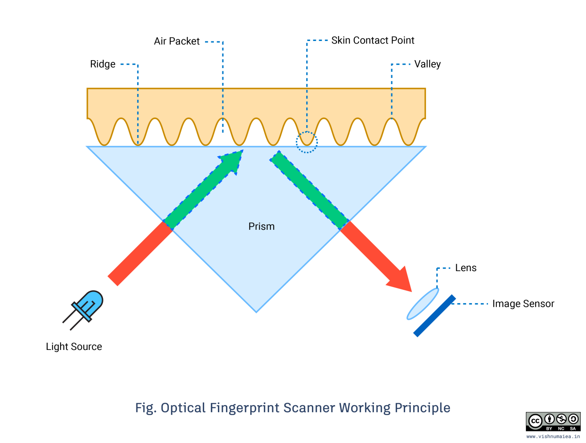

---

## Trang 26

### Khoa Điện tử- Viễn thông

- Trường Đại học Công nghệ, ĐHQGHN
- Kỹthuật Điện tử
- Electronics Engineering
- Capacitive sensors
- Capacitive fingerprint sensor
- 26

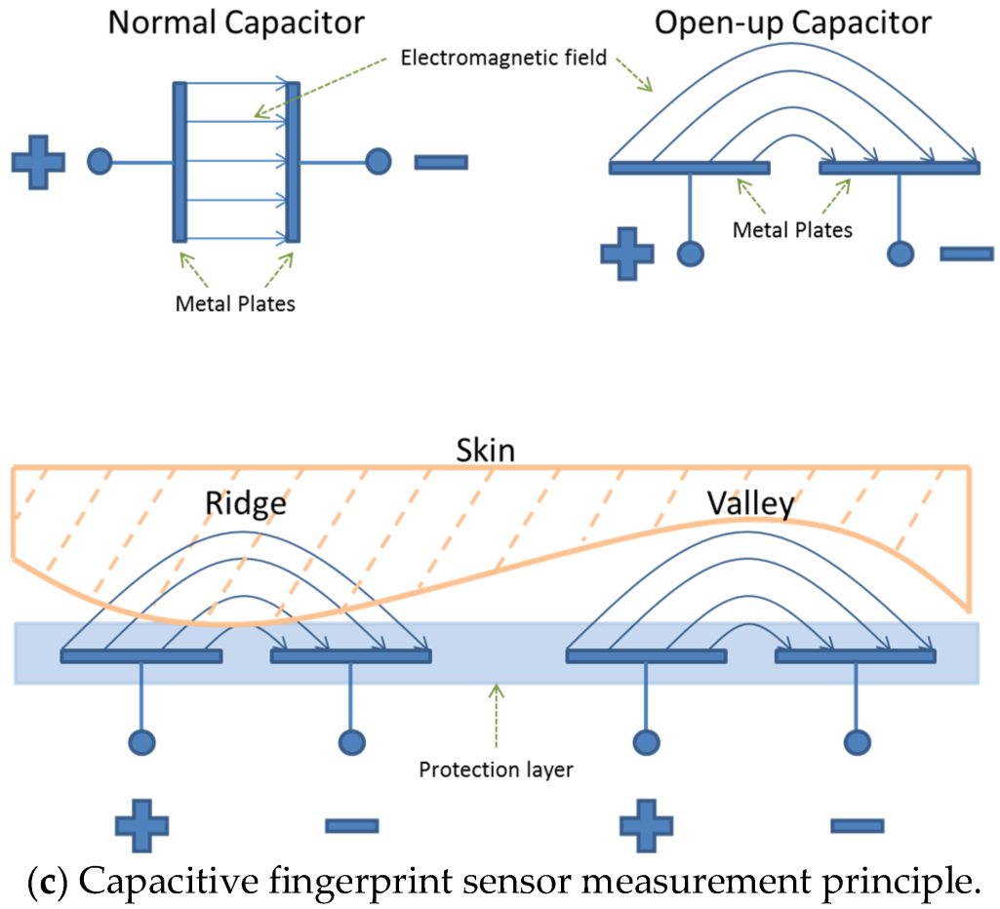

---

## Trang 27

### Khoa Điện tử- Viễn thông

- Trường Đại học Công nghệ, ĐHQGHN
- Kỹthuật Điện tử
- Electronics Engineering
- Magnetic (Hall) sensors
- Lorrentz force
- 𝑭= 𝑞𝑬+ 𝑞𝒗× 𝑩
- 27

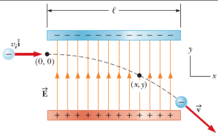

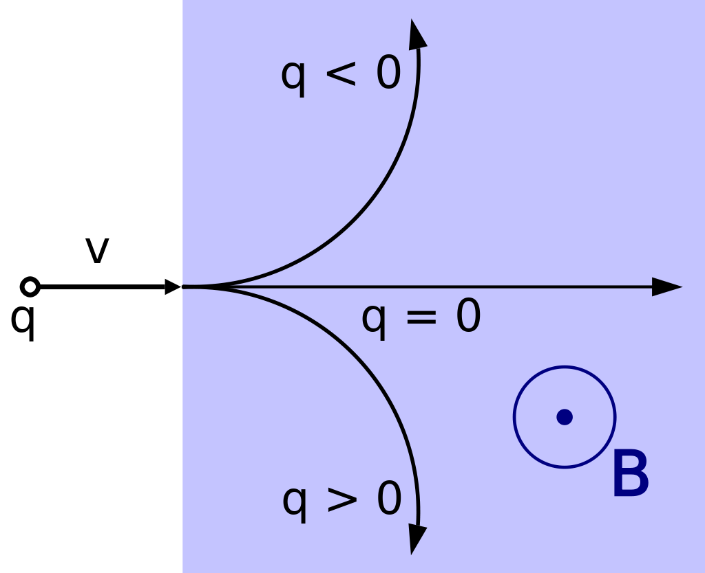

---

## Trang 28

### Khoa Điện tử- Viễn thông

- Trường Đại học Công nghệ, ĐHQGHN
- Kỹthuật Điện tử
- Electronics Engineering
- Magnetic (Hall) sensors
- 28

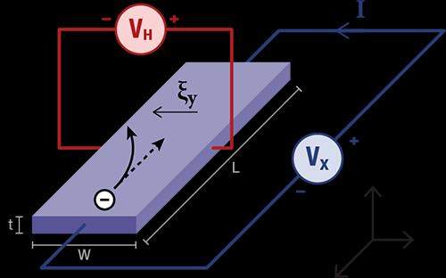

---

## Trang 29

### Khoa Điện tử- Viễn thông

- Trường Đại học Công nghệ, ĐHQGHN
- Kỹthuật Điện tử
- Electronics Engineering
- Magnetic (Hall) sensors
- 29

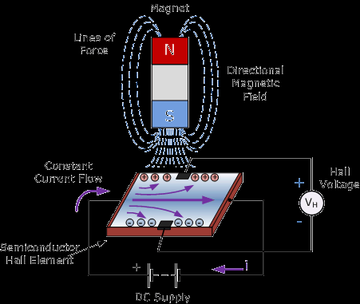

---

## Trang 30

### Khoa Điện tử- Viễn thông

- Trường Đại học Công nghệ, ĐHQGHN
- Kỹthuật Điện tử
- Electronics Engineering
- Magnetic (Hall) sensors
- 30

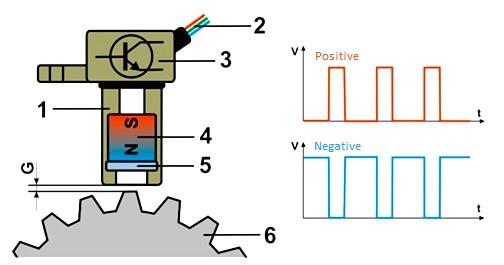

---

## Trang 31

### Khoa Điện tử- Viễn thông

- Trường Đại học Công nghệ, ĐHQGHN
- Kỹthuật Điện tử
- Electronics Engineering
- Magnetic (Hall) sensors
- 31

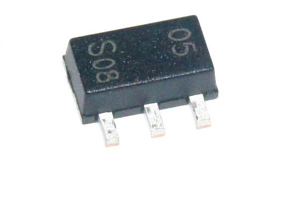

---

## Trang 32

### Khoa Điện tử- Viễn thông

- Trường Đại học Công nghệ, ĐHQGHN
- Kỹthuật Điện tử
- Electronics Engineering
- Clampmeter
- 32

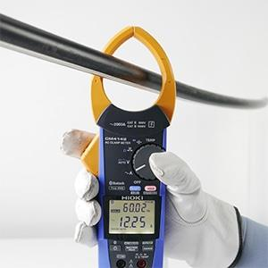

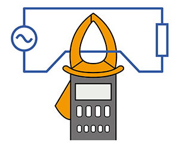

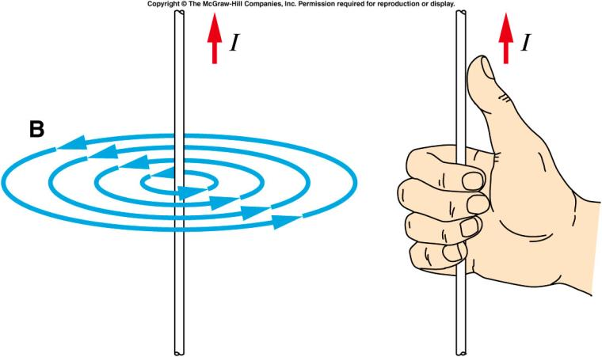

---

## Trang 33

### Khoa Điện tử- Viễn thông

- Trường Đại học Công nghệ, ĐHQGHN
- Kỹthuật Điện tử
- Electronics Engineering
- Optical sensors
- Time of flight (TOF) sensors
- 33

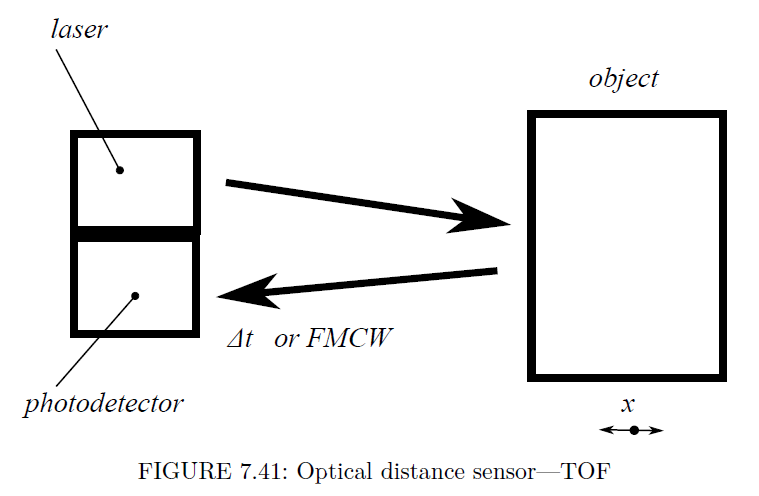

---

## Trang 34

### Khoa Điện tử- Viễn thông

- Trường Đại học Công nghệ, ĐHQGHN
- Kỹthuật Điện tử
- Electronics Engineering
- Optical sensors
- Frequency modulated continuous wave (FMCW)
- 34

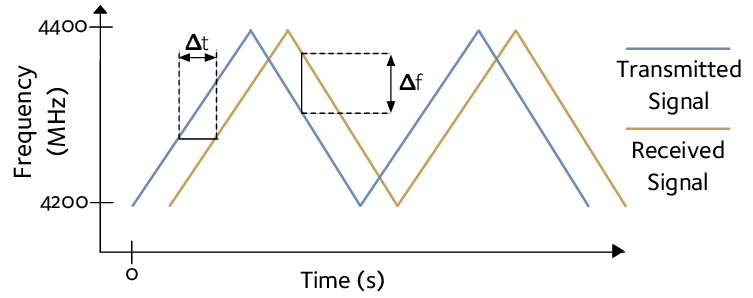

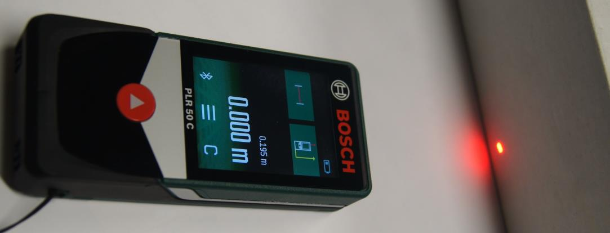

---

## Trang 35

### Khoa Điện tử- Viễn thông

- Trường Đại học Công nghệ, ĐHQGHN
- Kỹthuật Điện tử
- Electronics Engineering
- Optical sensors
- 35

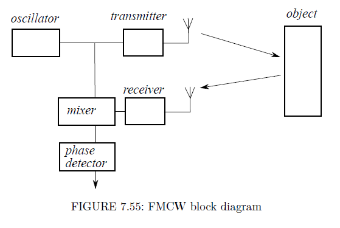

---

## Trang 36

### Khoa Điện tử- Viễn thông

- Trường Đại học Công nghệ, ĐHQGHN
- Kỹthuật Điện tử
- Electronics Engineering
- Incremental rotary encoders (IRC)
- 36

---

## Trang 37

### Khoa Điện tử- Viễn thông

- Trường Đại học Công nghệ, ĐHQGHN
- Kỹthuật Điện tử
- Electronics Engineering
- Absolute rotary encoders
- 37

---

## Trang 38

### Khoa Điện tử- Viễn thông

- Trường Đại học Công nghệ, ĐHQGHN
- Kỹthuật Điện tử
- Electronics Engineering
- Inductive proximity sensors
- 38
- Only work with conductive objects

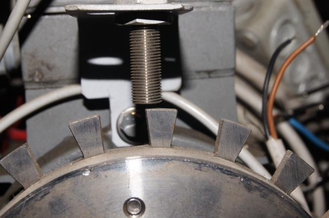

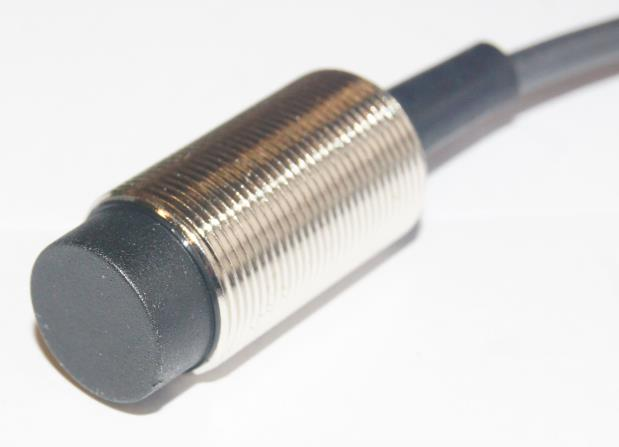

---

## Trang 39

### Khoa Điện tử- Viễn thông

- Trường Đại học Công nghệ, ĐHQGHN
- Kỹthuật Điện tử
- Electronics Engineering
- Capacitive proximity sensors
- 39

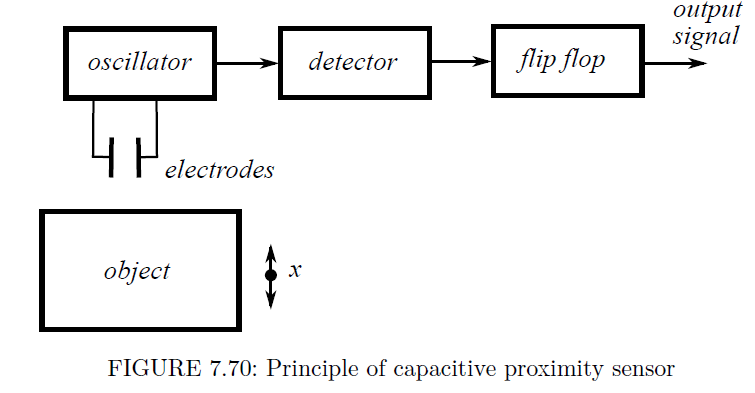

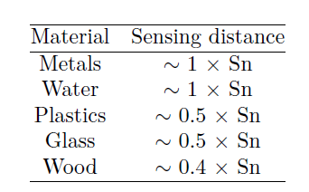

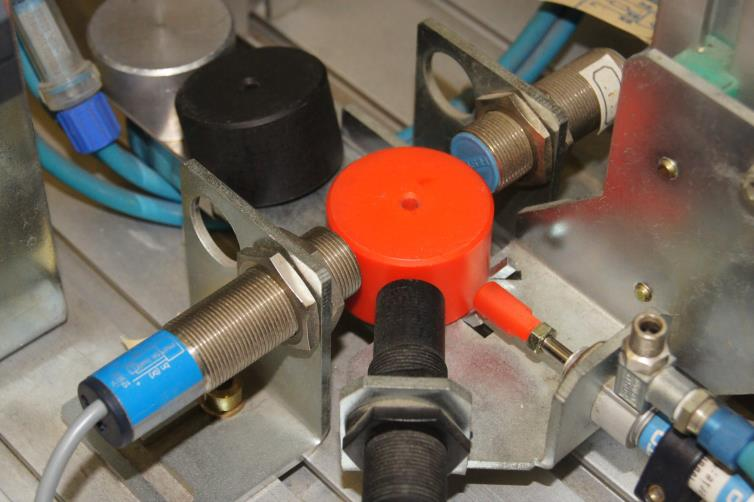

---

## Trang 40

### Khoa Điện tử- Viễn thông

- Trường Đại học Công nghệ, ĐHQGHN
- Kỹthuật Điện tử
- Electronics Engineering
- Optic proximity sensors
- 40

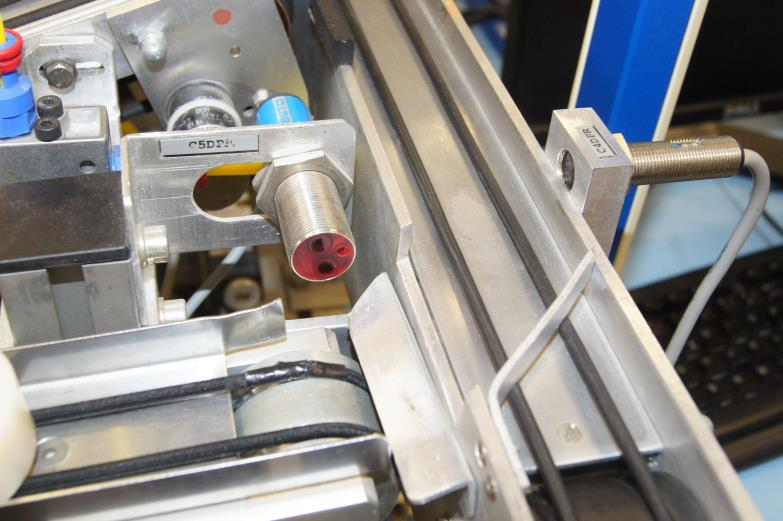

---
