# EP9 Acceleration gryroscope update

> Tài liệu chuyển đổi từ PDF: `EP9 Acceleration gryroscope update.pdf`

---

## Trang 1

### Khoa Điện tử- Viễn thông

- Trường Đại học Công nghệ, ĐHQGHN
- Kỹthuật Điện tử
- Electronics Engineering
- Acceleration
- 1

---

## Trang 2

### Khoa Điện tử - Viễn thông

- Trường Đại học Công nghệ, ĐHQGHN
- Kỹ thuật Điện tử
- Electronics Engineering
- Accelerometer
- 2

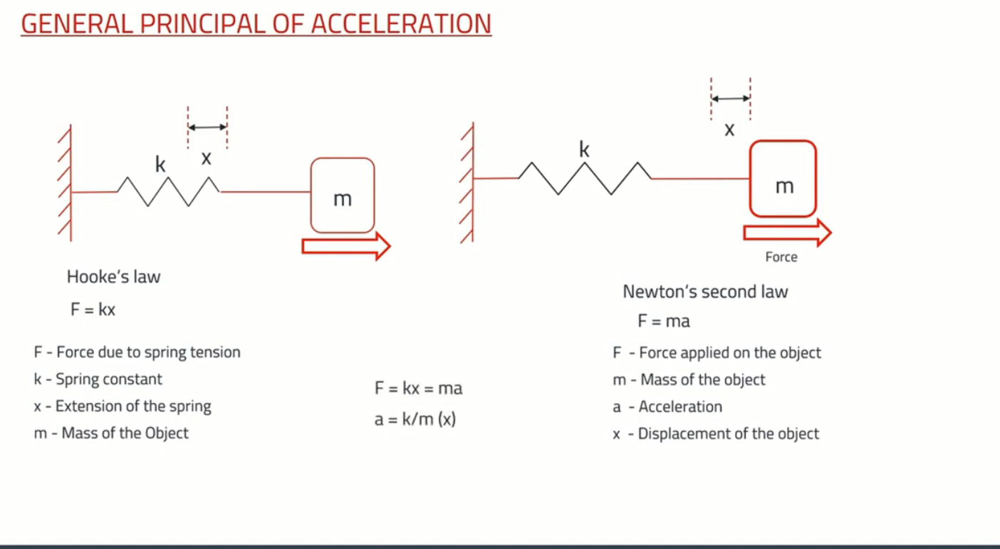

---

## Trang 3

### Khoa Điện tử - Viễn thông

- Trường Đại học Công nghệ, ĐHQGHN
- Kỹ thuật Điện tử
- Electronics Engineering
- Accelerometer
- 3

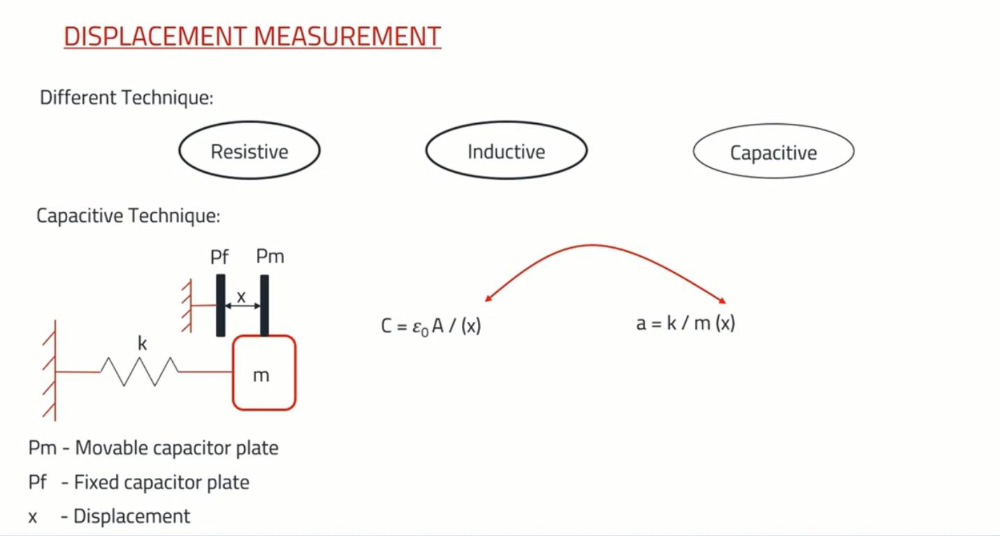

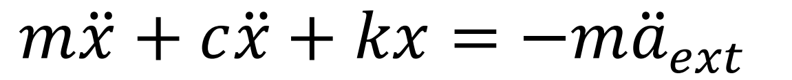

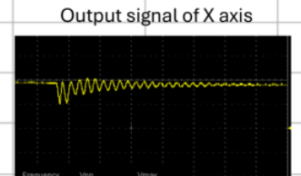

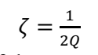

---

## Trang 4

### Khoa Điện tử - Viễn thông

- Trường Đại học Công nghệ, ĐHQGHN
- Kỹ thuật Điện tử
- Electronics Engineering
- Accelerometer
- 4

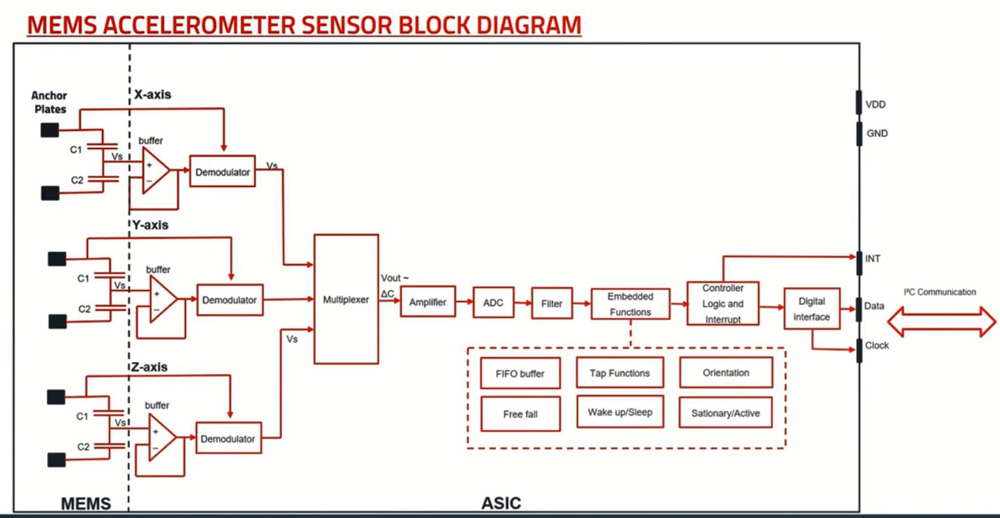

---

## Trang 5

### Khoa Điện tử - Viễn thông

- Trường Đại học Công nghệ, ĐHQGHN
- Kỹ thuật Điện tử
- Electronics Engineering
- 5
- Accelerometer

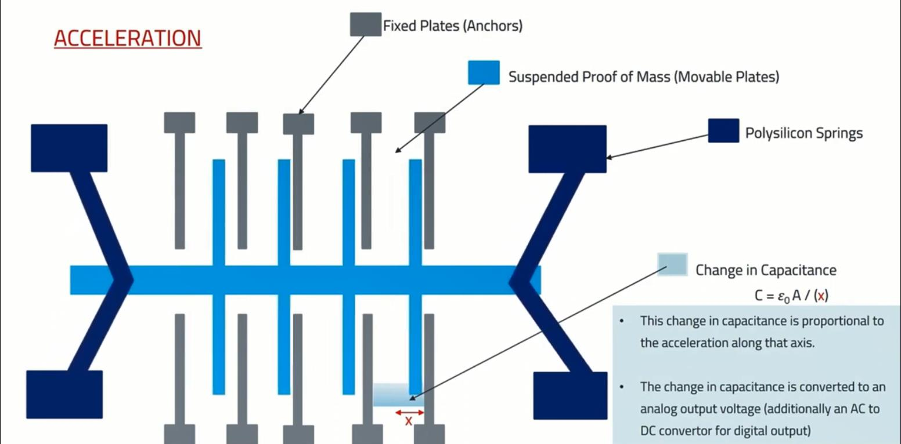

---

## Trang 6

### Khoa Điện tử - Viễn thông

- Trường Đại học Công nghệ, ĐHQGHN
- Kỹ thuật Điện tử
- Electronics Engineering
- 6
- Accelerometer

---

## Trang 7

### Khoa Điện tử - Viễn thông

- Trường Đại học Công nghệ, ĐHQGHN
- Kỹ thuật Điện tử
- Electronics Engineering
- Piezoelectric acceleration sensors
- 7

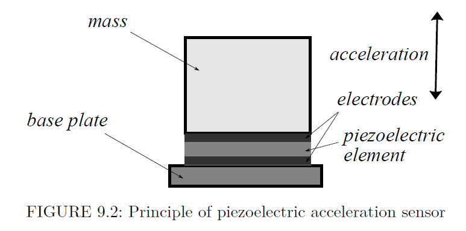

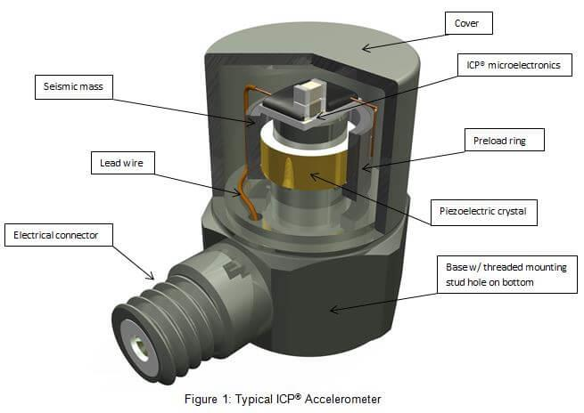

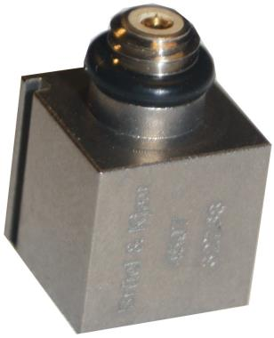

---

## Trang 8

### Khoa Điện tử - Viễn thông

- Trường Đại học Công nghệ, ĐHQGHN
- Kỹ thuật Điện tử
- Electronics Engineering
- Piezoresistive acceleration sensors
- 8

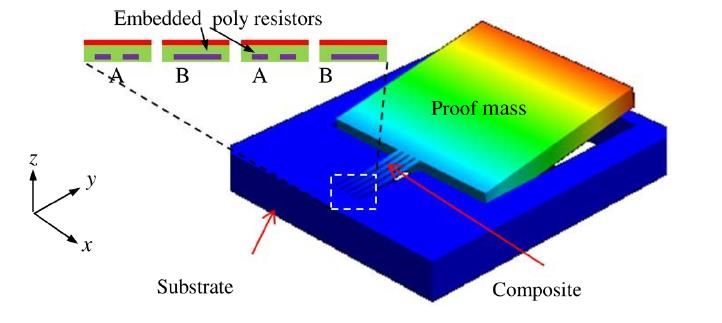

---

## Trang 9

### Khoa Điện tử - Viễn thông

- Trường Đại học Công nghệ, ĐHQGHN
- Kỹ thuật Điện tử
- Electronics Engineering
- Acceleration sensors with measured displacement
- 9

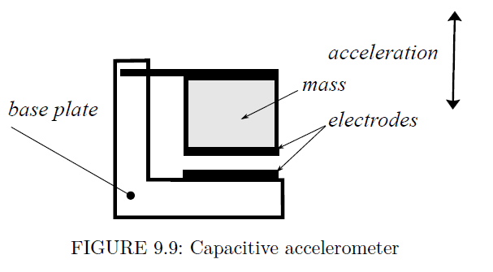

---

## Trang 10

### Khoa Điện tử - Viễn thông

- Trường Đại học Công nghệ, ĐHQGHN
- Kỹ thuật Điện tử
- Electronics Engineering
- Acceleration sensors with measured displacement
- 10

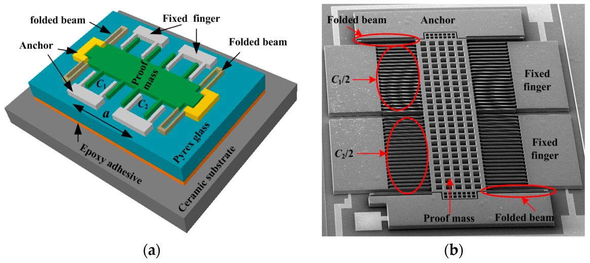

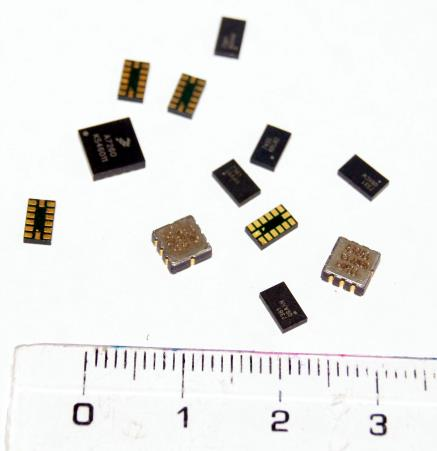

---

## Trang 11

### Khoa Điện tử - Viễn thông

- Trường Đại học Công nghệ, ĐHQGHN
- Kỹ thuật Điện tử
- Electronics Engineering
- Thermal gas gyroscope
- 11
- •
- Mukherjee, Rahul, et al. "A review of micromachined thermal accelerometers." Journal of Micromechanics and
- Microengineering 27.12 (2017): 123002.
- •
- Liu S, Zhu R. Micromachined Fluid Inertial Sensors. Sensors. 2017; 17(2):367. https://doi.org/10.3390/s17020367

---

## Trang 12

### Khoa Điện tử - Viễn thông

- Trường Đại học Công nghệ, ĐHQGHN
- Kỹ thuật Điện tử
- Electronics Engineering
- Gyroscope
- 12
- • Gyroscope is a type of inertial sensor that measures the
- angular rate
- • Applications:
- • Measure how quickly an object turns
- • Integrate the angular rate over time to determine
- angular position

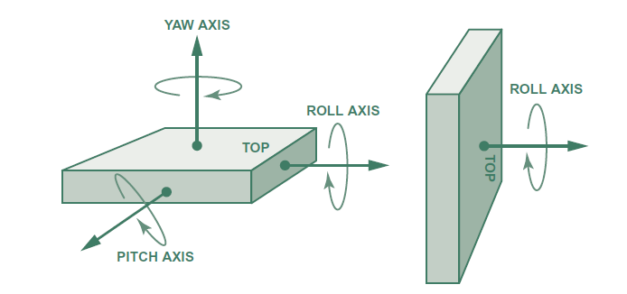

---

## Trang 13

### Khoa Điện tử - Viễn thông

- Trường Đại học Công nghệ, ĐHQGHN
- Kỹ thuật Điện tử
- Electronics Engineering
- Gyroscope
- 13
- • Conventional Vibratory Gyroscope:
- • Measure angular rate by means of Coriolis effects
- Angular
- rate
- Velocity
- 𝐹𝐶= −2𝑚Ω × 𝑣
- •
- 𝑚: mass
- •
- Ω: angular velocity
- •
- 𝑣: tangential velocity

---

## Trang 14

### Khoa Điện tử - Viễn thông

- Trường Đại học Công nghệ, ĐHQGHN
- Kỹ thuật Điện tử
- Electronics Engineering
- Gyroscope
- 14
- • Conventional Vibratory Gyroscope:
- • Measure angular rate by means of Coriolis effects
- Angular
- rate
- Velocity
- 𝐹𝐶= −2𝑚Ω × 𝑣
- •
- 𝑚: mass
- •
- Ω: angular velocity
- •
- 𝑣: tangential velocity
- Resonating Mass
- Mass  rive  irection
- oriolis Sense
- Fingers
- Inner Frame
- Springs

---

## Trang 15

### Khoa Điện tử - Viễn thông

- Trường Đại học Công nghệ, ĐHQGHN
- Kỹ thuật Điện tử
- Electronics Engineering
- Gyroscope
- 15

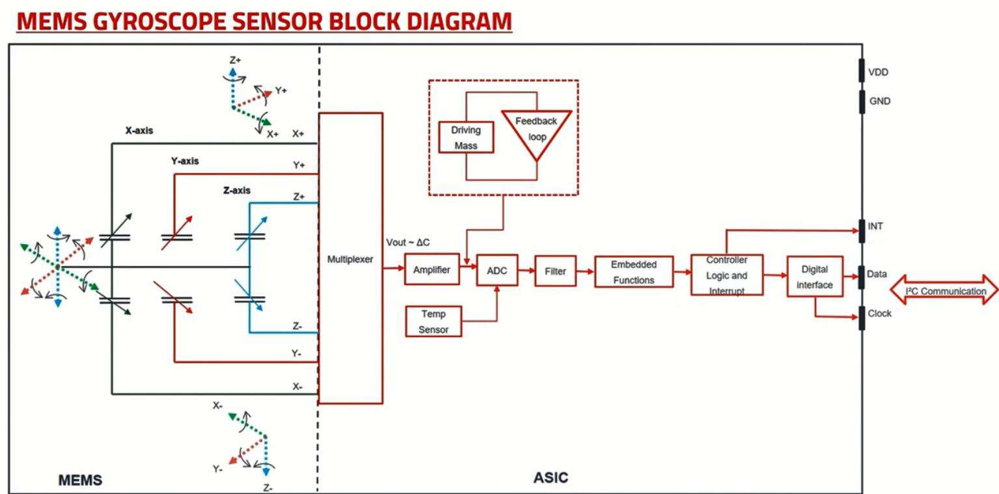

---

## Trang 16

### Khoa Điện tử - Viễn thông

- Trường Đại học Công nghệ, ĐHQGHN
- Kỹ thuật Điện tử
- Electronics Engineering
- 16
- Gyroscope

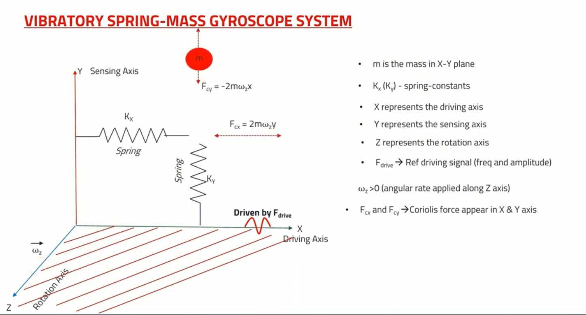

---

## Trang 17

### Khoa Điện tử - Viễn thông

- Trường Đại học Công nghệ, ĐHQGHN
- Kỹ thuật Điện tử
- Electronics Engineering
- 17
- Gyroscope

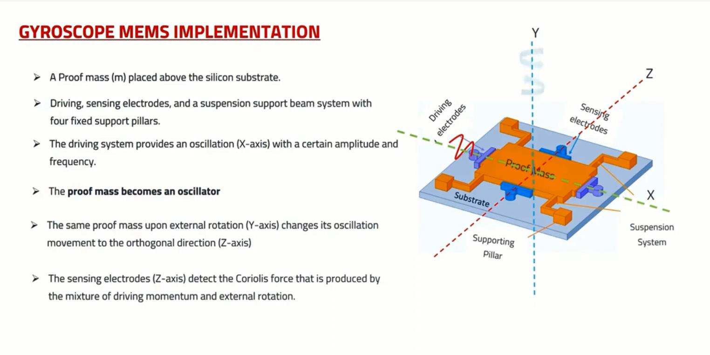

---

## Trang 18

### Khoa Điện tử - Viễn thông

- Trường Đại học Công nghệ, ĐHQGHN
- Kỹ thuật Điện tử
- Electronics Engineering
- 18
- Gyroscope

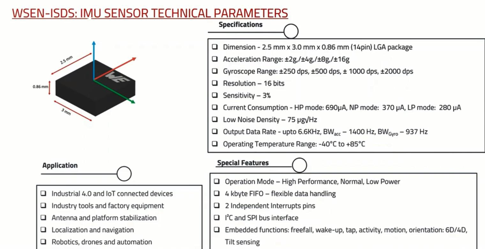

---
