# EP9 Acceleration

> Tài liệu chuyển đổi từ PDF: `EP9 Acceleration.pdf`

---

## Trang 1

### Khoa Điện tử- Viễn thông

- Trường Đại học Công nghệ, ĐHQGHN
- Kỹthuật Điện tử
- Electronics Engineering
- Acceleration
- 1

---

## Trang 2

### Khoa Điện tử- Viễn thông

- Trường Đại học Công nghệ, ĐHQGHN
- Kỹthuật Điện tử
- Electronics Engineering
- Piezoelectric acceleration sensors
- 2

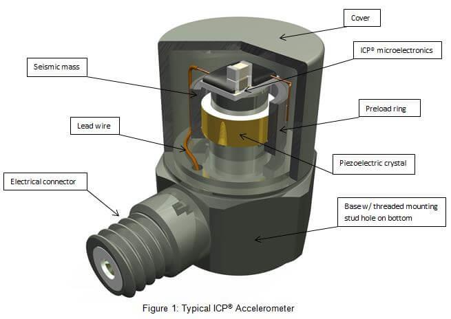

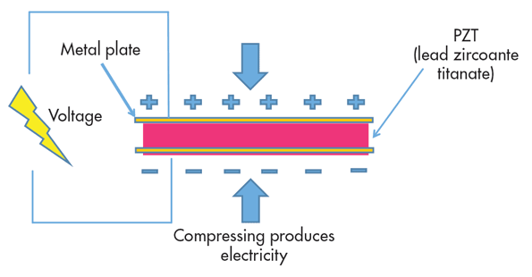

---

## Trang 3

### Khoa Điện tử- Viễn thông

- Trường Đại học Công nghệ, ĐHQGHN
- Kỹthuật Điện tử
- Electronics Engineering
- Piezoresistive acceleration sensors
- 3

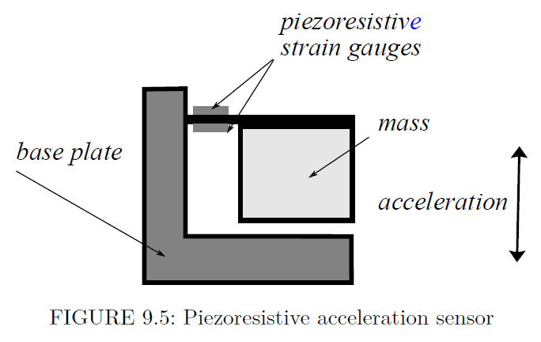

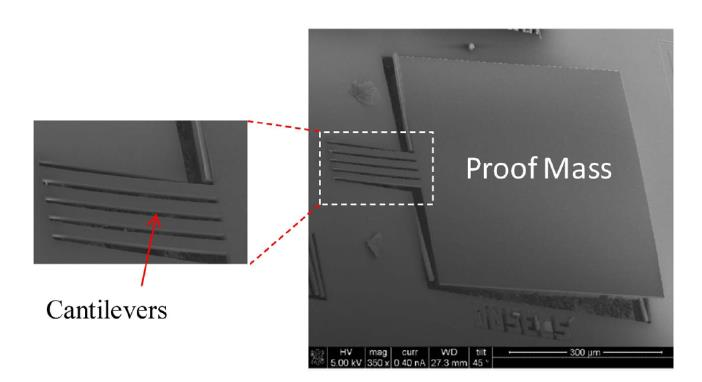

---

## Trang 4

### Khoa Điện tử- Viễn thông

- Trường Đại học Công nghệ, ĐHQGHN
- Kỹthuật Điện tử
- Electronics Engineering
- Acceleration sensors with measured displacement
- 4

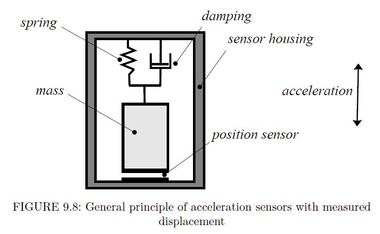

---

## Trang 5

### Khoa Điện tử- Viễn thông

- Trường Đại học Công nghệ, ĐHQGHN
- Kỹthuật Điện tử
- Electronics Engineering
- Acceleration sensors with measured displacement
- 5

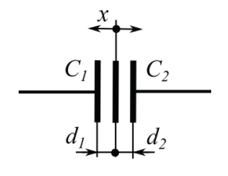

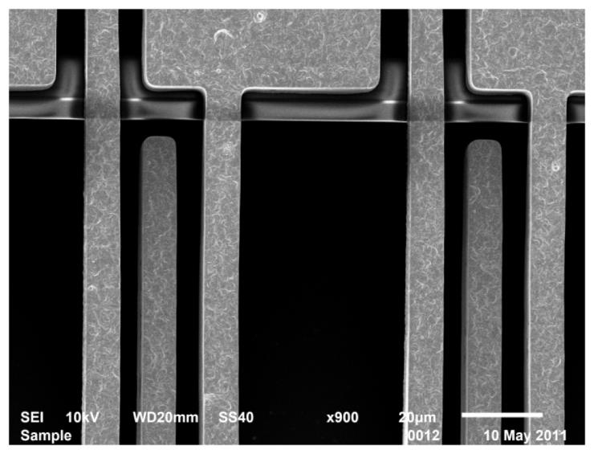

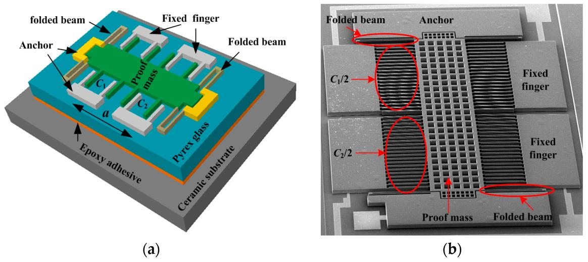

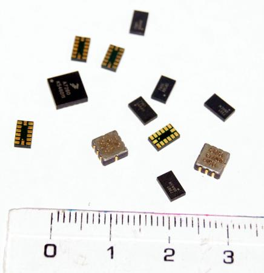

---

## Trang 6

### Khoa Điện tử- Viễn thông

- Trường Đại học Công nghệ, ĐHQGHN
- Kỹthuật Điện tử
- Electronics Engineering
- Thermal gas gyroscope
- 6
- •
- Mukherjee, Rahul, et al. "A review of micromachined thermal accelerometers." Journal of Micromechanics and
- Microengineering 27.12 (2017): 123002.
- •
- Liu S, Zhu R. Micromachined Fluid Inertial Sensors. Sensors. 2017; 17(2):367. https://doi.org/10.3390/s17020367

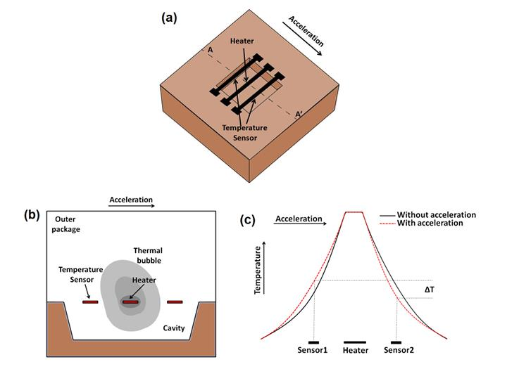

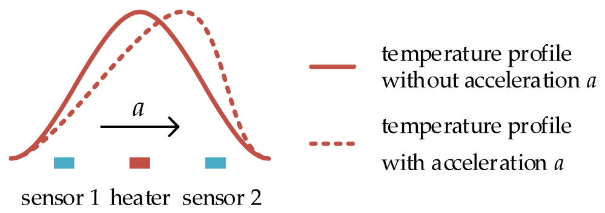

---

## Trang 7

### Khoa Điện tử- Viễn thông

- Trường Đại học Công nghệ, ĐHQGHN
- Kỹthuật Điện tử
- Electronics Engineering
- Gyroscope
- 7
- • Gyroscope is a type of inertial sensor that measures the
- angular rate
- • Applications:
- • Measure how quickly an object turns
- • Integrate the angular rate over time to determine
- angular position

---

## Trang 8

### Khoa Điện tử- Viễn thông

- Trường Đại học Công nghệ, ĐHQGHN
- Kỹthuật Điện tử
- Electronics Engineering
- Gyroscope
- 8
- • Conventional Vibratory Gyroscope:
- • Measure angular rate by means of Coriolis effects
- Angular
- rate
- Velocity
- 𝐹𝐶= −2𝑚Ω × 𝑣
- •
- 𝑚: mass
- •
- Ω: angular velocity
- •
- 𝑣: tangential velocity

---

## Trang 9

### Khoa Điện tử- Viễn thông

- Trường Đại học Công nghệ, ĐHQGHN
- Kỹthuật Điện tử
- Electronics Engineering
- Gyroscope
- 9
- • Conventional Vibratory Gyroscope:
- • Measure angular rate by means of Coriolis effects
- Angular
- rate
- Velocity
- 𝐹𝐶= −2𝑚Ω × 𝑣
- •
- 𝑚: mass
- •
- Ω: angular velocity
- •
- 𝑣: tangential velocity

---
