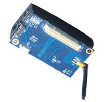
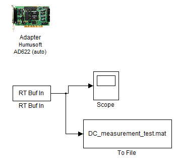

# Energydemandsof802.15.4_ZigBeecommunicationwithIRISsensormotes

> Tài liệu chuyển đổi từ PDF: `Energydemandsof802.15.4_ZigBeecommunicationwithIRISsensormotes.pdf`

---

## Trang 1

### See discussions, stats, and author profiles for this publication at: https://www.researchgate.net/publication/221045514

- Energy Demands of 802.15.4/ZigBee Communication with IRIS Sensor Motes
- Conference Paper · August 2011
- DOI: 10.1109/TSP.2011.6043770 · Source: DBLP
- CITATIONS
- 5
- READS
- 5,172
- 4 authors, including:
- Dan Komosny
- Brno University of Technology
- 65 PUBLICATIONS   455 CITATIONS
- SEE PROFILE
- All content following this page was uploaded by Dan Komosny on 08 April 2015.
- The user has requested enhancement of the downloaded file.

---

## Trang 2

### Energy Demands of 802.15.4/ZigBee

- Communication with IRIS Sensor Motes
- Patrik Moravek, Dan Komosny, Milan Simek and Lubomir Mraz
- Abstract—Limited energy sources of nodes in wireless sensor
- networks require a careful consideration of energy consumption
- of all processes during the sensors deployment. To analyze energy
- consumption and to predict a lifetime of a network, a compre-
- hensive energy model based on commercial products is necessary.
- Therefore, we have focused on the analysis of energy consumption
- during RF communication with particular 802.15.4 compliant
- nodes. We have designed experimental testbed and explored the
- scenario of node association and data transmission. For the
- measurement we used IRIS sensor nodes with 802.15.4/Zigbee
- protocol stack and shunt connection. The results show that energy
- consumption cannot be calculated only from datasheet values of
- current drain and length of a packet but intervals of listening
- and waiting between transmissions play important role as well.
- Keywords—Energy, 802.15.4/ZigBee, WSN, RF communica-
- tion, measurements, IRIS sensor nodes.
- I. INTRODUCTION
- W
- IRELESS sensor networks (WSNs) are intended to
- be an information technology for data gathering from
- environments with specific characteristics or requirements. In
- some applications, WSNs are just more economical option,
- in others the only possibility of meeting the determined
- demands. The applications can vary from home automation
- data gathering system to applications in very hostile and harsh
- environment such as active volcano or mines. In most cases,
- sensor nodes are battery operated and maintenance related to
- battery replacement means extra costs and additional problems
- especially in inaccessible or restricted areas [1][2].
- Limitation in energy sources is one of the constrains of
- WSN (besides computational, memory and bandwidth re-
- sources). When energy is depleted nodes lose their sensing and
- communication functionalities, become inactive, dead. With
- a non-uniform energy depletion in the network, some of the
- nodes are crucial for the whole network or its certain part
- and if those nodes are dead the whole dependent subnetwork
- (cluster) is disconnected. Therefore, to improve network re-
- liability and prolong network lifetime, certain techniques of
- communication, low-powered nodes and energy aware network
- topologies have to be involved in a network design.
- Improvements and various energy saving techniques can
- be employed in the whole protocol stack. Such techniques
- include MAC sleeping schemas, network routing protocols,
- Manuscript received April 30, 2011. This work was supported in part by
- the Grant of Ministry of Industry and business of Czech Republic FR-TI2/571
- and by FRVS G1/467
- Authors are with the Brno University of Technology, Department of
- Telecommunication, Brno, Czech Republic (corresponding author’s email:
- moravek@phd.feec.vutbr.cz)
- localization, security and other energy aware services and
- functions [3][4].
- IEEE standard 802.15.4 was accepted as a standard for
- short-range, low-energy Wireless Personal Area Networks
- (WPANs). This standard describes the Physical and Medium
- Access Control Layer parameters such as frequency range,
- modulation, bit rate, time intervals, topology etc. [5]. Follow-
- ing this standard, several companies designed and produced
- 802.15.4 compliant devices such as IRIS from CrossBow,
- WaspMote from Libelium or Tiny Nodes from Berkeley.
- In order to assure a full compatibility of different WSN
- products, specification of two bottom layers is not sufficient.
- Therefore, ZigBee alliance extended the 802.15.4 standard
- into a 802.15.4/ZigBee specification [6], which covers the
- whole protocol stack up to application layer framework. This
- specification allows products from different manufactures,
- following the specification, talk to each other.
- Since then, there have been designed several specifications
- defining protocol stack for WSNs such as proprietary XMesh
- protocol from Crossbow [7]. However, Zigbee is still the most
- common standard in commercial products and thus we focus
- on it.
- Our investigation is aimed to find real energy consumption
- of a WSN node during network operations. We measure
- current drain of a node circuits and base on it we try to explore
- phases and energy depletion during those phases related to
- communication between two nodes. To relate results to some
- real devices we decided to use IRIS sensor nodes from Cross-
- Bow with implemented ZigBee protocol stack. The obtained
- results allow us to see properly the consumption of node,
- time duration of individual phases and their current drain.
- Base on that we can perform more accurate energy analysis
- and design more appropriate energy model of communication.
- Moreover, we can optimize protocols and their time-schemes
- to save precious energy, which as a consequence results
- in longer WSN network lifetime. Therefore, we designed a
- measurement testbed composed of two communication nodes
- and current measurement setup in order to perform necessary
- measurements. The current measurement setup is due to small
- values in order of mA based on a shunt resistor and voltage
- amplifier to get appropriate results. For data acquisition and
- processing we used a sampling card and Matlab simulation
- tool.
- The rest of the paper is organized as it follows: Section
- 2 discusses briefly energy constraints in WSN, Section 3
- describes proposed experimental testbed and devices used. In
- the following section, Section 4, the results of measurements
- and comments are presented. The last Section 5 summarizes

---

## Trang 3

### conclusions of our work and measurements.

- II. ENERGY IN WSN
- Energy related questions are a permanent topic of research
- in WSN. Energy is a precious resource in WSN like bandwidth
- and computing power. This limitation is so important for entire
- network design that a new standard had to be introduced. It
- was not possible to describe low-power sensor nodes and their
- efficient communication by any other standard for wireless
- communication and thus, 802.15.4 standard was proposed. The
- crucial aspect of WSN is that nodes are generally equipped just
- with one battery unit and when the source is depleted the node
- is death. Certain types of nodes in a network can have extended
- functionality (as routing) and therefore they need more energy
- (perform more tasks and are up for a longer period). In ZigBee
- networks those nodes can be powered from mains supply.
- However, considering certain remote monitoring application
- without possibility of permanent power source for those nodes,
- the network has to handle this situation employing different
- approach. In certain applications, energy harvesting from the
- node surrounding is a good option. In this cases solar panels,
- wind mils or other energy harvesters (mechanical, acoustic,
- ultrasonic, thermoelectric) can be used [8] [9]. Interesting
- approach making use of electromagnetic energy of useless RF
- signals was introduced by L.Tang and Ch. Guy in [10].
- If we have no possibility of mains supply or energy har-
- vesting we have to guarantee that provided energy sources last
- till the end of the determined application lifetime. To assure
- that, minimal consumption is necessary. There are several
- approaches how to reduce energy during the node lifetime.
- Besides energy efficient design of all the hardware components
- of a WSN node, optimization of all processes in the network
- from the energy point of view is essential.
- If we want to evaluate energy demands of a certain algo-
- rithm, process or if we want to estimate the lifetime of a
- network, we have to use an energy model of the node and
- network and perform appropriate simulations. The simulation
- results are as precise as the model is closed to the real
- situation. Therefore, several models have been proposed [11]
- [12].
- There are three main consumers of energy regarding WSN
- node: computing power of microcontroller (MCU), RF com-
- munication and sensing. When we add up all those compo-
- nents we get an expression of entire energy consumption:
- E = Eµp + ERF + Esensor
- (1)
- Eµp is the energy consumed by microprocessor, ERF energy
- drained by transceiver circuits (transmission and reception
- both together) and Esensor stands for the energy needed to
- power all the sensors required by application task.
- Energy of sensing is highly dependent on the type of sensor
- used. It can range from units of mA to hundreds of mA
- and it can be hardly changed or optimized from the network
- point of view. Reduction of sensing power is possible only by
- prolonging the interval between sensing phases.
- III. EXPERIMENTAL TESTBED
- In order to describe precisely energy consumption of WSN
- node during its operation we designed a specific experimental
- testbed. The estimation of energy depleted from battery source
- during node activity is based on the current powering node cir-
- cuits and especially radio transceiver since it is the main source
- of energy consumption in the node. We focus mostly on the
- operations related to communication, which means association
- of a node to an existing network after node startup and packet
- transmission. Therefore, we designed an experimental testbed
- consisting of two communicating nodes IRIS and current
- measurement setup. The simple WSN topology consists of two
- nodes: PAN Coordinator and end device. The Coordinator and
- the end device are identical from the hardware point of view
- but distinguished by definition of ZigBee roles. As a network
- nodes, IRIS motes were used. These nodes with XM2110CA
- module are based on low power Atmel Atmega1281 8bit
- microcontroller and Atmel AT86RF230 transceiver. Radio part
- is designed for the radio range 2.4 GHz ISM. These nodes
- originally come with XMesh protocol stack but we replaced
- it with Atmel’s Bitcloud stack and ported it to IRIS motes for
- our experiments. The Atmel’s Bitcloud stack is full-featured
- certified ZigBee PRO stack. In addition, the sensor board
- is equipped with turn-on switch, three LED for user visual
- communication, serial interface, 10-bit AD converter and other
- digital interfaces (I2C, SPI). The Coordinator is powered by
- its battery source as usual, while for powering the end node
- we used a power supply (3 V) for the experimental purpose.
- The experimental testbed schema can be seen in Fig. 1.
- Power supply
- INA210-
- 214EVM
- Amplifier
- Oscilloscope/
- PC sampling
- card
- End node
- PAN Coordinator
- Fig. 1.
- Experimental testbed for measurement of energy consumption
- The main idea of the experiment is to measure a current
- drained by the end device during communication with the PAN
- Coordinator. In order to precisely measure the current, a shunt
- resistor has to be placed in a measurement circuit. The current
- measurement setup contains a shunt resistor with a known
- value, which is placed between an energy source and node
- supply pin. To minimize the impact of the shunt resistor on
- the node power supply, it has to be very small (we decided for
- 1 Ω). Because the current passing the shunt resistor is in order
- of mA the voltage across the shunt resistor has to be amplified
- for better transparency of results. In our measurement we used
- INA210 amplifier with the gain 100 especially conceived for

---

## Trang 4

### current shunt monitoring. See the current shunt monitoring

- connection in Fig. 2
- RSHUNT
- RFILT
- RFILT
- CFILT
- +V
- LOAD
- REF
- VOUT
- INA210
- Fig. 2.
- Current measurement with a shunt resistor and low pass filter(adapted
- from [14])
- There is also a low-pass filter depicted in Fig.1 formed by
- a capacitor CFILT and a resistor RFILT. The aim of the filter
- is to cut high frequency changes caused by interference and
- rapid current state transitions. For the filter design it has to
- be taken into consideration that a gain of the amplifier can be
- reduced by high value of RFILT [14].
- GINA210 = 100 ·
- RINA210
- RINA210 + RFILT
- (2)
- where RINA210 is an internal resistance of the amplifier
- which is 5 kΩ. Another restriction requires that RINA210 has to
- be much higher than RSHUNT in order to avoid negative effect
- of the filter on the voltage drop. Considering both limitation
- we choose RFILT = 47kΩ. According to the chosen value of
- RFILT, the capacitor CFILT can be calculated based on the cutoff
- frequency of the filter:
- fc =
- 1
- 2π · (2RF ILT ) · CF ILT
- (3)
- If we select a value 220 nF for CFILT we get a cutoff fre-
- quency 7.7 kHz, which allows us to use a sampling frequency
- not lower than 15.4 kHz in accordance with the Nyquist
- theorem.
- The last component of the experimental testbed is a mea-
- surement and displaying unit. Both fast oscillator and PC
- sampling card with appropriate software tool can accomplish
- this function. For our testbed we decided for PC sampling card
- (Humusoft AD622) and Matlab simulation tool with Simulink
- and real-time toolbox. The model of measurement in Simulink
- is in Fig. 3. Block RT Buf In gathers all measured samples
- which can be stored in buffer for further processing if needed
- (in case of high load). Values collected during the measure-
- ment were stored in a Matlab file and further processed by
- Matlab in non real-time mode after the experiment.
- For the experiment purposes one of the nodes was acting as
- a PAN Coordinator turned on before the measurement itself in
- Fig. 3.
- Using a Matlab real-time library with PCI sampling card
- order to create a network, which the end node joins after its
- startup. The application executed in the end node is a simple
- function of periodical sending a packet of size 3 Bytes.
- IV. RESULTS AND DISCUSSION
- In this section we describe the time-line of the experiment
- and operation of the node after startup in a relation to the cur-
- rent drained from an energy source. Based on the experiment
- description in the previous part when the end node is turned
- on its current consumption is as displayed in Fig. 4.
- 2
- 4
- 6
- 8
- 10
- 12
- 14
- 16
- 18
- 20
- 0
- 5
- 10
- 15
- 20
- 25
- 30
- 35
- time(s)
- current(mA)
- 1
- 2
- 3
- 4
- 5
- 6
- Fig. 4.
- Radio communication and power consumption of IRIS node
- In the phase 1 the node is turned off and the consumption
- is certainly 0. After turning on the sensor node performs
- association and binding phase exchanging information with
- PAN Coordinator and initial packet transmission (phase 2).
- Then, following the implemented function, the end node waits
- in a sleep mode (phase 3) draining minimum of energy until
- periodic packet transmission takes place in phase 4. The
- required current in a sleep mode is 2 mA approximately,
- which depends on the sleep mode of microcontroller. In the
- deepest sleep mode the ATmega1281 requires less than 7.5 µA
- [13]. Phase 5 represents waiting for next periodic packet
- transmission in the sleep mode, however, the end node is
- turned off (phase 6).
- The next figure, Fig. 5, represents the turning on process
- and the association phase only. During the phase 0 the end

---

## Trang 5

### 1

- 1.5
- 2
- 2.5
- 3
- 3.5
- 4
- 0
- 5
- 10
- 15
- 20
- 25
- 30
- time(s)
- current(mA)
- 0
- 1
- 2
- 3
- 4
- 5
- 6
- Fig. 5.
- Association and binding phase of Zigbee communication
- node is off. When turned on, the current increases sharply
- to 50 mA for 0.5 ms. Then, in phase 1, it stays on the
- level 4.6 mA for approximately 70 ms when system clock is
- being stabilized. Following phase and level of about 10.2 mA
- indicates the active state of the microprocessor (phase 2). In
- the phase 3 the end node sends beacon request and gathers
- information from PAN Coordinator. Since we already set the
- communication channel (channel 15) the node then sends
- rejoin request and gets acknowledgment packet (phase 4).
- After half a ms several packet transmissions are conducted.
- The end node gets rejoin response, sends packet with its
- capabilities as a payload to the Coordinator (the Coordinator
- spreads them over the network afterwards), sends data request
- and then the first data packet. Each packet is followed by an
- acknowledgment at the link layer. It is optional in standard
- 802.15.4 but ZigBee strictly requires it. It is different with an
- acknowledgment at the application layer. This ACK is optional
- in ZigBee communication and user has possibility to change
- it. In our experiment, the application ACK was required and
- thus, after approximately one second the end node requests
- application ACK, which is subsequently received (phase 6).
- The application of the end node periodically transmits a
- data packet after necessary data request command, which is,
- according to our setting, followed by ACK at the application
- layer. This sequence is then repeated every ten seconds until
- the end node is turned off. This means a periodical energy
- drain, which is imposed by activating the processor and RF
- circuits transmitting and receiving packets. The time interval
- of this sequence is 1.18 s. From that period there are two time
- intervals of 40 ms with the 22 mA current consumption, 0.5 s
- of 12.5 mA and 0.6 s of 10.3 mA. The current consumption of
- the activities related to sending of application data is shown
- in Fig. 6.
- As can be seen from all the figures, the energy consumption
- is mainly dependent on the active state of board circuits. It
- means mostly processor and RF circuits in our focus. The
- node association takes about 1.2 s. The half of that time all
- the circuits consumes energy which means high drain (about
- 23 mA). When only processor is in the active state, the current
- is about 12 mA. The important fact is also that while waiting
- for application ACK the processor is on draining energy (more
- than 1 s). Therefore, packet transmission and MAC ACK
- reception itself, when the current increases to 25 mA, is
- actually miner consumer (takes about 40 ms) in the entire
- interval of communication.
- 13.6
- 13.8
- 14
- 14.2
- 14.4
- 14.6
- 14.8
- 15
- 15.2
- 15.4
- 0
- 5
- 10
- 15
- 20
- 25
- time(s)
- current(mA)
- Fig. 6.
- Data transmission process in ZigBee with acknowledgment at the
- application layer
- V. CONCLUSION AND FUTURE WORK
- To conclude our work and experiments we focus on the
- current levels and energy consumption of different phases of
- communication. First, the start up phase takes approximately
- 250 ms till the beacon request is sent and the current rises
- to the value of 23 mA (power supply is 3 V) when RF part
- is powered. From the node start up the first packet is sent in
- 1.3 s.
- Information how much power is needed for the transmission
- and reception of a packet is an important input for each
- energy analysis. The data packet transmission,when maximal
- transmission power (3 dBm) is used, requires 25 mA (75 mW)
- and packet reception about 22 mA (66 mW) considering IRIS
- node. The whole data request and transmission of 3 Bytes of
- payload takes about 40 ms, about the same takes the request
- and the reception of application ACK. However, there is a
- significant interval of waiting. During the time interval of
- about 1 s, when the processor is on, the current consumption
- is 13 mA (39 mW) and 10.6 mA (31.8 mW) (see Fig. 6).
- Despite the fact that the current drain during the packet
- transmission and reception is higher, due to the duration of
- the phases of entire data transmission process (including data
- request and acknowledgments), more energy is consumed just
- by processor waiting for the application ACK in active state.
- This is very important fact, which means that the consumption
- cannot be calculated only from the transmission rate and
- number of bytes in the packet but waiting period has to be
- considered as well. Therefore, we should carefully think about
- using ACK at the application layer since we have experienced
- that waiting period takes more than one second in one hop
- communication and it would be even more for multi hop

---

## Trang 6

### communication. Moreover, for energy saving, we should set

- fast MCU oscillator stabilization whenever possible and lower
- the oscillator frequency if there is no high computational load.
- General recommendation, which should be obvious, is to make
- the best of the different sleep modes of microcontroller.
- There is several possibilities of energy savings in current
- WSN ranging from hardware design to energy aware protocols
- and entire protocol stack. A lot of works evaluating energy
- consumption is based on the datasheet values or general energy
- model based on the datasheet information. This work intends
- to point out that controlling software and implementation of
- protocols can have considerable effect on the energy consump-
- tion and thus, it should be certainly considered as well.
- In our future work we will focus on the multi-platform
- comparison and evaluation of low-power hardware possibili-
- ties controlled by firmware. Different manufactures offer WSN
- platforms with different design which certainly influences the
- energy consumption. Other broad field of investigation of
- power consumption is in the firmware controlling the node
- at the low level and making the best of low-power design
- strictly respecting its advantages. Especially, taking advantage
- of various low power modes is one way of prospective energy
- saving.
- REFERENCES
- [1] I. Akyildiz, W. Su, Y. Sankarasubramian and E. Cayircil. ”A Survey on
- Sensor Networks”. IEEE Communications Magazine. August 2002, pp.
- 102-114.
- [2] D. Culler, D. Estrin and M. Srivastava. ”Overview of Sensor Networks”.
- IEEE Computer. 2004, Vol. 37, 8, pp. 41-49.
- [3] W. Yunbo, M.C. Vuran, S. Goddard, ”Stochastic Analysis of Energy
- Consumption in Wireless Sensor Networks,” Sensor Mesh and Ad
- Hoc Communications and Networks (SECON), 2010 7th Annual IEEE
- Communications Society Conference on , vol., no., pp.1-9, 21-25 June
- 2010.
- [4] J. Haapola, Z. Shelby,C. Pomalaza-Raez,P. Mahonen,”Cross-layer en-
- ergy analysis of multihop wireless sensor networks,” Wireless Sensor
- Networks, 2005. Proceeedings of the Second European Workshop on ,
- vol., no., pp. 33- 44, 31 Jan.-2 Feb. 2005.
- [5] IEEE Standard for Information Technology Part 15.4: Wireless Medium
- Access Control (MAC) and Physical Layer (PHY) Specifications for
- Low-Rate Wireless Personal Area Networks (LR-WPANs), IEEE Std
- 802.15.4-2006.
- [6] ZigBee-Alliance.
- ZigBee
- Specification,
- 2006,
- Available
- online:
- http://www.ZigBee.org.
- [7] CrossBow company. Available online. (http://www.xbow.com/).
- [8] J. M. Gilbert, F. Balouchi, ”Comparison of energy harvesting systems
- for wireless sensor networks.” International Journal of Automation and
- Computing, 5(4), 334-347, (2008).
- [9] Featherston, Carol Ann and Holford, Karen Margaret and Waring, G
- ”Thermoelectric Energy Harvesting for Wireless Sensor Systems in
- Aircraft.” Key Engineering Materials. , 413-414 . pp. 487-494, (2009).
- [10] L. Tang, C. Guy, ”Radio frequency energy harvesting in wireless
- sensor networks.” Proceedings of the 2009 International Conference on
- Wireless Communications and Mobile Computing Connecting the World
- Wirelessly IWCMC 09, 644. ACM Press (2009).
- [11] B. Kan, L. Cai, L. Zhao, Y. Xu, ”Energy Efficient Design of WSN
- Based on an Accurate Power Consumption Model” Informatica, (1),
- 2751-2754,(2007).
- [12] Qin Wang, W. Yang,, ”Energy Consumption Model for Power Man-
- agement in Wireless Sensor Networks” Sensor, Mesh and Ad Hoc
- Communications and Networks, 2007. SECON ’07. 4th Annual IEEE
- Communications Society Conference on , vol., no., pp.142-151, 18-21
- June 2007
- [13] Atmel,
- ”Atmel
- ATmega1281
- datasheet”,
- Available
- online
- (http://www.atmel.com/dyn/resources/prod documents/doc2549.pdf).
- [14] Texas instrument, ”INA210-214EVM User’s Guide”, 2008
- View publication stats

---
