# MST2020-Wen

> Tài liệu chuyển đổi từ PDF: `MST2020-Wen.pdf`

---

## Trang 1

### See discussions, stats, and author profiles for this publication at: https://www.researchgate.net/publication/339751284

- A differential strategy for measurement of a static force in a single point
- diamond cutting by a force-controlled fast tool servo
- Article  in  Measurement Science and Technology · May 2020
- DOI: 10.1088/1361-6501/ab7d6f
- CITATIONS
- 5
- READS
- 108
- 7 authors, including:
- Bo Wen
- Tohoku University
- 5 PUBLICATIONS   27 CITATIONS
- SEE PROFILE
- Yuki Shimizu
- Tohoku University
- 274 PUBLICATIONS   2,672 CITATIONS
- SEE PROFILE
- Hiraku Matsukuma
- Tohoku University
- 120 PUBLICATIONS   943 CITATIONS
- SEE PROFILE
- Yuan-Liu Chen
- Tohoku University
- 89 PUBLICATIONS   1,545 CITATIONS
- SEE PROFILE
- All content following this page was uploaded by Wei Gao on 24 January 2024.
- The user has requested enhancement of the downloaded file.

---

## Trang 2

### Measurement Science and Technology

- PAPER
- A differential strategy for measurement of a static force in a single-point
- diamond cutting by a force-controlled fast tool servo
- To cite this article: Bo Wen et al 2020 Meas. Sci. Technol. 31 074014
- View the article online for updates and enhancements.
- This content was downloaded from IP address 130.34.95.39 on 04/06/2020 at 02:59

---

## Trang 3

### Measurement Science and Technology

- Meas. Sci. Technol. 31 (2020) 074014 (11pp)
- https://doi.org/10.1088/1361-6501/ab7d6f
- A differential strategy for measurement
- of a static force in a single-point
- diamond cutting by a force-controlled
- fast tool servo
- Bo Wen, Yuki Shimizu, Hiraku Matsukuma, Keisuke Tohyama,
- Haruki Kurita, Yuan-Liu Chen and Wei Gao
- Department of Finemechanics, Tohoku University, 6-6-01 Aramaki-Aza Aoba, Aoba-ku, Sendai
- 980-8579, Japan
- E-mail: hiraku.matsukuma@nano.mech.tohoku.ac.jp
- Received 18 December 2019, revised 26 February 2020
- Accepted for publication 6 March 2020
- Published 4 May 2020
- Abstract
- This paper presents a new strategy for applying a piezoelectric (PZT) force sensor to the
- measurement of static force in a force sensor-integrated fast tool servo (FS-FTS) system for
- single-point diamond cutting on planar brittle material substrates. A conventional PZT force
- sensor unit composed of a PZT force sensor and a charge amplifier cannot be employed for
- measurement of static force due to the discharging characteristics of PZT materials. In this
- paper, to realize the long-term stable measurement of static cutting force, the time constant of
- the PZT force sensor unit is set to be infinitely large by removing the feedback resistor from the
- charge amplifier. The influence of bias current leakage, which arises as a result of removing the
- feedback resistor, is compensated through obtaining the differential output of the two PZT force
- sensor units having identical charge amplifiers and identical thermal characteristics. After
- microgroove-cutting experiments to verify the stability of the PZT force sensor unit in the
- conventional FS-FTS unit, a theoretical model for the PZT force sensor unit is established.
- Some basic experiments are then carried out to verify the feasibility of the proposed differential
- measurement strategy. Furthermore, a modified FS-FTS unit with a pair of PZT force sensor
- units based on the proposed strategy is developed, and its effectiveness is demonstrated through
- experiments.
- Keywords: fast tool servo, static force measurement, piezoelectric force sensor, differential
- measurement
- (Some figures may appear in colour only in the online journal)
- 1. Introduction
- In recent years, the demand for precision and accurate machin-
- ing of components with freeform surfaces and/or microstruc-
- tures has grown rapidly in many fields, such as in the optical
- industry and the semiconductor industry [1–4]. Since the per-
- formance of such components mainly depends on form accur-
- acy and surface quality [5, 6], it is important to establish a
- machining process that can achieve both high accuracy and
- high throughput. Single-point diamond cutting with a fast tool
- servo (FTS) is one of the candidate technologies for this pur-
- pose since the FTS can overcome the limited bandwidth of
- the tool feed motion in a machine tool [7, 8]. In addition,
- when machining brittle materials such as non-ferrous metals,
- crystals, polymers and ceramics, it is necessary to control the
- depth of cut precisely so that ductile cutting can be carried out
- [9–13]. However, it is sometimes difficult for systems based
- on conventional CNC machine tools to carry out ductile cut-
- ting on a non-planar surface since the cutting tool is controlled
- in position.
- 1361-6501/20/074014+11$33.00
- 1
- © 2020 IOP Publishing Ltd
- Printed in the UK

---

## Trang 4

### Meas. Sci. Technol. 31 (2020) 074014

- Bo Wen et al
- The above issue can be addressed by controlling the cut-
- ting tool in force [14–16]. Especially, in-process monitor-
- ing and feedback of the cutting force is an effective way to
- realize ductile cutting of brittle material substrates [17–19].
- Some efforts have thus been made by using an atomic force
- microscope (AFM)-based system, where the AFM probe tip is
- employed as a cutting tool controlled in force [20–23]. Mean-
- while, one of the drawbacks of the AFM-based machining is
- its low cutting force down to µN, which prevents the AFM-
- based machining from being applied to various machining
- applications. On the other hand, a piezoelectric (PZT) force
- sensor-based system can provide a high cutting force with high
- rigidity, while realizing highly sensitive force measurement
- [24–27]. The author’s group has also developed a PZT force
- sensor-integrated fast tool servo (FS-FTS) system to deal with
- the difficulties of ultra-precision diamond cutting on a curved
- surface of a brittle material substrate [28, 29]. Furthermore, the
- FS-FTS system has also been employed to carry out not only
- force-controlled cutting but also on-machine profile measure-
- ment of microstructures [30]. However, the conventional FS-
- FTS system can only realize force-controlled cutting over a
- short period of several tens of seconds due to the inherent fea-
- tures of the PZT force sensor unit, which suffers from the dis-
- charging effect due to the finite insulation of PZT material. In
- addition, the PZT force sensor unit employed in the conven-
- tional FS-FTS system is sensitive to the change in temperature;
- these characteristics of the PZT force sensor unit prevent the
- FS-FTS system controlled in force from being applied to cut-
- ting operations over a large area. It is thus desirable to realize
- measurement of a static force over a long period by the PZT
- force sensor.
- In this paper, the stability of the PZT force sensor unit is
- first verified through microgroove cutting experiments with
- the conventional FS-FTS system. After that, a theoretical
- model of the output signal from the PZT force sensor unit
- including the influences of the discharging effect, the bias cur-
- rent in the charge amplifier and the thermal stability of the
- overall PZT force sensor unit is established. Regarding the
- established theoretical model, a new strategy referred to as the
- differential force measurement strategy, in which a pair of PZT
- force sensors is employed to compensate for the aforemen-
- tioned influences on the PZT force sensor unit, is proposed.
- A setup with the two PZT force sensor units is then developed
- to verify the feasibility of the proposed strategy. Furthermore,
- a new FS-FTS system with a pair of PZT force sensor units is
- developed, and its stability for the control of a diamond-cutting
- tool in force is verified through experiments.
- 2. Experimental verification of the stability of the
- conventional FS-FTS system
- A diagram of the conventional FS-FTS system is shown in
- figure 1. The conventional FS-FTS unit is composed of a
- ring-shaped PZT actuator, a capacitive displacement sensor
- and a ring-shaped PZT force sensor. The motion axis of
- the PZT actuator and the measuring axis of the PZT force
- sensor are aligned to coincide with each other. The PZT force
- Figure 1. Diagram of the conventional force sensor-integrated fast
- tool servo (FS-FTS) unit and the control system.
- Figure 2. Setup of the microgroove cutting by using the FS-FTS.
- (a) Schematic of the microgroove cutting. (b) Photograph of the
- FS-FTS on the ultra-precision diamond turning machine.
- sensor detects the thrust force (normal force) along the in-feed
- direction as the charge in the sensor. The current from the
- PZT force sensor, which is a consequence of the change in the
- charge of the PZT force sensor, can be converted into voltage
- output proportional to the integral of current. The voltage out-
- put from the charge amplifier is received by the signal condi-
- tioner and is then fed back to the PZT actuators in the FS-FTS
- unit through the PI controller and the PZT driver so that the
- thrust force can be kept constant as to the set reference force.
- To evaluate the stability of the force feedback cutting by
- the conventional FS-FTS system, experiments were carried
- 2

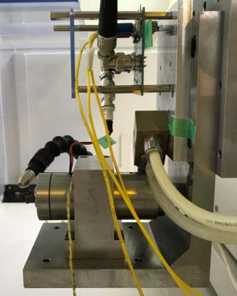

---

## Trang 5

### Meas. Sci. Technol. 31 (2020) 074014

- Bo Wen et al
- Figure 3. Profiles of the cut microgrooves measured by a
- three-dimensional optical profiler. (a) With a feed rate of
- 3.0 mm min−1. (b) With a feed rate of 1.0 mm min−1. (c) With a
- feed rate of 0.3 mm min−1. (d) Depths of the cut microgrooves.
- out. A schematic and a picture of the experimental setup are
- shown in figures 2(a) and (b), respectively. The FS-FTS unit
- was mounted on the Y-slide of a four-axis ultra-precision dia-
- mond turning machine (ULG-100, Toshiba Machine, Japan)
- in such a way that the motion axis of the FS-FTS unit became
- parallel with the Z-axis of the turning machine. An aluminum
- workpiece, whose surface was finished in advance of the
- experiments by using another diamond turning machine, was
- mounted onto the machine spindle with a vacuum chuck. A
- single-point diamond tool with a round nose radius of 2 mm
- and a clearance angle of 7◦(ALMT C
- Y-directional microgrooves were fabricated on the alu-
- minum workpiece surface by controlling the Y-slide of the
- machine, while the workpiece was held stationary on the
- machine tool along the X- and Z-directions and the in-feed
- motion of the single-point diamond tool was controlled in
- force by the FS-FTS system. The reference force of the force
- feedback control in the FS-FTS system was set to be approx-
- imately 0.7 N. Six repetitive microgroove cuttings were car-
- ried out at different X-positions with different Y-directional
- feed rates ranging from 0.2 mm min−1–3.0 mm min−1.
- Figures 3(a)–(c) show the profiles of the cut microgrooves
- with Y-directional feed rates of 3.0 mm min−1, 1.0 mm min−1
- Figure 4. Circuit configuration of the PZT force sensor unit.
- and 0.3 mm min−1, respectively, measured by a commer-
- cial three-dimensional optical profiler (Zygo NewView7300).
- Figure 3(d) summarizes the change in the depth of each
- microgroove. As can be seen in the figure, the stability of the
- groove depth was found to worsen with the decrease of the
- feed rate; this was mainly due to the discharging effect of the
- PZT force sensor. This issue should be addressed to achieve
- cutting operation over a large area by force feedback control.
- 3. Establishment of the theoretical model of the
- PZT force sensor unit for the force feedback control
- 3.1. Theoretical model of the PZT force sensor unit
- Aiming to improve the stability of the force feedback control in
- the FS-FTS unit, a theoretical model of the output signal from
- the PZT force sensor unit is established. Figure 4 shows the
- circuit configuration of the PZT force sensor unit composed of
- a PZT force sensor and a charge amplifier. The charge amp-
- lifier is composed of an operational amplifier with a feedback
- capacitor CF and a feedback resistance RF, and converts the
- sensor charge output QS into the voltage VOut. When a force F
- is applied to the PZT force sensor along its measurement axis,
- the external charges on the sensor surface become greater than
- the internal charges, generating a total amount of QS of surface
- charges that can be expressed by the following equation [31]:
- QS = F · d33
- (1)
- where d33 is the piezoelectric coefficient of the sensor mater-
- ial. Since the PZT sensor can be expressed by an equivalent
- circuit composed of a capacitor CS and an insulation resistor
- RS connected in parallel, the charge output q of the PZT force
- sensor can be expressed as a function of time t by the following
- equation [31]:
- q = QSe−
- t
- RSCS .
- (2)
- The piezoelectric effect is usually adopted for dynamic
- cutting force measurement by utilizing the charge amplifier
- converting the high impedance electrical charge to a low
- impedance voltage output having large amplitude enough to
- 3

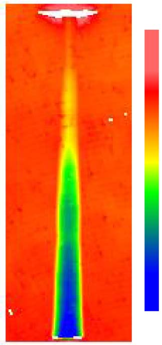

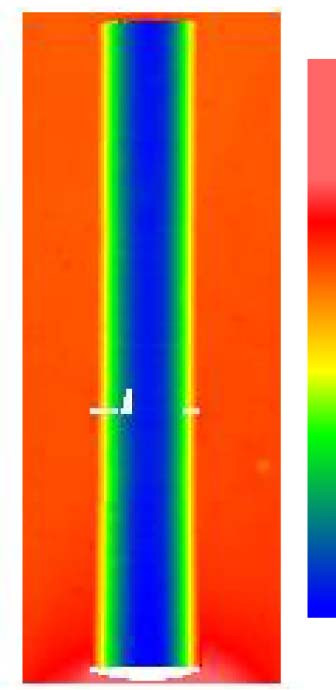

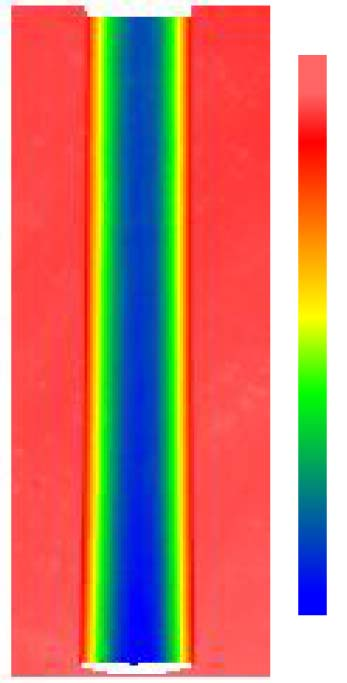

---

## Trang 6

### Meas. Sci. Technol. 31 (2020) 074014

- Bo Wen et al
- Figure 5. Circuit configurations of the PZT force sensor unit and corresponding voltage output. (a) With the feedback resistor. (b) Without
- the feedback resistor.
- be measured. From the above equations, the voltage output of
- the charge amplifier VOut can be expressed as follows:
- VOut = q
- CF e
- −
- t
- RF CF = QSe
- −
- t
- RSCS
- CF
- e
- −
- t
- RF CF = F · d33
- CF
- e
- −
- (
- t
- RSCS +
- t
- RFCF
- )
- .
- (3)
- Since a general PZT force sensor has a large insulation res-
- istor RS up to hundreds of G Ω, equation (3) can be simplified
- as follows:
- VOut ≈F · d33
- CF
- e−
- t
- RFCF = F · d33
- CF
- e−
- t
- τF
- (4)
- where τ F, which is expressed as the product of RF and CF,
- represents the time constant of the charge amplifier. As can be
- seen in equation (4), the voltage output of the charge amplifier
- decays exponentially as a function of t even when a constant
- force F is applied to the piezoelectric force sensor as shown in
- figure 5(a); this phenomenon is referred to as the discharging
- effect [31]. This effect prevents the PZT force sensor unit from
- being employed for static cutting force measurement.
- One of the possible solutions of employing PZT force
- sensor units to measure a static cutting force is to set the time
- constant τ F to be large; by disconnecting the feedback resistor
- in the charge amplifier, the time constant becomes infinitely
- large. This modification can decrease the influence of the dis-
- charging effect, as shown in figure 5(b). However, on the other
- hand, another problem arises; since there is no feedback res-
- istor, the small bias current IBias from the operational ampli-
- fier in the charge amplifier continuously charges the feedback
- capacitor connected to the operational amplifier, resulting in
- instability of the voltage output of the PZT force sensor unit.
- Furthermore, the influences of the thermal instability of the
- PZT force sensor, as well as that of the charge amplifier, are
- issues to be addressed. In a practical case, the voltage output
- V of the PZT force sensor unit corresponding to the applied
- static force F can thus be expressed as follows:
- V = F · d33
- CF
- + k · IBias + f(T)
- (5)
- where k is a constant coefficient, and the term f(T) repres-
- ents the influence of the thermal drift of the overall system
- including the PZT force sensor and the charge amplifier with
- respect to the temperature T. As can be seen in equation (5),
- the terms related to the bias current IBias from the operational
- amplifier and the thermal instability of the system still remain
- in the charge amplifier output.
- 4

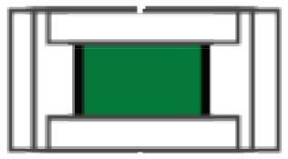

---

## Trang 7

### Meas. Sci. Technol. 31 (2020) 074014

- Bo Wen et al
- Figure 6. A schematic of the differential force measurement system with a pair of PZT force sensor units.
- 3.2. Differential force measurement strategy
- To overcome the aforementioned problems, in this paper, a
- strategy employing a pair of PZT force sensors (referred to
- as the measurement PZT sensor and the reference PZT sensor
- in the following) is proposed. Figure 6 shows a schematic of
- the system for the proposed strategy, where one of the PZT
- sensor units is employed for the force measurement (measure-
- ment sensor unit), while the other is employed to compensate
- for the influences of the bias current from the amplifier and
- the thermal drift of the overall system (reference sensor unit).
- Now we consider the case where a static force FM is applied to
- the measurement PZT sensor, while a static force FR (̸=FM) is
- applied to the reference PZT sensor. Assuming that the charge
- amplifier in the measurement sensor unit is identical to that in
- the reference sensor unit, and the specification of the meas-
- urement PZT sensor is identical to that of the reference PZT
- sensor, the voltage outputs from the measurement and the ref-
- erence sensor units VM and VR, respectively, can be expressed
- as follows:
- VM = FM · d33
- CF
- + K · IBias + f(T)
- (6)
- VR = FR · d33
- CF
- + K · IBias + f(T).
- (7)
- From these equations, the following equation can be
- obtained:
- ∆V = VM −VR = (FM −FR) · d33
- CF
- .
- (8)
- On the assumption that FR is known as a given parameter, a
- static force FM can be detected by taking the difference of the
- voltage outputs of the measurement and the reference sensor
- units.
- 4. Experiments for the verification of the proposed
- strategy with a pair of PZT force sensors
- 4.1. Investigation of the possible influencing factors on the
- stability of measurement
- Experiments were carried out to demonstrate the effectiveness
- of the proposed strategy. In the following, the effect of extend-
- ing the time constant by removing the feedback resistor in the
- charge amplifier, the influence of the bias current from the
- operational amplifier, and the influence of the thermal drift of
- the PZT force sensor units were investigated through experi-
- ments.
- 4.1.1. The effect of extending the time constant by remov-
- ing the feedback resistor in the charge amplifier.
- First, the
- effect of extending the time constant of the charge amplifier
- was investigated. Figures 7(a) and (b) show a schematic and
- a photograph of the setup for the experiment. A PZT force
- sensor with an equivalent piezoelectric charge constant d33
- of 600 × 10−12 C N−1 was fixed on a jig by a screw, and
- was connected to a charge amplifier composed of an oper-
- ational amplifier (ADA4530-1, Analog Devices) with a low
- bias current of within ±20 fA, a feedback capacitor CF of
- 5

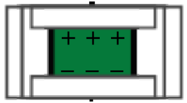

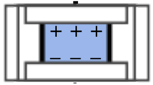

---

## Trang 8

### Meas. Sci. Technol. 31 (2020) 074014

- Bo Wen et al
- Figure 7. A setup for evaluating the time constant of the voltage
- output of a PZT force sensor unit. (a) A schematic of the setup.
- (b) A photograph of the PZT force sensor fixed on the jig.
- 47 nF and a feedback resistor. In the experiments, the voltage
- output of the PZT force sensor unit was monitored while the
- static force applied to the PZT force sensor was suddenly
- reduced by loosening the screw. Figure 8 shows the result. The
- voltage outputs with a feedback resistor of 1 GΩand 10 GΩ
- as well as that without the feedback resistor (corresponding
- to RF = ∞Ω) are plotted in the figure. Time constants of the
- voltage output from the charge amplifier were evaluated to be
- 46.95 s and 417.58 s for the case with a feedback resistor of
- 1 GΩand 10 GΩ, respectively. Each value was found to be
- close to the theoretical values (47 s and 470 s) obtained as the
- product of RF and CF. In addition, as predicted from the theory,
- a time constant for the case without the feedback resistor was
- confirmed to be infinitely large. Meanwhile, a slight increase
- in the voltage output of the PZT force sensor unit, which was
- due to the influences of the bias current from the operational
- amplifier and the thermal drift of the system, was observed.
- 4.1.2. The influence of the bias current from the operational
- amplifier.
- As the next step, the influence of the bias cur-
- rent from the operational amplifier was evaluated. Figure 9(a)
- shows a schematic of the setup for the experiment. Two charge
- amplifiers with identical characteristics were employed while
- the operational amplifiers in these charge amplifiers were
- driven by the same DC power supply (PMM18-2.5DU, Kiku-
- sui Electronics Corp., Japan). It should be noted that the PZT
- force sensors were disconnected from the charge amplifiers
- so that only the influence of the bias current from the oper-
- ational amplifier could be evaluated. Figure 9(b) shows the
- variation of the voltage output from each of the charge amp-
- lifiers, where the PZT force sensors were not connected. The
- differential output of these two voltage outputs obtained by an
- oscilloscope through a signal conditioner with a gain G of 5
- is also plotted in the figure. A linear component and a cyclic
- nonlinear component can both be found in the voltage output
- of the charge amplifier. The linear component was due to the
- influence of the bias current IBias from the operational ampli-
- fier. Denoting the trend of the linear component in the voltage
- output from the charge amplifier as k, the bias current IBias can
- be calculated by the following equation:
- IBias = CF · k
- G
- (9)
- The trend k of the linear component in the voltage output
- from the charge amplifier for the measurement PZT sensor
- was evaluated to be 2.62 × 10−7 V s−1, corresponding to a
- bias current from the operational amplifier of 2.46 fA regard-
- ing a feedback capacitor CF employed in the charge ampli-
- fier (47 nF). In the same manner, the bias current from the
- charge amplifier for the reference PZT sensor was evaluated
- to be 2.51 fA from an observed trend of 2.67 × 10−7 V s−1.
- The bias currents observed in the experiment were on the same
- level, and were within the specification of the operational amp-
- lifier (±20 fA). The cyclic nonlinear component was mainly
- due to the instability of the DC power supply. Since both of the
- charge amplifiers were driven by the same DC power supply,
- the cyclic nonlinear components in the voltage outputs were
- synchronized with each other. Therefore, as can be seen in the
- figure, the influences of these nonlinear and linear compon-
- ents were found to be reduced by one order of magnitude in
- the differential voltage output.
- 4.1.3. The influence of the thermal drift of the PZT force sensor
- units.
- The thermal drift of the system based on the pro-
- posed strategy with a pair of PZT force sensors was also eval-
- uated in experiments. Figure 10 shows a schematic of the
- setup where a pair of PZT force sensors with identical char-
- acteristics was employed aiming to compensate for the influ-
- ences of the thermal drift. The two PZT force sensors were
- connected to identical charge amplifiers. During the experi-
- ment, the room temperature was intentionally changed with an
- air conditioner in the laboratory. Figure 11(a) shows voltage
- outputs of the measurement sensor unit and the reference
- sensor unit, as well as the change in the room temperature.
- A change in the voltage output in a period of 180 s was eval-
- uated to be approximately 1.53 V, corresponding to a force F
- of 23.97 N. As can be seen from the result, the thermal sta-
- bility of the PZT force sensors greatly influences static force
- measurement. Figure 11(b) shows the voltage outputs of the
- measurement sensor unit and the reference sensor unit with
- respect to the change in the temperature, which were re-plotted
- from the data shown in figure 11(a). Temperature sensitiv-
- ity coefficients of the voltage outputs from the measurement
- 6

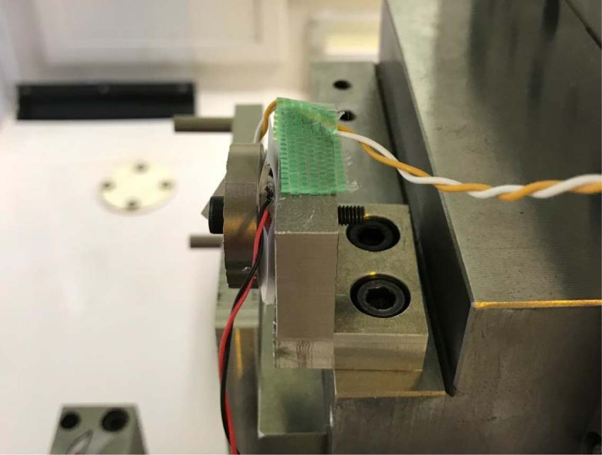

---

## Trang 9

### Meas. Sci. Technol. 31 (2020) 074014

- Bo Wen et al
- Figure 8. Variation of the voltage output of the PZT force sensor unit with different feedback resistors.
- (a)
- (b)
- Figure 9. Influence of the bias current in the charge amplifiers in
- the measurement sensor unit and the reference sensor unit. (a)
- Circuit configuration of the force sensor unit for the experiment.
- (b) Voltage outputs from the sensor units.
- sensor unit and the reference sensor unit after passing through
- the signal conditioner were evaluated to be −3.314 V/◦C
- and −3.246 V/◦C, respectively, and were found to be close
- to each other. These identical temperature sensitivity coeffi-
- cients of the PZT force sensor contribute to stabilizing the
- differential voltage output. A peak-to-peak deviation of the
- differential voltage output in a period of 180 s was evalu-
- ated to be 0.047 V, corresponding to the change in a force F
- of 0.736 N. By employing the proposed differential strategy,
- the thermal stability of the force measurement (0.736 N over
- 180 s) was improved to be 3% of that in the conventional
- method where a sole PZT force sensor was employed (23.97 N
- over 180 s). Table 1 summarizes the thermal sensitivities of
- the voltage outputs of the two force sensors and that of the
- differential output. These experimental results demonstrated
- the feasibility of the proposed strategy in reducing the influ-
- ences of the bias currents from the operational amplifier and
- the thermal drift of the overall system.
- Following the above investigation, experiments were exten-
- ded to the measurement of a static force based on the proposed
- differential strategy with the pair of PZT force sensors. In
- the experimental setup, the measurement axes of the measure-
- ment PZT sensor and the reference PZT sensor were aligned
- in the direction of gravity. By using weights, static forces
- FM (1.45 N) and FR (0.50 N) were applied simultaneously to
- the measurement PZT sensor and the reference PZT sensor,
- respectively. Figure 12 shows the voltage outputs of the two
- sensor units as well as the differential voltage output. As can
- be seen in the figure, a large drift component caused by the
- influences of bias currents from the operational amplifiers and
- the thermal drift of the system was observed in the voltage
- outputs of the PZT force sensor units. On the other hand, the
- differential output was almost kept constant over a period of
- 2000 s; this was much longer than the stable period of commer-
- cial piezoelectric force sensors on the order of several seconds.
- These results demonstrated the feasibility of the proposed dif-
- ferential strategy for the measurement of the static force.
- 4.2. Modification of the FS-FTS unit based on the proposed
- differential strategy with a pair of PZT force sensors
- To further verify the feasibility of the proposed differential
- strategy, a modification is made to the conventional FS-FTS
- unit. Figure 13(a) shows the modified FS-FTS unit designed
- in this paper. Two ring-shaped PZT force sensors made of
- identical material but having different diameters are integ-
- rated into the modified FS-FTS unit. The PZT force sensors
- are placed between the tool holder and the PZT actuator, and
- the measurement axes of the force sensors are designed to be
- aligned to coincide with the axis of the FS-FTS unit so that the
- FS-FTS unit based on the proposed strategy becomes compact.
- 7

---

## Trang 10

### Meas. Sci. Technol. 31 (2020) 074014

- Bo Wen et al
- Figure 10. A schematic of the developed system based on the proposed differential strategy.
- (a)
- (b)
- Figure 11. Thermal drift of the voltage outputs of the PZT force sensor units. (a) Variation of the outputs of the sensor units.
- (b) Relationship between the output and the temperature.
- 8

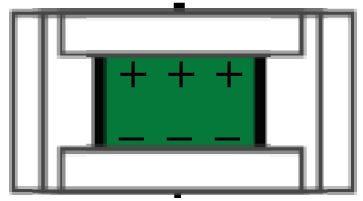

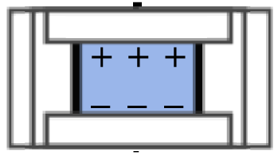

---

## Trang 11

### Meas. Sci. Technol. 31 (2020) 074014

- Bo Wen et al
- Table 1. Thermal stabilities of the force sensor outputs.
- Measurement sensor
- output
- Reference sensor
- output
- Differential output
- −3.314 V/◦C
- −3.246 V/◦C
- −0.068 V/◦C
- (−51.917 N/◦C)
- (−50.852 N/◦C)
- (−1.065 N/◦C)
- Figure 12. Off-machine static force measurement based on the
- proposed differential strategy.
- This design is also expected to improve the thermal stability of
- the differential output, since the two force sensors are placed
- close to each other. In the setup, the thrust force F applied to
- the diamond tool on the modified FS-FTS unit is received by
- the two PZT force sensors. Denoting the cross-sectional areas
- of the measurement PZT sensor and the reference PZT sensor
- as AM and AR, respectively, the voltage output from each of
- the force sensor units can be expressed as follows based on
- equation (5):
- VM = d33
- CF
- ·
- AM
- AM + AR
- · F + K · IBias + f(T)
- (10)
- VR = d33
- CF
- ·
- AR
- AM + AR
- · F + K · IBias + f(T).
- (11)
- As can be seen in the above equations, the sensitivity of
- the PZT force sensor unit depends on the equivalent piezo-
- electric constant d33 identical to the material and the feed-
- back capacitor CF, regardless of the sensor size. Therefore, on
- the assumption that identical charge amplifiers are employed
- for both of force sensor units and the thermal drifts of the
- force sensor units are the same, the following equation can be
- obtained:
- ∆V = VM −VR = −d33
- CF
- AM −AR
- AM + AR
- · F.
- (12)
- Since AM and AR are known as the design parameters of the
- FS-FTS unit, the static force F can be obtained by observing
- the voltage outputs VM and VR of the force sensor units, while
- reducing the influences of the bias currents in the charge amp-
- lifiers and the thermal drifts of the force sensor units.
- (a)
- (b)
- Figure 13. The modified FS-FTS unit based on the proposed
- differential strategy. (a) Schematic of the modified FS-FTS unit.
- (b) Photograph of the modified FS-FTS unit with two PZT force
- sensors.
- The feasibility of the modified FS-FTS was verified through
- experiments. Figure 13(b) shows a photograph of the modified
- FS-FTS with the ring-shaped PZT force sensors. Both force
- sensors were connected to different charge amplifiers hav-
- ing identical operational amplifiers whose feedback capacitor
- CF and feedback resistor RF were set to be 47 nF and ∞Ω,
- respectively. The modified FS-FTS with a single-point dia-
- mond tool with a round nose radius of 2 mm and a clearance
- angle of 7◦(ALMT Corp., Japan) was mounted on the four-
- axis ultra-precision diamond turning machine. An aluminum
- workpiece was mounted on the spindle of the machine. In
- the experiments, a static thrust force was applied to the dia-
- mond cutting tool by making the tool tip contact with a work-
- piece surface and held stationary along the in-feed direction.
- By using the PZT actuator in the modified FS-FTS unit, the
- tool tip was made to travel along the in-feed direction in a
- step of 1 µm. The contact between the diamond tool and the
- workpiece surface could be detected through monitoring the
- voltage outputs of the force sensor units. Once the contact was
- detected, both the aluminum workpiece and the diamond tool
- were held stationary while the variations of the voltage outputs
- 9

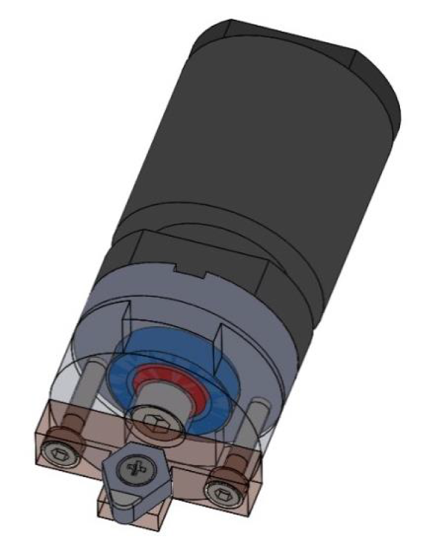

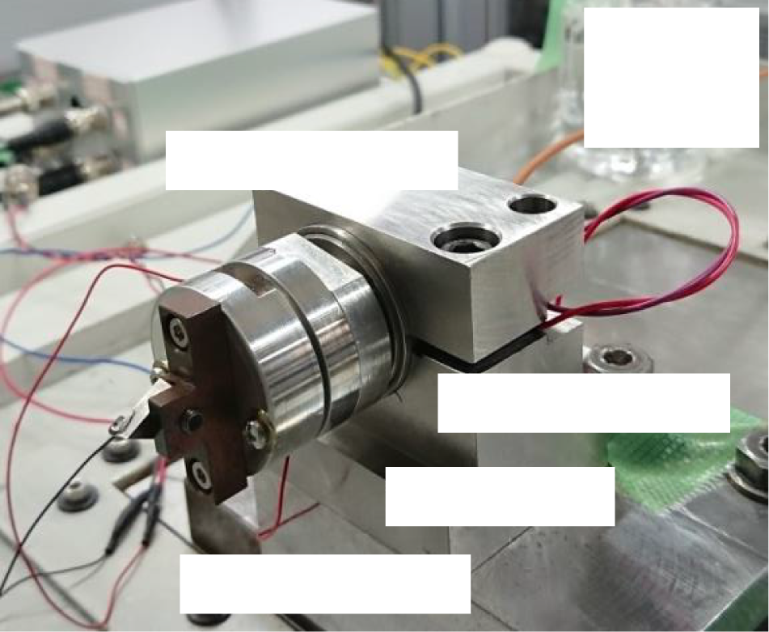

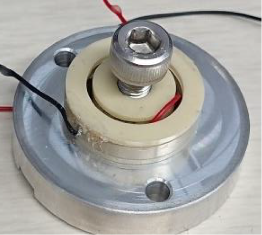

---

## Trang 12

### Meas. Sci. Technol. 31 (2020) 074014

- Bo Wen et al
- (a)
- (b)
- Figure 14. On-machine measurement of a static force applied to the
- modified FS-FTS unit based on the proposed differential strategy.
- (a) Voltage outputs of the sensor units during the contact between
- the tool tip and the workpiece surface. (b) The obtained differential
- output.
- of the force sensor units were monitored. Figures 14(a) and (b)
- show the voltage outputs of the force sensor units and the dif-
- ferential voltage output, respectively, over a period of 240 s.
- The differential voltage output was found to be stable during
- tool–workpiece contact. The peak-to-peak deviation of the dif-
- ferential voltage output was evaluated to be 9.6 mV, corres-
- ponding to a deviation of the detected force F of 0.150 N. This
- result demonstrated the feasibility of measuring static force by
- using the PZT force sensors integrated into the modified FS-
- FTS unit.
- 5. Summary
- A differential strategy has been proposed in this paper to
- achieve static force measurement in a force sensor-integrated
- fast tool servo (FS-FTS) system for controlling a cutting tool
- in force. First, cutting experiments were done to investig-
- ate the stability of the PZT force sensor employed in the
- conventional FS-FTS system. Through the cutting process of
- several microgrooves with different feed rates ranging from
- 0.2 mm min−1 to 3.0 mm min−1, the instability of the PZT
- force sensor in the conventional FS-FTS has been verified.
- To achieve the cutting operation over a large area by force
- feedback control, a new strategy referred to as the differen-
- tial force measurement strategy employing a pair of PZT force
- sensors has been proposed. In the proposed strategy, the time
- constant of the voltage output of the force sensor unit, which
- is composed of a PZT force sensor and a charge amplifier,
- was set to be infinitely large by removing the feedback resistor
- from the charge amplifier. The influence of the bias current
- from the operational amplifier, which arises with the removal
- of the feedback resistor, was compensated through employing
- a pair of PZT force sensors and obtaining the differential out-
- put of the two sensors. This setup is also expected to reduce the
- influences of the thermal drifts of the PZT force sensor units,
- which is another issue to be addressed for the measurement
- of static force based on the PZT force sensor. A theoretical
- model for the PZT force sensor unit has been established, and
- the effectiveness of increasing the time constant of the voltage
- output of the PZT force sensor unit, the influences of the bias
- current in the charge amplifier as well as the thermal drift of
- the overall system have been investigated through some fun-
- damental experiments. In addition, the result of the static force
- measurement based on the developed setup with identical PZT
- force sensors and charge amplifiers has demonstrated that the
- proposed differential strategy can realize static force measure-
- ment over a period of 2000 s with a deviation of the detec-
- ted force of 0.736 N, which cannot have been realized by the
- piezoelectric force sensor in the conventional FS-FTS unit.
- Furthermore, a design modification has been made for the FS-
- FTS unit to integrate two PZT force sensors into the unit, and
- the experimental result has demonstrated that the modified FS-
- FTS unit based on the proposed differential strategy can carry
- out stable on-machine measurement of a static force over a
- period of 240 s.
- It should be noted that this paper has focused on the pro-
- posal and demonstration of the newly proposed differential
- strategy. Further applications of the modified FS-FTS unit
- based on the strategy for the diamond cutting process con-
- trolled in force, as well as the uncertainty analysis of the force
- feedback control, will be carried out as future work.
- Acknowledgment
- This research is supported by the Japan Society for the Pro-
- motion of Science (JSPS).
- ORCID iD
- Hiraku Matsukuma https://orcid.org/0000-0001-8125-
- 9708
- 10

---

## Trang 13

### Meas. Sci. Technol. 31 (2020) 074014

- Bo Wen et al
- References
- [1] Fang F Z and Xu F 2018 Recent advances in
- micro/nano-cutting: effect of tool edge and material
- properties Nanomanuf. Metrol. 1 4–31
- [2] Fang F Z, Zhang X D, Gao W, Guo Y B, Byrne G and
- Hansen H N 2017 Nanomanufacturing-perspective and
- applications CIRP Ann. 66 683–705
- [3] Gao W, Dejima S, Yanai H, Katakura K, Kiyono S and
- Tomita Y 2004 A surface motor-driven planar motion stage
- integrated with an XYθZ surface encoder for precision
- positioning Precis. Eng. 28 329–37
- [4] Gao W, Kim S W, Bosse H, Haitjema H, Chen Y L, Lu X D,
- Knapp W, Weckenmann A, Estler W T and Kunzmann H
- 2015 Measurement technologies for precision positioning
- CIRP Ann. 64 773–96
- [5] Yang X, Yang X, Sun R, Kawai K, Arima K and Yamamura K
- 2019 Obtaining atomically smooth 4H–SiC (0001) surface
- by controlling balance between anodizing and polishing in
- electrochemical mechanical polishing Nanomanuf. Metrol.
- 2 140–7
- [6] Gao W, Haitjema H, Fang F Z, Leach R K, Cheung C F,
- Savio E and Linares J M 2019 On-machine and in-process
- surface metrology for precision manufacturing CIRP Ann.
- 68 843–66
- [7] Miller M H, Garrard K P, Dow T A and Taylor L W 1994 A
- controller architecture for integrating a fast tool servo into a
- diamond turning machine Precis. Eng. 16 42–48
- [8] Gao W, Araki T, Kiyono S, Okazaki Y and Yamanaka M 2003
- Precision nano-fabrication and evaluation of a large area
- sinusoidal grid surface for a surface encoder Precis. Eng.
- 27 289–98
- [9] Fang F Z and Venkatesh V C 1998 Diamond cutting of silicon
- with nanometric finish CIRP Ann. 47 45–49
- [10] Wang J, Fang F Z, Yan G and Guo Y 2019 Study on
- diamond cutting of ion implanted tungsten carbide with and
- without ultrasonic vibration Nanomanuf. Metrol.
- 2 177–85
- [11] Brinksmeier E, Mutlugünes Y, Klocke F, Aurich J C, Shore P
- and Ohmori H 2010 Ultra-precision grinding CIRP Ann.
- 59 652–71
- [12] Brinksmeier E, Riemer O, Gl¨abe R, Lünemann B,
- Kopylow C V, Dankwart C and Meier A 2010 Submicron
- functional surfaces generated by diamond machining CIRP
- Ann. 59 535–8
- [13] Wang J, Chen R, Zhang X and Fang F Z 2018 Study on
- machinability of silicon irradiated by swift ions Precis. Eng.
- 51 577–81
- [14] Gao W, Chen Y L, Lee K W, Noh Y J, Shimizu Y and Ito S
- 2013 Precision tool setting for fabrication of a
- microstructure array CIRP Ann. 62 523–6
- [15] Chen Y L, Gao W, Ju B F, Shimizu Y and Ito S 2014 A
- measurement method of cutting tool position for relay
- fabrication of microstructured surface Meas. Sci. Technol.
- 25 064018
- [16] Jacob J C, Linares J M and Sprauel J M 2015 Control of the
- contact force in a pre-polishing operation of free-form
- surfaces realised with a 5-axis CNC machine CIRP Ann.
- 64 309–12
- [17] Kawasegi N, Takano N, Oka D, Morita N, Yamada S,
- Kanda K, Takano S, Obata T and Ashida K 2006
- Nanomachining of silicon surface using atomic force
- microscope with diamond tip J. Manuf. Sci. Eng. 128 723–9
- [18] Teti R, Jemielniak K, O’Donnell G and Dornfeld D 2010
- Advanced monitoring of machining operations CIRP Ann.
- 59 717–39
- [19] Guo J, Suzuki H, Morita S Y, Yamagata Y and Higuchi T 2013
- A real-time polishing force control system for ultraprecision
- finishing of micro-optics Precis. Eng. 37 787–92
- [20] Malshe A P et al 2010 Tip-based nanomanufacturing by
- electrical, chemical, mechanical and thermal processes
- CIRP Ann. 59 628–51
- [21] Park S S, Mostofa M G, Park C I, Mehrpouya M and Kim S
- 2014 Vibration assisted nano mechanical machining using
- AFM probe CIRP Ann. 63 537–40
- [22] Geng Y, Yan Y, Wang J and Zhuang Y 2018 Fabrication of
- nanopatterns on silicon surface by combining AFM-based
- scratching and RIE methods Nanomanuf. Metrol. 1 225–35
- [23] Herrera-Granados G, Morita N, Hidai H, Matsusaka S,
- Chiba A, Ashida K, Ogura I and Okazaki Y 2016
- Development of a non-rigid micro-scale cutting mechanism
- applying a normal cutting force control system Precis. Eng.
- 43 544–53
- [24] Puangmali P, Althoefer K, Seneviratne L D, Murphy D and
- Dasgupta P 2008 State-of-the-art in force and tactile sensing
- for minimally invasive surgery IEEE Sens. J. 8 371–81
- [25] Liu J, Luo X, Liu J, Li M and Qin L 2017 Development of a
- commercially viable piezoelectric force sensor system for
- static force measurement Meas. Sci. Technol.
- 28 095103
- [26] Cheng K and Huo D, ed 2013 Micro-Cutting (United
- Kingdom: Wiley) (https://doi.org/10.1002/9781118536605)
- [27] Gautschi G 2002 Piezoelectric Sensorics (Berlin: Springer)
- (https://doi.org/10.1007/978-3-662-04732-3)
- [28] Chen Y L, Cai Y, Tohyama K, Shimizu Y, Ito S and Gao W
- 2017 Auto-tracking single point diamond cutting on
- non-planar brittle material substrates by a high-rigidity
- force controlled fast tool servo Precis. Eng. 49 253–61
- [29] Chen Y L, Cai Y, Tohyama K, Shimizu Y, Ito S, Gao W and
- Ju B F 2015 Ductile cutting of silicon microstructures with
- surface inclination measurement and compensation by
- using a force sensor integrated single point diamond tool J.
- Micromech. Microeng. 26 025002
- [30] Chen Y L, Wang S, Shimizu Y, Ito S, Gao W and Ju B F 2015
- An in-process measurement method for repair of defective
- microstructures by using a fast tool servo with a force
- sensor Precis. Eng. 39 134–42
- [31] Gao W, Shimizu Y, Hane K, Soyama H and Adachi K 2017
- Measurement and Instrumentation: Bilingual Edition
- (Tokyo: Asakura Publishing)
- 11
- View publication stats

---
