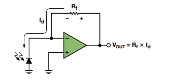
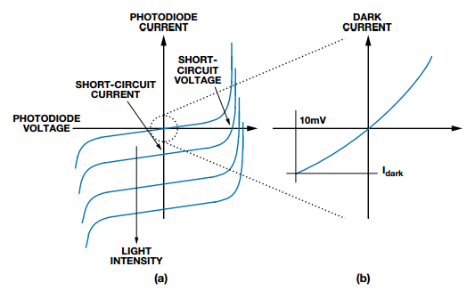
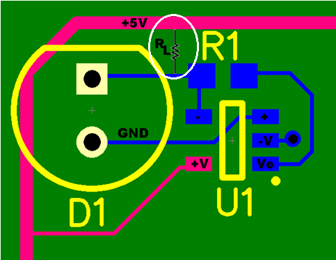
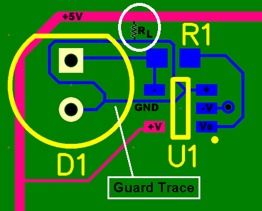
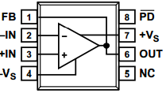
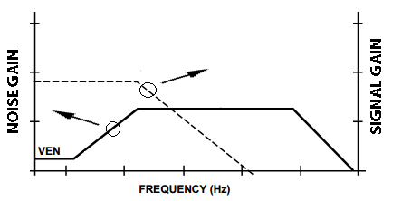

# Optimizing-Precision-Photodiode-Sensor-Circuit-Design-MS-2624

> Tài liệu chuyển đổi từ PDF: `Optimizing-Precision-Photodiode-Sensor-Circuit-Design-MS-2624.pdf`

---

## Trang 1

### Technical Article 

- MS-2624
- .
- Optimizing Precision
- Photodiode Sensor Circuit
- Design
- by Luis Orozco, system applications engineer,
- Analog Devices, Inc.
- Photodiodes are one of the most popular sensor types for
- many light-based measurements. Applications such as
- absorption and emission spectroscopy, color measurement,
- turbidity, gas detection, and more, all rely on photodiodes
- for precision light measurement.
- Photodiodes generate a current proportional to the light that
- strikes their active area. Most measurement applications
- involve using a transimpedance amplifier to convert the
- photodiode current into an output voltage. Figure 1 shows a
- simplified schematic of what the circuit could look like.
- Figure 1. Simple Transimpedance Amplifier Circuit
- This circuit operates the photodiode in photovoltaic mode,
- where the op amp keeps the voltage across the photodiode at
- 0 V. This is the most common configuration for precision
- applications. The photodiode’s voltage vs. current curve is
- very similar to that of a regular diode, with the exception
- that the entire curve will shift up or down as the light level
- changes. Figure 2a shows a typical photodiode transfer
- function. Figure 2b is a zoomed-in view of the transfer
- function, and it shows how a photodiode outputs a small
- current even if there is no light present. This “dark current”
- grows with increasing reverse voltage across the photodiode.
- Most manufacturers specify photodiode dark current with a
- reverse voltage of 10 mV.
- Figure 2. Typical Photodiode Transfer Function
- Current flows from cathode to anode when light strikes the
- photodiode’s active area. Ideally, all of the photodiode
- current flows through the feedback resistor of Figure 1,
- generating an output voltage equal to the photodiode
- current multiplied by the feedback resistor. The circuit is
- conceptually simple, but there are a few challenges you must
- address to get the best possible performance from your
- system.
- DC CONSIDERATIONS
- The first challenge is to select an op amp with dc
- specifications that match your application’s requirements.
- Most precision applications will have low input offset voltage
- at the top of the list. The input offset voltage appears at the
- output of the amplifier, contributing to the overall system
- error, but in a photodiode amplifier, it generates additional
- error. The input offset voltage appears across the photodiode
- and causes increased dark current, which further increases
- the system offset error. You can remove the initial dc offset
- through software calibration, ac coupling, or a combination
- of both, but having large offset errors decreases the system’s
- dynamic range. Fortunately, there is a wide selection of op
- amps with input offset voltage in the hundreds or even tens
- of microvolts.
- The next important dc specification is the op amp’s input-
- leakage current. Any current that goes into the input of the
- op amp, or anywhere else other than through the feedback
- resistor, results in measurement errors. There are no op
- amps with zero input bias current, but some CMOS or JFET
- input op amps get close. For example, the AD8615 has a
- maximum input bias current of 1 pA at room temperature.
- The classic AD549 has a maximum input bias current of
- 60 fA that is guaranteed and production tested. The input
- bias current of FET input amplifiers increases exponentially
- www.analog.com
- Page 1 of 5
- ©2014 Analog Devices, Inc. All rights reserved.

---

## Trang 2

### MS-2624 

- Technical Article
- as temperature rises. Many op amps include specifications at
- 85°C or 125°C, but for those that do not, a good
- approximation is that the current will double for every
- 10 degrees of temperature increase.
- Another challenge is designing a circuit and layout to
- minimize external leakage paths that could ruin the
- performance of your low input bias current op amp. The
- most common external leakage path is through the printed
- circuit board itself. For example, Figure 3 shows one possible
- layout of the photodiode amplifier schematic of Figure 1.
- The pink trace is the +5 V rail that powers the amplifier and
- goes off to other parts of the board. If the resistance through
- the board between the +5 V trace and the trace carrying the
- photodiode current is 5 GΩ (shown as RL in Figure 3), 1 nA
- of current will flow from the +5 V trace into the amplifier.
- This would obviously defeat the purpose of carefully
- selecting a 1 pA op amp for the application. One way to
- minimize this external leakage path is to increase the
- resistance between the trace carrying the photodiode current
- and any other traces. This can be as simple as adding a large
- routing keep-out around the trace to increase the distance to
- other traces. For some extreme applications, some engineers
- will eliminate PCB routing altogether and run the
- photodiode lead through air directly into the op amp’s
- input pin.
- Figure 3. Photodiode Layout with Leakage Path
- Another way to prevent external leakage is to run a guard
- trace adjacent to the trace carrying photodiode current,
- making sure both are driven to same voltage. Figure 4 shows
- a guard trace around the net carrying the photodiode
- current. The leakage current caused by the +5 V trace now
- flows through RL into the guard trace rather than into the
- amplifier. In this circuit, the voltage difference between the
- guard trace and the input trace is only due to the op amp’s
- input offset voltage, which is another reason to select an
- amplifier with low input offset voltage.
- Figure 4. Using a Guard Trace to Reduce External Leakage
- AC CONSIDERATIONS
- Although most precision photodiode applications tend to be
- low speed, we still need to make sure the system’s ac
- performance is adequate for the application. The two main
- concerns here are the signal bandwidth (or closed-loop
- bandwidth) and the noise bandwidth.
- The closed-loop bandwidth depends on the open-loop
- bandwidth of the amplifier, the gain resistor, and the total
- input capacitance. Photodiode input capacitance can vary
- widely from a few picofarads for high speed photodiodes, to
- a few thousand picofarads for very large area precision
- photodiodes. However, adding capacitance on the input of
- an op amp causes it to become unstable unless you
- compensate it by adding capacitance across the feedback
- resistor. The feedback capacitance limits the closed-loop
- bandwidth of the system. You can use Equation 1 to
- calculate the maximum possible closed-loop bandwidth that
- will result in a phase margin of 45 degrees.
- 𝑓𝑓45 = ට
- 𝑓𝑢
- 2𝜋∙𝑅𝐹∙(𝐶𝐼𝑁+𝐶𝑀+𝐶𝐷)
- Equation 1
- Where:
- fU is the amplifier’s unity gain frequency.
- RF is the feedback resistor.
- CIN is the input capacitance, which includes diode
- capacitance and any other parasitic capacitance on the
- board, etc.
- CM is the common mode capacitance of the op amp.
- CD is the differential capacitance of the op amp.
- Page 2 of 5

---

## Trang 3

### Technical Article 

- MS-2624
- For example, if you have an application with 15 pF of
- photodiode capacitance and 1 MΩ of transimpedance gain,
- Equation 1 predicts you would need an amplifier with unity
- gain bandwidth of about 95 MHz to achieve a 1 MHz signal
- bandwidth. This is with a 45° phase margin, which will cause
- peaking during step changes in signal. You may want to
- reduce the peaking by designing for a 60° phase margin or
- higher, which would require a faster amplifier. This is why
- parts like the ADA4817-1, with 20 pA of maximum input
- bias current and a unity gain frequency of around 400 MHz
- are a good fit for high gain photodiode applications, even for
- moderate bandwidths.
- The photodiode capacitance will dominate the total input
- capacitance in most systems, but some applications may
- require extra care in selecting an op amp with very low input
- capacitance. To address this issue, some op amps are
- available with special pinouts designed to reduce input
- capacitance. For example, Figure 5 shows the ADA4817-1’s
- pinout, which routes the op amp output to a pin adjacent to
- the inverting input.
- Figure 5. ADA4817-1 Pinout is Optimized for Low Parasitic Capacitance
- System noise is typically another challenge when designing
- with photodiodes. The main contributors to output noise are
- the amplifier’s input voltage noise and the feedback resistor’s
- Johnson noise. The noise from the feedback resistor appears
- at the output without additional amplification. If you
- increase the size of the resistor to amplify the photodiode
- current, the increase in noise due to the gain resistor will
- only increase by the square root of the resistor value
- increase. In practical terms, this means it is beneficial to
- have as much gain as possible in the photodiode amplifier
- rather than adding a second amplifier stage, where the noise
- will increase linearly with gain.
- The output noise of the amplifier is the input voltage noise
- multiplied by the amplifier’s noise gain. The noise gain is
- determined not just by the feedback resistor, but also by the
- feedback and input capacitors, so it is not constant over
- frequency. Figure 6 shows a typical plot of amplifier noise
- gain vs. frequency, with the closed-loop gain superimposed
- for reference. The two things you can learn from this plot are
- that the output noise increases at some frequencies and the
- frequency range where the noise peaks can be beyond the
- amplifier’s closed-loop cutoff bandwidth.
- Figure 6. The Noise Gain of a Photodiode Amplifier Increases at Higher
- Frequencies
- Because you can’t take advantage of this bandwidth, use a
- low-pass filter set to the signal bandwidth of the amplifier to
- reduce the noise.
- USING PROGRAMMABLE GAINS TO EXTEND DYNAMIC
- RANGE
- Because the Johnson noise of the feedback resistor increases
- with the square root of the resistance, it makes sense to have
- as much gain as possible in the photodiode amplifier, rather
- than in a second stage. You can take this one step further by
- adding programmable gain to your photodiode amplifier as
- in the circuit of Figure 7.
- Rf1
- Cf1
- Cf2
- Rf2
- S1
- Figure 7. The Concept of a Programmable Gain Photodiode Amplifier
- Switch S1 selects the desired feedback path so that you can
- select the optimal gain for different signals. Unfortunately,
- analog switches have on resistance that will introduce gain
- errors to our circuit. This on resistance will change with
- applied voltage, temperature, and other factors, so you must
- find a way to eliminate it from the circuit. Figure 8 shows
- how you can use two sets of switches to remove the error due
- to the on resistance in the feedback loop. With this circuit,
- Page 3 of 5

---

## Trang 4

### MS-2624 

- Technical Article
- you have one switch inside the feedback loop just like
- Figure 7, but instead of looking at the voltage on the output
- of the amplifier, switch S2 connects the output of the circuit
- directly to the gain resistor. This eliminates any gain errors
- due to current flowing through switch S1. One of the trade-
- offs when using this circuit is that the output no longer has
- the very low impedance associated with amplifier outputs,
- since it includes the on resistance of multiplexer S2. This is
- usually not a big problem if the next stage has a high
- impedance input, such as with an ADC driver.
- Rf1
- Cf1
- Rf2
- Cf2
- -
- +
- S1
- S2
- Figure 8. Using Two Sets of Switches Reduces Errors Due to Additional
- Resistance Inside the Loop
- USING MODULATION AND SYNCHRONOUS DETECTION TO
- REDUCE NOISE
- Many precision applications involve measuring a dc light
- level absorbed or reflected through a sample.
- While some applications allow shielding from all ambient
- light, many other systems, mainly in industrial
- environments, have to operate exposed to ambient light. In
- this case, you can modulate the light source and use
- synchronous detection to move your signal away from the
- low frequency spectrum where electrical and optical
- interference is the highest. The simplest form of modulation
- is to rapidly turn the light source on and off. Depending on
- the light source, you can electronically modulate it, or as is
- the case in some older instruments, you can use a
- mechanical chopper to block the light at a given rate.
- For example, if you are interested in measuring light
- absorption through a substance to determine concentration,
- you can chop the light source at a few kHz. Figure 9 shows
- how this results in moving the measurement away from
- most of the low frequency light pollution typically present in
- most environments, such as changes in the ambient light
- level due to time of day, 50 Hz/60 Hz fluorescent lights, and
- the like.
- fm
- 3fm
- 5fm
- Amplitude
- Frequency
- Ambient Noise
- Modulated Signal
- Figure 9. Chopping the Input Signal Moves the Information to the Chopping
- Frequency and Away from Ambient Noise
- Because you control the frequency of the modulation signal,
- you can use the same clock to synchronously demodulate the
- received light. The circuit of Figure 10 is a very simple
- synchronous demodulator. The voltage at the output of the
- photodiode amplifier is ac-coupled and then passed through
- an amplifier with programmable gain of +1 and –1. The gain
- switch is synchronized to set the gain to +1 exactly when the
- light is expected to be on, and to –1 when the light is
- expected to be off. Ideally, the output would then be a dc
- voltage corresponding to the amplitude of the light pulses.
- The low-pass filter rejects any other signals that are not
- synchronous to the modulation clock. The cutoff frequency
- of the low-pass filter is equivalent to the width of a band-
- pass filter around the modulation frequency. For example, if
- the modulation frequency is 5 kHz and you use a low-pass
- filter with bandwidth of 10 Hz, the output of the circuit
- would pass signals from 4.99 kHz to 5.01 kHz. Lowering the
- low-pass filter bandwidth results in stronger rejection at the
- expense of slower settling time.
- Figure 9 also shows an additional caveat when using
- chopping. The resulting waveform is not a single line in the
- frequency domain (which would require a sine wave), but
- rather a line at the chopping frequency and its odd
- harmonics. Any noise present at the odd harmonics of the
- chopping frequency will appear at the output with minimal
- attenuation. You can completely eliminate this by using sine
- wave modulation, but that requires more complex or
- expensive circuitry. Another solution is to pick an oddball
- fundamental frequency whose harmonics do not coincide
- with any known sources of interference. You can also
- implement the same functionality of Figure 10 in firmware.
- You can sample the chopped light signal synchronously with
- the modulation clock and use digital signal processing
- Page 4 of 5

---

## Trang 5

### Technical Article 

- MS-2624
- techniques to extract the amplitude information at the
- frequency of interest.
- AD8615
- AD8615
- Vo
- Vo
- Vo
- Vo
- AD8271
- ADG733
- Chopper
- Clock
- Figure 10. Synchronous Detection Circuit
- CONCLUSION
- Photodiode amplifiers are an important building block of
- most precision optical measurement systems. Selecting the
- right op amp is an important first step in obtaining the best
- possible system performance, and using other performance
- enhancing techniques such as using programmable gains
- and synchronous detection can help boost dynamic range
- and reject noise. If you are interested in learning more about
- precision photodiode circuits, please visit
- http://instrumentation.analog.com/en/chemical-
- analysis/segment/im.html.
- AUTHOR
- Luis Orozco [luis.orozco@analog.com] is a system
- applications engineer in ADI’s industrial and
- instrumentation segment. Before joining ADI in 2011, he
- designed precision measurement equipment for 11 years. He
- currently focuses on test and measurement, chemical
- analysis, and environmental monitoring applications.
- REFERENCES
- CN0312 Circuit Note. Dual-Channel Colorimeter with
- Programmable Gain Transimpedance Amplifiers and
- Synchronous Detectors.
- Orozco, Luis. “Programmable Gain Transimpedance
- Amplifiers Maximize Dynamic Range in Spectroscopy
- Systems.” Analog Dialogue, Volume 47. Issue 5, 2013.
- ADA4817 Data Sheet.
- Johnson, Mark. Photodetection and Measurement:
- Maximizing Performance in Optical Systems. New York:
- McGraw-Hill, 2003.
- RESOURCES
- Share this article on
- One Technology Way • P.O. Box 9106 • Norwood, MA 02062-9106, U.S.A.
- Tel: 781.329.4700 • Fax: 781.461.3113 • www.analog.com
- Trademarks and registered trademarks are the property of their
- respective owners.
- TA12631-0-8/14
- www.analog.com
- ©2014 Analog Devices, Inc. All rights reserved.
- Page 5 of 5

---
