# de-cuong-on-tap-ky-thuat-do-luong-va-cam-bien-k62-uet-450

> Tài liệu chuyển đổi từ PDF: `de-cuong-on-tap-ky-thuat-do-luong-va-cam-bien-k62-uet-450.pdf`

---

## Trang 1

- KỸ THUẬT ĐO LƯỜNG
- VÀ CẢM BIẾN
- Đề cương ôn tập cuối kỳ
- Nguyễn Ngọc Linh
- nlnguyen@vnu.edu.vn

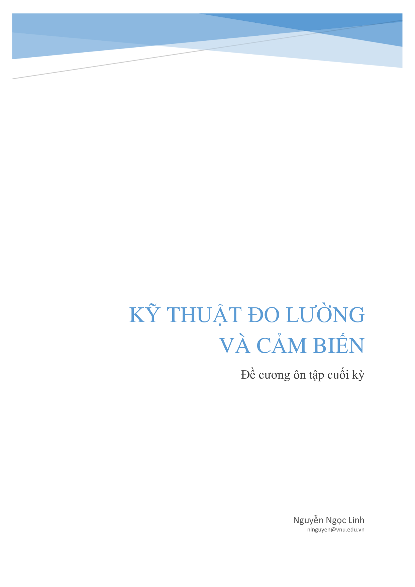

---

## Trang 2

- 1
- Phần I: Lý thuyết:
- Câu 1: Trình bày phương pháp và các lưu ý khi đo dòng điện
- Câu 2: Trình bày phương pháp và các lưu ý khi đo điện áp
- Câu 3: Trình bày phương pháp và các lưu ý khi đo điện trở
- Câu 4: Trình bày phương pháp và các lưu ý khi đo điện dung, điện cảm, hỗ cảm.
- Câu 5: Trình bày các sơ đồ đo công suất tác dụng sử dụng oát mét.
- Câu 6: Trình bày cấu tạo, nguyên lý của các loại cảm biến đã học.

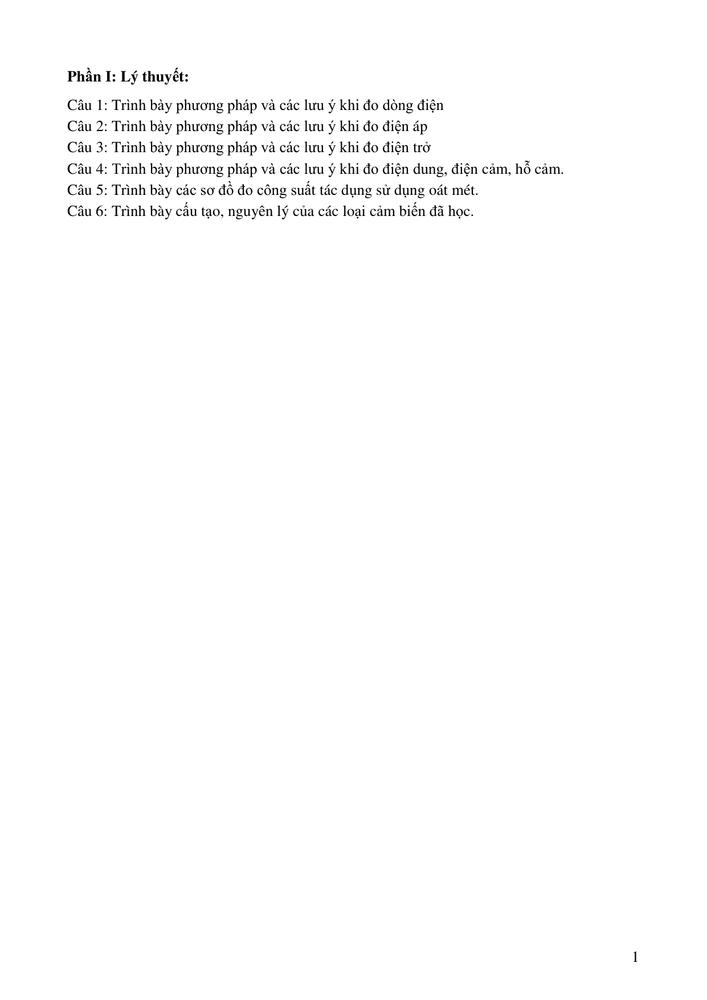

---

## Trang 3

- 2
- Phần II: Bài tập
- Đo điện áp – dòng điện
- Bài 1. Một vôn-kế có tầm đo 5V được mắc vào mạch đo điện áp 2 đầu điện trở 𝑅𝑅2 như hình
- vẽ.
- a. Tính điện áp 𝑉𝑉𝑅𝑅2 khi chưa mắc V
- b. Tính 𝑉𝑉𝑅𝑅2 khi mắc V có độ nhạy 20𝑘𝑘Ω/𝑉𝑉
- Bài 2. Một cơ cấu đo từ điện có dòng toàn dải 𝐼𝐼𝑓𝑓𝑓𝑓=
- 100𝜇𝜇𝜇𝜇 và điện trở nội 𝑅𝑅𝑚𝑚= 1𝑘𝑘Ω được sử dụng làm vôn-kế
- AC có tầm đo 100V(RMS). Mạch chỉnh lưu có dạng cầu sử
- dụng điốt có 𝑉𝑉𝐹𝐹= 0.7𝑉𝑉
- a. Tính điện trở nối tiếp 𝑅𝑅𝑆𝑆
- b. Tính độ lệch của vôn-kế khi điện áp đưa vào vôn-kế là
- 75V bà 50V (RMS)
- c. Tính độ nhạy của vôn-kế. Tín hiệu đo là tín hiệu xoay chiều dạng sin
- Bài 3. Một cơ cấu đo từ điện có: 𝐼𝐼𝑓𝑓𝑓𝑓= 50𝜇𝜇𝜇𝜇, 𝑅𝑅𝑚𝑚=
- 1700Ω kết hợp với mạch chỉnh lưu bán kỳ. Điốt D1 có
- giá trị dòng điện thuận 𝐼𝐼𝐹𝐹(đỉnh) tối thiểu là 100𝜇𝜇𝜇𝜇. Khi
- điện áp đo bằng 20% 𝑉𝑉𝑡𝑡ầ𝑚𝑚 đ𝑜𝑜, điốt có 𝑉𝑉𝐹𝐹= 0.7𝑉𝑉. Vôn-
- kế có tầm đo 50V.
- a. Tính 𝑅𝑅𝑆𝑆 và 𝑅𝑅𝑆𝑆𝑆𝑆
- b. Tính độ nhạy của V trong 2 trường hợp có D2 và không có D2
- Bài 4. Một ampe-kế sử dụng cơ cấu
- đo từ điện có cầu chỉnh lưu và biến
- dòng. Biết cơ cấu có 𝐼𝐼𝑓𝑓𝑓𝑓= 1𝑚𝑚𝑚𝑚,
- 𝑅𝑅𝑚𝑚= 1700Ω. Biến dòng có 𝑁𝑁𝑡𝑡ℎứ=
- 500,
- 𝑁𝑁𝑠𝑠ơ = 4.
- Điốt
- có
- 𝑉𝑉𝐹𝐹(đỉnh)=0.7V, 𝑅𝑅𝑠𝑠= 20𝑘𝑘Ω. Ampe-
- kế lệch tối đa khi dòng sơ cấp 𝐼𝐼𝑃𝑃=
- 250𝑚𝑚𝑚𝑚. Tính 𝑅𝑅𝐿𝐿
- Bài 5. Ta đo điện áp ở 2 đầu điện trở 6kΩ trong mạch như hình vẽ. Vôn-kế có độ nhạy
- 10kΩ/V. Giả sử vôn-kế có các tầm đo 1V, 5V, 10V và 100V, hãy cho biết tầm đo nhạy nhất
- có thể sử dụng mà sai số gây ra do tải của vôn-kế nhỏ hơn 3%
- Bài 6. Tính độ nhạy AC, DC và điện trở 𝑅𝑅𝑆𝑆 trong mạch đo sau:

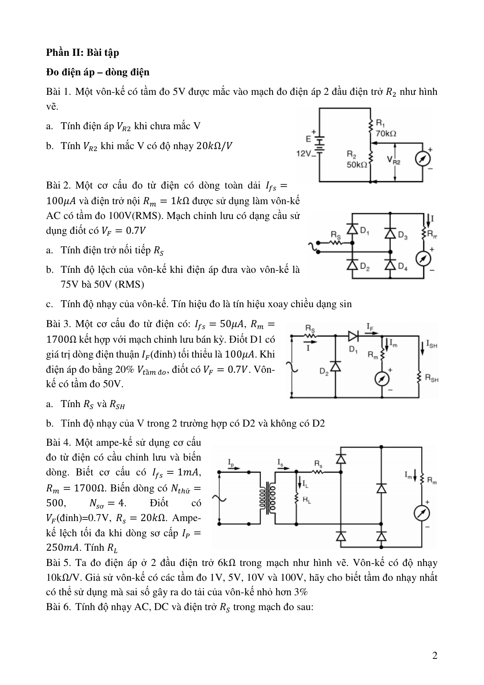

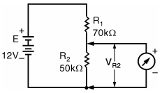

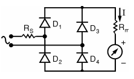

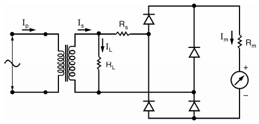

---

## Trang 4

- 3
- Bài 7. Một vôn-kế AC được dùng để đo điện áp hai đầu điện trở 𝑅𝑅2 như hình vẽ. Biết vôn-kế
- dùng cơ cấu đo từ điện có 𝐼𝐼𝑓𝑓𝑓𝑓= 100𝜇𝜇𝜇𝜇, điện trở dây quấn 𝑅𝑅𝑚𝑚= 1.5𝑘𝑘Ω, sử dụng mạch chỉnh
- lưu bán kỳ và có tầm đo 10V. Hãy cho biết trị giá đọc được trên vôn-kế
- Đo các thông số mạch điện
- Bài 8. Ôm-kế loại nối tiếp có mạch đo như hình vẽ. Nguồn Eb =
- 1.5V, cơ cấu đo có Ifs = 100𝜇𝜇𝜇𝜇. Điện trở 𝑅𝑅1 + 𝑅𝑅𝑚𝑚= 15𝑘𝑘Ω.
- a. Tính dòng điện chạy qua cơ cấu đo khi 𝑅𝑅𝑥𝑥= 0
- b. Tính giá trị 𝑅𝑅𝑥𝑥 để kim chỉ thị có độ lệch bằng ½ FSD, ¼ FSD
- và ¾ FSD (FSD: độ lệch tối đa)
- Bài 9. Ôm-kế có mạch đo như hình vẽ. Nguốn 𝐸𝐸𝑏𝑏= 1.5𝑉𝑉;
- 𝑅𝑅1 = 15𝑘𝑘Ω; 𝑅𝑅𝑚𝑚= 50Ω; 𝑅𝑅2 = 50Ω, cơ cấu đo có 𝐼𝐼𝑓𝑓𝑓𝑓= 50𝜇𝜇𝜇𝜇.
- Tính giá trị 𝑅𝑅𝑥𝑥 khi kim chỉ thị có độ lệch tối đa (FSD), ½ FSD
- và ¾ FSD
- Bài 10.
- Tính dòng điện chạy qua cơ cấu đo và
- độ lệch của kim chỉ thị của ôm-kế có mạch đo như
- hình vẽ khi ta sử dụng tầm đo 𝑅𝑅× 1 trong 2 trường
- hợp:
- a. 𝑅𝑅𝑥𝑥= 0
- b. 𝑅𝑅𝑥𝑥= 24Ω
- Đo công suất và điện năng
- Bài 11.
- a. Vẽ sơ đồ kết hợp BU, BI và công tơ 3 pha đo năng lượng tác dụng và năng lượng phản
- kháng cho lưới 3 pha cao thế.Yêu cầu:
- Công tơ tác dụng 3 pha 2 phần tử có cuộn dòng ở các pha A, C
- Công tơ phản kháng 3 pha 2 phần tử có cuộn dây nối tiếp phụ ở pha A

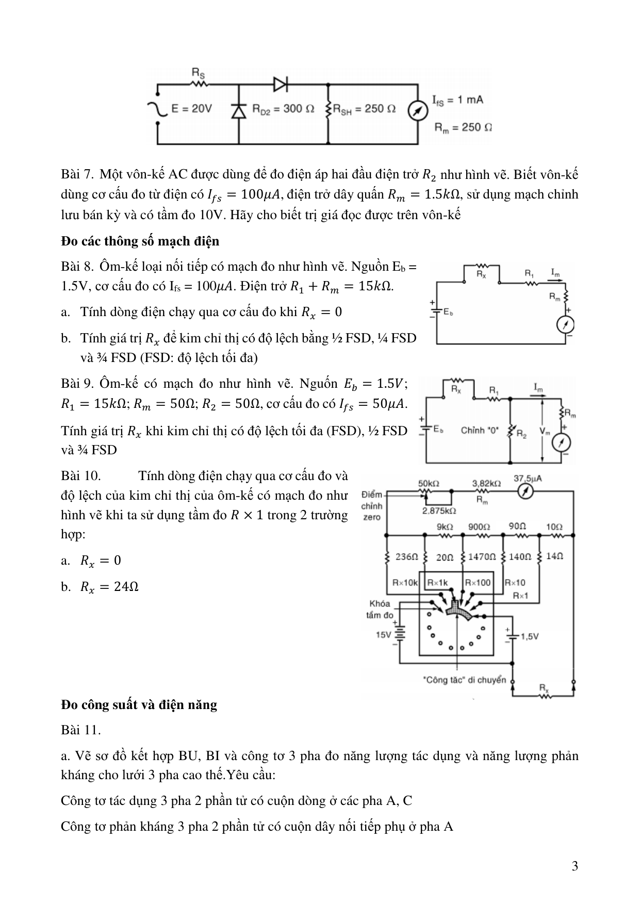

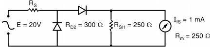

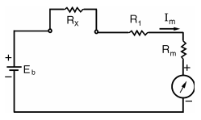

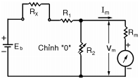

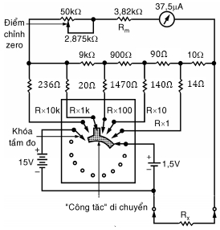

---

## Trang 5

- 4
- b. Vẽ sơ đồ kết hợp BU, BI và công tơ 3 pha đo năng lượng tác dụng và năng lượng phản
- kháng cho lưới 3 pha cao thế.Yêu cầu:
- Công tơ tác dụng 3 pha 2 phần tử có cuộn dòng ở các pha B, C
- Công tơ phản kháng 3 pha 2 phần tử có cuộn dây nối tiếp phụ ở pha A
- c. Vẽ sơ đồ kết hợp BU, BI và công tơ 3 pha đo năng lượng tác dụng và năng lượng phản
- kháng cho lưới 3 pha cao thế.Yêu cầu:
- Công tơ tác dụng 3 pha 2 phần tử có cuộn dòng ở các pha A, B
- Công tơ phản kháng 3 pha 2 phần tử có cuộn dây nối tiếp phụ ở pha B
- d. Vẽ sơ đồ kết hợp BU, BI và công tơ 3 pha đo năng lượng tác dụng và năng lượng phản
- kháng cho lưới 3 pha cao thế.Yêu cầu:
- Công tơ tác dụng 3 pha 2 phần tử có cuộn dòng ở các pha A, C
- Công tơ phản kháng 3 pha 2 phần tử có cuộn dây nối tiếp phụ ở pha B
- e. Vẽ sơ đồ kết hợp BU, BI và công tơ 3 pha đo năng lượng tác dụng và năng lượng phản
- kháng cho lưới 3 pha cao thế.Yêu cầu:
- Công tơ tác dụng 3 pha 2 phần tử có cuộn dòng ở các pha B, C
- Công tơ phản kháng 3 pha 2 phần tử có cuộn dây nối tiếp phụ ở pha B
- f. Vẽ sơ đồ kết hợp BU, BI và công tơ 3 pha đo năng lượng tác dụng và năng lượng phản
- kháng cho lưới 3 pha cao thế.Yêu cầu:
- Công tơ tác dụng 3 pha 2 phần tử có cuộn dòng ở các pha A, B
- Công tơ phản kháng 3 pha 2 phần tử có cuộn dây nối tiếp phụ ở pha C
- g. Vẽ sơ đồ kết hợp BU, BI và công tơ 3 pha đo năng lượng tác dụng và năng lượng phản
- kháng cho lưới 3 pha cao thế.Yêu cầu:
- Công tơ tác dụng 3 pha 2 phần tử có cuộn dòng ở các pha A, C
- Công tơ phản kháng 3 pha 2 phần tử có cuộn dây nối tiếp phụ ở pha C
- h. Vẽ sơ đồ kết hợp BU, BI và công tơ 3 pha đo năng lượng tác dụng và năng lượng phản
- kháng cho lưới 3 pha cao thế.Yêu cầu:
- Công tơ tác dụng 3 pha 2 phần tử có cuộn dòng ở các pha B, C
- Công tơ phản kháng 3 pha 2 phần tử có cuộn dây nối tiếp phụ ở pha C
- i. Vẽ sơ đồ kết hợp BU, BI và công tơ 3 pha đo năng lượng tác dụng và năng lượng phản
- kháng cho lưới 3 pha cao thế.Yêu cầu:
- Công tơ tác dụng 3 pha 2 phần tử có cuộn dòng ở các pha A, B
- Công tơ phản kháng 3 pha 3 phần tử

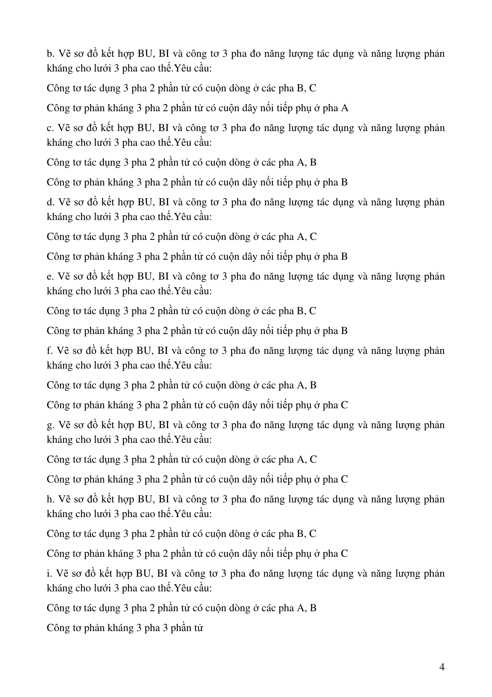

---

## Trang 6

- 5
- j. Vẽ sơ đồ kết hợp BU, BI và công tơ 3 pha đo năng lượng tác dụng và năng lượng phản
- kháng cho lưới 3 pha cao thế.Yêu cầu:
- Công tơ tác dụng 3 pha 2 phần tử có cuộn dòng ở các pha A, C
- Công tơ phản kháng 3 pha 3 phần tử
- Cảm biến và kỹ thuật cảm biến
- Bài 12.
- Đầu ra của một chuyển đổi điện cảm (như LVDT) được nối với một vôn kế 5V.
- Khi lõi thép của chuyển đổi dịch chuyển 1 khoảng 0.1𝑚𝑚𝑚𝑚 thì điện áp đầu ra đo được là 2𝑚𝑚𝑚𝑚.
- Tính độ nhay của chuyển đổi.
- Bài 13.
- Một chiết áp quay với dải đo là 330𝑜𝑜 được sử dụng để phản hổi vị trí góc trong
- ứng dụng. Nguồn cấp cho chiết áp là 5VDC. Đầu ra của chiết áp được nối với 1 ADC 12bit
- với dải ±5𝑉𝑉. Điện trở của chiết áp là 50Ω. Tính:
- a. Độ phân giải hiệu quả của cảm biến
- b. Tổn hao gây ra bởi chiết áp
- Bài 14.
- Một động cơ DC được gắn encoder quang và
- được sử dụng để quay 1 bàn định vị thông qua 1 thanh
- truyền (Hình vẽ). Thanh truyền có chu vi 0.1 inch.  Đĩa
- encoder có 1000 vạch và hoạt động ở chế độ vuông pha
- (quadrature mode). Tính độ phân giải của encoder. Nếu thay động cơ trên bằng một động cơ
- có hộp giảm tốc với tỉ lệ 5:1 thì độ phân giải là bao nhiêu.
- Bài 15.
- Một động cơ DC có hộp giảm tốc với tỉ số truyền 9:1 được gắn encoder. Đĩa
- encoder có 1250 vạch. Tính độ phân giải của encoder biết encoder hoạt động ở quadrature
- mode.
- Bài 16.
- Vẽ mạch đi dây cho cảm biến tiệm cận điện cám loại 2 dây thường mở sử dụng
- như 1 công tắc trong mạch rơ le.
- Bài 17.
- Một thanh thép đường kính 2𝑐𝑐𝑐𝑐 được kéo dọc trục với 1 lực bằng 2500𝑁𝑁. Một
- cảm biến sức căng với điện trở 120Ω và hệ số đo là 2 được sử dụng để đo đô căng. Tính sự
- thay đổi điện trở của đầu đo trong trường hợp trên (Modun đàn hồi của thép 200 × 109𝑃𝑃𝑃𝑃).
- Bài 18.
- Một cảm biến đo sức căng với điện trở 120Ω và hệ số đo bằng 2. Khi đo biến
- đạng cho giá trị điện trở thay đổi 1 lượng là 0.005Ω (Modun đàn hồi của thép 200 × 109𝑃𝑃𝑃𝑃).
- a. Tính độ biến dạng đo được bởi thiết bị đo (𝜇𝜇𝜇𝜇𝜇𝜇𝜇𝜇𝜇𝜇𝜇𝜇𝜇𝜇)
- b. Giả sử biến dạng này gây ra trên 1 thanh thép có tiết diện 0.4 × 10−3𝑚𝑚2. Xác định
- lực tác dụng lên thanh thép.
- Bài 19.
- Một cảm biến nhiệt điện trở platinum có điện trở danh định 100Ω ở 0𝑜𝑜𝐶𝐶 và hệ
- số nhiệt 0.00392Ω/Ω/𝑜𝑜𝐶𝐶. Xác định nhiệt độ đọc bởi cảm biến nếu điện trở của cảm biến là
- 200Ω

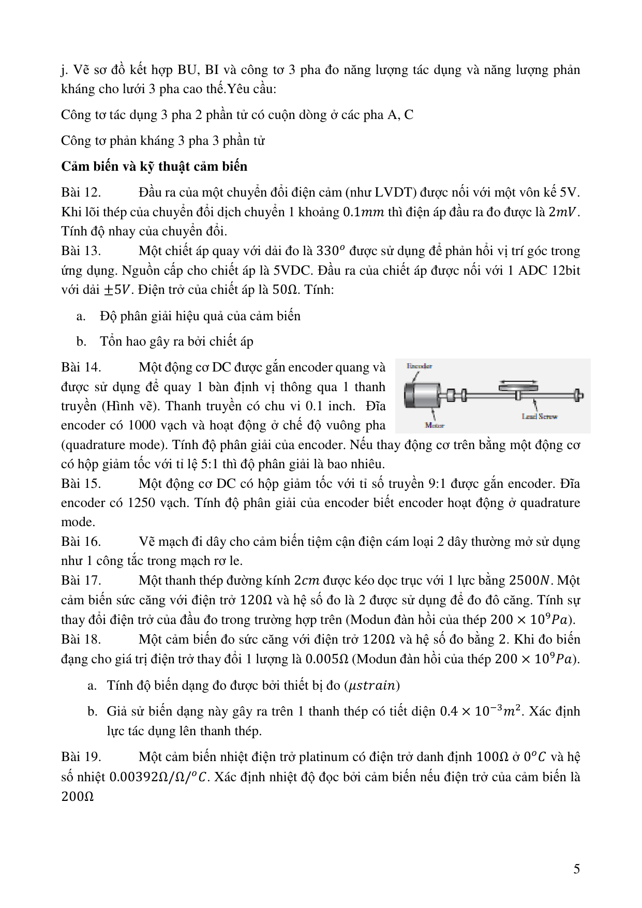

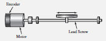

---

## Trang 7

- 6
- Bài 20.
- Một nhiệt điện trở có hệ số nhiệt là 0.004/𝑜𝑜𝐶𝐶 và điện trở 𝑅𝑅= 106Ω ở 20𝑜𝑜𝐶𝐶.
- Nhiệt điện trở này được mắc vào mạch cầu có 𝑅𝑅1 = 𝑅𝑅2 = 𝑅𝑅3 = 100Ω. Nguồn điện cung cấp
- là 10𝑉𝑉. Độ phân giải điện áp của đầu dò phải bằng bao nhiêu để nhân biết được thay đổi 1𝑜𝑜𝐶𝐶.
- Bài 21.
- Mạch cầu Wheatstone được dùng để xác định điện trở 𝑅𝑅1 bằng cách điều chỉnh
- điện trở 𝑅𝑅3. Ban đầu mạch được mắc như hình vẽ. Khi cầu cân bằng, có 𝑅𝑅3 = 151Ω. Đổi chỗ
- 𝑅𝑅2 và 𝑅𝑅4 cho nhau cầu lại cân bằng khi 𝑅𝑅3 = 182.5Ω. Tính giá trị 𝑅𝑅1

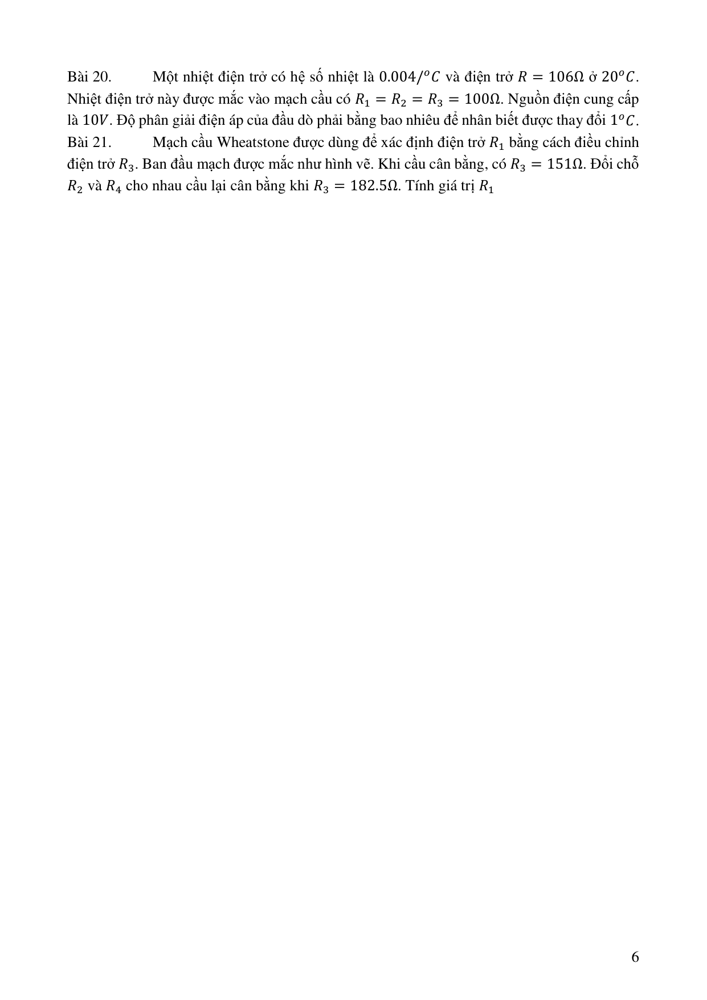

---

