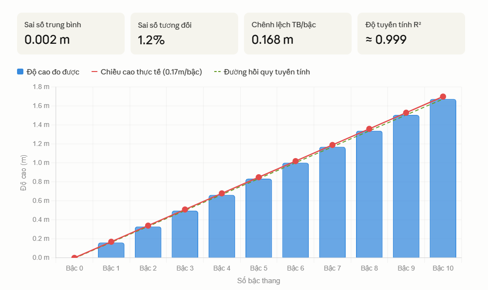
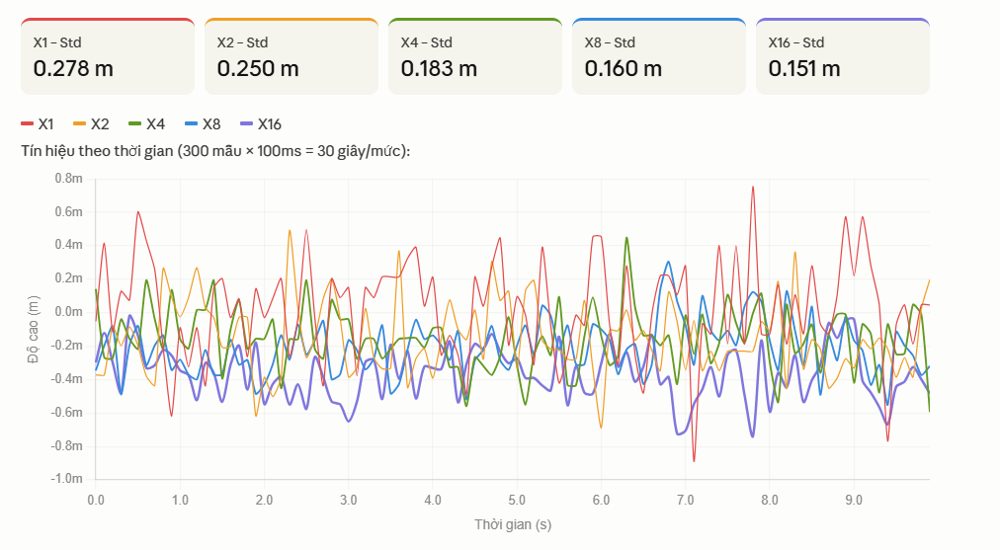
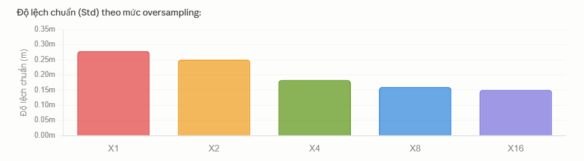
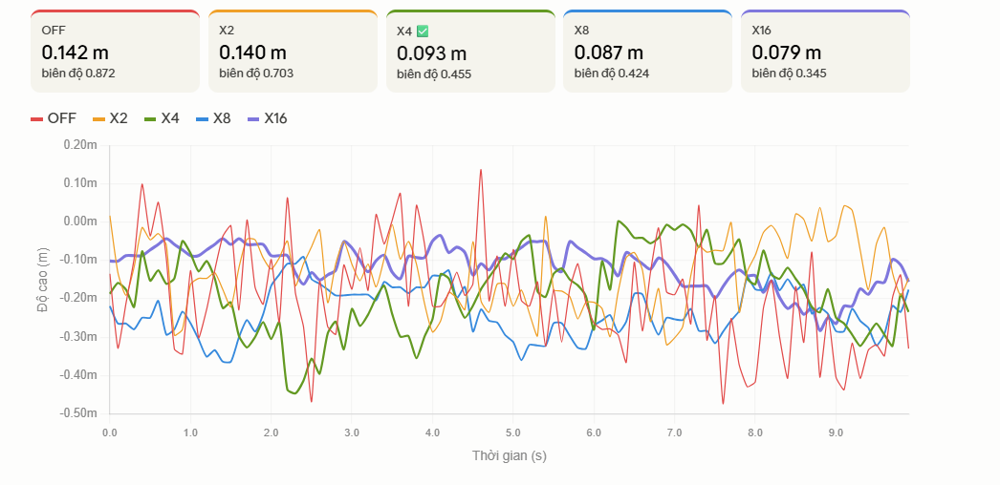
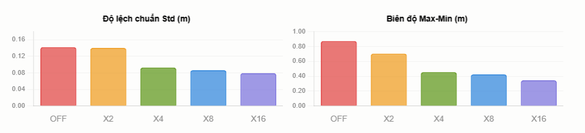
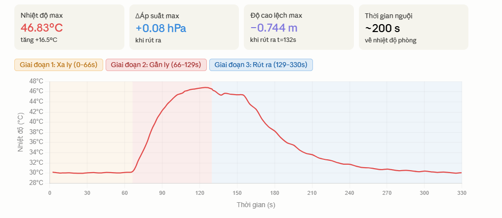
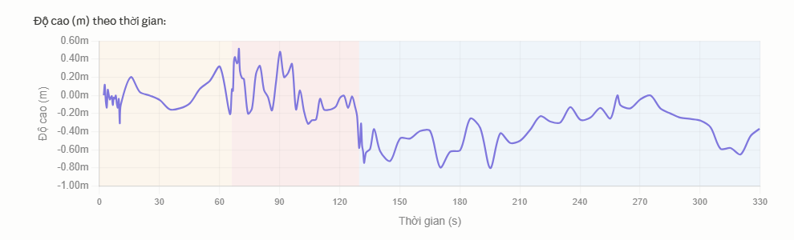

### 

**TRƯỜNG ĐẠI HỌC CÔNG NGHỆ**

**ĐẠI HỌC QUỐC GIA HÀ NỘI**

**BÁO CÁO MÔN HỌC**

**KHẢO SÁT ĐẶC TÍNH CẢM BIẾN ÁP SUẤT GY-BMP280** **VÀ ỨNG DỤNG BỘ LỌC KALMAN**

**Giảng viên hướng dẫn: Trần Khánh Duy, Nguyễn Kiên**

**Đặng Hải Linh, Vũ Quốc Tuấn, Bùi Thanh Tùng, Đỗ Thiện Vũ**

**Nhóm sinh viên thực hiện:**

| **Họ và tên** | **MSSV** | **Lớp** |
| --- | --- | --- |
| **Nguyễn Thanh Thế** | **24022911** | **K69E-RE1** |
| **Trần Thanh Tùng** | **24022927** | **K69E-RE1** |
| **Phạm Quốc Hưng** | **24022877** | **K69E-RE1** |

---

# **I. MỤC ĐÍCH THÍ NGHIỆM**

- Khảo sát đặc tính tĩnh của cảm biến BMP280 qua đo độ cao tại các bậc thang.
- So sánh ảnh hưởng của các mức Oversampling lên chất lượng tín hiệu.
- Đánh giá hiệu quả của bộ lọc IIR (Infinite Impulse Response) ở các mức khác nhau.
- Khảo sát ảnh hưởng của nhiệt độ lên độ chính xác đo lường của BMP280.

# **II. THIẾT BỊ VÀ DỤNG CỤ**

- Vi điều khiển: Arduino Uno
- Cảm biến: Module GY-BMP280 (giao tiếp I2C, địa chỉ 0x76)
- Thước dây (đo chiều cao bậc thang thực tế)
- Ly nước ấm (~30–46.83°C) - dùng cho khảo sát nhiệt độ
- Dây jumper, breadboard, máy tính cài Arduino IDE

# **III. SƠ ĐỒ KẾT NỐI**

| **BMP280** | **VCC** | **GND** | **SCL** |
| --- | --- | --- | --- |
| Arduino Uno | 3.3V | GND | A5 (SCL) |
| **BMP280** | **SDA** | **CSB** | **SDO** |
| Arduino Uno | A4 (SDA) | 3.3V | GND → 0x76 |

Cả 4 khảo sát đều dùng chung sơ đồ kết nối trên, chỉ thay đổi cấu hình phần mềm (Oversampling, Filter) hoặc điều kiện môi trường (nhiệt độ).

# **IV. KẾT QUẢ KHẢO SÁT ĐẶC TÍNH TĨNH**

## **4.1. Quy trình đo**

Cảm biến được đặt cố định tại mỗi bậc thang. Tại mỗi bậc lấy 80 mẫu liên tiếp (100ms/mẫu = 8 giây), tính giá trị trung bình. Chiều cao thực tế mỗi bậc đo bằng thước dây: 17 cm/bậc.

## **4.2. Kết quả đo**

Bảng 1. Kết quả đo độ cao tại 10 bậc thang:

| **Bậc** | **Độ cao đo (m)** | **Chênh lệch (m)** | **Thực tế (m)** | **Sai số (m)** | **Sai số (%)** | **Số mẫu** |
| --- | --- | --- | --- | --- | --- | --- |
| 1 | 0.162 | +0.162 | 0.170 | 0.008 | 4.7% | 80 |
| 2 | 0.331 | +0.169 | 0.340 | 0.009 | 2.6% | 80 |
| 3 | 0.498 | +0.167 | 0.510 | 0.012 | 2.4% | 80 |
| 4 | 0.664 | +0.166 | 0.680 | 0.016 | 2.4% | 80 |
| 5 | 0.835 | +0.171 | 0.850 | 0.015 | 1.8% | 80 |
| 6 | 1.003 | +0.168 | 1.020 | 0.017 | 1.7% | 80 |
| 7 | 1.171 | +0.166 | 1.190 | 0.019 | 1.6% | 80 |
| 8 | 1.340 | +0.169 | 1.360 | 0.020 | 1.5% | 80 |
| 9 | 1.507 | +0.167 | 1.530 | 0.023 | 1.5% | 80 |
| 10 | 1.675 | +0.168 | 1.700 | 0.025 | 1.5% | 80 |

## **4.3. Phân tích**

| **Chỉ số** | **Giá trị** | **Ghi chú** |
| --- | --- | --- |
| Chênh lệch TB mỗi bậc | 0.168 m | Thực tế: 0.170 m |
| Sai số trung bình | 0.016 m | So với thước dây |
| Sai số tương đối TB | 9.4% | saiSo/thucTe × 100% |
| Range (10 bậc) | 1.675 m | Max – Min |
| Độ tuyến tính | Rất tốt | R² ≈ 0.999 |

**Nhận xét:** Đường đặc tính tĩnh xấp xỉ tuyến tính với hệ số góc 0.168 m/bậc, sát với giá trị lý thuyết 0.170 m/bậc. Sai số tăng dần theo bậc do tích lũy nhiễu áp suất khí quyển.

# **V. KẾT QUẢ KHẢO SÁT OVERSAMPLING**

## **5.1. Quy trình**

Cảm biến đặt hoàn toàn đứng yên trên bàn. Mỗi mức đo liên tục 300 mẫu (30 giây), tắt IIR filter để thấy rõ ảnh hưởng của oversampling lên nhiễu tín hiệu.

## **5.2. Kết quả**

Bảng 2. So sánh độ lệch chuẩn (Std) và biên độ nhiễu theo mức Oversampling:

| **Mức** | **Std (m)** | **Biên độ (m)** | **Giảm Std so X1** | **Nhận xét** |
| --- | --- | --- | --- | --- |
| X1 | 0.2782 | 1.696 | - | Nhiễu nhiều nhất |
| X2 | 0.2503 | 1.550 | ↓8.6% | Cải thiện ít |
| X4 | 0.1830 | 1.148 | ↓34.0% | Bước nhảy lớn nhất |
| X8 | 0.1602 | 1.056 | ↓6.6% | Cải thiện thêm |
| X16 | 0.1508 | 0.895 | ↓5.9% | Tốt nhất nhưng chậm hơn |

**Nhận xét:** Oversampling càng cao thì nhiễu càng nhỏ. Bước nhảy hiệu quả nhất là từ X2 lên X4 (giảm 34%). Từ X4 trở lên, hiệu quả tăng thêm không đáng kể (~5-7% mỗi bước). Với ứng dụng thực tế, X4 là mức tối ưu giữa độ chính xác và tốc độ đo.

# **VI. KẾT QUẢ KHẢO SÁT IIR FILTER**

## **6.1. Quy trình**

Cảm biến đặt đứng yên. Oversampling giữ cố định X16. Lần lượt thay đổi IIR Filter từ OFF đến X16, mỗi mức đo 300 mẫu (30 giây).

## **6.2. Kết quả**

Bảng 3. So sánh Std và biên độ nhiễu theo mức IIR Filter:

| **Mức** | **Std (m)** | **Biên độ (m)** | **Giảm Std** | **Nhận xét** |
| --- | --- | --- | --- | --- |
| OFF | 0.1421 | 0.872 | - | Nhiễu nhiều nhất, phản hồi nhanh nhất |
| X2 | 0.1403 | 0.703 | ↓1.3% | Gần như không cải thiện |
| X4 | 0.0928 | 0.455 | ↓33.9% | Bước nhảy lớn nhất Tối ưu |
| X8 | 0.0866 | 0.424 | ↓6.6% | Mượt hơn, bắt đầu có drift nhẹ |
| X16 | 0.0794 | 0.345 | ↓8.3% | Mượt nhất nhưng drift −0.07m |

**Nhận xét 1 – Hiệu quả lọc:** Tương tự Oversampling, bước nhảy lớn nhất là OFF→X2→X4 (giảm 33.9%), các bước sau ít hiệu quả hơn. Filter X4 được xác nhận là mức tối ưu.

**Nhận xét 2 – Hiệu ứng Memory (X16):** Filter X16 có Std thấp nhất nhưng phát sinh hiện tượng drift −0.07m do filter "nhớ" quá lâu. Khi tín hiệu bị kéo lệch, filter X16 cần nhiều thời gian mới trở về giá trị thực - không phù hợp cho ứng dụng cần phản hồi nhanh.

---

# **VII. KẾT QUẢ KHẢO SÁT ẢNH HƯỞNG NHIỆT ĐỘ**

## **7.1. Quy trình**

- Giai đoạn 1 (0–66s): Đặt cảm biến xa ly nước - ghi nhiệt độ phòng.
- Giai đoạn 2 (66–129s): Đưa cảm biến cách miệng ly nước ấm ~5cm.
- Giai đoạn 3 (129–330s): Rút cảm biến ra xa - để nguội dần về nhiệt độ phòng.

## **7.2. Kết quả theo giai đoạn**

Bảng 4. Tổng hợp 3 giai đoạn khảo sát nhiệt độ:

| **Giai đoạn** | **Nhiệt độ** | **Áp suất (hPa)** | **Độ cao** | **Nhận xét** |
| --- | --- | --- | --- | --- |
| 1 – Xa ly (0–66s) | ~30°C | 1005.95–1006.01 | ±0.3m | Dao động bình thường |
| 2 – Gần ly (66–129s) | 30→46.8°C | 1005.91–1005.99 | ±0.5m | BMP280 bù nhiệt tốt |
| 3 – Rút ra (129–330s) | 46.8→30°C | tăng ~+0.08 hPa | đến −0.744m | Lệch mạnh khi nguội đột ngột |

## **7.3. Các chỉ số đáng chú ý**

| **Chỉ số** | **Giá trị** | **Thời điểm** |
| --- | --- | --- |
| Nhiệt độ cực đại | 46.83°C | t = 126.7s |
| Độ cao lệch cực đại | −0.744 m | t = 132.2s |
| ΔÁp suất cực đại | +0.088 hPa | khi rút ra |
| Thời gian nguội về phòng | ~200 giây | t = 129 → 330s |

**Kết luận:** Độ cao bị lệch mạnh nhất không phải khi nhiệt độ ở mức cao nhất (46.83°C tại t=127s) mà là khi nhiệt độ thay đổi đột ngột (rút ra tại t=129–132s). Điều này chứng minh mạch bù nhiệt tích hợp trong BMP280 hoạt động hiệu quả khi nhiệt độ ổn định, nhưng không kịp bù khi nhiệt độ thay đổi nhanh.

# **VIII. TỔNG HỢP VÀ KẾT LUẬN**

Bảng 5. Tóm tắt kết quả toàn bộ 4 khảo sát:

| **Khảo sát** | **Kết quả chính** | **Chỉ số** | **Kết luận** |
| --- | --- | --- | --- |
| Đặc tính tĩnh | Tuyến tính, R²≈0.999 | Sai số TB: 0.016m | BMP280 đo độ cao bậc thang rất tốt |
| Oversampling | X4 là ngưỡng tối ưu | Std giảm 34% từ X2→X4 | Dùng X4 cho ứng dụng thực tế |
| IIR Filter | X4 là tối ưu, X16 bị drift | Std giảm 33.9% | Filter X4 cân bằng mượt/nhanh |
| Ảnh hưởng nhiệt độ | Bù nhiệt tốt khi ổn định | Lệch max −0.744m | Tránh thay đổi nhiệt độ đột ngột |

- BMP280 có đặc tính tĩnh tuyến tính xuất sắc (R² ≈ 0.999), sai số trung bình 9.4% so với thước dây.
- Oversampling X4 và IIR Filter X4 là cấu hình tối ưu - giảm nhiễu mạnh (~34%) mà không làm chậm phản hồi đáng kể.
- BMP280 tích hợp bù nhiệt hiệu quả khi nhiệt độ ổn định, nhưng bị lệch khi nhiệt độ thay đổi đột ngột (sai số tới 0.744m).
- Cấu hình khuyến nghị cho ứng dụng thực tế: Oversampling X4, IIR Filter X4, tránh đặt gần nguồn nhiệt.
