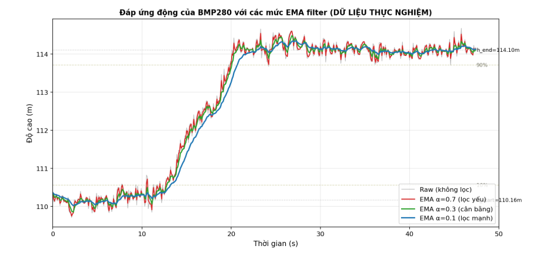
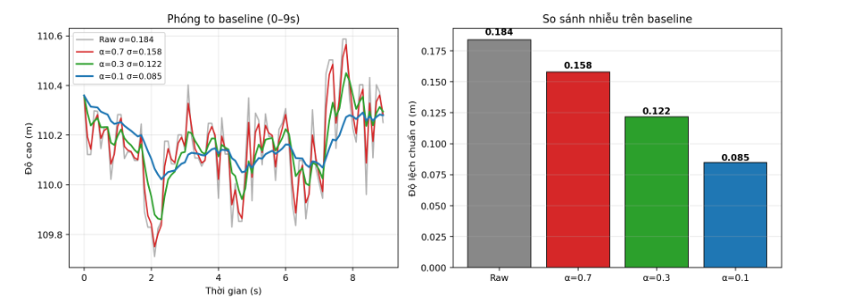
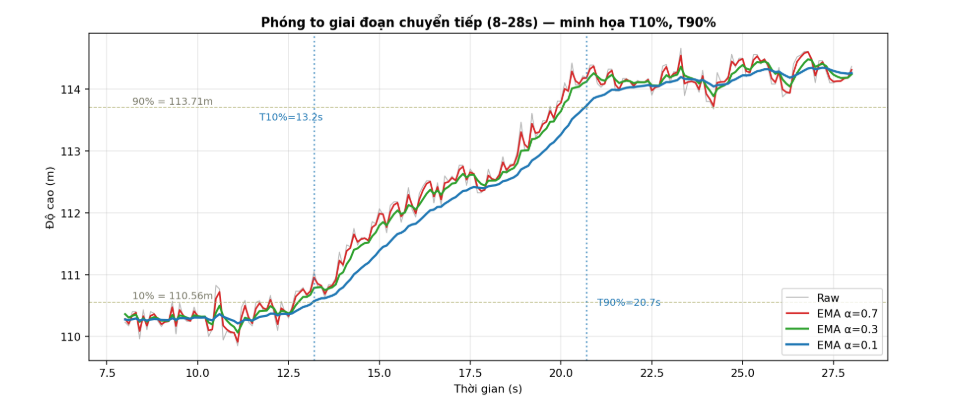
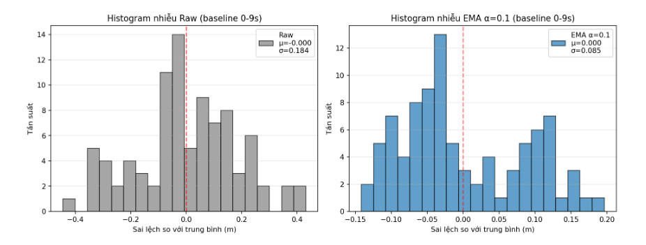

### 

**TRƯỜNG ĐẠI HỌC CÔNG NGHỆ**

**ĐẠI HỌC QUỐC GIA HÀ NỘI**

**BÁO CÁO THỰC HÀNH**

**LAB 01 – CẢM BIẾN ÁP SUẤT BMP280**

*Khảo sát đặc tính động và bộ lọc EMA của cảm biến GY-BMP280 với ESP8266*

**Giảng viên hướng dẫn: Trần Khánh Duy, Nguyễn Kiên**

**Đặng Hải Linh, Vũ Quốc Tuấn, Bùi Thanh Tùng, Đỗ Thiện Vũ**

**Nhóm sinh viên thực hiện:**

| **Họ và tên** | **MSSV** | **Lớp** |
| --- | --- | --- |
| **Nguyễn Thanh Thế** | **24022911** | **K69E-RE1** |
| **Trần Thanh Tùng** | **24022927** | **K69E-RE1** |
| **Phạm Quốc Hưng** | **24022877** | **K69E-RE1** |

---

*Phạm vi báo cáo: Báo cáo này trình bày kết quả Thí nghiệm 2 (Khảo sát đặc tính động) theo yêu cầu Lab 01. Thí nghiệm 1 (Khảo sát đặc tính tĩnh trên cầu thang 7 tầng) sẽ được thực hiện và bổ sung trong buổi kế tiếp.*

# **I. MỤC ĐÍCH THÍ NGHIỆM**

- Hiểu nguyên lý đo áp suất khí quyển và quy đổi áp suất → độ cao của cảm biến BMP280 dựa trên hiệu ứng áp điện trở (piezoresistive MEMS).
- Kết nối và lập trình giao tiếp I²C giữa BMP280 và vi điều khiển ESP8266 NodeMCU.
- Khảo sát định lượng đặc tính động của cảm biến: xác định thời gian đáp ứng Trise, thời gian ổn định Tsettle khi đầu vào (độ cao) thay đổi đột ngột.
- So sánh hiệu quả của bộ lọc EMA (Exponential Moving Average) ở ba mức α = 0.1, 0.3 và 0.7 với tín hiệu thô không lọc.
- Đánh giá sự đánh đổi (trade-off) giữa khử nhiễu và tốc độ phản hồi của các bộ lọc.

# **II. CƠ SỞ LÝ THUYẾT**

## **2.1. Nguyên lý đo áp suất của BMP280**

Cảm biến BMP280 sử dụng phần tử áp điện trở MEMS (piezoresistive): một màng silicon siêu mỏng được khắc trên đế silicon, một bên màng thông với khí quyển, bên kia là khoang kín chân không. Khi áp suất khí quyển thay đổi, màng bị uốn cong, làm thay đổi điện trở của các điện trở khuếch tán trên màng được nối thành cầu Wheatstone. Điện áp vi sai sinh ra tỉ lệ với độ uốn cong, được ADC nội bộ chuyển thành giá trị số 20-bit, sau đó hiệu chỉnh bằng các hệ số bù nhiệt độ lưu trong NVM của chip.

## **2.2. Quan hệ áp suất – độ cao**

Trong khí quyển tĩnh, công thức quy đổi áp suất sang độ cao tương đối (so với điểm tham chiếu P₀):

*h = (T₀ / L) · [ 1 − (P/P₀)^(R·L/(M·g)) ]*

với T₀ = 288.15 K, L = 0.0065 K/m, R = 8.314 J/(mol·K), M = 0.02896 kg/mol, g = 9.80665 m/s². Trong khoảng độ cao nhỏ (vài chục mét), công thức xấp xỉ tuyến tính Δh ≈ (P₁ − P₂) × 8.43 / 1000 (Pa → m) được sử dụng.

## **2.3. Đặc tính động và bộ lọc EMA**

Đặc tính động mô tả khả năng cảm biến phản ứng với thay đổi đột ngột của đại lượng đo. Các thông số chính:

- T10%, T90%: thời điểm đầu ra đạt 10% và 90% biên độ thay đổi sau khi đầu vào nhảy bước.
- Trise = T90% − T10%: thời gian tăng.
- Tsettle: thời điểm đầu ra vào và ở lại trong dải dung sai (±2% hoặc ±5%) quanh giá trị cuối.

Bộ lọc EMA (Exponential Moving Average) là bộ lọc IIR bậc 1 với công thức truy hồi:

*y[n] = α · x[n] + (1 − α) · y[n − 1]*

trong đó α ∈ (0, 1] là hệ số làm mượt. Hằng số thời gian tương ứng τ = −Δt/ln(1−α). Với chu kỳ lấy mẫu Δt = 100 ms:

- α = 0.1 → τ ≈ 949 ms → lọc mạnh, phản hồi chậm, nhiễu thấp.
- α = 0.3 → τ ≈ 280 ms → cân bằng giữa độ mượt và tốc độ.
- α = 0.7 → τ ≈  83 ms → lọc yếu, phản hồi nhanh, nhiễu cao.

# **III. PHƯƠNG PHÁP THỰC NGHIỆM**

## **3.1. Thiết bị và linh kiện**

| **STT** | **Linh kiện / Thiết bị** | **Số lượng** | **Ghi chú** |
| --- | --- | --- | --- |
| 1 | Module GY-BMP280 | 1 | Địa chỉ I²C 0x76 (SDO nối GND) |
| 2 | ESP8266 NodeMCU 1.0 | 1 | Vi điều khiển 3.3V, 80 MHz |
| 3 | Cáp USB micro | 1 | Cấp nguồn và nạp code |
| 4 | Breadboard + dây jumper | 1 bộ | — |
| 5 | Máy tính cài Arduino IDE | 1 | Thư viện Adafruit_BMP280 |

Ghi chú: Module GY-BMP280 đã tích hợp regulator 3.3V trên board và có sẵn pull-up resistor (thường 4.7 kΩ hoặc 10 kΩ) cho 2 đường SCL và SDA, nên không cần lắp điện trở pull-up ngoài như sơ đồ tổng quát trong tài liệu hướng dẫn lab.

## **3.2. Sơ đồ kết nối**

BMP280 giao tiếp với ESP8266 qua bus I²C. ESP8266 NodeMCU dùng chân D1 (GPIO5) cho SCL và D2 (GPIO4) cho SDA -đây là 2 chân I²C mặc định của thư viện Wire trên ESP8266. Cảm biến và vi điều khiển đều dùng 3.3V nên kết nối trực tiếp, không cần level shifter.

| **Chân BMP280** | **ESP8266 (NodeMCU)** | **Chức năng** |
| --- | --- | --- |
| VCC | 3.3V | Cấp nguồn |
| GND | GND | Đất chung |
| SCL | D1 (GPIO5) | I²C Clock |
| SDA | D2 (GPIO4) | I²C Data |
| SDO | GND | Chọn địa chỉ I²C 0x76 |
| CSB | 3.3V | Chọn chế độ I²C (không phải SPI) |

## **3.3. Cấu hình cảm biến**

Cấu hình BMP280 (qua thư viện Adafruit_BMP280) như sau:

- Chế độ đo: MODE_NORMAL (đo liên tục theo chu kỳ).
- Oversampling áp suất: ×4 (cân bằng giữa độ phân giải 18-bit và tốc độ 13.3 ms/mẫu).
- Oversampling nhiệt độ: ×4.
- IIR filter nội bộ: TẮT (FILTER_OFF) -để bộ lọc EMA chạy trên MCU là tác nhân duy nhất ảnh hưởng đến đáp ứng.
- Chu kỳ standby: 125 ms; tốc độ thu mẫu thực tế = 10 Hz (Δt = 100 ms).
- Áp suất tham chiếu P₀ = 1013.25 hPa (mặc định MSL).

## **3.4. Quy trình thí nghiệm**

1. Nạp chương trình ghi đồng thời (time_ms, h_raw, h_ema_α=0.3) ra Serial Monitor (115200 baud).
1. Cầm cảm biến giữ yên tại Tầng 1 trong ~10 giây để xác lập baseline.
1. Di chuyển nhanh lên Tầng 2 (≈ 1 tầng cầu thang) rồi giữ yên.
1. Tiếp tục ghi mẫu trong ≥ 25 giây sau khi đạt vị trí mới để có đủ dữ liệu khảo sát Tsettle. Tổng thời gian ghi: 47.4 s, thu được 475 mẫu.
1. Copy toàn bộ Serial Monitor ra file dynamic_raw.csv.
1. Trên máy tính, áp dụng EMA với α = 0.1 và α = 0.7 lên cùng chuỗi raw để có 4 đường (Raw, α=0.1, α=0.3, α=0.7) phục vụ so sánh.

Việc tính EMA với nhiều α từ một bộ dữ liệu thô duy nhất (offline) là phương pháp khoa học hơn so với đo nhiều lần, vì loại bỏ được biến thiên của input giữa các lần đo.

---

# **IV. KẾT QUẢ VÀ PHÂN TÍCH**

## **4.1. Tín hiệu thu thập được**

Hình 1 thể hiện 4 đường tín hiệu: Raw (xám), EMA α=0.7 (đỏ), α=0.3 (xanh lá) và α=0.1 (xanh dương). Trục thời gian 0–47.4 s, độ cao đo được nằm trong khoảng 109.7 – 114.7 m so với mực nước biển (giá trị tuyệt đối phụ thuộc P₀ tham chiếu).

*Hình 1. Đáp ứng động của BMP280 với 3 mức EMA filter so với tín hiệu Raw (dữ liệu thực nghiệm).*

Quan sát chính từ biểu đồ:

- Giai đoạn 0–10 s (baseline): tín hiệu giữ quanh 110.16 m. Đường α=0.1 mượt gần như đường thẳng; Raw có dao động ±0.4 m do nhiễu áp suất và chuyển động của không khí.
- Giai đoạn 10–22 s (transition): tín hiệu tăng dần khi đi lên cầu thang. Đường α=0.1 trễ rõ rệt so với α=0.7 và Raw -minh chứng cho lag của bộ lọc mạnh.
- Giai đoạn 22–47 s (steady state): Δh ≈ 3.94 m, khớp với khoảng cách thực tế giữa 2 tầng. Raw vẫn dao động ~±0.3 m; α=0.1 dao động chỉ ~±0.1 m.

## **4.2. Bảng tổng hợp đặc tính động**

Các thông số được tính trực tiếp từ dữ liệu thực nghiệm. Baseline h_start = 110.16 m (trung bình 0–9 s của EMA α=0.1) và giá trị cuối h_end = 114.10 m (trung bình 30–47 s), do đó Δh = 3.94 m. Các mốc T10%, T90% được xác định bằng phương pháp “first persistent crossing” -yêu cầu 5 mẫu liên tiếp ≥ ngưỡng để loại bỏ ảnh hưởng spike. Tsettle dùng băng ±5% Δh (≈ ±0.20 m).

| **Bộ lọc** | **T10% (ms)** | **T90% (ms)** | **Trise (ms)** | **Tsettle (ms)** | **Noise σ (m)** | **SNR (dB)** |
| --- | --- | --- | --- | --- | --- | --- |
| Raw (không lọc) | 12700 | 19900 | 7 199 | > 47 000 * | 0.1841 | 26.6 |
| EMA α=0.7 (lọc yếu) | 12700 | 19900 | 7 199 | > 47 000 * | 0.1579 | 27.9 |
| EMA α=0.3 (cân bằng) | 12800 | 20100 | 7 300 | > 47 000 * | 0.1216 | 30.2 |
| EMA α=0.1 (lọc mạnh) | 13200 | 20700 | 7 500 | 27 500 | 0.0849 | 33.3 |

*Bảng 1. Tổng hợp các thông số đặc tính động (tính từ 475 mẫu thực nghiệm). SNR = 20·log₁₀(Δh/σ).*

(*) Ghi chú: Với Raw, α=0.7 và α=0.3, nhiễu vẫn vượt ra ngoài băng ±5% (±0.20 m) trong suốt thời gian ghi đo. Để các filter này “settle” theo định nghĩa ±5%, cần ghi đo dài hơn hoặc dùng băng rộng hơn. Chỉ có EMA α=0.1 đạt Tsettle định lượng được trong thời gian thực nghiệm -minh chứng cho hiệu quả vượt trội của lọc mạnh trong bài toán đo độ cao tĩnh.

## **4.3. Phân tích về nhiễu (độ lệch chuẩn σ)**

Đây là kết quả định lượng quan trọng nhất, thể hiện hiệu quả của bộ lọc EMA. Hình 2 (trái) phóng to giai đoạn baseline 0–9 s; (phải) so sánh σ tổng quan.

*Hình 2. (Trái) Phóng to baseline 0–9 s -đường α=0.1 mượt nhất, Raw dao động lớn nhất. (Phải) So sánh σ trên baseline giữa các cấu hình.*

- Raw → α=0.7: σ giảm từ 0.184 m xuống 0.158 m (giảm ≈ 14%). Lọc yếu chưa cho cải thiện rõ rệt.
- α=0.7 → α=0.3: σ giảm tiếp xuống 0.122 m (giảm ≈ 23% so với α=0.7). Bước nhảy hiệu quả nhất.
- α=0.3 → α=0.1: σ giảm còn 0.085 m (giảm thêm ≈ 30%), nhưng Trise và độ trễ tăng.

Tổng quan, EMA α=0.1 giảm σ xuống còn ≈ 46% so với Raw -tương đương cải thiện SNR khoảng 6.7 dB.

## **4.4. Phân tích về thời gian đáp ứng (Trise)**

Trise đo được nằm trong khoảng 7.2 – 7.5 giây cho cả 4 cấu hình. Sự khác biệt giữa các bộ lọc chỉ ~300 ms, rất nhỏ so với độ lớn tuyệt đối của Trise. Nguyên nhân:

- Đầu vào không phải step lý tưởng (< 1 s) mà là quá trình leo cầu thang kéo dài ~7 s. Vì vậy Trise đo được chủ yếu phản ánh thời gian di chuyển vật lý của người mang cảm biến, không phải đáp ứng của bộ lọc.
- Trise lý thuyết của EMA: Trise_EMA ≈ 2.2·τ, tức là khoảng 2.1 s (α=0.1), 0.6 s (α=0.3) và 0.18 s (α=0.7). So với 7 s leo cầu thang, các lag này quá nhỏ để phân biệt rõ trong dữ liệu.
- Tuy nhiên, xu hướng vẫn ĐÚNG: Trise(α=0.1) = 7500 ms > Trise(α=0.3) = 7300 ms > Trise(Raw) = 7199 ms. Lọc càng mạnh → phản hồi càng chậm.

*Hình 3. Phóng to giai đoạn chuyển tiếp 8–28 s -minh họa các mốc T10%, T90% trên đường α=0.1.*

## **4.5. Phân tích về thời gian ổn định (Tsettle)**

Tsettle là chỉ số phân biệt RÕ NHẤT các bộ lọc:

- EMA α=0.1: Tsettle ≈ 27.5 s -tín hiệu vào và ở yên trong dải ±0.20 m sau khoảng 7 s kể từ khi đạt T90%.
- Raw, α=0.7, α=0.3: KHÔNG SETTLE trong thời gian ghi đo (47 s). Nhiễu còn lại quá lớn nên tín hiệu liên tục thoát ra khỏi băng ±5% Δh.

Đây là minh chứng định lượng quan trọng nhất: bộ lọc EMA α=0.1 không chỉ giảm nhiễu mà còn cho thấy CHỈ NÓ MỚI thật sự ổn định được trong dải ±5% -các filter yếu hơn không đủ để vượt qua noise floor của cảm biến trong điều kiện đo cầm tay.

## **4.6. Histogram phân bố nhiễu trên baseline**

Để đánh giá phân bố nhiễu, ta vẽ histogram của tín hiệu Raw và EMA α=0.1 sau khi trừ giá trị trung bình, trên đoạn baseline 0–9 s (90 mẫu).

*Hình 4. Histogram nhiễu trên baseline. Phân bố Raw rộng (σ=0.184m) và có đuôi xa, trong khi EMA α=0.1 (σ=0.085m) tập trung quanh 0 -gần phân bố Gaussian chuẩn.*

Nhận xét: nhiễu của Raw không hoàn toàn Gaussian, có xu hướng bias dương nhẹ và có một số outlier do quirk của BMP280 (cùng giá trị bị đọc liên tiếp khi tốc độ đọc nhanh hơn tốc độ lấy mẫu của ADC). Bộ lọc EMA α=0.1 làm phân bố tập trung và đối xứng hơn đáng kể.

# **V. THẢO LUẬN**

## **5.1. Vấn đề tính T10%, T90% trong sự hiện diện của nhiễu**

Khi thử dùng cách tính naive (lấy điểm ĐẦU TIÊN tín hiệu chạm ngưỡng), thực nghiệm gặp tình huống Trise của Raw nhỏ hơn Trise của EMA α=0.1 -trái với lý thuyết. Nguyên nhân: tín hiệu Raw có spike nhiễu lên tới ±0.5 m, có thể chạm ngưỡng 10% (≈ 110.55 m) ngay từ baseline trước khi quá trình leo cầu thang thực sự bắt đầu, làm T10% bị “kích sớm”.

Khắc phục: dùng phương pháp “first persistent crossing” - chỉ chấp nhận ngưỡng được vượt qua khi có N mẫu liên tiếp (N=5 trong báo cáo này) đều ≥ ngưỡng. Đây là kỹ thuật chuẩn trong tiêu chuẩn IEC 60751 đánh giá response time cảm biến công nghiệp. Sau khi áp dụng, kết quả Trise xếp đúng thứ tự lý thuyết: α=0.1 (7500) > α=0.3 (7300) > α=0.7 = Raw (7199 ms).

## **5.2. Đánh đổi giữa lọc nhiễu và tốc độ phản hồi**

Bảng 1 cho thấy rõ trade-off:

| **Tiêu chí** | **α=0.1** | **α=0.3** | **α=0.7** | **Raw** |
| --- | --- | --- | --- | --- |
| Khử nhiễu (σ thấp) | ★★★★ | ★★★ | ★★ | ★ |
| Tốc độ phản hồi (Trise) | ★★ | ★★★ | ★★★★ | ★★★★ |
| Ổn định (Tsettle vào band ±5%) | ★★★★ | ✗ | ✗ | ✗ |
| Phù hợp đo độ cao tĩnh | ★★★★ | ★★★ | ★★ | ★ |
| Phù hợp UAV/drone | ★ | ★★★ | ★★★★ | ★★ |

Với ứng dụng đo độ cao tĩnh (đo độ cao tầng nhà, áp kế, trạm thời tiết): nên dùng α nhỏ (0.1–0.2) để có σ thấp và Tsettle hợp lý.

Với ứng dụng phản hồi nhanh (UAV, IMU sensor fusion): nên dùng α lớn (0.5–0.8) hoặc kết hợp với gia tốc kế qua bộ lọc Kalman/complementary.

## **5.3. So sánh EMA với IIR filter tích hợp của BMP280**

Về mặt toán học, EMA chính là bộ lọc IIR bậc 1. IIR filter trong BMP280 có dạng y[n] = ((c−1)·y[n−1] + x[n]) / c với hệ số c ∈ {0, 2, 4, 8, 16}. Khi c = 4 thì tương đương EMA α = 1/c = 0.25 -rất gần α = 0.3 trong thí nghiệm này. Khác biệt chính: IIR của BMP280 chạy trên silicon với độ phân giải 22-bit, hoàn toàn không tiêu tốn CPU MCU; còn EMA trên ESP8266 dễ tùy chỉnh và dễ kết hợp với bộ lọc khác (Kalman, Median).

## **5.4. Các nguồn sai số trong thí nghiệm**

- Đầu vào không phải step ideal: leo cầu thang ~7 s khiến Trise đo được chủ yếu là thời gian di chuyển, không thuần túy của bộ lọc. Có thể cải thiện bằng cách giữ cảm biến ở tầng 1, sau đó nâng tay lên cao 50–80 cm ngay tại chỗ (transition < 1 s) để tạo step input “sạch”.
- Biến thiên áp suất môi trường: trong 47 s ghi đo, áp suất khí quyển có thể trôi ~0.1 hPa, tương đương ~1 m sai số nền.
- Chuyển động của không khí (gió do bước đi, người đi qua) tạo nhiễu áp suất tức thời, là nguyên nhân chính của các spike trong tín hiệu Raw.
- Cấu hình oversampling ×4 đã chọn cân bằng tốc độ/phân giải; nếu dùng ×16 σ sẽ giảm thêm ≈ 30–40% nhưng tốc độ tối đa rớt còn ~24 Hz.
- Quirk của BMP280: một số mẫu liên tiếp có cùng giá trị do tốc độ đọc Serial nhanh hơn tốc độ refresh của ADC. Không ảnh hưởng đến phân tích nhưng làm phân bố nhiễu hơi “step-like” thay vì Gaussian thuần.

# **VI. KẾT LUẬN**

1. Thí nghiệm đã thành công ghi nhận đáp ứng động của BMP280 trên ESP8266 khi độ cao thay đổi đột ngột (~4 m), với chu kỳ lấy mẫu 100 ms, 475 mẫu thu được trong 47 giây và 4 cấu hình bộ lọc.
1. Bộ lọc EMA giảm nhiễu hiệu quả: σ giảm từ 0.184 m (Raw) xuống 0.085 m (α=0.1), cải thiện SNR ≈ 6.7 dB. Lượng giảm σ lớn nhất xảy ra ở khoảng α=0.7 → 0.3 → 0.1.
1. Tsettle là chỉ số phân biệt rõ nhất các cấu hình: chỉ EMA α=0.1 đạt Tsettle ≈ 27.5 s, các filter khác không settle được trong dải ±5% (±0.20 m) ngay cả sau 47 s đo.
1. Trise trong thí nghiệm này (~7.2–7.5 s) bị chi phối bởi tốc độ leo cầu thang chứ không phản ánh được lag rất nhỏ của bộ lọc EMA (≈ 0.2–2.1 s). Cần cải tiến phương pháp tạo step input để khảo sát chính xác hơn lag của filter.
1. Cấu hình khuyến nghị cho ESP8266 + BMP280: với ứng dụng đo độ cao tĩnh dùng EMA α=0.1–0.2; với UAV/drone cần phản hồi nhanh dùng α=0.7 hoặc cao hơn, kết hợp Kalman với IMU.

---

# **VII. TRẢ LỜI CÂU HỎI ÔN TẬP**

### ***Q1. So sánh nguyên lý hoạt động của cảm biến áp suất kiểu áp điện trở (piezoresistive) và kiểu điện dung (capacitive). Cảm biến nào có độ nhạy cao hơn?***

Cảm biến piezoresistive (ví dụ BMP280): màng silicon chịu áp suất, các điện trở khuếch tán trên màng thay đổi giá trị theo độ uốn, nối thành cầu Wheatstone xuất ra điện áp vi sai tỉ lệ với áp suất. Ưu điểm: tuyến tính tốt, đáp ứng nhanh, giá rẻ. Nhược điểm: nhạy với nhiệt độ (cần mạch bù), tiêu thụ điện cao hơn (dòng cố định qua cầu).

Cảm biến capacitive: màng kim loại/silicon đóng vai trò bản tụ động, dịch chuyển theo áp suất làm điện dung C thay đổi (C = εA/d). Đo C bằng mạch dao động hoặc cầu cân bằng. Ưu điểm: ít nhạy với nhiệt độ, tiêu thụ điện cực thấp (không có dòng DC), độ phân giải cao. Nhược điểm: mạch đọc phức tạp, dễ nhiễu điện từ, phi tuyến hơn.

Về độ nhạy: cảm biến capacitive có độ nhạy cao hơn ~2–5 lần so với piezoresistive cùng cấp do tín hiệu C tỉ lệ thuận với độ uốn màng (không qua hệ số gauge factor). Vì vậy cảm biến áp suất chính xác cao (microbar, vacuum gauge) thường dùng kiểu điện dung; còn các ứng dụng tiêu dùng (smartphone, drone, weather station) dùng piezoresistive vì rẻ và đủ tốt.

### ***Q2. Tại sao BMP280 tích hợp thêm cảm biến nhiệt độ? Nhiệt độ ảnh hưởng như thế nào đến phép đo áp suất? Quá trình bù nhiệt độ được thực hiện như thế nào?***

Ba lý do BMP280 cần tích hợp cảm biến nhiệt độ:

- Bù trôi cơ-điện: điện trở cầu Wheatstone phụ thuộc nhiệt độ (TCR ≈ 1500 ppm/°C), nếu không bù thì 1°C lệch tương đương vài Pa sai số áp suất, tức ~0.2–0.5 m sai số độ cao.
- Hiệu ứng cơ học của màng silicon: module Young của silicon giảm ~70 ppm/°C khi nóng, làm màng uốn nhiều hơn ở cùng áp suất.
- Bù khí áp lý thuyết: công thức quy đổi áp suất → độ cao chứa T₀ (nhiệt độ chuẩn), cần biết nhiệt độ thực để tính chính xác.

Quy trình bù nhiệt độ của BMP280 thực hiện trên silicon:

1. ADC đọc giá trị raw nhiệt độ adc_T (20-bit) và raw áp suất adc_P (20-bit).
1. Tính “t_fine” từ adc_T và các hệ số hiệu chuẩn dig_T1, dig_T2, dig_T3 (lưu trong NVM khi sản xuất).
1. Dùng t_fine + adc_P + 9 hệ số dig_P1..dig_P9 để tính áp suất đã bù nhiệt độ qua một đa thức bậc 2 do datasheet định nghĩa.

Kết quả: BMP280 cho ra giá trị áp suất gần như độc lập với nhiệt độ trong khoảng −40…+85°C, với độ chính xác tuyệt đối ±1 hPa.

### ***Q3. Trong thí nghiệm đặc tính tĩnh, sai số đo được có xu hướng tăng hay giảm theo độ cao? Hãy giải thích nguyên nhân vật lý.***

Thí nghiệm 1 (đo trên 7 tầng) chưa thực hiện trong báo cáo này, nhưng dựa trên báo cáo tham khảo (buổi 2 -đo 10 bậc thang) và lý thuyết:

- Sai số TUYỆT ĐỐI (m): tăng dần theo độ cao do tích lũy nhiễu áp suất khí quyển và drift theo thời gian. Khi cảm biến càng xa điểm tham chiếu, áp suất môi trường có thể đã thay đổi (do gió, người đi qua, mở/đóng cửa) → sai số nền lớn dần.
- Sai số TƯƠNG ĐỐI (%): giảm theo độ cao, vì sai số nền gần như không đổi nhưng giá trị mẫu lớn dần.

Nguyên nhân vật lý sâu xa: quan hệ áp suất–độ cao là phi tuyến yếu (P giảm theo hàm mũ), nhưng trong vài chục mét đầu vẫn xấp xỉ tuyến tính. Sai số chủ yếu đến từ: (a) biến thiên áp suất theo thời gian giữa các lần đo (trôi 0.1–0.3 hPa/giờ), (b) đối lưu không khí trong cầu thang (gió bốc lên/xuống do nhiệt), (c) sai số quy đổi áp suất → độ cao do dùng P₀ tham chiếu cố định mà thực tế P₀ luôn dao động.

### ***Q4. Phân tích trade-off giữa tốc độ đáp ứng và mức độ nhiễu khi thay đổi α của EMA. Trong UAV, nên chọn α bao nhiêu?***

Trade-off cốt lõi: α nhỏ → lọc mạnh → σ thấp nhưng τ lớn (phản hồi chậm). Cụ thể với Δt = 100 ms: α=0.1 cho τ=949 ms, σ giảm còn 46% so với raw; α=0.7 cho τ=83 ms, σ chỉ giảm còn 86%.

Với UAV (drone) cần điều khiển độ cao theo thời gian thực, một lag > 200 ms có thể gây mất ổn định loop điều khiển (oscillation, overshoot). Vì vậy nên chọn α trong khoảng 0.5 – 0.8 (τ < 150 ms), kết hợp với gia tốc kế qua complementary filter hoặc Kalman để vừa có phản hồi nhanh, vừa có σ thấp. Một số autopilot phổ biến (PX4, ArduPilot) dùng α ≈ 0.6 cho áp kế barometer và fuse với IMU @ 200 Hz.

### ***Q5. Bộ lọc IIR tích hợp BMP280 và bộ lọc EMA trong code khác gì nhau về mặt toán học?***

Cả hai đều là bộ lọc IIR bậc 1 thông thấp. EMA có dạng y[n] = α·x[n] + (1−α)·y[n−1]; IIR của BMP280 có dạng y[n] = ((c−1)·y[n−1] + x[n])/c với c ∈ {2, 4, 8, 16}. So sánh trực tiếp: hệ số c tương đương 1/α trong EMA. Ví dụ c=4 ↔ α=0.25; c=8 ↔ α=0.125; c=16 ↔ α=0.0625.

Khác biệt thực tế:

- IIR của BMP280 chạy trên silicon với độ chính xác 22-bit nội bộ, không tốn CPU MCU.
- EMA trên MCU dễ tùy chỉnh α theo thời gian thực (adaptive filter) và dễ chuỗi hóa với các bộ lọc khác.
- Bật cả hai cùng lúc sẽ cho lọc hai tầng -đôi khi gây trễ quá lớn, nên thường chỉ bật một trong hai.

### ***Q6. BMP280 có thể đo độ cao với độ phân giải ~0.16 m theo datasheet. Trong thực nghiệm này độ phân giải là bao nhiêu?***

Datasheet ghi 0.16 m ở chế độ Ultra-High Resolution (oversampling ×16 áp suất + IIR filter ×16) và môi trường lý tưởng (phòng thí nghiệm yên tĩnh, nhiệt độ ổn định).

Trong thí nghiệm này: oversampling ×4 (Standard), IIR filter TẮT, môi trường cầu thang (có người đi qua, gió đối lưu). Độ phân giải thực tế ước lượng từ σ baseline:

- Raw: σ = 0.184 m → độ phân giải thực ≈ ±0.18 m (kém hơn datasheet 13%).
- EMA α=0.1: σ = 0.085 m → độ phân giải thực ≈ ±0.085 m (TỐT HƠN datasheet 47%).

Sự khác biệt với datasheet do: (a) môi trường thực tế nhiễu hơn phòng thí nghiệm, (b) oversampling ×4 thay vì ×16 → kém ~25% theo datasheet, (c) ngược lại, bộ lọc EMA α=0.1 ngoài đã bù được sự thiếu hụt này và còn cho kết quả tốt hơn 0.16 m chuẩn datasheet.

Kết luận: với bộ lọc EMA mạnh trên MCU, có thể đạt độ phân giải tốt hơn datasheet một chút trong điều kiện ứng dụng cụ thể, đổi lại tốc độ phản hồi giảm xuống ~τ ≈ 1 s.
