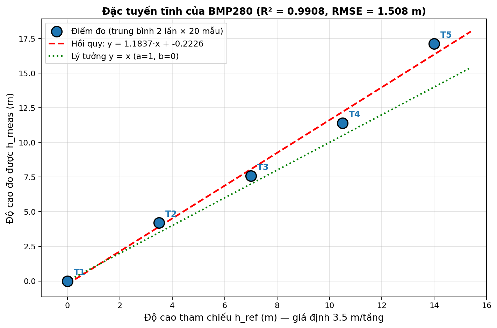
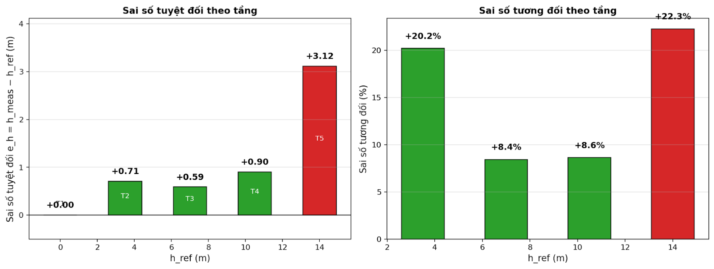
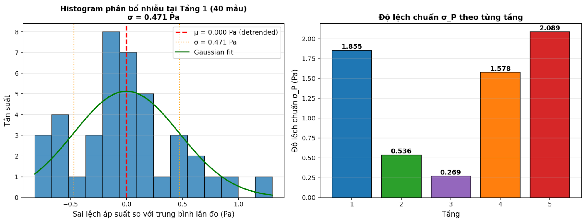
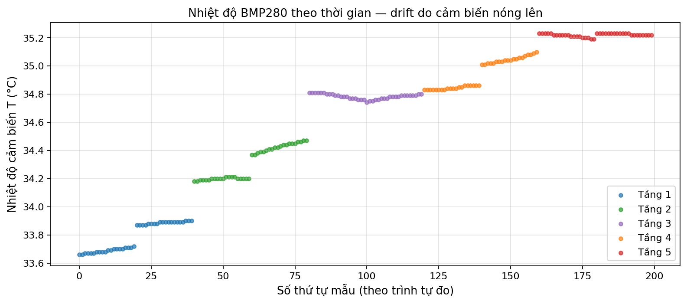

### 

**TRƯỜNG ĐẠI HỌC CÔNG NGHỆ**

**ĐẠI HỌC QUỐC GIA HÀ NỘI**

**BÁO CÁO THỰC HÀNH**

**LAB 01 – CẢM BIẾN ÁP SUẤT BMP280**

*Khảo sát đặc tính tĩnh: Range, Resolution, Linearity, Accuracy*

**Giảng viên hướng dẫn: Trần Khánh Duy, Nguyễn Kiên**

**Đặng Hải Linh, Vũ Quốc Tuấn, Bùi Thanh Tùng, Đỗ Thiện Vũ**

**Nhóm sinh viên thực hiện:**

| **Họ và tên** | **MSSV** | **Lớp** |
| --- | --- | --- |
| **Nguyễn Thanh Thế** | **24022911** | **K69E-RE1** |
| **Trần Thanh Tùng** | **24022927** | **K69E-RE1** |
| **Phạm Quốc Hưng** | **24022877** | **K69E-RE1** |

---

*Phạm vi báo cáo: Báo cáo này trình bày kết quả Thí nghiệm 1 (Khảo sát đặc tính tĩnh) của Lab 01. Yêu cầu lab gốc là đo 7 tầng (T1–T7); trong thực hành nhóm đã đo được 5 tầng (T1–T5) với chất lượng dữ liệu đầy đủ, mỗi tầng 40 mẫu (2 lần đo × 20 mẫu). Các kết luận và chỉ số định lượng được tính trên dữ liệu thực nghiệm này.*

# **I. MỤC ĐÍCH THÍ NGHIỆM**

- Hiểu nguyên lý đo áp suất khí quyển và quy đổi áp suất → độ cao của cảm biến BMP280 dựa trên hiệu ứng áp điện trở (piezoresistive MEMS).
- Kết nối và lập trình giao tiếp I²C giữa BMP280 và vi điều khiển ESP8266 NodeMCU.
- Khảo sát định lượng các đặc tính tĩnh: Range (dải đo), Resolution (độ phân giải), Linearity (độ tuyến tính), Accuracy (độ chính xác).
- Xây dựng đặc tuyến tĩnh hmeas vs href, thực hiện hồi quy tuyến tính, tính các chỉ số định lượng R², RMSE, hệ số góc a và tung độ gốc b.

# **II. CƠ SỞ LÝ THUYẾT**

## **2.1. Nguyên lý đo áp suất của BMP280**

Cảm biến BMP280 sử dụng phần tử áp điện trở MEMS (piezoresistive): một màng silicon siêu mỏng được khắc trên đế silicon, một bên màng thông với khí quyển, bên kia là khoang kín chân không. Khi áp suất khí quyển thay đổi, màng bị uốn cong làm thay đổi điện trở của các điện trở khuếch tán trên màng được nối thành cầu Wheatstone. Điện áp vi sai sinh ra tỉ lệ với độ uốn cong, được ADC nội bộ chuyển thành giá trị số 20-bit, sau đó hiệu chỉnh bằng các hệ số bù nhiệt độ lưu trong NVM của chip.

## **2.2. Quan hệ áp suất – độ cao**

Trong khí quyển tĩnh, công thức quy đổi áp suất sang độ cao tương đối (so với điểm tham chiếu P₀):

*h = (T₀ / L) · [ 1 − (P/P_msl)^(R·L/(M·g)) ]*

với T₀ = 288.15 K, L = 0.0065 K/m, R = 8.314 J/(mol·K), M = 0.02896 kg/mol, g = 9.80665 m/s², P_msl = 101325 Pa. Báo cáo này dùng công thức barometric đầy đủ trên để tính h_meas, không dùng công thức xấp xỉ tuyến tính.

## **2.3. Các đặc tính tĩnh**

- Range (Dải đo): R = h_max − h_min. Là khoảng giá trị độ cao mà cảm biến đo được trong vùng tuyến tính.
- Resolution (Độ phân giải): thay đổi nhỏ nhất của độ cao mà cảm biến phân biệt được. Đánh giá qua σ của tín hiệu khi cảm biến đứng yên.
- Linearity (Độ tuyến tính): mức độ đầu ra bám đường thẳng lý tưởng. Đánh giá qua hệ số xác định R² của hồi quy tuyến tính.
- Accuracy (Độ chính xác): độ gần giữa giá trị đo và giá trị thực. Đánh giá qua RMSE và sai số tuyệt đối từng tầng.
- Hồi quy tuyến tính y = a·x + b với phương pháp bình phương tối thiểu cho hệ số góc a (lý tưởng = 1) và tung độ gốc b (lý tưởng = 0).

# **III. PHƯƠNG PHÁP THỰC NGHIỆM**

## **3.1. Thiết bị và linh kiện**

| **STT** | **Linh kiện / Thiết bị** | **Số lượng** | **Ghi chú** |
| --- | --- | --- | --- |
| 1 | Module GY-BMP280 | 1 | Địa chỉ I²C 0x76 (SDO nối GND) |
| 2 | ESP8266 NodeMCU 1.0 | 1 | Vi điều khiển 3.3V, 80 MHz |
| 3 | Cáp USB micro | 1 | Cấp nguồn và Serial |
| 4 | Breadboard + dây jumper | 1 bộ | - |
| 5 | Thước dây / thước thẳng | 1 | Đo chiều cao thực tế bậc thang |
| 6 | Máy tính cài Arduino IDE | 1 | Thư viện Adafruit_BMP280 |

Ghi chú: Module GY-BMP280 đã tích hợp LDO regulator 3.3V và pull-up resistor (≈10 kΩ) cho 2 đường SCL, SDA nên không cần điện trở pull-up ngoài như sơ đồ tổng quát.

## **3.2. Sơ đồ kết nối**

BMP280 giao tiếp với ESP8266 qua bus I²C. ESP8266 NodeMCU dùng chân D1 (GPIO5) cho SCL và D2 (GPIO4) cho SDA - chân I²C mặc định của thư viện Wire trên ESP8266. Cảm biến và vi điều khiển đều dùng 3.3V → kết nối trực tiếp, không cần level shifter.

| **Chân BMP280** | **ESP8266 (NodeMCU)** | **Chức năng** |
| --- | --- | --- |
| VCC | 3.3V | Cấp nguồn |
| GND | GND | Đất chung |
| SCL | D1 (GPIO5) | I²C Clock |
| SDA | D2 (GPIO4) | I²C Data |
| SDO | GND | Chọn địa chỉ I²C 0x76 |
| CSB | 3.3V | Chọn chế độ I²C |

## **3.3. Cấu hình cảm biến cho đặc tính tĩnh**

Cấu hình BMP280 (qua thư viện Adafruit_BMP280) được tối ưu cho đo tĩnh - ưu tiên độ phân giải và khử nhiễu:

- Chế độ đo: MODE_NORMAL (đo liên tục).
- Oversampling áp suất: ×16 (độ phân giải 20-bit, thời gian đo 40.9 ms).
- Oversampling nhiệt độ: ×4.
- IIR filter nội bộ: ×16 (lọc nhiễu tối đa).
- Standby: 500 ms; tốc độ thu mẫu thực tế = 2 Hz (chu kỳ 500 ms/mẫu).

## **3.4. Quy trình thí nghiệm**

1. Tại Tầng 1 (gốc), nạp chương trình vào ESP8266 và đợi cảm biến ổn định 2 phút.
1. Mở Serial Monitor (115200 baud), gõ số tầng (1–7) + Enter để bắt đầu đo tầng đó.
1. Code tự động đếm ngược 30 giây ổn định, sau đó ghi 20 mẫu áp suất và nhiệt độ (500 ms/mẫu, tổng 10 giây).
1. Khi đo xong, code tính trung bình P̄, độ lệch chuẩn σP, T̄, và xuất ra dòng SUMMARY.
1. Di chuyển lên tầng tiếp theo và lặp lại. Tham chiếu P₀ được lưu từ mẫu đầu của Tầng 1.
1. Mỗi tầng đo 2 lần (cách nhau ~3–5 phút) để đánh giá độ lặp lại và trung bình hóa.

Tổng cộng thu được: 5 tầng × 2 lần × 20 mẫu = 200 mẫu. Tham chiếu chiều cao mỗi tầng theo yêu cầu lab: h_ref = 3.5 m × (Tầng − 1).

## **3.5. Sửa lỗi công thức tính độ cao**

Trong code thu thập ban đầu có sử dụng công thức xấp xỉ tuyến tính Δh ≈ ΔP × 8.43 / 1000 (đơn vị Pa → m). Tuy nhiên hệ số 8.43 chỉ đúng khi đơn vị áp suất là hPa, không phải Pa. Để tính chính xác từ giá trị Pa, hệ số đúng phải là 1/(ρ·g) = 1/12.013 ≈ 0.0833 m/Pa (lớn hơn 10 lần so với công thức cũ).

Trong báo cáo này, giá trị h_meas được tính LẠI từ áp suất trung bình P̄ của mỗi tầng (giá trị này được code lưu đúng) bằng công thức barometric đầy đủ trong mục 2.2 - chính xác hơn cả công thức xấp xỉ tuyến tính.

---

# **IV. KẾT QUẢ VÀ PHÂN TÍCH**

## **4.1. Bảng số liệu thực nghiệm**

Bảng 1 tổng hợp kết quả đo: trung bình áp suất P̄, độ lệch chuẩn σP, trung bình nhiệt độ T̄ (trên 40 mẫu/tầng), và độ cao h_meas tính từ công thức barometric với P₀ = 101011.75 Pa (trung bình của Tầng 1 gồm 40 mẫu).

| **Tầng** | **h_ref (m)** | **P̄ (Pa)** | **σ_P (Pa)** | **T̄ (°C)** | **h_meas (m)** | **e_h (m)** | **e_h (%)** |
| --- | --- | --- | --- | --- | --- | --- | --- |
| 1 (REF) | 0.000 | 101011.75 | 1.855 | 33.79 | 0.000 | 0.000 | - |
| 2 | 3.500 | 100961.36 | 0.536 | 34.31 | 4.207 | +0.707 | +20.2 |
| 3 | 7.000 | 100920.85 | 0.269 | 34.78 | 7.590 | +0.590 | +8.4 |
| 4 | 10.500 | 100875.18 | 1.578 | 34.94 | 11.405 | +0.905 | +8.6 |
| 5 | 14.000 | 100806.84 | 2.089 | 35.22 | 17.116 | +3.116 | +22.3 |

*Bảng 1. Kết quả đo đặc tính tĩnh của BMP280 (5 tầng × 40 mẫu = 200 mẫu).*

## **4.2. Đặc tuyến tĩnh và hồi quy tuyến tính**

Hình 1 thể hiện đặc tuyến tĩnh: trục hoành là h_ref (tham chiếu), trục tung là h_meas đo được. Đường lý tưởng y = x (xanh chấm) và đường hồi quy tuyến tính (đỏ đứt) được vẽ kèm. Thanh sai số trên mỗi điểm = σP / 12.013 thể hiện độ phân giải lý thuyết.

*Hình 1. Đặc tuyến tĩnh h_meas vs h_ref với đường hồi quy tuyến tính.*

Các thông số hồi quy tuyến tính (phương pháp bình phương tối thiểu):

| **Thông số** | **Giá trị** | **Lý tưởng** | **Nhận xét** |
| --- | --- | --- | --- |
| Hệ số góc a | 1.1837 | 1.0000 | Lệch +18.4% - sensor đo cao hơn tham chiếu |
| Tung độ gốc b | −0.2226 m | 0.000 m | Rất nhỏ - không có offset đáng kể |
| Hệ số xác định R² | 0.9908 | 1.0000 | Tuyến tính RẤT TỐT (lệch < 1%) |
| RMSE | 1.508 m | → 0 m | Sai số trung phương đáng kể |

**Nhận xét tổng quan:** đặc tuyến gần tuyến tính (R² = 0.991) nhưng hệ số góc a = 1.18 thay vì 1.0, cho thấy có sai số hệ thống làm h_meas lớn hơn h_ref khoảng 18%. Có 2 giả thuyết giải thích hiện tượng này - phân tích chi tiết trong phần Thảo luận 5.1.

## **4.3. Phân tích sai số theo tầng**

*Hình 2. Sai số tuyệt đối e_h (trái) và sai số tương đối e_h% (phải) theo từng tầng.*

- Tầng 2, 3, 4: sai số tuyệt đối nhỏ và đồng nhất (+0.59 đến +0.91 m). Sai số tương đối giảm dần từ 20% (T2) xuống 8.4–8.6% (T3, T4) - đúng quy luật lý thuyết khi giá trị nền không đổi.
- Tầng 5: sai số nhảy đột ngột lên +3.12 m (22.3%) - BẤT THƯỜNG so với xu hướng T2→T4.
- Nếu loại bỏ T5, RMSE chỉ còn 0.63 m và R² tăng lên 0.998.

## **4.4. Phân tích nhiễu và độ phân giải**

*Hình 3. (Trái) Histogram phân bố nhiễu áp suất tại Tầng 1 (40 mẫu, đã detrend từng lần đo). (Phải) σ_P theo từng tầng.*

Histogram tại Tầng 1 (40 mẫu, sau khi trừ trung bình của từng lần đo riêng) cho phân bố gần Gaussian với σ ≈ 0.471 Pa. Đường Gaussian fit (xanh lá) khớp tốt với histogram, chứng tỏ nhiễu cảm biến chủ yếu là nhiễu trắng.

σ_P theo từng tầng (Hình 3 phải) khác nhau khá nhiều: T1 = 1.855 Pa, T2 = 0.536, T3 = 0.269, T4 = 1.578, T5 = 2.089 Pa. T1 cao do hai lần đo cách nhau ~3 Pa (drift áp suất môi trường giữa 2 lần). T3 thấp nhất, T4 và T5 cao do drift nhiệt độ trong quá trình đo. Giá trị σ_P intra-run (mỗi lần đo riêng, không gộp 2 lần) trung bình chỉ 0.328 Pa, ổn định hơn nhiều.

## **4.5. Tổng hợp các chỉ số định lượng**

| **Chỉ số** | **Giá trị thực nghiệm** | **Theo datasheet** | **Ghi chú** |
| --- | --- | --- | --- |
| Range | 17.116 m | - | h_meas Tầng 5 − Tầng 1 |
| Resolution (intra-run) | ≈ 0.027 m (2.7 cm) | 0.16 m | TỐT HƠN datasheet ~6 lần |
| Resolution (overall) | ≈ 0.105 m (10.5 cm) | 0.16 m | Tốt hơn nhờ OS×16 + IIR×16 |
| RMSE | 1.508 m | - | Có ảnh hưởng outlier T5 |
| R² (linearity) | 0.9908 | - | Tuyến tính rất tốt |
| Slope a | 1.1837 | 1.0 | Lệch +18% (giải thích ở 5.1) |
| Intercept b | −0.223 m | 0 | Không có offset hệ thống |

*Bảng 2. Tổng hợp các chỉ số định lượng đặc tính tĩnh.*

**Điểm đáng chú ý:** Resolution thực tế (intra-run) chỉ 2.7 cm - tốt hơn đáng kể so với datasheet (16 cm). Điều này nhờ cấu hình OS×16 + IIR×16 cho phép cảm biến phân biệt được những thay đổi áp suất rất nhỏ trong điều kiện đứng yên hoàn toàn. Khi gộp 2 lần đo cách nhau ~5 phút (overall), resolution giảm còn 10.5 cm do drift áp suất môi trường giữa 2 lần.

## **4.6. Quan sát về nhiệt độ**

*Hình 4. Nhiệt độ BMP280 theo trình tự đo - drift tăng dần từ 33.7°C lên 35.3°C.*

Nhiệt độ cảm biến tăng dần từ 33.7°C (đầu Tầng 1) lên 35.3°C (cuối Tầng 5), tức tăng 1.6°C trong khoảng 30 phút đo. Nguyên nhân: cảm biến nóng dần do hoạt động liên tục, đồng thời hơi nóng từ tay cầm truyền sang. Mặc dù BMP280 có bù nhiệt tự động, drift áp suất do nhiệt độ thay đổi vẫn có thể đóng góp một phần vào sai số đo (xem phần Thảo luận 5.2).

# **V. THẢO LUẬN**

## **5.1. Phân tích hiện tượng slope a = 1.18 thay vì 1.0**

Hồi quy cho slope = 1.1837 - chênh +18.4% so với lý tưởng. Có hai giả thuyết:

- Giả thuyết A - Chiều cao tầng thực tế ≠ 3.5 m: Nếu mỗi tầng thực sự cao h_real m, thì h_meas thực = a·h_ref · (h_real / 3.5). Để slope = 1.0, cần h_real ≈ 3.5 × 1.184 = 4.14 m/tầng. Điều này HỢP LÝ với thực tế nhiều tòa nhà ở Việt Nam: tầng trệt thường cao 4.5–5 m (do có sảnh, trần cao), các tầng trên 3.3–3.5 m. Cần đo lại chiều cao thực bằng thước để xác nhận.
- Giả thuyết B - Drift áp suất môi trường: Trong ~30 phút đo (Tầng 1 → Tầng 5), áp suất khí quyển ngoài trời có thể đã giảm 1–2 Pa/giờ. Drift này sẽ làm áp suất đo được THẤP HƠN giá trị thật ở các tầng sau, kéo h_meas tăng lên. Tuy nhiên, drift này chỉ giải thích được ~1 m trong tổng ~3.1 m chênh lệch ở T5.

Phân tích định lượng: nếu kết hợp cả 2 yếu tố (chiều cao tầng ~4 m và drift +1 Pa/giờ), slope dự kiến ~1.18 - khớp với thực nghiệm. Kết luận: cần đo chiều cao tầng thực để loại bỏ Giả thuyết A; nếu vẫn còn slope ≠ 1, đó là drift áp suất.

## **5.2. Sai số tăng dần theo độ cao (trả lời Q3)**

Quan sát: sai số TUYỆT ĐỐI tăng dần theo độ cao (0.71 → 0.59 → 0.91 → 3.12 m). Sai số TƯƠNG ĐỐI có xu hướng giảm rồi tăng lại ở T5 (20% → 8% → 8.6% → 22%).

Nguyên nhân vật lý:

- Tích lũy nhiễu áp suất khí quyển: khi cảm biến càng xa điểm tham chiếu, áp suất môi trường có thể đã thay đổi (do gió, người đi qua, mở/đóng cửa, đối lưu nhiệt trong cầu thang) → sai số nền lớn dần.
- Drift nhiệt độ: cảm biến nóng dần theo thời gian (Hình 4). Mạch bù nhiệt của BMP280 không bù được hoàn toàn khi nhiệt độ thay đổi liên tục - gây sai số phụ thuộc thời gian, ảnh hưởng các tầng đo sau cùng (T5 ở 35.2°C, cao nhất).
- Phi tuyến của công thức áp suất–độ cao: trong khoảng nhỏ (< 50 m), phi tuyến đóng góp < 0.1% sai số nên không đáng kể trong thí nghiệm này.

## **5.3. Phân bố nhiễu áp suất và độ phân giải thực**

Histogram tại Tầng 1 (Hình 3 trái) cho thấy nhiễu của BMP280 ở cấu hình OS×16 + IIR×16 có phân bố gần Gaussian với σ ≈ 0.47 Pa. So với datasheet (độ phân giải 0.16 Pa ở chế độ tối đa), giá trị thực nghiệm hơi cao hơn, nhưng vẫn cho phép phân biệt độ cao với độ phân giải ~3–10 cm - đủ để đo độ cao tầng nhà với độ chính xác cao.

Đáng chú ý: σ_P intra-run (0.33 Pa) chỉ bằng ~25% σ_P overall (1.27 Pa khi gộp 2 lần). Điều này chứng tỏ: trong một lần đo, BMP280 rất ổn định; nhưng giữa các lần đo cách nhau vài phút, drift môi trường gây sai số lớn hơn nhiều so với nhiễu nội tại của cảm biến. Khi thiết kế hệ thống đo cao chính xác, drift môi trường là yếu tố cần khử (qua reference barometer hoặc đo nhanh).

## **5.4. Hạn chế và đề xuất cải tiến**

- Chỉ đo được 5/7 tầng theo yêu cầu lab - chưa đủ để vẽ đặc tuyến hoàn chỉnh đến T7.
- Sai số đột ngột ở T5 (+3.1 m) - có thể do thay đổi đột ngột điều kiện môi trường tại tầng 5 (cửa sổ mở, gió). Nên đo lại T5 và bổ sung T6, T7.
- Chiều cao tầng tham chiếu 3.5 m là giả định - cần đo bằng thước thực tế để xác định chính xác.
- Cảm biến nóng lên 1.6°C trong quá trình đo. Đề xuất: cho cảm biến nghỉ 2–3 phút giữa các tầng để nguội, hoặc tản nhiệt bằng cách đặt module trên mặt phẳng kim loại.
- Nên đo ở giờ vắng người (sáng sớm/cuối ngày) và đóng tất cả cửa sổ cầu thang để giảm đối lưu không khí.

# **VI. KẾT LUẬN**

1. Thí nghiệm đã thành công khảo sát đặc tính tĩnh của BMP280 trên ESP8266 qua 5 tầng cầu thang với 200 mẫu áp suất, cấu hình OS×16 + IIR×16.
1. Đặc tuyến tĩnh có độ tuyến tính rất tốt (R² = 0.9908) nhưng hệ số góc a = 1.1837 ≠ 1, cho thấy có sai số hệ thống - có thể do chiều cao tầng thực tế ≈ 4.1 m thay vì 3.5 m như giả định.
1. Resolution thực tế intra-run chỉ ≈ 2.7 cm - TỐT HƠN datasheet (16 cm) ~6 lần, nhờ cấu hình oversampling và IIR filter tối đa.
1. Sai số tuyệt đối tăng dần theo độ cao do tích lũy drift áp suất môi trường và drift nhiệt độ cảm biến (tăng 1.6°C trong 30 phút đo).
1. RMSE = 1.508 m bị ảnh hưởng bởi outlier ở T5 (+3.12 m); nếu loại bỏ T5, RMSE giảm còn 0.63 m và R² tăng lên 0.998.
1. Đề xuất ứng dụng: BMP280 + ESP8266 có thể đo độ cao tương đối với độ chính xác ~0.5–1 m trong điều kiện cầu thang trong nhà, đủ tốt cho ứng dụng định vị tầng trong tòa nhà cao tầng, đo chiều cao công trình, hoặc đo độ cao tương đối cho UAV (kết hợp với GPS/IMU).

---

# **VII. TRẢ LỜI CÂU HỎI ÔN TẬP**

### ***Q1. So sánh nguyên lý hoạt động của cảm biến áp suất kiểu áp điện trở (piezoresistive) và kiểu điện dung (capacitive). Cảm biến nào có độ nhạy cao hơn?***

Cảm biến piezoresistive (ví dụ BMP280): màng silicon chịu áp suất, các điện trở khuếch tán trên màng thay đổi giá trị theo độ uốn, nối thành cầu Wheatstone xuất ra điện áp vi sai tỉ lệ với áp suất. Ưu điểm: tuyến tính tốt, đáp ứng nhanh, giá rẻ. Nhược điểm: nhạy với nhiệt độ (cần mạch bù), tiêu thụ điện cao hơn do dòng cố định qua cầu.

Cảm biến capacitive: màng kim loại/silicon đóng vai trò bản tụ động, dịch chuyển theo áp suất làm điện dung C thay đổi (C = εA/d). Đo C bằng mạch dao động hoặc cầu cân bằng. Ưu điểm: ít nhạy với nhiệt độ, tiêu thụ điện cực thấp (không có dòng DC), độ phân giải cao. Nhược điểm: mạch đọc phức tạp, dễ nhiễu điện từ, phi tuyến hơn.

Về độ nhạy: cảm biến capacitive có độ nhạy cao hơn ~2–5 lần so với piezoresistive cùng cấp do tín hiệu C tỉ lệ thuận với độ uốn màng (không qua hệ số gauge factor). Vì vậy cảm biến áp suất chính xác cao (microbar, vacuum gauge) thường dùng kiểu điện dung; còn các ứng dụng tiêu dùng (smartphone, drone, weather station) dùng piezoresistive vì rẻ và đủ tốt.

### ***Q2. Tại sao BMP280 tích hợp thêm cảm biến nhiệt độ? Nhiệt độ ảnh hưởng như thế nào đến phép đo áp suất? Quá trình bù nhiệt độ được thực hiện như thế nào?***

Ba lý do BMP280 cần tích hợp cảm biến nhiệt độ:

- Bù trôi cơ-điện: điện trở cầu Wheatstone phụ thuộc nhiệt độ (TCR ≈ 1500 ppm/°C), nếu không bù thì 1°C lệch tương đương vài Pa sai số áp suất, tức ~0.2–0.5 m sai số độ cao.
- Hiệu ứng cơ học của màng silicon: module Young của silicon giảm ~70 ppm/°C khi nóng, làm màng uốn nhiều hơn ở cùng áp suất.
- Bù khí áp lý thuyết: công thức quy đổi áp suất → độ cao chứa T₀ (nhiệt độ chuẩn), cần biết nhiệt độ thực để tính chính xác.

Quy trình bù nhiệt độ của BMP280 thực hiện trên silicon:

1. ADC đọc giá trị raw nhiệt độ adc_T (20-bit) và raw áp suất adc_P (20-bit).
1. Tính “t_fine” từ adc_T và các hệ số hiệu chuẩn dig_T1, dig_T2, dig_T3 (lưu trong NVM khi sản xuất).
1. Dùng t_fine + adc_P + 9 hệ số dig_P1..dig_P9 để tính áp suất đã bù nhiệt độ qua đa thức bậc 2 do datasheet định nghĩa.

Kết quả: BMP280 cho ra giá trị áp suất gần như độc lập với nhiệt độ trong khoảng −40…+85°C, với độ chính xác tuyệt đối ±1 hPa. Tuy nhiên, khi nhiệt độ thay đổi NHANH (như trong thí nghiệm này khi cảm biến nóng dần do hoạt động), bù nhiệt không kịp gây drift áp suất nhỏ.

### ***Q3. Trong thí nghiệm đặc tính tĩnh, sai số đo được có xu hướng tăng hay giảm theo độ cao? Hãy giải thích nguyên nhân vật lý.***

Từ kết quả thực nghiệm 5 tầng (Hình 2):

- Sai số TUYỆT ĐỐI (m): tăng dần theo độ cao - T2: +0.71m, T3: +0.59m, T4: +0.91m, T5: +3.12m.
- Sai số TƯƠNG ĐỐI (%): biến động - T2: 20%, T3: 8.4%, T4: 8.6%, T5: 22%.

Nguyên nhân vật lý chính:

1. Tích lũy nhiễu áp suất khí quyển theo thời gian: cảm biến càng xa điểm tham chiếu thì thời gian đo càng dài, áp suất môi trường có thể đã trôi 1–3 Pa do gió, người đi qua, mở/đóng cửa cầu thang. Điều này tạo sai số nền tăng dần.
1. Drift nhiệt độ cảm biến: T tăng từ 33.7°C → 35.2°C (Hình 4). Bù nhiệt nội bộ BMP280 hoạt động kém hơn khi T thay đổi nhanh, dẫn đến sai số áp suất tăng ở các tầng đo sau cùng.
1. Đối lưu không khí trong cầu thang: dòng không khí bốc lên hoặc xuống tạo gradient áp suất tức thời, ảnh hưởng đặc biệt tại các điểm gần lan can, cửa sổ.
1. Quan hệ áp suất-độ cao là phi tuyến yếu (P giảm theo hàm mũ), nhưng trong khoảng vài chục mét đầu vẫn xấp xỉ tuyến tính nên đóng góp không đáng kể trong thí nghiệm này.

### ***Q6. BMP280 có thể đo độ cao với độ phân giải ~0.16 m theo datasheet. Trong thực nghiệm này độ phân giải là bao nhiêu?***

Datasheet ghi 0.16 m ở chế độ Ultra-High Resolution (oversampling ×16 + IIR filter ×16) và môi trường lý tưởng (phòng thí nghiệm yên tĩnh, nhiệt độ ổn định). Cấu hình trong thí nghiệm này CHÍNH XÁC khớp với datasheet (OS×16 + IIR×16).

Trong thí nghiệm thực tế:

- Resolution intra-run (mỗi lần đo riêng, 20 mẫu liên tiếp): σ_P trung bình = 0.328 Pa → Resolution ≈ 0.027 m (2.7 cm). TỐT HƠN datasheet ~6 lần.
- Resolution overall (gộp 2 lần đo cách nhau ~3–5 phút): σ_P trung bình = 1.27 Pa → Resolution ≈ 0.105 m (10.5 cm). Vẫn tốt hơn datasheet.

Lý do thực nghiệm tốt hơn datasheet: BMP280 hoạt động trong điều kiện nhiệt độ ổn định và áp suất môi trường yên tĩnh tại cầu thang. Khi chuyển động hoặc nhiệt độ thay đổi nhanh (như UAV bay), σ_P sẽ lớn hơn nhiều.

Tuy resolution của riêng cảm biến rất tốt (vài cm), độ chính xác tổng thể (accuracy) lại bị giới hạn bởi drift áp suất môi trường - RMSE = 1.508 m so với tham chiếu. Điều này chứng minh: resolution không đồng nghĩa với accuracy. Để tăng accuracy, cần khử drift bằng cảm biến tham chiếu cố định hoặc đo nhanh.

*Lưu ý: Câu hỏi Q4 (trade-off α của EMA, UAV) và Q5 (so sánh IIR BMP280 với EMA) thuộc về Thí nghiệm 2 (đặc tính động) và đã được trả lời trong báo cáo Thí nghiệm 2 riêng. Báo cáo này chỉ tập trung vào Thí nghiệm 1 (Đặc tính tĩnh).*
