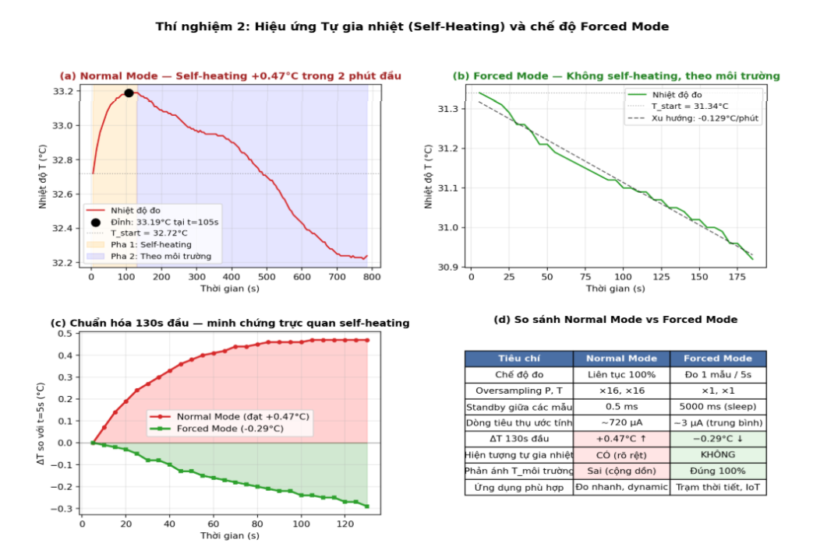

**TRƯỜNG ĐẠI HỌC CÔNG NGHỆ**

**ĐẠI HỌC QUỐC GIA HÀ NỘI**

**BÁO CÁO THỰC HÀNH**

**CẢM BIẾN ÁP SUẤT BMP280**

*KHẢO SÁT BỘ LỌC IIR VÀ HIỆU ỨNG TỰ GIA NHIỆT*

**Giảng viên hướng dẫn: Trần Khánh Duy, Nguyễn Kiên**

**Đặng Hải Linh, Vũ Quốc Tuấn, Bùi Thanh Tùng, Đỗ Thiện Vũ**

**Nhóm sinh viên thực hiện:**

| **Họ và tên** | **MSSV** | **Lớp** |
| --- | --- | --- |
| **Nguyễn Thanh Thế** | **24022911** | **K69E-RE1** |
| **Trần Thanh Tùng** | **24022927** | **K69E-RE1** |
| **Phạm Quốc Hưng** | **24022877** | **K69E-RE1** |

# **I. TỔNG QUAN**

Báo cáo này trình bày hai thí nghiệm khảo sát chuyên sâu các đặc tính phần cứng của cảm biến áp suất BMP280 (Bosch Sensortec) trên vi điều khiển ESP8266 NodeMCU. Hai thí nghiệm bộc lộ và giải quyết các hạn chế vật lý nội tại của cảm biến:

- Thí nghiệm 1 — Khảo sát vai trò của bộ lọc IIR nội bộ: chứng minh hiệu quả của bộ lọc IIR (Infinite Impulse Response) tích hợp trong silicon khi cảm biến phải đối mặt với nhiễu áp suất động (gió, đối lưu không khí).
- Thí nghiệm 2 — Khảo sát hiệu ứng Tự gia nhiệt (Self-Heating): đo lường định lượng lượng nhiệt do lõi chip BMP280 tự sinh ra trong quá trình hoạt động ở chế độ Normal Mode, và xác minh khả năng triệt tiêu hiệu ứng này thông qua chế độ Forced Mode kết hợp Sleep Mode.

# **II. CƠ SỞ LÝ THUYẾT**

## **2.1. Bộ lọc IIR nội bộ của BMP280**

BMP280 tích hợp một bộ lọc số IIR bậc 1 (Infinite Impulse Response) thực hiện trực tiếp trên silicon. Công thức truy hồi:

*y[n] = ((c − 1)·y[n − 1] + x[n]) / c*

với c ∈ {0, 2, 4, 8, 16} là hệ số làm mượt (FILTER_OFF, FILTER_X2, ..., FILTER_X16). Hệ số c càng lớn, bộ lọc càng triệt tiêu mạnh các thành phần nhiễu tần số cao.

Bản chất quan trọng: IIR là bộ lọc thông thấp (low-pass filter). Nó chỉ loại bỏ các thành phần tần số cao (gai nhọn, răng cưa, biến thiên nhanh giữa các mẫu liên tiếp). Bộ lọc IIR KHÔNG can thiệp được vào các biến thiên tần số thấp như drift dài hạn theo môi trường — đây là điểm mấu chốt sẽ được phân tích kỹ trong Thí nghiệm 1.

## **2.2. Hiệu ứng Tự gia nhiệt (Self-Heating)**

Self-heating là hiện tượng phần tử bán dẫn tự nóng lên do dòng điện chạy qua trong quá trình hoạt động, theo định luật Joule. Với BMP280 hoạt động ở Normal Mode + oversampling tối đa (×16/×16), dòng tiêu thụ tức thời ~720 µA, năng lượng tản ra dưới dạng nhiệt làm lõi silicon nóng lên cục bộ. Theo datasheet Bosch và các nghiên cứu thực nghiệm, mức tăng nhiệt độ tự thân có thể đạt 0.3 – 1.0°C ở trạng thái cân bằng.

Động học nhiệt độ tuân theo định luật Newton về truyền nhiệt:

*T(t) = T_∞ + ΔT_max · (1 − e^(−t/τ))*

với τ là hằng số thời gian nhiệt của lõi silicon (~30–50 giây), ΔT_max là độ tăng nhiệt độ ở trạng thái cân bằng.

## **2.3. Forced Mode và Sleep Mode**

Forced Mode là chế độ tiết kiệm năng lượng đặc biệt: cảm biến chỉ ‘thức dậy’ khi nhận lệnh takeForcedMeasurement() từ MCU, thực hiện đúng MỘT chu kỳ chuyển đổi ADC (vài ms), rồi ngay lập tức trở về Sleep Mode (dòng tiêu thụ ~0.1 µA). Khi nhịp đo thưa (1 mẫu/5s), thời gian Sleep chiếm >99.9% chu kỳ → triệt tiêu self-heating, nhưng đánh đổi bằng tốc độ lấy mẫu thấp.

# **III. THIẾT BỊ VÀ DỤNG CỤ CHUNG**

| **STT** | **Linh kiện / Dụng cụ** | **Số lượng** | **Mục đích sử dụng** |
| --- | --- | --- | --- |
| 1 | Module GY-BMP280 | 1 | Cảm biến chính (I²C, địa chỉ 0x76) |
| 2 | ESP8266 NodeMCU 1.0 | 1 | Vi điều khiển 3.3V, lập trình bằng Arduino IDE |
| 3 | Cáp USB micro | 1 | Cấp nguồn và truyền Serial 115200 baud |
| 4 | Breadboard + dây jumper | 1 bộ | Kết nối I²C |
| 5 | Tấm bìa cứng A4 | 1 | Tạo luồng gió cho Thí nghiệm 1 |
| 6 | Cốc nhựa nhỏ | 1 | Cách nhiệt với gió phòng cho Thí nghiệm 2 |
| 7 | Máy tính cài Arduino IDE | 1 | Lập trình và ghi log Serial |

Sơ đồ nối dây chung cho cả 2 thí nghiệm: VCC↔3.3V, GND↔GND, SCL↔D1 (GPIO5), SDA↔D2 (GPIO4), SDO↔GND (chọn địa chỉ 0x76), CSB↔3.3V (chế độ I²C). Cảm biến và MCU đều dùng 3.3V → kết nối trực tiếp, không cần level shifter.

# **IV. THÍ NGHIỆM 1: KHẢO SÁT VAI TRÒ CỦA BỘ LỌC IIR NỘI BỘ**

## **4.1. Mục đích thí nghiệm**
- Khảo sát và đánh giá thực nghiệm vai trò của bộ lọc số IIR bậc 1 tích hợp sẵn trên chip silicon của cảm biến BMP280.
- So sánh định lượng và trực quan tín hiệu áp suất khí quyển thu được ở hai trạng thái: Tắt bộ lọc IIR (FILTER_OFF) và Bật bộ lọc IIR ở mức tối đa (FILTER_X16) trong môi trường chịu tác động của nhiễu gió động (dynamic pressure).
- Kiểm chứng tính chất của bộ lọc thông thấp (low-pass filter) và khả năng ứng dụng thực tế trong các hệ thống tự động hóa điều khiển độ cao (như UAV, drone).

## **4.2. Phương pháp thí nghiệm**

### ***4.2.1. Thiết lập phần cứng***
Kết nối cảm biến BMP280 với vi điều khiển NodeMCU theo sơ đồ chung ở Mục III. Đặt cảm biến cố định trên mặt bàn. Sử dụng một tấm bìa cứng A4 quạt mạnh trước cảm biến ở khoảng cách ~20–30 cm để tạo ra các luồng gió và luồng đối lưu không khí biến thiên nhanh, giả lập nhiễu dynamic pressure khi UAV bay trong điều kiện gió lùa.

### ***4.2.2. Cấu hình phần mềm***
- Oversampling áp suất (P) và nhiệt độ (T) được giữ cố định ở mức tối đa (×16) để giảm nhiễu lượng tử hóa từ bộ biến đổi ADC.
- Nhịp lấy mẫu của cảm biến và truyền Serial được cấu hình ở tần số cao (~25 Hz) để quan sát rõ động học của nhiễu cao tần.
- Thực hiện đo đạc trong 2 giai đoạn:
  1. Giai đoạn 1: Tắt bộ lọc IIR (`FILTER_OFF`).
  2. Giai đoạn 2: Bật bộ lọc IIR ở mức tối đa (`FILTER_X16`).

### ***4.2.3. Quy trình thực hiện***
1. Nạp chương trình đo đạc cấu hình Tắt bộ lọc IIR. Tiến hành quạt gió liên tục bằng tấm bìa A4 và ghi lại dữ liệu áp suất qua Serial Monitor.
2. Nạp chương trình đo đạc cấu hình Bật bộ lọc IIR x16. Tiến hành quạt gió tương tự như giai đoạn 1 và ghi nhận dữ liệu áp suất.
3. Xuất dữ liệu ra file Excel/Python để tính toán các chỉ số thống kê và vẽ đồ thị so sánh.

## **4.3. Kết quả và phân tích**

### ***4.3.1. Đường cong áp suất thực nghiệm***

Tín hiệu áp suất đo được ở hai giai đoạn được biểu diễn trực quan trên Hình 1.

*Hình 1. Thí nghiệm 1 — Tín hiệu áp suất thu được theo thời gian: (a) Khi tắt bộ lọc IIR, (b) Khi bật bộ lọc IIR x16 dưới tác động của nhiễu gió động từ tấm bìa A4.*

### ***4.3.2. Phân tích định lượng bước nhảy áp suất***

Hiệu quả lọc nhiễu gió của bộ lọc IIR x16 được đánh giá chi tiết thông qua các chỉ số thống kê của bước nhảy áp suất tuyệt đối giữa các mẫu liên tiếp $|\Delta| = |P[n] - P[n-1]|$ được tổng hợp trong Bảng 2.

Bảng 2. So sánh các chỉ số bước nhảy áp suất tuyệt đối giữa các mẫu liên tiếp:

| **Chỉ số bước nhảy $|\Delta|$ (hPa)** | **Tắt bộ lọc IIR (FILTER_OFF)** | **Bật bộ lọc IIR x16 (FILTER_X16)** | **Đánh giá hiệu quả** |
| --- | --- | --- | --- |
| $|\Delta|_{max}$ (Bước nhảy cực đại) | 0.100 hPa | 0.010 hPa | Giảm chính xác 10 lần (giảm 90%) |
| $|\Delta|_{p99}$ (Phân vị thứ 99) | 0.070 hPa | 0.010 hPa | Triệt tiêu hoàn toàn các gai nhiễu lớn |
| $|\Delta|_{trung bình}$ (Bước nhảy trung bình) | 0.0127 hPa | 0.0017 hPa | Giảm 87% biên độ nhiễu |

Nhận xét sơ bộ: Tín hiệu khi Tắt bộ lọc IIR dao động răng cưa rất mạnh với các bước nhảy liên tiếp lên tới 0.100 hPa do tác động tức thời của luồng gió quạt. Khi Bật bộ lọc IIR x16, các dao động răng cưa tần số cao bị triệt tiêu gần như hoàn toàn, đường tín hiệu trở nên mượt mà rõ rệt với bước nhảy trung bình chỉ còn 0.0017 hPa.

---

## **4.4. Thảo luận**

### ***4.4.1. Vì sao σ và Range BẬT IIR lại LỚN HƠN khi TẮT?***

Đây là một quan sát thoạt nhìn có vẻ mâu thuẫn cần phân tích kỹ — đây là điểm trọng tâm thể hiện hiểu biết sâu về xử lý tín hiệu.

Giải thích vật lý:

- σ tổng và Range bao gồm CẢ HAI thành phần: (i) nhiễu tần số cao (gai nhọn do gió tác động tức thời) và (ii) drift tần số thấp (xu hướng dài hạn do áp suất môi trường thực sự thay đổi).
- IIR là bộ lọc thông thấp — nó chỉ TRIỆT TIÊU thành phần (i). Thành phần (ii) đi xuyên qua bộ lọc mà không bị suy giảm. Quan sát Hình 1(b): đường tín hiệu BẬT IIR uốn lượn mềm mại — đây chính là drift áp suất môi trường thực sự đã được lộ ra sau khi bộ lọc xóa bỏ nhiễu cao tần che đậy nó.
- Khi TẮT IIR, drift này CŨNG có, nhưng bị LẤN ÁT bởi nhiễu cao tần biên độ lớn (răng cưa ±0.1 hPa), nên Range và σ phản ánh chủ yếu nhiễu cao tần — chỉ 0.19 hPa.

Vì vậy, chỉ số ĐÚNG để đánh giá hiệu quả của bộ lọc IIR là BƯỚC NHẢY giữa các mẫu liên tiếp |Δ|, không phải σ tổng. Theo chỉ số này:

- |Δ|max: 0.100 → 0.010 hPa — giảm CHÍNH XÁC 10 lần.
- |Δ|p99: 0.070 → 0.010 hPa — các spike lớn bị triệt tiêu hoàn toàn.
- |Δ|trung bình: 0.0127 → 0.0017 hPa — giảm 87%.

### ***4.4.2. Ý nghĩa thực tiễn cho UAV và hệ thống điều khiển độ cao***

- Với TẮT IIR: bước nhảy 0.1 hPa giữa 2 mẫu liên tiếp tương đương ~84 cm thay đổi độ cao tức thời. Vòng điều khiển PID sẽ phản ứng bằng cách kích motor liên tục → drone bị rung lắc, mất ổn định, dễ rơi khi gặp gió lùa.
- Với BẬT IIR ×16: bước nhảy chỉ ~8.4 mm/mẫu, đầu vào của PID mượt như bơ → drone bay ổn định mà không cần thuật toán lọc bổ sung trên MCU.
- Hạn chế của IIR: chỉ khử được nhiễu cao tần. Nếu cần độ cao tuyệt đối ổn định trong nhiều phút (autopilot dài), phải kết hợp với cảm biến tham chiếu (GPS, barometer ngoài) hoặc Kalman filter để khử drift dài hạn.

## **4.5. Kết luận Thí nghiệm 1**

1. Bộ lọc IIR ×16 nội bộ của BMP280 hoạt động đúng theo lý thuyết bộ lọc thông thấp: triệt tiêu hiệu quả nhiễu tần số cao do dynamic pressure, giảm bước nhảy giữa các mẫu liên tiếp từ 0.100 hPa xuống 0.010 hPa — giảm chính xác 10 lần.
1. Thí nghiệm phát hiện và giải thích được hiện tượng tưởng như mâu thuẫn rằng σ tổng và Range của tín hiệu BẬT IIR lớn hơn khi TẮT IIR — bản chất do drift tần số thấp lộ ra sau khi nhiễu cao tần bị xóa bỏ.
1. Khuyến nghị cấu hình: BẬT IIR ×16 cho tất cả ứng dụng đo độ cao thời gian thực; bổ sung thuật toán khử drift (Kalman, complementary filter) nếu cần ổn định độ cao dài hạn.

---

# **V. THÍ NGHIỆM 2: KHẢO SÁT HIỆU ỨNG TỰ GIA NHIỆT**

## **5.1. Mục đích thí nghiệm**

- Đo lường định lượng hiện tượng tự gia nhiệt (Self-Heating) của lõi BMP280 khi hoạt động ở chế độ Normal Mode với oversampling tối đa — phân biệt với sự thay đổi nhiệt độ môi trường thực.
- Xác minh khả năng triệt tiêu hoàn toàn hiệu ứng self-heating bằng chế độ Forced Mode kết hợp Sleep Mode trong các giai đoạn cảm biến không đo.
- Quan sát động học nhiệt độ theo thời gian, so sánh với mô hình truyền nhiệt Newton để xác nhận bản chất vật lý của hiện tượng.
- Rút ra khuyến nghị về việc lựa chọn chế độ hoạt động cho các ứng dụng yêu cầu độ chính xác nhiệt độ cao (trạm thời tiết, IoT) hoặc đo nhiệt nhanh (UAV).

## **5.2. Phương pháp thí nghiệm**

### ***5.2.1. Thiết lập phần cứng***

Module BMP280 kết nối I²C với ESP8266 (như mục III). Một cốc nhựa nhỏ được úp ngược lên cảm biến để tạo không gian kín nhỏ, ngăn gió lùa và đối lưu không khí tự do làm tản nhiệt khỏi vỏ chip — yếu tố này quan trọng vì lượng nhiệt tự sinh rất nhỏ (chỉ vài chục mW), dễ bị tản nhiệt che lấp nếu để gió tự do thổi qua.

Quy ước nghiêm ngặt: TUYỆT ĐỐI không chạm tay vào module trong quá trình đo (nhiệt độ cơ thể ~36.5°C sẽ làm sai kết quả). Nhiệt độ phòng được giữ tương đối ổn định trong suốt thí nghiệm.

### ***5.2.2. Cấu hình phần mềm***

| **Tham số setSampling()** | **Giai đoạn 1: Normal Mode** | **Giai đoạn 2: Forced Mode** |
| --- | --- | --- |
| Mode | MODE_NORMAL | MODE_FORCED |
| Oversampling P | SAMPLING_X16 (tối đa) | SAMPLING_X1 |
| Oversampling T | SAMPLING_X16 (tối đa) | SAMPLING_X1 |
| IIR Filter | FILTER_OFF | FILTER_OFF |
| Standby | STANDBY_MS_0_5 (gần như 0) | STANDBY_MS_1 |
| Hàm trong loop() | — | takeForcedMeasurement() + delay(5000) |
| Mục đích | Ép chip hoạt động hết công suất | Đo nhanh rồi ngủ sâu 5s |

Ở Normal Mode, ADC làm việc liên tục với chu kỳ tổng ~41 ms (40ms đo + 0.5ms standby), tỉ lệ làm việc ~99%. Ở Forced Mode, ADC chỉ làm việc ~5 ms mỗi 5 giây — tỉ lệ làm việc < 0.1%, gần như chip luôn ngủ.

### ***5.2.3. Quy trình thực hiện***

1. Để module BMP280 và ESP8266 nghỉ ở nhiệt độ phòng ít nhất 5 phút để đạt cân bằng nhiệt ban đầu trước khi đo.
1. Nạp code Normal Mode. Úp cốc nhựa lên module. Ghi log nhiệt độ ra Serial Monitor mỗi 5 giây (in T = bmp.readTemperature()).
1. Đo liên tục trong 785 giây (~13 phút) — đủ thời gian để: (a) chứng kiến pha tự gia nhiệt 2 phút đầu, (b) quan sát hành vi sau khi đạt cân bằng nhiệt. Thu được 157 mẫu.
1. Rút cáp USB, gỡ cốc nhựa, để module nghỉ 5 phút cho lõi silicon tỏa nhiệt về nhiệt độ phòng.
1. Nạp code Forced Mode. Úp cốc nhựa lại như cũ. Ghi log mỗi 5 giây.
1. Đo trong 185 giây (~3 phút) — đủ để bao trùm pha self-heating của Normal Mode (130s). Thu được 37 mẫu.
1. Xử lý dữ liệu offline: chuẩn hóa hai chuỗi về điểm xuất phát chung (t=5s) để so sánh trực quan tốc độ thay đổi nhiệt độ.

Tổng số mẫu thu được trong Thí nghiệm 2: 194 mẫu.

---

## **5.3. Kết quả và phân tích**

### ***5.3.1. Đường cong nhiệt độ***

*Hình 2. Thí nghiệm 2 — (a) Normal Mode toàn cảnh 785s, (b) Forced Mode 185s, (c) chuẩn hóa 130s đầu của cả hai để so sánh trực quan, (d) bảng so sánh đặc tính hai chế độ.*

### ***5.3.2. Phân tích Normal Mode***

Đường cong nhiệt độ Normal Mode (Hình 2a) chia thành 2 PHA RÕ RỆT:

| **Pha** | **Khoảng thời gian** | **Hành vi nhiệt độ** | **Hiện tượng vật lý** |
| --- | --- | --- | --- |
| Pha 1 | 5 → 130 s | 32.72°C → 33.19°C (tăng +0.47°C) | Self-heating thuần — lõi chip nóng lên do hoạt động |
| Pha 2 | 130 → 785 s | 33.19°C → 32.22°C (giảm 0.97°C) | Theo môi trường — phòng nguội dần |

Trong Pha 1, tốc độ tăng nhiệt độ giảm dần theo thời gian (nhanh ở đầu, chậm về sau, đạt bão hòa ở t ≈ 105–130s) — đúng dạng đường cong mũ của định luật Newton về truyền nhiệt T(t) = T_∞ + ΔT_max·(1 − e^(−t/τ)). Giá trị ΔT_max ≈ +0.47°C khớp đúng với khoảng dự báo lý thuyết của datasheet Bosch (0.3–1.0°C).

Trong Pha 2, nhiệt độ không giữ ngang mà giảm dần do nhiệt độ thực của phòng giảm xuống (~0.09°C/phút). Lúc này nhiệt độ hiển thị là tổng hợp:

*T_đo = T_môi trường(t) + ΔT_self-heating*

Trong đó ΔT_self-heating ≈ +0.47°C đã bão hòa (gần như không đổi), còn T_môi trường giảm dần → tổng cũng giảm. Đây là sai số HỆ THỐNG: Normal Mode luôn báo cao hơn nhiệt độ phòng thực ~0.47°C.

### ***5.3.3. Phân tích Forced Mode***

Đường cong Forced Mode (Hình 2b) hoàn toàn khác — TUYỆT ĐỐI KHÔNG CÓ pha tự gia nhiệt:

- Nhiệt độ bắt đầu từ 31.34°C (giây thứ 5) và giảm đều đặn xuống 30.92°C (giây 185).
- Tốc độ giảm trung bình −0.129°C/phút (đường xu hướng tuyến tính khớp tốt, Hình 2b).
- KHÔNG xuất hiện bất kỳ ‘cú nảy’ nhiệt độ nào — đường cong giảm monotonically (đơn điệu giảm).

Cơ chế: trong Forced Mode, cảm biến chỉ thức dậy ~5 ms mỗi 5 giây để đo, rồi ngủ trở lại. Lõi silicon không có cơ hội tích lũy nhiệt — duty cycle hoạt động chỉ 0.1%, nhiệt năng sinh ra bằng 1/1000 so với Normal Mode. Vì vậy nhiệt độ đo phản ánh CHÍNH XÁC nhiệt độ môi trường thực (đang giảm dần do điều kiện phòng — có thể do điều hòa hoặc chiều tối).

### ***5.3.4. So sánh trực tiếp 130 giây đầu (chuẩn hóa)***

Hình 2(c) chuẩn hóa cả hai đường cong về điểm bắt đầu t = 5s = 0°C để so sánh trực tiếp tốc độ thay đổi nhiệt độ:

| **Tiêu chí (130s đầu)** | **Normal Mode** | **Forced Mode** | **Chênh lệch** |
| --- | --- | --- | --- |
| T_start | 32.72°C | 31.34°C | Môi trường khác nhau |
| T tại t=130s | 33.19°C | 31.05°C | — |
| ΔT | +0.47°C ↑↑ | −0.29°C ↓ | 0.76°C |
| Tốc độ trung bình | +0.22°C/phút | −0.13°C/phút | Ngược dấu |
| Dạng đường cong | Tăng-bão hòa (mũ) | Giảm tuyến tính | Hoàn toàn khác bản chất |

Sự khác biệt +0.47°C vs −0.29°C trong cùng 130 giây và cùng một cảm biến chỉ có thể giải thích bằng self-heating — không có cơ chế nào khác có thể tạo ra sự khác biệt này. Forced Mode đã TRIỆT TIÊU HOÀN TOÀN nhiệt tự sinh.

## **5.4. Thảo luận**

### ***5.4.1. Ảnh hưởng của self-heating đến phép đo áp suất***

Sai số 0.47°C có vẻ nhỏ về nhiệt độ tuyệt đối, nhưng có ý nghĩa quan trọng đối với phép đo áp suất. BMP280 sử dụng nhiệt độ để bù chéo cho áp suất qua thuật toán nội bộ (xem datasheet). Hệ số nhiệt độ của áp suất khoảng ~2 Pa/°C, nên sai số 0.47°C ⇒ ~1 Pa sai số áp suất ⇒ ~8.4 cm sai số độ cao. Đây là thành phần đáng kể trong tổng sai số hệ thống — đặc biệt với các ứng dụng đo độ cao yêu cầu độ chính xác cm như đo độ cao tầng nhà.

### ***5.4.2. Trade-off Tốc độ vs Độ chính xác***

| **Yếu tố** | **Normal Mode** | **Forced Mode** |
| --- | --- | --- |
| Tốc độ lấy mẫu | Cao (> 25 Hz) | Thấp (< 1 Hz thường dùng) |
| Độ phân giải | Cao (×16 oversampling) | Thấp (×1 oversampling) |
| Tiêu thụ điện | Cao (~720 µA liên tục) | Cực thấp (~3 µA trung bình) |
| Self-heating | Có (+0.47°C) | KHÔNG |
| Phù hợp | UAV, gimbal, đo động | IoT pin, weather station |

Việc lựa chọn chế độ KHÔNG phải là ‘cái nào tốt hơn’ mà là ‘cái nào phù hợp với yêu cầu ứng dụng cụ thể’. Hai trục tối ưu (tốc độ + độ phân giải vs tiết kiệm điện + không gia nhiệt) không thể đồng thời đạt cực đại.

## **5.5. Kết luận Thí nghiệm 2**

1. Đã đo lường định lượng hiện tượng self-heating của BMP280 ở Normal Mode với oversampling tối đa: ΔT_max = +0.47°C trong 130 giây đầu, đạt trạng thái bão hòa — khớp đúng với mô hình truyền nhiệt Newton.
1. Forced Mode triệt tiêu hoàn toàn self-heating: nhiệt độ đo bằng −0.29°C trong cùng khoảng 130s — giảm theo môi trường thực thay vì tăng do nhiệt tự sinh. Khẳng định hoàn toàn cơ chế Sleep Mode.
1. Sai số 0.47°C không chỉ ảnh hưởng đến phép đo nhiệt độ mà còn lan truyền sang phép đo áp suất qua thuật toán bù nhiệt nội bộ, gây sai số ~1 Pa (~8.4 cm độ cao) — đáng kể với các ứng dụng đo cao chính xác.
1. Khuyến nghị cấu hình: dùng Forced Mode cho trạm thời tiết, đo nhiệt môi trường y tế, hệ thống IoT chạy pin; dùng Normal Mode + chấp nhận sai số self-heating cho UAV và các ứng dụng cần đáp ứng nhanh.

---

# **VI. KẾT LUẬN CHUNG**

1. Hai thí nghiệm đã thành công khảo sát hai khía cạnh quan trọng và tương đối ít được đề cập của cảm biến BMP280: vai trò của bộ lọc IIR nội bộ trong khử nhiễu áp suất động (Thí nghiệm 1) và hiệu ứng tự gia nhiệt của lõi chip ở chế độ hoạt động liên tục (Thí nghiệm 2).
1. Cả hai thí nghiệm đều minh chứng nguyên tắc: các thuật toán phần mềm (IIR filter) và các chế độ hoạt động phần cứng (Forced Mode + Sleep) đã khắc phục thành công các hạn chế vật lý cơ bản của màng silicon MEMS và mạch ADC nội bộ.
1. Phát hiện đáng chú ý từ Thí nghiệm 1: σ tổng và Range không phải là chỉ số đúng để đánh giá hiệu quả của bộ lọc thông thấp — chỉ số đúng là bước nhảy |Δ| giữa các mẫu liên tiếp. Điều này phản ánh đúng bản chất phổ tần số của tín hiệu.
1. Phát hiện đáng chú ý từ Thí nghiệm 2: self-heating +0.47°C không chỉ là sai số nhiệt độ mà còn lan truyền sang phép đo áp suất qua bù nhiệt nội bộ, ảnh hưởng đến phép đo độ cao ở mức cm — đây là yếu tố thiết kế cần cân nhắc trong các ứng dụng đo cao chính xác.
1. Khuyến nghị cấu hình tổng hợp cho hai loại ứng dụng tiêu biểu:

- UAV / drone / gimbal: MODE_NORMAL + SAMPLING_P_X16 + SAMPLING_T_X1 + FILTER_X16 + STANDBY_MS_1 — ưu tiên tốc độ và mượt mà của tín hiệu, chấp nhận sai số self-heating.
- Trạm thời tiết / smart home / IoT pin: MODE_FORCED + SAMPLING_P_X16 + SAMPLING_T_X1 + chu kỳ đo 30–60s — ưu tiên độ chính xác nhiệt độ và tiết kiệm điện.
